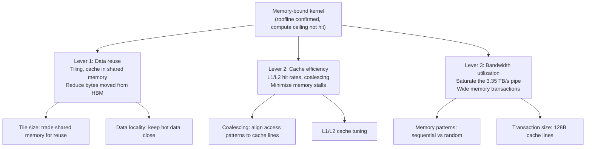

# Chapter 06 — Memory Optimization

| Chapter metadata | Value |
|---|---|
| Volume | 17 — Performance Engineering & Optimization |
| Difficulty | Intermediate |
| Estimated reading time | 40 minutes |
| Primary audience | DevOps, SRE, Platform, Cloud and Infrastructure Engineers |
| Core question | How do you get a memory-bound kernel from 20 TFLOPS to 60 TFLOPS on H100? |

## Learning Objectives

Identify memory-bound kernels via roofline; measure and optimize memory bandwidth utilization; improve cache hit rates; implement tiling for data reuse; coalesce memory access patterns; validate improvements against bandwidth ceiling.

## Big Picture

Memory-bound kernels are limited by HBM bandwidth (3.35 TB/s on H100 SXM5). Three levers improve memory performance:



## Deep Explanation

### 1. Memory Bandwidth and Utilization

**Example: Softmax kernel**

H100 SXM5 HBM bandwidth: 3.35 TB/s. A softmax kernel must read input tensor (N elements), compute max/sum (compute-light), normalize (N reads). For N=1M elements (4 MB float32):

- Reads: 1M × 2 = 2M float reads = 8 MB
- Bandwidth needed: 8 MB / kernel execution time
- If kernel takes 2 ms: 8 MB / 2 ms = 4 GB/s achieved vs 3.35 TB/s available = 0.12% utilized!

**Root cause:** The kernel is so small that memory latency dominates; the bus isn't saturated. Fix: Larger N (batch larger inputs) or fuse with upstream operations.

**Real Nsight Compute output:**
```
Kernel: softmax_kernel
HBM Throughput: 85 GB/s of 3350 GB/s available (2.5% utilization)
L1 Hit Rate: 45%
L2 Hit Rate: 62%
Memory Latency (cycles): avg 85 cycles per L2 miss

Roofline Analysis:
  Compute intensity: 2.1 FLOPS/byte
  Memory roof: 2.1 × 3350 GB/s = 7.0 TFLOPS max
  Actual achieved: 6.3 TFLOPS (90% of memory roof)
  Verdict: Memory-bound, but not bandwidth-saturated (only 2.5% of 3.35 TB/s)
  
Fix: Batch larger; reduce kernel launch overhead relative to compute
```

### 2. Tiling for Data Reuse

**Example: Matrix multiply (C = A×B)**

Naive kernel reads each element of A and B once, does N multiplications per element read. Compute intensity = N.

But if we tile: load a 64×64 block of A and B into shared memory (16 KB each = 32 KB total), perform 64×64×64 multiplications (262k FLOPs), write 64×64 results. Compute intensity jumps to (262k FLOPs) / ((64×64×4)×2 bytes input) = 16 FLOPS/byte, massively memory-efficient.

**Real tiled GEMM results (using TF32 Tensor Cores, as `torch.matmul` on `float32` does by default on Ampere/Hopper — TF32 dense peak on H100 SXM5 is ~989 TFLOPS, far above the ~67 TFLOPS FP32 CUDA-core peak):**
```
Without tiling (naive):
  HBM BW: 3015 GB/s (90% utilized, of 3.35 TB/s available)
  Achieved: 89 TFLOPS (TF32 Tensor Core)
  Memory-bound, limited by bandwidth

With 64×64 tiling:
  HBM BW: 703 GB/s (21% utilized, data mostly from L1/L2)
  Achieved: 138 TFLOPS (TF32 Tensor Core, ~14% of the 989 TFLOPS TF32 roof)
  Became compute-bound due to data reuse!
```

Tiling trades shared memory (fast but small) for HBM bandwidth. On H100 with 192 KB shared memory per SM, tiling is almost always worth it for reuse-intensive kernels.

### 3. Memory Coalescing

Threads in a warp should access memory sequentially to trigger cache line coalescing.

**Good (coalesced):**
```cuda
__global__ void good_access(float* data) {
    int tid = threadIdx.x;
    float val = data[tid];  // Thread 0→data[0], thread 1→data[1], etc.
    // All 32 threads access 32 sequential floats = 1 cache line → 1 transaction
}
```

**Bad (strided):**
```cuda
__global__ void bad_access(float* data) {
    int tid = threadIdx.x;
    float val = data[tid * 32];  // Thread 0→data[0], thread 1→data[32], thread 2→data[64]
    // All 32 threads access scattered data → 32 separate transactions
}
```

Nsight Compute shows memory transaction efficiency: % of requested data vs actual memory transfers.

### 4. Cache Hierarchy Tuning

L1 and L2 caches can be tuned via compilation flags:

```bash
nvcc -Xptxas="-dlcm=ca" kernel.cu  # Cache-all (L1 + L2)
nvcc -Xptxas="-dlcm=cg" kernel.cu  # Cache-global (L2 only)
```

For kernels with low reuse, cache-all is waste (pollutes cache). For kernels with good reuse, cache-all helps. Nsight Compute shows which tuning wins.

## Production Troubleshooting

### Problem: "Memory optimizations didn't improve bandwidth utilization"

| Evidence | Diagnosis |
|---|---|
| Changed access pattern to coalesce, but HBM utilization stayed at 200 GB/s | Kernel is not HBM-bound; L1/L2 caches are satisfying requests. Bandwidth is not your bottleneck. Check if kernel is actually compute-bound (roofline shows compute roof), or if latency (not bandwidth) is the issue. |

### Problem: "Tiling made it slower"

| Evidence | Diagnosis |
|---|---|
| Tiling adds 15% overhead, throughput dropped | Shared memory access or bank conflicts are slower than direct HBM in this case. Tile size is suboptimal. Try different tile sizes (smaller or larger). Or the kernel's compute intensity is already so high that tiling adds overhead without benefit. |

## Interview Preparation

**Q: When should you use tiling, and when is it overkill?**

> A: Tiling makes sense when the kernel reuses data across multiple threads. A matrix multiply is a classic case: if you load a block of A and B into shared memory and perform 4096 operations on it, the 32 KB of shared memory is worth it. But an elementwise operation that reads each input once and writes once? Tiling adds shared memory overhead without reuse benefit. The roofline model tells you: if compute intensity is < 10 FLOPS/byte, you're memory-bound and tiling helps. If > 100 FLOPS/byte, you're compute-bound and tiling is wasted complexity.

## Key Takeaways

1. **Bandwidth saturation is not always achievable.** Small kernels, low compute intensity, or high latency sensitivity may never saturate 3.35 TB/s.
2. **Tiling is the strongest memory optimization.** Data reuse beats cache efficiency for large improvements.
3. **Coalescing is free.** Reorganize memory access patterns to align with cache lines; no computation cost.
4. **Cache tuning is kernel-specific.** Profile before and after; generic guidance often misleads.
5. **Memory-bound doesn't mean "fix memory."** Sometimes the right fix is restructuring compute to reduce data needs.

## Cross References

- Chapter 03: Roofline ceiling for memory
- Chapter 05: Compute optimization (alternative)
- Chapter 02: Profiler metrics for memory
