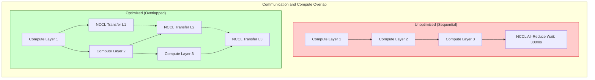

# Chapter 7 — Communication and Collective Optimization

| Chapter metadata | Value |
|---|---|
| Volume | 17 — Performance Engineering & Optimization |
| Difficulty | Advanced |
| Estimated reading time | 30 minutes |
| Primary audience | Network Architects, AI Performance Engineers |
| Core question | If the GPUs are computing instantly, and the InfiniBand network is lightning fast, why is the training job still slow? |

## Introduction

In single-GPU optimization (Chapters 5 & 6), the goal is keeping the Tensor Cores fed.
In multi-GPU optimization, the goal is hiding the network.

If GPU 0 finishes its math, and then sits completely idle while it waits for GPU 1 to send data over the network, your cluster efficiency is dead. You cannot make the speed of light any faster. You cannot make InfiniBand faster than its physical wire rate. 

The only way to optimize distributed training is to **Overlap Communication with Computation**. A Senior Architect designs systems where the GPUs are crunching math *at the exact same time* the network is transferring data.

## Beginner's Primer: Hiding the Mailman

Imagine you are running a business where you write 100 letters a day, and the mailman has to deliver them. 

**Sequential Execution (Bad):**
You spend 8 hours writing all 100 letters. When you finish, you call the mailman. You sit at your desk doing nothing for 4 hours while he delivers them. The total time taken is 12 hours. You are wasting 4 hours of productivity waiting for the network.

**Overlapping Communication (Good):**
You write 10 letters (a "bucket") and immediately hand them to the mailman. While he drives off to deliver those 10, you keep writing the next 10. You do this all day. By the time you finish writing the last 10 letters, the mailman is almost completely done delivering. The total time taken is 8 hours and 10 minutes. You completely "hid" the mailman's driving time behind your writing time.

In AI training, PyTorch groups gradients into "Buckets." If you don't tune your bucket size correctly, the GPU waits until it has computed the entire model before calling NCCL to send the data. Tuning the bucket size ensures the network cards are transmitting data *while* the Tensor Cores are crunching the next layer. 

## 1. The Physics of Overlap

Imagine a model with 10 layers. 
*   **The Sequential Anti-Pattern:** The GPU calculates the gradients for all 10 layers. It stops doing math. It triggers NCCL to `AllReduce` the massive block of 10 gradients across the network. It waits. 
*   **The Overlap Pattern (Bucketing):** The GPU calculates the gradient for Layer 10. It instantly hands Layer 10 to NCCL to send over the network. While the network is transmitting Layer 10, the GPU is simultaneously calculating the math for Layer 9. 

This requires the Host CPU and the PCIe bus to handle the network routing asynchronously without pausing the GPU's execution threads.

## 2. Tuning NCCL Buckets and Buffers

The "Bucketing" process is highly configurable. If you use PyTorch DDP or FSDP, you must tune the **Bucket Size**.

*   *If the bucket size is too small (e.g., 1 MB):* NCCL generates thousands of tiny network transfers. The latency overhead of setting up the network connections destroys throughput.
*   *If the bucket size is too large (e.g., 500 MB):* The GPU has to wait a long time to fill the bucket before it can send it over the network, reducing the ability to overlap communication with the ongoing math.

A Performance Engineer uses `nsys` tracing to view the exact overlap, and tweaks environment variables (like PyTorch's `bucket_cap_mb`) until the red network blocks perfectly align underneath the blue compute blocks.

## 3. Sharp (Scalable Hierarchical Aggregation and Reduction Protocol)

When running massive jobs on InfiniBand, the `AllReduce` math (averaging the gradients) normally happens on the GPUs.
1. All GPUs send data to GPU 0.
2. GPU 0 does the math to average them.
3. GPU 0 sends the answers back.

**NVIDIA SHARP** moves the math *into the network switches*. 
Instead of the GPUs doing the `AllReduce` math, the ConnectX NICs send the raw gradients to the Quantum InfiniBand switch. The Switch ASIC physically calculates the average as the packets flow through it, and sends the final averaged gradient back down to the GPUs. 
This cuts the amount of data traversing the network in half and frees the GPUs to focus purely on neural network math.

## Customer Scenario (Senior Level)

**The Situation:**
A massive LLM training job is running on a 128-node InfiniBand cluster. The team notices that Model Flops Utilization (MFU) is hovering at 35%. They run an `nsys` profile trace. The timeline shows massive blocks of Blue Compute, followed by massive blocks of Red Network Communication (`AllReduce`), with almost zero overlap. The GPUs are spending 40% of their time idle waiting for the network. They ask the network team to upgrade the switches.

**The Senior Architect Response:**
"The network switches are fine. The problem is a total failure of **Communication and Compute Overlap** within the distributed training framework.

When we look at the `nsys` trace, we see a sequential execution pattern. The GPUs are calculating the backward pass in its entirety, halting, and then executing a massive, monolithic `AllReduce` synchronization across the InfiniBand fabric. Because the model is massive, this synchronization takes hundreds of milliseconds, during which the Tensor Cores sit completely idle.

We do not need faster switches; we need to instruct the software to pipeline the data. 

We must immediately inspect the PyTorch DDP or FSDP configuration. The **Bucket Size** (`bucket_cap_mb`) is likely misconfigured or completely disabled. 

We will tune the bucket size to a mathematically appropriate value (e.g., 25MB or 50MB). This will instruct PyTorch to chunk the gradients as they are calculated during the backward pass. The moment a 25MB bucket is full, the framework will fire it to the NCCL library for asynchronous transmission across the InfiniBand network. 

Simultaneously, the GPU will continue calculating the gradients for the remaining layers. When we re-run the `nsys` trace, we will see the Red Network blocks slide underneath the Blue Compute blocks. The network latency will be completely hidden behind the GPU math, pushing our MFU back above 50%."

## Interview Preparation

**Conceptual:** What does it mean to "Overlap Communication with Computation" in distributed training? *(Hint: Instead of waiting for a GPU to finish all its math before sending the results over the network (which causes the GPU to idle during the transfer), the framework chunks the data. As soon as the first chunk of math is done, it is sent over the network asynchronously while the GPU simultaneously begins computing the math for the second chunk, hiding the network latency).*

**Architecture:** Explain how NVIDIA SHARP improves performance on an InfiniBand network. *(Hint: In a standard `AllReduce` operation, the GPUs must send data to each other and perform the averaging math themselves, generating massive network traffic. SHARP offloads the averaging math directly into the InfiniBand Switch ASICs. The switch calculates the average as the data flows through it, halving the network traffic and reducing the latency of collective operations).*

## Architecture Summary

Because network latency (InfiniBand/RoCE) is orders of magnitude slower than VRAM access, AI training must never wait synchronously on the network. Performance engineers must tune PyTorch's DDP/FSDP `bucket_cap_mb` to ensure gradients are sent over the network exactly as they are calculated, visually resulting in the "Red" network blocks sliding perfectly underneath the "Blue" compute blocks in an Nsight Systems trace. 

