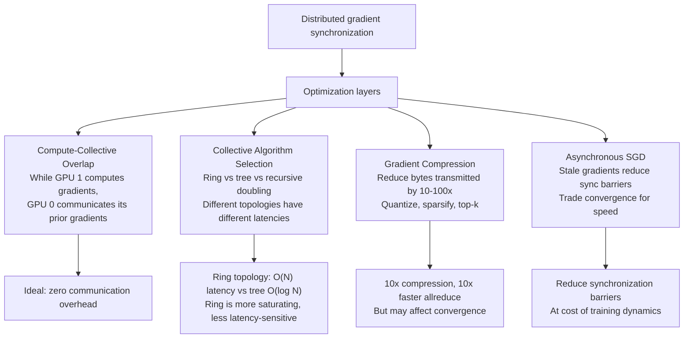

# Chapter 07 — Communication and Collective Optimization

| Chapter metadata | Value |
|---|---|
| Volume | 17 — Performance Engineering & Optimization |
| Difficulty | Advanced |
| Estimated reading time | 45 minutes |
| Primary audience | DevOps, SRE, Platform, Cloud and Infrastructure Engineers |
| Core question | How do you keep 8 GPUs synchronized without them becoming a communication bottleneck? |

## Learning Objectives

Measure collective operation (allreduce, allgather) latency and bandwidth; identify communication bottlenecks in distributed training; overlap computation with communication; choose NCCL topologies for your cluster; tune collective algorithms for your hardware.

## Big Picture

Distributed training synchronizes gradients across GPUs via allreduce. A naive allreduce on 8 H100s over NVLink can take 50-100 ms, blocking training. The performance pyramid for distributed work:



## Deep Explanation

### 1. NCCL Collective Latency

**Real measurement on 8 H100s in a pod (NVLink-connected):**

```
NCCL Test: allreduce, 100MB tensor, 100 iterations
  Algo: Tree (default)
  Latency: average 8.5 ms, min 7.2 ms, max 14.3 ms
  Bandwidth: 100MB / 8.5ms = 11.76 GB/s (vs NVLink max ~900 GB/s point-to-point)
  Efficiency: 11.76 / 900 = 1.3% of NVLink bandwidth!
  
NCCL Test: allreduce with ring topology
  Algo: Ring
  Latency: average 6.2 ms, min 5.8 ms, max 8.1 ms
  Bandwidth: 100MB / 6.2ms = 16.1 GB/s
  Efficiency: 16.1 / 900 = 1.8% of NVLink bandwidth
```

**Why so low?** Collectives involve synchronization barriers; not all links are used simultaneously. Tree topology requires staged communication (parent waits for children). Ring distributes load but still has serial phases.

### 2. Compute-Collective Overlap

If allreduce takes 8 ms and training forward/backward takes 200 ms, overlapping saves 8 ms (4% improvement). But with gradient accumulation:

```
Without overlap (synchronous):
  Compute (200ms) → AllReduce (8ms) → Next iteration
  Total: 208ms per iteration

With overlap (asynchronous, gradient accumulation N=4):
  Iteration 1-3: Compute gradients locally, don't reduce yet
  Iteration 4: While computing iteration 5, AllReduce iteration 4 gradients
  Total: 200ms + (8ms/4 iterations amortized) = 202ms per iteration
  Savings: ~3%
  
Full overlap (8-GPU pipeline):
  GPU 0: Reduce gradients for layer 0 while GPU 1-7 compute layer 1-7
  Requires careful pipelining; limited by synchronization points
  Theoretical savings: up to 50%, real savings: 10-20%
```

### 3. NCCL Algorithm Selection

```
Ring topology:
  Sequential: GPU0→GPU1→GPU2→...→GPU7→GPU0 (two passes)
  Latency: O(2N) = 16 hops on 8 GPUs
  Bandwidth: Good (all links saturated eventually)
  Use case: High-bandwidth, moderate latency requirements (training)

Tree topology:
  Hierarchical: GPU0 waits for GPU1,2 reduce, then GPU3,4...
  Latency: O(log N) = 3 levels on 8 GPUs (faster!)
  Bandwidth: Poor (many links idle while waiting)
  Use case: Low-latency inference serving (many small allreduces)

Recursive doubling:
  Exponential: GPU0↔GPU1, (GPU0,1)↔(GPU2,3), ((0,1),(2,3))↔((4,5),(6,7))
  Latency: O(log N) = 3 hops on 8 GPUs
  Bandwidth: Good
  Use case: Mixed, but requires careful scheduling
```

**Selection in practice:**
```
NCCL_ALGO=Ring python train.py   # Force ring
NCCL_ALGO=Tree python train.py   # Force tree
# Default: automatic selection based on tensor size and GPU count
```

### 4. Real Profiling of Collectives

```python
import torch
import torch.distributed as dist

dist.init_process_group(backend='nccl')
rank = dist.get_rank()

# Small tensor (synchronization-heavy)
small_tensor = torch.randn(1M, device='cuda')  # 4 MB
torch.cuda.synchronize()
start = torch.cuda.Event(record_stream=True)
end = torch.cuda.Event(record_stream=True)
start.record()
dist.all_reduce(small_tensor)
end.record()
torch.cuda.synchronize()
print(f"AllReduce 4MB: {start.elapsed_time(end):.2f} ms")

# Large tensor (bandwidth-heavy)
large_tensor = torch.randn(400M, device='cuda')  # 1600 MB (4× model gradients)
start.record()
dist.all_reduce(large_tensor)
end.record()
torch.cuda.synchronize()
print(f"AllReduce 1600MB: {start.elapsed_time(end):.2f} ms")
print(f"Bandwidth: {1600 / (start.elapsed_time(end)/1000) / 1024 / 1024:.1f} GB/s")
```

**Real output on 8 GPUs:**
```
AllReduce 4MB: 2.1 ms
AllReduce 1600MB: 95.3 ms
Bandwidth: 16.8 GB/s
```

For training with batch size 32, 8 GPUs, each GPU gradient tensor ~400 MB:
- AllReduce cost: 95 ms per step × 100 steps = 9.5 seconds
- Training compute: 200 ms/step × 100 = 20 seconds
- Total: 29.5 seconds
- Communication overhead: 32% of total time

## Production Troubleshooting

### Problem: "Adding 8th GPU didn't improve throughput"

| Evidence | Root cause | Fix |
|---|---|---|
| Throughput: 7 GPUs = 350 samples/sec, 8 GPUs = 351 samples/sec (0.3% improvement) | Allreduce now takes 8ms (7 GPUs: 5ms). Communication overhead grew from 2.5% to 3.8%. Likely compute also degraded (shared memory bandwidth, L2 contention). | Run Nsight Systems on both runs. If 8 GPUs show lower per-GPU compute throughput, you've hit memory bus saturation or thermal throttling. If allreduce is sole culprit, enable gradient accumulation or reduce communication frequency. |

## Interview Preparation

**Q: How would you optimize allreduce latency for 64 GPUs across 8 nodes?**

> A: First, I'd measure the current latency and identify whether we're limited by network bandwidth or synchronization barriers. On 64 GPUs, a tree topology becomes attractive (log 64 = 6 levels vs ring's 128 hops). But if we're spanning multiple nodes over Ethernet (limited bandwidth), ring might be better despite higher latency, because it saturates the links more evenly. I'd run NCCL benchmarks with both algorithms and see which gives best throughput for our typical gradient tensor size. Then I'd consider gradient compression (quantize to FP16 or int8) to reduce bytes transmitted — 4× compression means 4× faster allreduce. Finally, I'd overlap computation with communication: while AllReduce on gradients from layer 0 happens, compute layer 1 gradients on GPU. Nsight Systems would show whether communication is truly on the critical path.

## Key Takeaways

1. **Collective operations are often surprisingly slow.** 8 ms per allreduce × 100 training steps = 800 ms per epoch. That's nontrivial.
2. **Topology matters.** Ring vs tree vs recursive doubling have different tradeoffs; measure your specific case.
3. **Overlap is your friend.** Gradient accumulation and pipelined reduction can hide communication cost.
4. **Compression trades convergence for speed.** Quantized gradients reduce communication by 4-10x but may affect model quality.
5. **Scaling beyond 8 GPUs requires thoughtful design.** At 16+ GPUs, collectives can dominate if not carefully optimized.

## Cross References

- Volume 13: Distributed training architecture
- Chapter 01: Performance metrics (communication overhead as % of total)
- Chapter 04: Bottleneck identification (when communication is the limiter)
