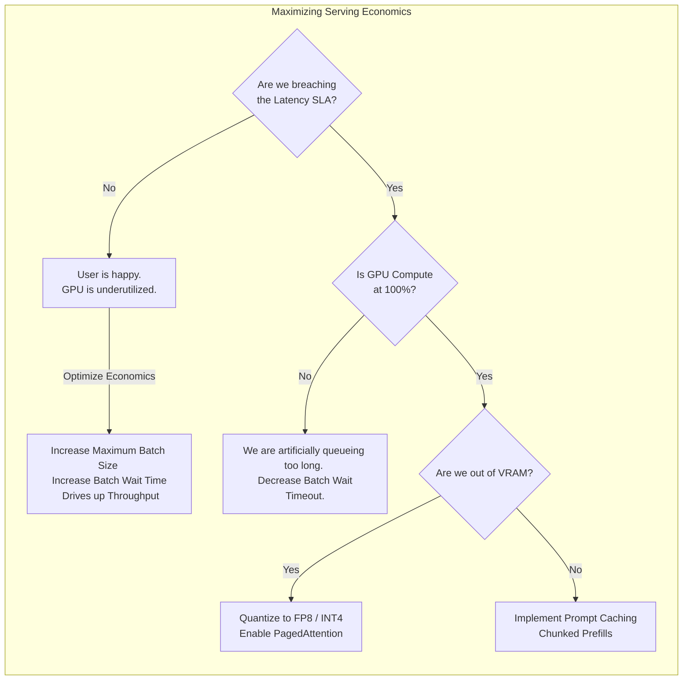

# Chapter 8 — Inference Optimization

| Chapter metadata | Value |
|---|---|
| Volume | 17 — Performance Engineering & Optimization |
| Difficulty | Advanced |
| Estimated reading time | 30 minutes |
| Primary audience | MLOps Engineers, Performance Architects |
| Core question | If your inference API is too slow, how do you decide whether to increase the batch size, lower the precision, or buy a faster GPU? |

## Introduction

Training is a math problem. Inference is an economics problem. 

In training, you just want to finish the job as fast as possible. 
In inference, your goal is to process the maximum number of user requests per dollar of hardware (Throughput) *without* breaching the user's patience threshold (Latency SLA).

If you misconfigure an inference server, you might achieve an incredible 10,000 requests per second, but every user has to wait 5 seconds for a response. The business will fail. A Senior Architect must navigate the strict mathematical trade-offs between Latency, Throughput, and Accuracy.

## Beginner's Primer: The Bus Terminal

In Chapter 1, we introduced the Iron Triangle (Latency, Throughput, Utilization). Let's bring this to life. 

Imagine an inference server is a bus terminal, and incoming API requests are passengers.
- **Latency** is how long a passenger waits before arriving at their destination.
- **Throughput** is how many passengers the terminal processes per hour.

If you dispatch a bus the *millisecond* one passenger sits down (Batch Size = 1), that passenger gets amazing Latency! But you are sending an empty bus. You will go bankrupt. Your Throughput is terrible. 

If you wait for 50 passengers to fill every seat before leaving (Batch Size = 50), your Throughput is incredible, and your costs are low! But the first passenger who sat down has been waiting an hour. Their Latency is terrible.

**Dynamic Batching** is the algorithm inference servers (like Triton) use to solve this. It says: *"Wait a maximum of 50 milliseconds. If the bus is full, leave immediately. If 50ms passes and there are only 12 people, leave anyway so they don't get angry."*

Tuning that exact millisecond threshold is the foundation of Inference Optimization. 

## 1. The Latency vs. Throughput Curve

You cannot optimize both simultaneously. You must map the curve.

1.  **Batch Size 1 (Minimum Latency, Terrible Throughput):** The GPU processes exactly one request. It finishes instantly (e.g., 5ms). The user is happy. The GPU is 95% idle. You are burning money.
2.  **Batch Size 256 (Maximum Throughput, Terrible Latency):** The inference server holds the first request in a queue while it waits for 255 more requests to arrive. The GPU processes the massive batch efficiently (e.g., 90% utilization). However, the first user had to wait 500ms in the queue plus 50ms for the execution. The user abandons the website.

**The Optimization Goal:** You must use tools like **Triton Model Analyzer** or **Perf Analyzer** to automatically test batch sizes from 1 to 256. You find the exact maximum batch size that keeps the P99 latency *just under* the business SLA (e.g., 95ms).

## 2. Quantization (The Free Lunch and The Heavy Price)

As established in Volume 12, running inference in FP32 (32-bit precision) is architectural malpractice. It consumes massive VRAM and destroys memory bandwidth.

You must optimize the math using **Quantization** via TensorRT.

*   **FP16 / BF16:** The industry standard. Halves memory requirements, doubles speed. Almost zero loss in model accuracy.
*   **INT8 (Post-Training Quantization - PTQ):** Squeezes the model into 8-bit integers. 4x speedup. However, you must "calibrate" the model with sample data during compilation, or the model will become noticeably dumber.
*   **INT4 / FP8:** Bleeding edge. Extreme performance, but carries severe risk of model degradation (hallucinations, incorrect math) if not carefully validated.

*Architectural Mandate:* You cannot blindly quantize a model. You must run an automated accuracy evaluation script (e.g., checking the model against a standard benchmark test) after compilation to prove the INT8 model is still legally and ethically safe to deploy.

## 3. KV Cache Optimization (LLMs)

For LLMs, the KV Cache is the ultimate bottleneck. 

If you are running out of VRAM due to high concurrent users, you have three optimization levers:
1.  **PagedAttention:** (Mandatory). Eliminates memory fragmentation.
2.  **KV Cache Quantization:** Storing the KV cache in INT8 instead of FP16. Doubles the number of concurrent users you can support, with minimal impact on text generation quality.
3.  **Prompt Caching (RadixAttention):** If 1,000 users all send the exact same massive "System Prompt" (e.g., "Act as a helpful customer service agent..."), standard servers recalculate the math for that prompt 1,000 times. Engines like SGLang cache the math for that prefix, completely eliminating the compute overhead for subsequent users.

## Customer Scenario (Senior Level)

**The Situation:**
A company deploys an LLM inference service using vLLM on a cluster of A100s. The business SLA mandates a Time-To-First-Token (TTFT) of < 200ms. The MLOps team load-tests the server. At 50 concurrent requests, the TTFT spikes to 800ms. They look at `nvidia-smi` and the GPU compute is pegged at 100%. They declare the A100s are too slow and request $1 Million to upgrade to H100s.

**The Senior Architect Response:**
"The A100s are not too slow; your software architecture is choking on the mathematical complexity of the Prefill phase, and you are brute-forcing the problem instead of optimizing it.

When TTFT spikes under load while compute is at 100%, the GPU's Tensor Cores are mathematically saturated trying to ingest and process the massive incoming prompts (the Prefill phase). 

Before we spend a million dollars on hardware, we must exhaust our software optimization levers. 

First, we will implement **Prompt Caching** (e.g., via SGLang or vLLM's APC). If the users share a common system prompt, we will cache the KV states. This will instantly eliminate a massive percentage of the required Prefill compute.

Second, if the model weights are currently in FP16, we will compile them down to **INT8 or FP8 (Quantization)** using TensorRT-LLM. This will drastically reduce the memory bandwidth required and allow the Tensor Cores to execute the math at twice the speed.

Third, we will implement strict **Chunked Prefill**. Instead of forcing the GPU to process a massive 10,000-token prompt in a single, blocking operation (which stalls all other users and destroys TTFT), the engine will chunk the prompt into smaller pieces, interleaving the compute with the token generation of other users. 

These three optimizations will likely drop your P99 TTFT from 800ms back down to 150ms under heavy load, rescuing the SLA without buying a single new GPU."

## Interview Preparation

**Conceptual:** Explain the trade-off between Latency and Throughput when tuning dynamic batch size for an inference server. *(Hint: To increase Throughput, the server must wait to gather a large batch of requests, processing them all simultaneously to maximize GPU utilization. However, waiting to build that batch introduces artificial queueing time, which increases the end-to-end Latency for the user. You must tune the batch size to maximize throughput without breaching the maximum latency SLA).*

**Architecture:** What is the primary operational risk of using aggressive quantization (like INT4) to optimize an inference model? *(Hint: While aggressive quantization drastically reduces VRAM requirements and increases speed, squeezing complex 32-bit floating-point numbers into a tiny 4-bit space permanently destroys data precision. This can severely degrade the 'intelligence' of the model, leading to hallucinations, incorrect math, or loss of reasoning capabilities. It requires rigorous automated accuracy testing before deployment).*

## Architecture Summary

Inference optimization is an exercise in FinOps (Financial Operations). Generating tokens faster than humans can read them offers no business value. Engineers must implement Dynamic Batching to intentionally delay requests, grouping them together to maximize GPU utilization and Throughput, while carefully stopping just short of breaching the user's Latency SLA. When hardware limits are reached, Quantization (lowering math precision) is the ultimate lever to increase capacity.

