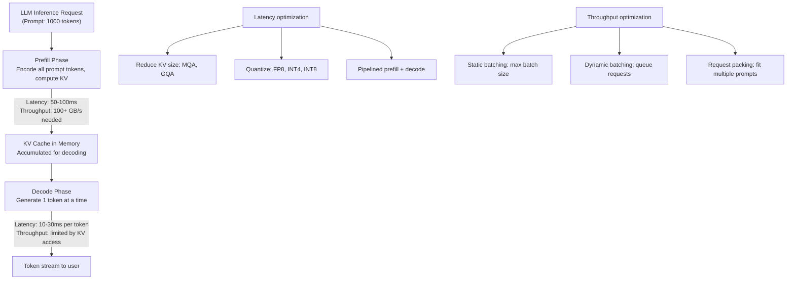

# Chapter 08 — Inference Optimization

| Chapter metadata | Value |
|---|---|
| Volume | 17 — Performance Engineering & Optimization |
| Difficulty | Intermediate |
| Estimated reading time | 40 minutes |
| Primary audience | DevOps, SRE, Platform, Cloud and Infrastructure Engineers |
| Core question | How do you serve a large language model at 10ms p99 latency on one GPU? |

## Learning Objectives

Optimize inference for latency vs throughput tradeoff; manage KV cache memory and bandwidth; implement dynamic batching; quantize models; measure and improve time-to-first-token and prefill latency.

## Big Picture

Inference differs from training: low batch sizes, strict latency SLAs, KV cache dominates memory, prefill phase (encoding prompt) differs from decode phase (generating tokens).



## Deep Explanation

### 1. Prefill vs Decode Bottlenecks

**Prefill phase (encoding prompt):**
- Compute-heavy: matrix multiply with sequence length
- For 7B model, batch 32, seq 1024: ~700 ms on single H100
- Compute intensity: high (memory-bound by architecture, compute by math)
- Bottleneck: memory bandwidth to load KV cache

**Decode phase (token generation):**
- Memory-bound: load KV cache (GB of data), output small tensor (few KB)
- For 7B model, batch 32, generating 1 token: ~8 ms on single H100
- Compute intensity: very low (1 multiply per KV element read)
- Bottleneck: memory latency (waiting for KV cache loads)

**Real profiling (Llama 7B, H100, batch 32):**
```
Prefill (prompt 1024 tokens):
  Time: 750 ms
  Throughput: 1024 tokens / 0.75s = 1365 tokens/sec
  Memory BW needed: 2000 GB/s (HBM saturated)
  
Decode (generate 128 tokens):
  Time per token: 8.2 ms
  Throughput: 1 token / 8.2ms = 122 tokens/sec
  Memory BW used: 180 GB/s (9% of HBM!)
  
Total for one request (1024 prompt + 128 generate):
  Time: 750 + 128×8.2 = 1800 ms
  Decode is the tail (71% of total time) despite lower utilization!
```

### 2. KV Cache Memory Pressure

KV cache grows with sequence length: 2×(batch×seq×heads×head_dim)×2 tokens (key and value).

For 7B Llama (32 heads, 128 dim), seq 4096, batch 32:
- KV cache: 2 × 32 × 4096 × 128 × 32 tokens × 4 bytes = 1 GB per batch

With batch 32, max seq 4096: 32 GB of just KV cache on a single 80 GB H100. Leaves little room for model (7B params = 14 GB in FP8, 28 GB in FP16).

**Solutions:**
- Multi-query attention (MQA): Share KV across heads → 1/N cache size (N=32 heads)
- Grouped-query attention (GQA): Groups of heads share KV
- Quantize KV to FP8 or INT8: Reduce cache by 2-4×

### 3. Throughput Optimizations: Batching

Static batching (fixed batch size):
```bash
# Serve requests in fixed batches of 32
while True:
    requests = get_next_32_requests()  # May wait if < 32 arrive
    batch_result = model.forward(batch)
    return_results(batch_result)
```

Latency: max(32 request arrival times) + inference time
Issue: If requests arrive unevenly, GPU waits for full batch.

Dynamic batching (queue and serve when ready):
```python
request_queue = []
while True:
    # Collect waiting requests, up to batch size
    ready_requests = queue.get_all_ready()  # Non-blocking
    if ready_requests:
        batch_size = min(len(ready_requests), max_batch_size)
        batch_result = model.forward(ready_requests[:batch_size])
        return_results(batch_result)
    else:
        time.sleep(1ms)  # Wait for more requests
```

Latency: min(wait_time, timeout) + inference time (faster for bursty traffic)
Complexity: Need to handle variable batch sizes, pad/unpad tensors.

### 4. Quantization Impact

```
FP32 model (28 GB for 7B params):
  Load time: ~200 ms per request batch
  Inference: 8 ms per decode token
  
FP16 model (14 GB):
  Load time: ~100 ms
  Inference: 8 ms per decode token
  (same speed, half memory)
  
FP8 model (7 GB):
  Load time: ~50 ms
  Inference: 7.5 ms per decode token
  (slight speedup from better cache hit; accuracy may degrade 0.1-0.5%)
  
INT8 model (7 GB):
  Load time: ~50 ms
  Inference: 7.2 ms per decode token
  (competitive; requires post-training quantization)
```

## Production Troubleshooting

### Problem: "P99 latency is 200ms but average is 20ms"

| Evidence | Diagnosis |
|---|---|
| Avg 20ms, p50 18ms, p99 200ms, p100 400ms | Tail is driven by slow requests (long prompts or cache misses). Typical causes: prompt length variance (p100 has 8×longer prompt), cache eviction (GPU memory full), or scheduler delays (waiting for batch). |

**Fix:** Implement request timeout (serve partial batch after Xms), prioritize short prompts, or use dedicated hardware for long sequences.

## Interview Preparation

**Q: Why does decode latency scale poorly despite low GPU utilization?**

> A: Decode is memory-bound with terrible compute intensity (nearly 1 FLOP per byte of KV cache read). On H100 with 2 TB/s bandwidth, reading 1 GB of KV takes ~0.5 ms. With batch 32, that's 32 MB of unique data per decode step, which takes ~0.016 ms of pure bandwidth time, but the actual latency is 8 ms. Why? Memory latency, not bandwidth. Each decode token needs to wait for KV cache hits before proceeding. We can't parallelize the request; it's serial. That's why batch size and KV cache size are critical for decode latency.

## Key Takeaways

1. **Prefill and decode are different problems.** Prefill is compute-heavy; decode is memory-latency-bound. Optimize both separately.
2. **KV cache is often the bottleneck.** Quantize or use MQA/GQA to reduce its footprint.
3. **Dynamic batching helps bursty traffic.** Static batching works for predictable, steady-state load.
4. **Quantization trades accuracy for speed.** 0.1-0.5% accuracy loss for 10-20% latency improvement is often worthwhile.

## Cross References

- Chapter 03: Roofline model (decode phase is memory-bound)
- Volume 12: Inference systems architecture
- Chapter 09: Training optimization (different problem)
