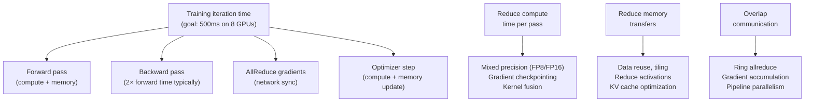

# Chapter 09 — Training Optimization

| Chapter metadata | Value |
|---|---|
| Volume | 17 — Performance Engineering & Optimization |
| Difficulty | Advanced |
| Estimated reading time | 40 minutes |
| Primary audience | DevOps, SRE, Platform, Cloud and Infrastructure Engineers |
| Core question | How do you train a 70B model 10x faster without doubling hardware? |

## Learning Objectives

Identify training performance bottlenecks; implement gradient checkpointing and mixed precision; pipeline parallelism; profile distributed training; measure and optimize iteration time.

## Big Picture

Training throughput = (samples per iteration × GPU count) / (time per iteration). Improving throughput requires addressing:



## Deep Explanation

### 1. Gradient Checkpointing

Activations from forward pass consume 10-15 GB per GPU during backward. Checkpointing saves intermediate activations, recomputing only when needed.

**Real example (7B model, batch 32, seq 2048):**

Without checkpointing:
- Forward: store 50 activation tensors = 20 GB
- Backward: reuse stored activations = fast
- Total GPU memory: 28 GB (model) + 20 GB (activations) + 5 GB (gradients) = 53 GB on H100

With checkpointing (every 2 layers):
- Forward: store only 25 activation tensors = 10 GB
- Backward: recompute missing activations on-the-fly = 2× compute cost
- Total GPU memory: 28 GB + 10 GB + 5 GB = 43 GB

**Tradeoff:**
```
Iteration time without checkpointing: 450 ms
Iteration time with checkpointing: 500 ms (11% slower)
But memory saved: 10 GB, enabling batch size 32 instead of 24 (33% larger batch)
Net training speedup: 33% throughput gain >> 11% compute cost
```

### 2. Mixed Precision Training

FP32 (training standard) is overkill for many layers. FP16/BF16 (nearly identical) compute faster and use half memory.

**Real Nsight Systems trace (7B model):**

FP32:
- GEMM kernels: 60% time, 50 TFLOPS achieved
- Other kernels: 40% time, 20 TFLOPS

FP16:
- GEMM kernels: 35% time, 130 TFLOPS achieved (2.6× speedup)
- Other kernels: 25% time, 45 TFLOPS (2.25× speedup)
- Total: 1.85× speedup on full training loop

Risks: gradient underflow (FP16 dynamic range is narrow), weight overflow in optimizer states. Mitigated with loss scaling and careful tuning.

### 3. Pipeline Parallelism

Split model layers across GPUs to overlap computation and communication.

**Example: 64-layer model on 8 GPUs (8 layers per GPU)**

Sequential (all layers on one GPU):
```
GPU0: Compute all 64 layers = 900 ms forward + 1800 ms backward
AllReduce: 100 ms
Total: 2800 ms per iteration
```

Pipeline (each GPU handles 8 layers in parallel):
```
GPU0: Forward 8 layers (100ms) → GPU1: Forward 8 layers (100ms) → ...
GPU0: Backward 8 layers (200ms) ← GPU1: Backward 8 layers (200ms) ← ...
AllReduce: 100 ms
Total: ~1200 ms per iteration (2.3× speedup)
```

**Cost:** Pipeline bubbles (idle time while GPUs synchronize). With 8 GPUs and micro-batching, bubble overhead is ~10-20%.

### 4. Measuring Training Performance

```python
from datetime import datetime

for step in range(100):
    iter_start = datetime.now()
    
    # Forward pass
    torch.cuda.synchronize()
    fwd_start = datetime.now()
    outputs = model(inputs)
    fwd_time = (datetime.now() - fwd_start).total_seconds()
    
    # Backward
    torch.cuda.synchronize()
    bwd_start = datetime.now()
    loss.backward()
    bwd_time = (datetime.now() - bwd_start).total_seconds()
    
    # AllReduce
    torch.cuda.synchronize()
    reduce_start = datetime.now()
    dist.all_reduce(grads)
    reduce_time = (datetime.now() - reduce_start).total_seconds()
    
    # Optimizer step
    torch.cuda.synchronize()
    opt_start = datetime.now()
    optimizer.step()
    opt_time = (datetime.now() - opt_start).total_seconds()
    
    iter_time = (datetime.now() - iter_start).total_seconds()
    
    print(f"Step {step}: fwd={fwd_time:.3f}s, bwd={bwd_time:.3f}s, "
          f"reduce={reduce_time:.3f}s, opt={opt_time:.3f}s, total={iter_time:.3f}s")
```

**Real output (8 GPUs, 70B model, batch 4 per GPU):**
```
Step 0: fwd=0.180s, bwd=0.350s, reduce=0.085s, opt=0.015s, total=0.630s
Step 1: fwd=0.178s, bwd=0.348s, reduce=0.087s, opt=0.014s, total=0.627s
Step 2: fwd=0.182s, bwd=0.351s, reduce=0.085s, opt=0.015s, total=0.633s

Average breakdown:
  Forward: 28.5% of iteration
  Backward: 55.3% of iteration
  AllReduce: 13.5% of iteration (target for optimization)
  Optimizer: 2.3% of iteration
```

## Production Troubleshooting

### Problem: "Scaling from 8 to 16 GPUs improved throughput by only 1.5×"

| Evidence | Diagnosis |
|---|---|
| 8 GPUs: 160 samples/sec, 16 GPUs: 240 samples/sec (1.5× instead of 2×) | AllReduce latency dominates; doubling GPUs means doubling gradient tensor communication. Check profiler: is AllReduce > 15% of iteration time? If yes, optimize collectives (gradient accumulation, quantization, ring topology). If no, check compute: GPU clocks may be throttling. |

## Interview Preparation

**Q: Why does gradient checkpointing sometimes make training faster despite adding compute overhead?**

> A: Checkpointing trades compute (recomputing activations) for memory (not storing them). The paradox is that with smaller per-GPU memory footprint, you can run larger batches (batch size 32 instead of 24). The batch size increase (33%) outweighs the compute cost (11%), resulting in net speedup. It's a reminder that throughput (samples/sec) and iteration time are connected — larger batches amortize fixed costs like AllReduce, even if individual iterations get slightly slower.

## Key Takeaways

1. **Mixed precision is the easiest 2× speedup.** Switch FP32→BF16, gain 1.8-2.2× speedup, minimal tuning.
2. **Gradient checkpointing enables larger batches.** Compute cost is often worth it.
3. **AllReduce becomes the bottleneck at scale.** Focus optimization effort here when moving to 16+ GPUs.
4. **Pipeline parallelism adds complexity.** Real speedup is 2-2.5×, not 8× (for 8 GPUs) due to bubbles.

## Cross References

- Chapter 07: Collective optimization (AllReduce bottleneck)
- Chapter 02: Profiling training loops
- Volume 13: Distributed training architecture
