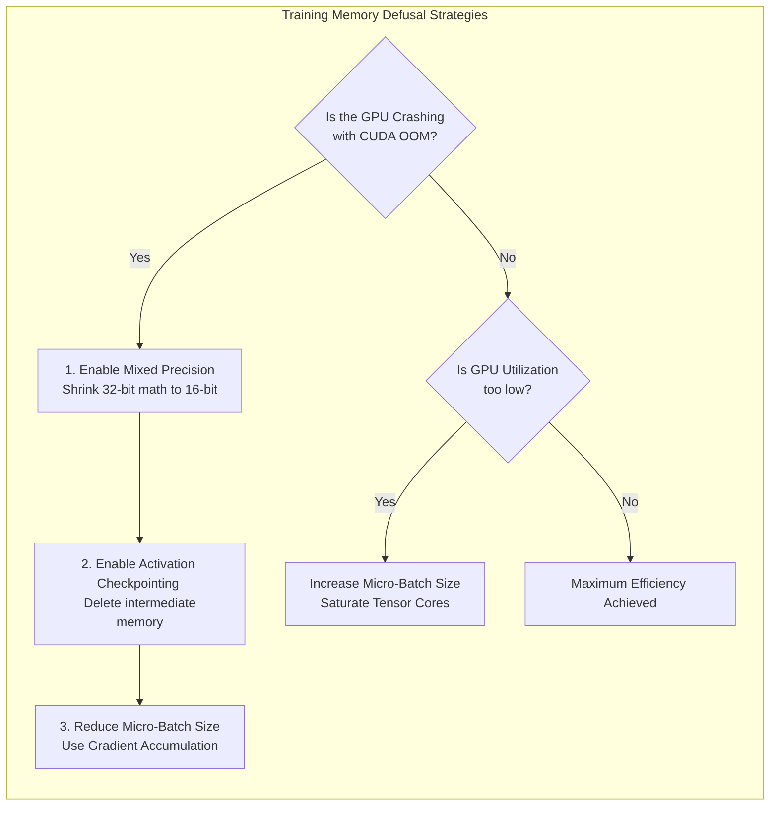

# Chapter 9 — Training Optimization

| Chapter metadata | Value |
|---|---|
| Volume | 17 — Performance Engineering & Optimization |
| Difficulty | Expert |
| Estimated reading time | 25 minutes |
| Primary audience | AI Infrastructure Engineers, Core ML Researchers |
| Core question | If your multi-million dollar training job is projected to take 60 days, how do you reconfigure the math to finish in 30 days? |

## Introduction

In training, you have one metric that rules them all: **Time to Convergence**. 
How fast can the model learn what it needs to learn? 

A Junior Engineer thinks the only way to reduce training time is to buy more GPUs. 
A Senior Architect knows that unoptimized PyTorch code can leave 80% of a GPU's compute capability sitting idle on the table. By mathematically tuning the precision, the memory footprint, and the batching strategy, an Architect can often double the training speed on existing hardware.

## Beginner's Primer: The Physics of Training

Training an AI is an exercise in managing explosions. 
When a model is evaluating data (the Forward Pass), it generates massive amounts of intermediate data called "Activations". It has to save these Activations in memory because it needs them later for the Backward Pass (where it learns from its mistakes). 

If you make your Batch Size large (processing 100 images at once instead of 10), the model learns much faster, but the Activations explode in size. The GPU instantly runs out of memory (OOM crash).

As an AI Performance Engineer, your job is to defuse these memory explosions so you can push the Batch Size as high as mathematically possible. You have three main tools:
1. **Mixed Precision (AMP):** You shrink the data. Instead of using highly detailed 32-bit numbers, you compress the math into 16-bit or 8-bit numbers. This cuts the memory explosion in half, allowing you to double the Batch Size.
2. **Gradient Accumulation:** You cheat. If the GPU can only hold a Batch Size of 10, but you want a Batch Size of 40, you run 4 batches of 10 sequentially, add up the learning (accumulate), and then apply the update. You get the math of a size-40 batch without exploding the memory.
3. **Activation Checkpointing:** You sacrifice time for space. Instead of saving all the Activations during the Forward Pass, you just delete them. During the Backward Pass, you recalculate them from scratch. This wastes compute time, but saves so much memory that you can double the Batch Size, ultimately resulting in faster overall training.

## 1. Mixed Precision Training (AMP)

Standard deep learning math is done in FP32 (32-bit precision). 
NVIDIA Tensor Cores are explicitly designed to execute FP16 or BF16 (16-bit precision) at speeds up to 4x faster than FP32. 

If you just convert the entire model to FP16, the gradients might become so small that they round down to zero (Underflow), and the model stops learning. 

The optimization standard is **Automatic Mixed Precision (AMP)**. 
1. PyTorch stores a "Master Copy" of the weights in high-precision FP32.
2. During the forward and backward pass, it dynamically casts the matrices into FP16/BF16 to execute the math blindingly fast on the Tensor Cores.
3. It then updates the high-precision Master Copy. 

*Architectural Mandate:* Every training job running on modern NVIDIA hardware MUST have AMP enabled. Running pure FP32 on an H100 is architectural malpractice.

## 2. Escaping the Memory Wall

As discussed in Volume 13, if you run out of VRAM, the training job crashes. You must manipulate the VRAM to allow larger batch sizes (which increases throughput).

**The Three Levers of Memory Optimization:**
1.  **Gradient Accumulation:** Run a small batch (e.g., 4) to fit in VRAM. Do not update the optimizer. Run another small batch. Do this 16 times. Then update the optimizer. You just mathematically simulated a batch size of 64 without needing the VRAM to hold 64 samples simultaneously.
2.  **Activation Checkpointing:** Do not save the intermediate layer activations during the forward pass. Delete them to save massive amounts of VRAM. During the backward pass, just recalculate them. (Trades compute time for massive memory savings).
3.  **Zero Redundancy Optimizer (ZeRO / FSDP):** Shard the Optimizer states and Gradients across multiple GPUs to reduce the static memory footprint. 

## 3. Dataloader Optimization

If `nsys` profiling shows the GPUs sitting idle between batches, the CPU is failing to feed them data. 

*   **`num_workers`:** Never leave the PyTorch Dataloader at `num_workers=0`. This forces the main thread to do all I/O. Set it to a multiple of your CPU cores.
*   **`pin_memory=True`:** This tells the Linux kernel to lock the data in a specific RAM location, allowing the GPU to use DMA (Direct Memory Access) to pull it across the PCIe bus instantly without CPU involvement.
*   **NVIDIA DALI:** If image decoding (JPEG to Tensor) is maxing out the Host CPU, use the DALI library to move the decoding math onto the GPU's idle CUDA cores.

## Customer Scenario (Senior Level)

**The Situation:**
A startup is training a 7B parameter model from scratch on a cluster of 8x A100s. They complain that their Model Flops Utilization (MFU) is a terrible 22%. The GPUs have 80GB of VRAM, but `nvidia-smi` shows they are only using 30GB. When they try to increase the batch size to use more VRAM, the model crashes with a CUDA Out-Of-Memory (OOM) error. They are completely stuck.

**The Senior Architect Response:**
"You are trapped in an optimization paradox. You have massive amounts of free memory (50GB), yet increasing the batch size by even a fraction causes an immediate OOM crash.

This is the classic signature of **Memory Fragmentation** and a lack of **Activation Checkpointing**.

When you process a forward pass in PyTorch, the framework allocates massive blocks of VRAM to store the intermediate activations. Because standard PyTorch does not aggressively manage memory contiguity, these massive allocations fragment the remaining 50GB of free VRAM into thousands of tiny, unusable gaps. When the next layer requests a single 2GB contiguous block, the memory allocator fails to find one, throws a panic, and hard-crashes the job, despite 50GB technically being 'free'.

We will immediately implement two software optimizations. 
First, we will enable **Activation Checkpointing** (Gradient Checkpointing). We will instruct PyTorch to discard the massive activation tensors immediately after the forward pass, and recalculate them dynamically during the backward pass. This will completely eliminate the massive VRAM footprint that is causing the fragmentation.

Second, we will enable **Automatic Mixed Precision (AMP)** using `torch.autocast`. This will cast the massive activation tensors from 32-bit down to 16-bit, halving their physical size and doubling the speed at which the Tensor Cores process them. 

These two optimizations will clear the VRAM bottleneck, allowing us to massively increase the physical batch size, saturating the Tensor Cores and pushing the MFU from 22% up to a healthy 50%."

## Interview Preparation

**Conceptual:** What is Automatic Mixed Precision (AMP) and why is it mandatory for modern AI training? *(Hint: AMP stores a master copy of the model weights in high-precision 32-bit (FP32) to maintain accuracy, but dynamically converts the matrices to 16-bit (FP16/BF16) during the actual math operations. This allows the workload to utilize the massive speed of the hardware Tensor Cores and halves the memory bandwidth required, dramatically speeding up training without losing model quality).*

**Architecture:** If a PyTorch training job is crashing with an Out-of-Memory (OOM) error, but `nvidia-smi` shows 20GB of VRAM is still 'Free', what is the likely cause? *(Hint: Memory Fragmentation. Deep learning frameworks allocate memory in contiguous blocks. If the free VRAM is fragmented into thousands of tiny, non-contiguous chunks, the framework will be unable to find a single large enough block for the next tensor operation, resulting in an OOM crash despite having sufficient total free capacity).*

## Architecture Summary

Optimizing AI training is a balancing act between Memory capacity and Compute utilization. By applying Mixed Precision (AMP) to shrink tensors, Activation Checkpointing to trade compute for memory, and Gradient Accumulation to artificially inflate batch sizes, platform engineers can squeeze maximum efficiency (MFU) out of the silicon before resorting to buying more GPUs.

