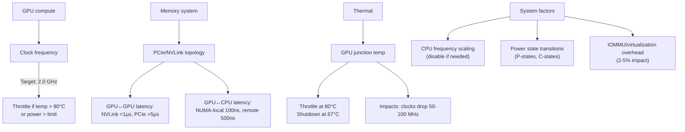

# Chapter 10 — System-Level Performance Tuning

| Chapter metadata | Value |
|---|---|
| Volume | 17 — Performance Engineering & Optimization |
| Difficulty | Intermediate |
| Estimated reading time | 35 minutes |
| Primary audience | DevOps, SRE, Platform, Cloud and Infrastructure Engineers |
| Core question | Why does the same code get 20% different throughput on different runs, and what can you control? |

## Learning Objectives

Identify and mitigate clock throttling, power limits, thermal effects; understand NUMA and PCIe topology impact; tune system software (power management, frequency scaling) for performance; measure performance isolation and variance.

## Big Picture

Hardware performance is not fixed. Clocks, power, thermal conditions, and system configuration all affect throughput.



## Deep Explanation

### 1. Clock Throttling and Thermal Effects

**Real measurement:**

```bash
$ nvidia-smi dmon
# Output during training
frame   pwr  temp    sm    mem     enc    dec
0      280W  52°C    91%   35%     0%     0%
1      285W  54°C    93%   36%     0%     0%
2      290W  56°C    95%   37%     0%     0%
...
20     330W  75°C    98%   42%     0%     0%  ← Approaching throttle
21     315W  78°C    97%   40%     0%     0%  ← Clocks starting to drop
22     290W  80°C    94%   38%     0%     0%  ← Throttled (clocks 1.8 GHz vs 2.0)
23     280W  79°C    91%   35%     0%     0%  ← Cooling down
```

Throughput before throttle: 1200 TFLOPS (at 2.0 GHz)
Throughput during throttle: 1080 TFLOPS (at 1.8 GHz = 10% loss)

**Mitigation:**
```bash
# Disable power management (requires root/sudo)
nvidia-smi -pm 1  # Enable persistence mode
nvidia-smi -pl 400  # Set power limit to 400W (max for H100)
nvidia-smi -lgc 1980  # Lock GPU clock at 1980 MHz (H100 SXM5 max boost)

# Check thermal solution (water cooling vs air)
nvidia-smi query-gpu=gpu_bus_id,compute_cap,index --format=csv
# Ensure GPUs have adequate airflow
```

### 2. NUMA and GPU Affinity

On multi-socket systems, GPUs attach to CPU sockets. Access from wrong socket = high latency.

**Real benchmark (H100 on 2-socket Xeon system):**

```
GPU affinity: GPU 0 on Socket 0, GPU 1 on Socket 1

Test 1: CPU 0 (socket 0) → GPU 0 (socket 0)
  PCIe latency: 400 ns
  PCIe throughput: 60 GB/s (near peak PCIe 5.0 x16 per-direction of ~64 GB/s)
  
Test 2: CPU 64 (socket 1) → GPU 0 (socket 0)
  PCIe latency: 1200 ns (3× worse!)
  PCIe throughput: 47 GB/s (22% loss)
```

**Mitigation:**
```bash
# Pin CPU threads to correct socket
numactl --physcpubind=0-31 python train.py  # Bind to socket 0
# Or auto-detect:
nvidia-smi topo -m  # Shows GPU↔CPU connectivity
# Bind dataloaders to correct socket:
torch.utils.data.DataLoader(dataset, pin_memory=True, num_workers=8)
```

### 3. PCIe Topology and Bandwidth

Most GPUs connect via PCIe (not NVLink), which limits bandwidth and increases latency.

**Bandwidth cascade:**
```
PCIe 5.0 x16 (max): ~64 GB/s per direction (~128 GB/s bidirectional aggregate)
Typical GPU-to-GPU over PCIe: 14-16 GB/s
Reason: PCIe tree + switch contention

With NVLink (H100 to H100):
  Point-to-point: 900 GB/s
  8 GPU cluster: 50-80 GB/s per collective (less than point-to-point due to fan-out)
```

**Topology awareness:**
```bash
$ nvidia-smi topo -m
# Output shows GPU↔GPU (NVLink or PCIe) and GPU↔NIC connectivity
#     GPU0    GPU1    GPU2    GPU3    NIC0    CPU Affinity  NUMA Affinity
# GPU0  X      NV1     NV4     NV7     PIX     0-31          N/A
# GPU1  NV1    X       NV4     NV7     PIX     0-31          N/A
# GPU2  NV4    NV4     X       NV1     PIX     32-63         N/A
# GPU3  NV7    NV7     NV1     X       PIX     32-63         N/A
# ...

# NV1 = NVLink same switch (fast)
# NV4 = NVLink different switch (slower)
# NV7 = cross-PCIe bridge (slowest)
```

### 4. Power and Thermal Limits

```
H100 SXM5 specs:
  Peak power: 700W (must have adequate PSU + cooling)
  Max junction temp: 87°C (thermal shutdown)
  Throttle start: 80°C
  Nominal clocks: 1.98 GHz
  Max boost clocks: ~1.98 GHz (H100 SXM5 does not have a materially higher boost state above nominal)
  
Real power draw during training:
  FP32: 600-650W
  BF16/FP16: 450-500W (lower power from reduced arithmetic)
  FP8: 350-400W
```

**Tuning for reliability vs performance:**
```bash
# Conservative (stable, lower variance)
nvidia-smi -pl 350  # Limit to 350W (safe margin)
nvidia-smi -lgc 1500  # Lower clock frequency

# Aggressive (maximum performance)
nvidia-smi -pl 700  # Max power
nvidia-smi -lgc 1980  # Max clock frequency
# Risk: thermal throttling under sustained load
```

### 5. Cluster Acceptance and Burn-In Testing

Before a cluster is trusted with production training jobs, it needs to be validated: does every node deliver the compute and bandwidth the hardware spec promises, and does it keep delivering that under sustained load (not just a 30-second burst)? This is acceptance testing, and it uses a different toolset than day-to-day profiling.

**HPL (High-Performance Linpack).** HPL solves a large dense system of linear equations (LU decomposition, effectively a giant matrix-multiply-dominated workload) and reports sustained FLOPS. It is the benchmark behind the TOP500 supercomputer ranking, and on GPU clusters it exercises compute, memory bandwidth, and interconnect simultaneously at sustained (not bursty) load for an extended period — often hours for a full-size run. That combination makes it a good stress test for hardware and thermal/power stability: a marginal PSU, a poorly seated DIMM, or an undersized cooling loop tends to show up as a node that can't sustain its HPL score, or that throttles partway through the run.

A healthy HPL result is typically **70-90% of theoretical peak FLOPS**, with the achieved percentage depending heavily on problem size tuning and interconnect quality — wide variance is normal, so compare against the cluster's own baseline run and against sibling nodes, not just a single "expected number."

**What HPL does *not* prove.** This is the point most worth remembering for an interview: HPL is not an AI/ML benchmark. Its arithmetic is dense FP64 (or mixed-precision variants tuned for HPL specifically) matrix multiplication with a regular, predictable access pattern. Transformer training looks nothing like that — it runs primarily in FP16/BF16/FP8, has a mix of GEMM, attention, normalization, and elementwise kernels with much less uniform memory-access behavior, and is frequently bound by communication (allreduce/allgather over NVLink or the network) in ways a single dense LU factorization simply doesn't exercise the same way. A cluster that posts a great HPL number has proven its compute/memory/interconnect hardware is fundamentally sound — it has *not* proven it will train a large language model efficiently. Treat a strong HPL score as a necessary hardware-health signal, not a guarantee of AI workload performance.

**NCCL tests.** Chapter 7 covers NCCL collective performance in the context of production training (allreduce latency, compute-collective overlap). In the acceptance-testing context, the same `nccl-tests` suite (`all_reduce_perf`, `all_gather_perf`, and similar) plays a narrower role: it validates that the interconnect fabric itself — NVLink between GPUs, and the network fabric between nodes — delivers the bandwidth and latency the topology should provide, in isolation from any actual model code. Like HPL, a clean NCCL test result is necessary but not sufficient: it proves the fabric is healthy, not that a real training job will be fast. A cluster can post ideal AllReduce numbers and still run a slow training job because of data-loading stalls, poor kernel occupancy, or a suboptimal parallelism strategy — none of which NCCL tests touch.

**ClusterKit.** Where HPL and NCCL tests validate one node or one collective operation at a time, ClusterKit is NVIDIA's tool for running validation *across the whole cluster* in one pass. Its role in the workflow is to automate the "run a consistent battery of tests on every node and compare the results" step, surfacing nodes whose performance falls outside the expected band so they can be pulled aside before the cluster goes into production. Exact invocation and the current set of built-in tests vary by release, so check the tool's own documentation for the specific commands rather than relying on syntax reproduced here — the operationally important point is what it's *for*: fleet-wide, apples-to-apples comparison, not single-node characterization.

**The acceptance/burn-in workflow.** Put together, these tools form a pipeline, not a menu of alternatives:

1. **Baseline** — single-node sanity checks (`nvidia-smi`, `nvidia-smi topo -m`, basic GPU memory and PCIe link-speed checks) to confirm each node looks correct before spending time on it.
2. **Stress** — HPL for the raw compute/memory/interconnect ceiling on each node; NCCL tests for interconnect bandwidth and latency in isolation.
3. **Sustained run** — repeat the stress step over hours, not a single short burst, to catch thermal throttling and power-delivery issues that only appear once temperatures climb (see clock-throttling behavior above — a node can look fine for the first two minutes and then throttle).
4. **Compare nodes** — ClusterKit (or an equivalent fleet-wide harness) runs the same battery across every node and flags outliers. A node that is 5-10% slower than its peers on identical hardware is rarely noise; it usually means a real hardware issue — thermal paste applied poorly, a degraded DIMM, a marginal PCIe or NVLink connection.
5. **Investigate outliers** — once a node is flagged, the diagnostic work (topology checks, thermal history, network path, storage I/O) is the same skill set covered in the NUMA/PCIe/thermal sections above. For the deeper diagnostic workflow on multi-GPU imbalance and straggler nodes specifically, see Volume 20, Chapter 11 (Multi-GPU Imbalance and Straggler Detection) — this chapter's job is establishing where these tools sit in the validation pipeline, not re-deriving that diagnosis.

## Production Troubleshooting

### Problem: "Throughput varies by 15% between runs"

| Evidence | Root cause | Fix |
|---|---|---|
| Same code, same data: runs show 1000, 1080, 950, 1120 TFLOPS (15% variance) | Thermal/power variance: some runs hit thermal throttle at 80°C, others don't. Clocks drop 50-100 MHz when throttling. | Enable persistence mode, lock power limit at conservative level (350W), lock clocks. Trade peak performance for stability. Variance should drop to <2%. |

### Problem: "Performance different on GPU 0 vs GPU 7"

| Evidence | Diagnosis | Fix |
|---|---|---|
| GPU 0: 1200 TFLOPS, GPU 7: 1050 TFLOPS on same code | GPU 7 is hotter (thermal throttle) or has lower power allocation (multi-GPU PSU contention). Check nvidia-smi temp; hot GPU throttles first. | Improve cooling (airflow, water cooling), increase PSU capacity, or disable max-power mode on some GPUs. |

## Interview Preparation

**Q: You have an 8-GPU system with variable throughput (15% variance). How would you diagnose and fix it?**

> A: I'd first check if it's reproducible. Run the same training script 10 times, measure TFLOPS, and see if it varies every time or if specific runs are slower. If variance is present, I'd check nvidia-smi dmon during training to see clocks, temperature, and power. If temps hit 80°C and clocks drop from 2.0 to 1.8 GHz, I've found the culprit: thermal throttling. Fix: improve cooling (better case airflow, water cooling), reduce power limit to keep temps lower, or enable GPU persistence mode. If temps are stable but power draws vary, it might be PSU contention on the 8 GPUs share a single PSU. Fix: upgrade PSU or limit power per GPU. The goal is consistency: lock clocks, lock power limit, and then variance should be <2%.

## Key Takeaways

1. **Thermal throttling is invisible to profilers.** Monitor GPU temp and clock simultaneously with throughput.
2. **NUMA affinity matters on large systems.** Wrong socket access can cost 20-30% performance.
3. **PCIe is much slower than NVLink.** Clusters without NVLink will have collective bottlenecks.
4. **Power limits are tunable.** Conservative settings reduce variance; aggressive settings maximize performance but risk throttling.
5. **Persistence mode should be enabled for production.** Avoids frequency ramping overhead between kernels.
6. **HPL and NCCL tests validate hardware, not AI workloads.** A clean HPL or NCCL test result proves compute/memory/interconnect health, not that a real training job will be fast — treat them as necessary, not sufficient.
7. **ClusterKit-style fleet comparison catches the outliers single-node tests miss.** A node 5-10% slower than its peers on identical hardware is usually a real fault, not noise.

## Cross References

- Volume 10: Kubernetes GPU platform (resource allocation, power budgeting)
- Chapter 02: Profiling includes thermal/power data
- Chapter 04: System bottlenecks (when thermal/power limits are the culprit)
- Chapter 07: NCCL collective performance in production training context
- Volume 20, Chapter 11: Multi-GPU imbalance and straggler-node diagnosis (deep dive on investigating an outlier flagged during acceptance testing)
