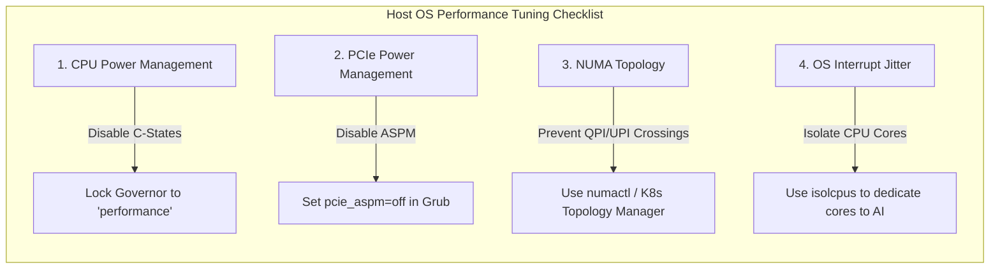

# Chapter 10 — System-Level Performance Tuning

| Chapter metadata | Value |
|---|---|
| Volume | 17 — Performance Engineering & Optimization |
| Difficulty | Advanced |
| Estimated reading time | 30 minutes |
| Primary audience | SREs, Systems Engineers |
| Core question | If your Python code is perfect and your GPUs are state-of-the-art, why is the Linux operating system slowing down your training job by 15%? |

## Introduction

A GPU does not exist in a vacuum. It is a peripheral device plugged into a motherboard, managed by a Host CPU, running a Linux operating system. 

If the Linux OS is configured for power-saving, or if the motherboard bios is throttling the PCIe bus, the most perfectly optimized PyTorch code in the world will run slowly. 
A Senior Architect must tune the "metal" beneath the container. 

## Beginner's Primer: Tuning the Racecar

Imagine you put an 800-horsepower Formula 1 engine (the GPU) inside a standard Honda Civic (the Host Server). 

If you step on the gas, you won't go 200 mph. The transmission will snap, the tires will spin, and the car will overheat. To use that engine, you have to upgrade the tires, tune the suspension, and bypass the factory speed limiters.

In a standard Linux server, the "factory settings" are designed to save electricity. 
- **The Engine Sleeps:** If the server is idle for 1 second, Linux puts the CPU to sleep (C-States). When a burst of AI data arrives, the CPU takes milliseconds to wake up, starving the GPU. You must force the CPU to stay awake (`performance` governor).
- **The Wires Sleep:** The motherboard puts the PCIe cables to sleep to save power (ASPM). When the GPU asks for data, the cable has to "wake up". You must disable this.
- **The Driver is Lost:** The CPU is physically split into two halves (NUMA Nodes). If the data is sitting in the left half's RAM, but the right half's CPU is doing the work, the data has to cross a slow bridge inside the motherboard. You must "pin" the application to the correct side.

If you do not tune the Host OS, your expensive AI training job will suffer from mysterious "micro-stutters" that ruin performance.

## 1. CPU Governors and C-States

By default, Enterprise Linux distributions (like Ubuntu or RHEL) are configured for power efficiency. 
If the Host CPU is not doing heavy math, the Linux kernel will drop the CPU frequency (downclocking) and put the cores to sleep (C-States) to save electricity. 

**The AI Penalty:**
When a GPU finishes a massive batch of math, it interrupts the CPU to ask for more data. If the CPU is asleep in a deep C-State, it takes milliseconds to wake up, ramp up its clock speed, and respond. Those milliseconds of latency happen thousands of times a second, creating a massive cumulative stall on the GPU.

*The Fix:* An SRE must configure the CPU governor to `performance` mode, locking the CPU cores at maximum frequency and disabling deep sleep states. 

## 2. PCIe Gen and ASPM

The PCIe bus is the highway between the CPU and the GPU. 
Like the CPU, the PCIe bus has power-saving features. Active State Power Management (ASPM) will power down PCIe lanes when they are idle. 

Waking up a PCIe lane introduces micro-latency. 
Furthermore, sometimes a motherboard BIOS misconfigures a slot, negotiating a Gen4 x16 card down to Gen3 x8 speeds.

*The Fix:* You must disable ASPM in the Linux kernel boot parameters (`pcie_aspm=off`). You must also run `nvidia-smi -q -d PCIE` to verify that every single GPU has successfully negotiated the maximum generation (e.g., Gen4) and maximum width (e.g., 16x).

## 3. NUMA Pinning and Topology

As discussed in Volume 7 and 10, crossing the UPI link between two physical CPUs destroys performance. 

If the OS scheduler decides to run the PyTorch Dataloader thread on CPU 0, but the data is destined for a GPU physically wired to CPU 1, the data must cross the slow motherboard interconnect. 

*The Fix:* You must use tools like `numactl` or Kubernetes Topology Manager to strictly pin the CPU threads and RAM allocations to the exact same NUMA node that the target GPU is wired to. 

## Customer Scenario (Senior Level)

**The Situation:**
A quantitative trading firm deploys an ultra-low latency inference engine on bare-metal servers with L40S GPUs. The application is highly optimized in C++. However, their telemetry shows intermittent, inexplicable 2-millisecond latency spikes that occur roughly every 10 seconds. The code is flawless, the GPUs are barely utilized, and the network is idle. 

**The Senior Architect Response:**
"We are hunting a phantom bottleneck introduced by the Linux Operating System's power management and interruption scheduling. 

Because your workload is highly optimized and bursty (low continuous utilization), the Linux kernel assumes the server is mostly idle. 

First, the kernel is likely placing the Host CPU cores into deep sleep states (C-States). When a sudden high-frequency trading request arrives, the CPU takes a full millisecond just to wake up the cores before it can hand the data to the GPU. 
Second, the Linux kernel is likely pausing your critical inference threads to process random hardware interrupts (like a network packet arriving on a management interface) or running garbage collection. 

To achieve absolute deterministic latency, we must execute extreme **System-Level Tuning**. 
1. We will alter the CPU governor to `performance`, explicitly disabling C-States (`intel_idle.max_cstate=0`). The CPU cores will run at maximum frequency permanently.
2. We will use `taskset` or `numactl` to pin the critical inference threads to specific CPU cores. 
3. We will use `isolcpus` in the Linux boot parameters to explicitly tell the Linux kernel scheduler to *never* schedule generic OS tasks or hardware interrupts on those specific pinned cores. 

By isolating the CPU cores and locking them at maximum power, we completely eliminate OS-level context-switching jitter, removing the 2-millisecond spikes entirely."

## Interview Preparation

**Conceptual:** Why must an SRE change the Linux CPU governor from `powersave` to `performance` on a GPU compute node? *(Hint: By default, Linux puts idle CPU cores to sleep to save power. When a GPU needs data, the sleeping CPU takes milliseconds to wake up and respond. This latency compounds thousands of times a second, starving the GPU. Setting the governor to `performance` locks the CPU at maximum speed, eliminating the wake-up latency).*

**Architecture:** What is Active State Power Management (ASPM) and why should it be disabled on AI servers? *(Hint: ASPM is a hardware power-saving feature that puts PCIe lanes to sleep when idle. For AI workloads that require constant, microsecond-latency data transfers across the PCIe bus, the latency introduced by waking up the PCIe lanes causes severe performance jitter. It must be disabled via the kernel boot parameters).*

## Architecture Summary

Maximum AI throughput requires ruthlessly stripping away standard IT power-saving features. Operating Systems and motherboards are designed to put idle components to sleep. For microsecond-sensitive AI workloads, these wake-up latencies are catastrophic. Platform engineers must lock CPU frequencies to maximum (`performance` governor), disable PCIe link sleeping (ASPM), and rigidly enforce NUMA pinning to ensure data never crosses slow internal motherboard bridges.

