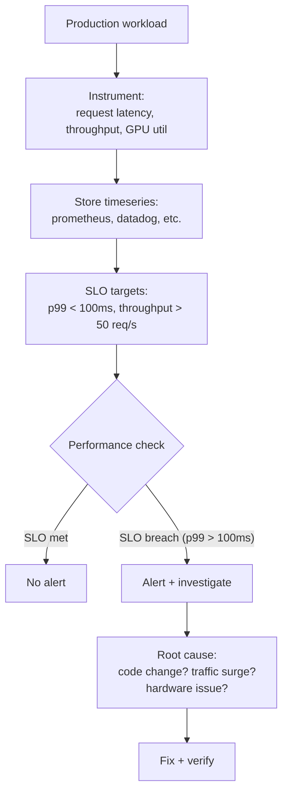

# Chapter 11 — Production Performance Monitoring and SLOs

| Chapter metadata | Value |
|---|---|
| Volume | 17 — Performance Engineering & Optimization |
| Difficulty | Intermediate |
| Estimated reading time | 35 minutes |
| Primary audience | DevOps, SRE, Platform, Cloud and Infrastructure Engineers |
| Core question | How do you know whether your inference SLO is being met, and what do you do when it's not? |

## Learning Objectives

Define performance SLOs (latency, throughput, cost); instrument production services for continuous monitoring; detect regressions; correlate performance with system events; set appropriate alerting thresholds.

## Big Picture

Production performance monitoring differs from development profiling. You need continuous, real-time observation of latency, throughput, and resource utilization.



## Deep Explanation

### 1. SLO Definition for AI Workloads

**Inference service SLO:**
```yaml
# Service-level objectives
latency:
  p50: 20ms (50th percentile response time)
  p99: 100ms (99th percentile response time, strict SLO)
  p100: 500ms (max timeout; requests aborted after this)

throughput:
  min: 50 requests/sec (minimum capacity)
  max: 200 requests/sec (max before queuing increases)

availability:
  target: 99.9% (max 8.6 hours downtime/month)
  errors: < 0.1% of requests

cost:
  target: $0.50 per 1M tokens generated
```

### 2. Instrumentation and Metrics

```python
import prometheus_client
from prometheus_client import Counter, Histogram, Gauge

# Define metrics
request_duration = Histogram('request_duration_seconds', 
                            'Request latency', buckets=[.01, .05, .1, .5, 1.0])
requests_total = Counter('requests_total', 'Total requests by outcome', 
                        labelnames=['status'])
gpu_utilization = Gauge('gpu_utilization_percent', 'GPU util', labelnames=['gpu_id'])
queue_depth = Gauge('queue_depth', 'Pending requests')

@app.route('/inference', methods=['POST'])
def inference():
    with request_duration.time():
        try:
            # Inference work here
            result = model.generate(prompt)
            requests_total.labels(status='success').inc()
            return jsonify(result)
        except Exception as e:
            requests_total.labels(status='error').inc()
            raise
```

### 3. Regression Detection

**Method 1: Threshold-based alerting**
```yaml
alert:
  name: InferenceLatencyHigh
  condition: p99_latency_ms > 100
  duration: 5m  # Alert if sustained > 5 minutes
  action: page_oncall
```

**Method 2: Trend-based detection**
```python
# Compare this hour's p99 latency to last hour's and 7 days ago
p99_now = get_percentile(latency_history['last_1h'], 99)
p99_1h_ago = get_percentile(latency_history['1h_to_2h_ago'], 99)
p99_7d_ago = get_percentile(latency_history['last_week_same_time'], 99)

# Alert if 20% worse than baseline
if p99_now > p99_7d_ago * 1.2:
    alert("Latency regression: {:.0f}ms vs baseline {:.0f}ms".format(p99_now, p99_7d_ago))
```

### 4. Root Cause Correlation

When SLO breaches, correlate with events:

| Signal | Correlation | Action |
|---|---|---|
| p99 latency +50ms simultaneously on all GPUs | Code change deployed 2 min ago | Rollback, then profile new code for bottleneck |
| p99 latency +30ms on GPU 0 only | Temperature on GPU 0 is 80°C | Check thermal solution, improve airflow |
| Throughput -30% but latency unchanged | New feature uses 10% more GPU memory | Reduce batch size or optimize feature |
| Error rate spikes to 2% | Network packet loss on allreduce | Investigate Ethernet topology, upgrade switch |

### 5. Cost-per-Task Metrics

For batch inference or fine-tuning:

```
Training cost per sample:
  GPU compute: $0.003 per H100 GPU-hour = $0.10 per 50K samples
  Memory (cache): $0.0002 per GB-hour = $0.0004 (negligible)
  Network: $0.02 per TB = $0.004 for 200MB collectives
  Total: $0.11 per 50K samples = $0.0000022 per sample
  
Inference cost per token:
  GPU compute: $0.003 per H100 GPU-hour
  Prefill: 1000 prompt tokens = 0.1ms on H100 = $0.00000033
  Decode: 100 output tokens = 800ms on H100 = $0.00000267
  Total: ~$0.0000030 per token, or $0.30 per 1M tokens
```

## Production Troubleshooting

### Problem: "p99 latency is regularly 3× SLO but p50 is normal"

| Evidence | Diagnosis |
|---|---|
| p50: 25ms (normal), p99: 300ms (3× SLO of 100ms) | Tail latency is driven by outliers (slow requests, cold cache, network jitter). Typical causes: long prompts (prefill dominates), cache misses, GC pauses. |

**Fix:** Implement request timeouts (serve partial result after 100ms), prioritize short prompts, or add request classification (fast lane for short prompts, slow lane for long prompts).

### Problem: "GPU util 100% but throughput decreased"

| Evidence | Diagnosis | Fix |
|---|---|---|
| GPU util was stable 95%, now 100%, but throughput dropped 10% | GPU is hitting power limits or thermal throttle. Clocks are dropping. Check temps and power limits. | Reduce batch size (lower power), improve cooling, or accept lower throughput as thermal boundary. |

## Interview Preparation

**Q: How would you monitor and alert on an LLM inference service?**

> A: I'd instrument latency, throughput, and error rate at the request level. Store p50, p99, p100 latencies in a timeseries database (Prometheus), and alert if p99 > SLO for > 5 minutes. I'd also track per-request metadata (prompt length, output tokens, model version) so I can slice metrics by problem (long prompts might legitimately have higher latency). For root cause correlation, I'd log each request with its timestamp, latency, and the GPU/node it ran on. If latency spikes, I can cross-reference with system metrics (GPU temperature, network latency, memory utilization) to identify whether it's a code issue, hardware issue, or traffic pattern change. Finally, I'd compute cost per request (GPU power cost per token generated) to detect regressions that trade quality for speed.

## Key Takeaways

1. **SLOs must be measurable and actionable.** "Fast" is not an SLO. "p99 latency &lt; 100ms" is.
2. **Tail latency (p99, p100) matters more than mean.** Users experience the tail, not the average.
3. **Instrument at request level, not just aggregate.** Know latency per request, not just per minute.
4. **Correlate metrics with events.** Performance changes correlate with deployments, traffic changes, hardware issues.
5. **Cost per task is a performance metric.** Faster at 10x cost is often not an improvement.

## Cross References

- Chapter 01: Defining "good performance"
- Chapter 02: Profiling vs monitoring (continuous vs occasional)
- Chapter 04: Root cause analysis when SLOs breach
