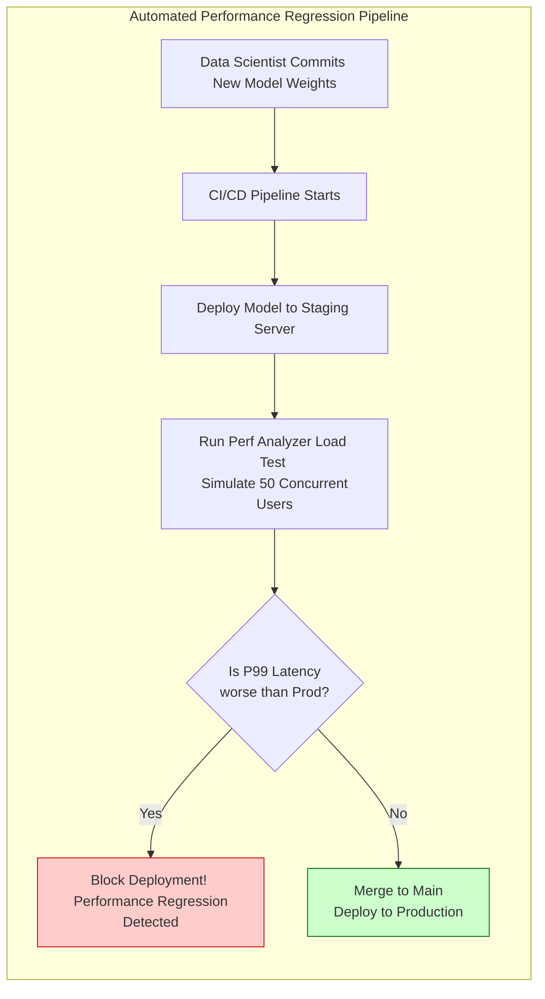

# Chapter 11 — Production Performance Monitoring and SLOs

| Chapter metadata | Value |
|---|---|
| Volume | 17 — Performance Engineering & Optimization |
| Difficulty | Advanced |
| Estimated reading time | 25 minutes |
| Primary audience | SREs, MLOps, Platform Owners |
| Core question | If the model was blazing fast on Monday, why is it timing out on Friday without anyone touching the code or the infrastructure? |

## Introduction

Performance engineering is not a one-time event that happens before deployment. Performance degrades over time. 

If you optimize a model, deploy it, and walk away, the system will eventually fail. User traffic patterns change, hardware degrades silently, and data distributions drift. 
A Senior Architect builds continuous performance monitoring pipelines that alert the team to performance regressions *before* the users complain.

## Beginner's Primer: The Silent Decay

Imagine you buy a brand new, highly optimized racecar. On day 1, it breaks the track record.
You drive it every day for a year. You never change the oil. You add 500 pounds of luggage to the trunk. 

One day, you lose a race. You look at the engine (GPU Utilization) and it seems fine. You look at the gas tank (VRAM) and it has fuel. You don't understand why the car is slow.

This is exactly what happens to AI models in production:
1. **The Luggage (Input Drift):** On day 1, users typed 5-word questions. Six months later, users are pasting 10,000-word PDF documents into the chat. The model didn't get slower; the workload got exponentially heavier.
2. **The Oil (Hardware Degradation):** On day 1, the GPU was pristine. Six months later, the datacenter AC unit is failing, the GPU is running 10 degrees hotter, and it is silently thermal-throttling its clock speed down by 20%.

If you only monitor whether the server is "Up or Down," you will be completely blind to this silent decay. Performance Monitoring requires tracking the exact time it takes to generate a word (ITL) and mathematically halting any new code deployments that make the model even 5% slower.

## 1. The Threat of Silent Degradation

In traditional software, if a database drops a table, the app crashes and throws a 500 Error. It is obvious.
In AI, degradation is silent. 

**Examples of Silent Performance Degradation:**
*   *Data Drift:* Users start asking the LLM much longer questions. The model continues to respond successfully (HTTP 200 OK), but the massive sequence lengths quietly double the Time-To-First-Token (TTFT) and exhaust the KV Cache.
*   *Hardware Throttling:* A fan fails in the server chassis. The GPU temperature hits 85C. The GPU does not crash; it silently drops its clock speed by 50% to cool down. The inference latency doubles.
*   *Link Degradation:* A PCIe slot gets dusty and downgrades from Gen4 x16 to Gen3 x8. Bandwidth is halved. 

## 2. Setting Mathematical SLOs

You cannot monitor "slowness." You must define strict Service Level Objectives (SLOs).

For an LLM inference service, an Architect defines a composite SLO:
1.  **Availability:** 99.9% of requests must return HTTP 200.
2.  **Latency (TTFT):** 95% of requests must have a Time-To-First-Token of < 250ms.
3.  **Latency (TPOT):** 99% of requests must have a Time-Per-Output-Token of < 50ms.

You configure Prometheus Alertmanager to monitor these specific SLIs (Service Level Indicators). If the P95 TTFT creeps up to 260ms for more than 5 minutes, an alert fires to the MLOps team. 

## 3. Automated Regression Testing (CI/CD)

The most common cause of performance degradation is developers pushing a "minor" update to the model weights or the Triton configuration. 

A Senior Architect mandates that performance is tested in the CI/CD pipeline. 
When a developer commits a new model version:
1.  The CI pipeline compiles the TensorRT engine.
2.  The pipeline launches a temporary Triton container on a GPU node.
3.  The pipeline runs **NVIDIA Perf Analyzer** to blast the container with synthetic burst traffic.
4.  The pipeline records the P99 latency.
5.  *The Hard Gate:* If the P99 latency of the new model is more than 5% slower than the current production model, the CI pipeline automatically fails the build and blocks the deployment. 

## Customer Scenario (Senior Level)

**The Situation:**
An MLOps team manages a fleet of Triton Inference Servers. Over the course of 3 months, they receive increasing complaints from the sales team that the API is "laggy." The MLOps team checks the Grafana dashboards. The GPU utilization is steady at 60%, the CPU is fine, and there are zero HTTP 500 errors. They dismiss the complaints as subjective. 

**The Senior Architect Response:**
"The complaints are not subjective; our observability dashboard is fundamentally flawed because it is tracking system health instead of user experience.

GPU utilization at 60% and zero HTTP 500 errors only prove that the server is online and has spare capacity. It proves absolutely nothing about the actual latency experienced by the end-user.

We are suffering from **Silent Degradation caused by Input Drift**. Over the last 3 months, the sales team has likely started sending significantly larger or more complex payloads to the API. Because we are not tracking payload size or percentiles, Triton is dutifully executing these massive payloads, taking 3x as long to process them, and returning a 'successful' HTTP 200.

We must immediately overhaul our SLIs (Service Level Indicators). 
We will configure Prometheus to explicitly track the **P95 and P99 Latency Percentiles** extracted directly from Triton. Furthermore, we will track the **Average Payload Size (or Token Length)**. 

When we overlay these new metrics, we will instantly see that the P99 latency has drifted from 100ms up to 400ms, perfectly correlating with the increasing payload sizes. To fix the issue, we will use this data to retune the Triton Dynamic Batcher, capping the `max_batch_size` to force Triton to return answers faster under the new payload conditions, restoring the snappy user experience."

## Interview Preparation

**Conceptual:** Why is tracking "Average Latency" insufficient for enforcing an AI Performance SLO? *(Hint: Averages hide extreme anomalies. If 90% of requests are fast, but 10% get stuck in long queues or suffer GPU memory swapping, the average will still look acceptable, but 10% of the users are experiencing catastrophic timeouts. SLOs must strictly monitor the P95 or P99 Tail Latency to ensure worst-case scenarios are captured).*

**Architecture:** Describe an automated CI/CD performance gate for an AI model. *(Hint: Before a new model version is allowed to deploy to production, the CI pipeline must spin up a staging container and run an automated load test (e.g., using Triton Perf Analyzer). If the P99 latency or memory footprint of the new model exceeds the baseline of the current production model by a certain threshold, the pipeline automatically fails the deployment, preventing a performance regression).*

## Architecture Summary

Performance is not static. A model that launches with blazing speed can slowly degrade over months due to subtle shifts in user behavior (larger prompts) or hardware degradation (thermal throttling). Platform teams must protect against this by enforcing CI/CD Performance Gates (blocking code that slows the model down) and tracking strict P99 Latency SLOs in production rather than useless "Average Latency" metrics.

