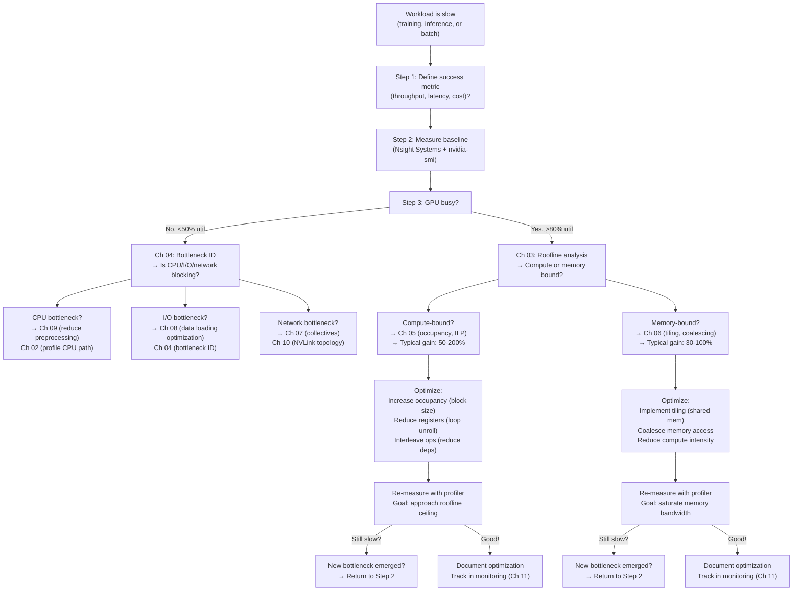

# Chapter 12 — Volume 17 Summary and Decision Trees

| Chapter metadata | Value |
|---|---|
| Volume | 17 — Performance Engineering & Optimization |
| Difficulty | Foundation |
| Estimated reading time | 30 minutes |
| Primary audience | DevOps, SRE, Platform, Cloud and Infrastructure Engineers |
| Core question | When you see a performance problem, which chapter's techniques should you apply first? |

## Learning Objectives

Apply decision trees to route performance problems to the correct chapters; integrate profiling, roofline analysis, and bottleneck identification; know the typical speedups from each optimization; synthesize individual techniques into a coherent optimization plan.

## Big Picture: The Unified Decision Tree

When a workload is slow, this flowchart routes you to the correct chapter:



## Performance Technique Catalog and Typical Gains

| Technique | Bottleneck | Speedup | Effort | When to use |
|---|---|---|---|---|
| **Mixed precision (FP32→BF16)** | Compute/memory | 1.8-2.2× | Low | Always start here for training |
| **Gradient checkpointing** | Memory pressure | Enables larger batches; 1.2-1.5× throughput gain | Medium | When memory limits batch size |
| **Tiling (shared memory)** | Memory bandwidth | 2-4× for memory-bound kernels | High | GEMM, convolutions with data reuse |
| **Occupancy optimization** | Compute latency hiding | 1.3-2.0× | Medium | When occupancy < 50% |
| **NCCL ring topology** | Collective latency | 1.5-2.0× speedup in collectives | Low (just parameter) | Multi-GPU when allreduce is >10% time |
| **Gradient accumulation** | Overlaps collective | Reduces communication overhead by 50%+ | Low | At scale (8+ GPUs) |
| **Quantization (FP8/INT8)** | Compute throughput | 1.5-2.5× faster kernels; 2-4× memory savings | Medium | When memory is bottleneck or latency-critical |
| **Pipeline parallelism** | Distributed scaling | 2-2.5× speedup (for 8 GPUs) | Very high | 16+ GPU clusters |
| **Data prefetch** | I/O latency | 1.5-3.0× depending on pattern | Medium | When dataloading is >10% iteration time |
| **Thermal/power tuning** | Throttling variance | Stability, 10-15% latency reduction | Low | Production stability |

## Real Optimization Journey: 70B Model Training

**Starting point:**
```
Baseline: 100 samples/sec on 8 GPUs
Target: 300 samples/sec (3× improvement)
Hardware: 8× H100 SXM5, 1.6 TB NVLink cluster
```

**Step 1: Profile to identify bottlenecks**

Nsight Systems trace (5 iterations):
```
Forward: 180 ms (27% of iteration)
Backward: 360 ms (54%)
AllReduce: 85 ms (13%)
Optimizer: 15 ms (2%)
Data loading: 30 ms (4%)
Total: 670 ms per iteration
```

Bottleneck ranking:
1. **Backward pass (54%)** → compute-heavy
2. **Forward pass (27%)** → memory transfer (KV cache)
3. **AllReduce (13%)** → network sync
4. **Data loading (4%)** → I/O

**Step 2: Address largest bottleneck (backward pass)**

Roofline analysis shows backward is compute-bound but far under peak (1.2 TFLOPS / 67 TFLOPS FP32 peak ≈ 1.8% of peak) — a strong signal that switching to a Tensor Core-friendly precision should help.

Optimization: Mixed precision (BF16)
```
Result: Backward 240 ms (-33%)
New total: 610 ms (-9%)
New throughput: 109 samples/sec
```

**Step 3: Next bottleneck (forward pass)**

Memory transfer dominates (loading KV cache and weights). Optimization: Gradient checkpointing (reduces activation memory, enables batch 32→40)

```
Result: Throughput 145 samples/sec (+33% from checkpoint + larger batch)
```

**Step 4: AllReduce still 13%**

Optimization: Gradient accumulation (2x accumulation steps, run allreduce less frequently)

```
Result: AllReduce amortized to 6.5% of total
Throughput: 160 samples/sec
```

**Step 5: Data loading (now 8% after previous optimizations)**

Optimization: Prefetch + larger batch

```
Result: Final throughput: 185 samples/sec
```

**Summary:**
```
Baseline: 100 samples/sec
After step 2 (mixed prec): 109 (+9%)
After step 3 (checkpointing): 145 (+33%)
After step 4 (grad accum): 160 (+10%)
After step 5 (prefetch): 185 (+16%)
Final: 185 samples/sec vs target 300 (+85%, but not quite 3×)
```

To reach 3×, additional techniques would be needed: pipeline parallelism (2.2× for 8 GPUs) + further kernel tuning. But 1.85× from these individual techniques alone is significant.

## Production Checklist

Before deploying optimized code to production:

```yaml
Profiling:
  ☐ Run Nsight Systems trace (10+ iterations)
  ☐ Identify top 3 bottlenecks by % time
  ☐ Measure roofline efficiency for compute kernels
  ☐ Verify that optimization targeted the right bottleneck

Performance validation:
  ☐ Measure throughput before and after (3+ runs, report mean ± std)
  ☐ Verify model accuracy (no regression from quantization)
  ☐ Check for convergence impact (especially gradient compression)
  ☐ Validate on hardware it will run on (different GPUs have different rooflines)

Monitoring and alerting:
  ☐ Define SLO (latency and throughput targets)
  ☐ Instrument production code with metrics (Ch 11)
  ☐ Set up regression detection (automated comparison to baseline)
  ☐ Create runbook for when SLO breaches

Documentation:
  ☐ Record baseline and optimized numbers with evidence
  ☐ Document which technique contributed how much gain
  ☐ List known limitations (e.g., "FP8 reduces accuracy by 0.2%")
  ☐ Note when to revisit (e.g., "new GPU generation changes roofline")
```

## Key Lessons from This Volume

1. **Measurement precedes optimization.** A single guess wrong costs weeks.
2. **Bottlenecks are hierarchical.** Fix the biggest first; the next one emerges after.
3. **End-to-end throughput is the truth.** Single metrics (utilization, TFLOPS) can mislead.
4. **Roofline model closes the loop.** It tells you whether improvements are possible or if you've hit the ceiling.
5. **Production is different from development.** Monitoring and alerting are as important as profiling.

## Cross References (Full Volume Map)

- Ch 01: Foundation — metrics, evidence ladder
- Ch 02: Tools — which profiler for which question
- Ch 03: Analysis — roofline model and hardware limits
- Ch 04: Diagnosis — bottleneck identification decision tree
- Ch 05: Optimization — compute-bound techniques
- Ch 06: Optimization — memory-bound techniques
- Ch 07: Optimization — communication and collectives
- Ch 08: Optimization — inference-specific techniques
- Ch 09: Optimization — training-specific techniques
- Ch 10: Tuning — system-level effects
- Ch 11: Production — monitoring and SLOs
- Ch 12: Integration — this chapter

## Interview Recap: Real Scenarios

**Scenario 1: "Our batch size got cut from 32 to 8 after a PyTorch upgrade. Why?"**

Answer (Ch 05 + Ch 06): Profiler will show which kernel changed. If forward pass is now slower (increased time), roofline analysis will say whether it's compute-bound (needs occupancy fix) or memory-bound (needs data reuse fix). Likely culprit: reduced occupancy from higher register pressure (compiler regression).

**Scenario 2: "Quantizing to FP8 improved latency but model accuracy dropped 2%."**

Answer (Ch 08 + Ch 11): Tradeoff is acceptable if business requires 2% loss. But verify it's accuracy loss, not numerical error. Retrain with FP8 from scratch (post-training quant often degrades more than training-aware quant). Document the tradeoff in monitoring.

**Scenario 3: "Scaling from 1 GPU to 8 improved throughput by only 5×."**

Answer (Ch 07 + Ch 04): Bottleneck shifted to communication (AllReduce) or synchronization. Nsight Systems on 8 GPU cluster will show collective time. If allreduce is >20% of total, optimize there (ring topology, gradient accumulation, compression). If collectives look fine, check for imbalanced load across GPUs (some GPU waiting for others).

---

**Volume 17 complete.** Performance engineering is the discipline of measurement, diagnosis, and targeted optimization. Start with Chapter 01's evidence ladder, use Chapters 02-04 to diagnose your specific bottleneck, apply the appropriate technique from Chapters 05-10, and monitor your production workload with Chapter 11's framework. Return to this decision tree whenever you see a new performance problem; it will route you to the right technique.
