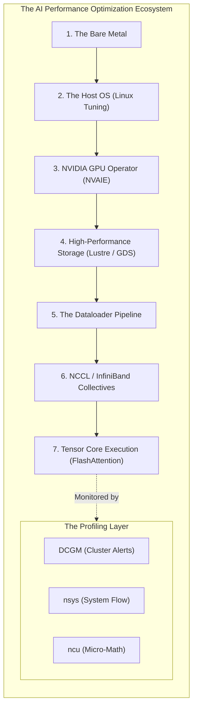

# Chapter 12 — Volume 17 Summary and Decision Trees

This volume established that performance engineering is not guesswork; it is a rigid scientific discipline. We defined the mathematical boundaries of hardware, the critical importance of the Evidence Ladder, and the specific tools required to isolate any bottleneck in a massive GPU cluster.

## Core Concepts Reviewed

1.  **The Evidence Ladder:** Never optimize without measuring. Start at the macro level (API Latency), move to the system level (CPU/PCIe metrics), and finally drill down to the execution level (Nsight timeline) to prove the bottleneck.
2.  **The Roofline Model:** The fundamental theorem of performance. A model is mathematically bound by either **Compute** (hitting the ceiling of the Tensor Cores) or **Memory Bandwidth** (starving while waiting for data from VRAM). Optimization strategies (like Quantization vs. larger GPUs) depend entirely on where the workload sits on this graph.
3.  **The Profiling Ecosystem:** 
    *   **DCGM:** Continuous background telemetry (Macro).
    *   **Nsight Systems (`nsys`):** System-wide timelines. Proves CPU starvation, PCIe bottlenecks, and network overlap (System).
    *   **Nsight Compute (`ncu`):** Microscopic analysis of a single CUDA kernel. Proves warp divergence or cache misses (Micro).
4.  **GPU Compute Optimization:** Hardware requires aligned data. Neural network dimensions must be multiples of 8 or 16 to utilize Tensor Core tiles perfectly. Avoid `if/else` branching logic to prevent **Warp Divergence**, which instantly halves GPU efficiency.
5.  **Memory Optimization:** VRAM reads must be contiguous (Coalesced). Implement **Kernel Fusion** to keep math trapped in the ultra-fast L1 Cache. For LLMs, implement **FlashAttention** to completely bypass writing massive $N \times N$ matrices to global VRAM. 
6.  **System-Level Tuning:** The Linux OS will slow down AI workloads. You must disable CPU C-States (set governor to `performance`), disable PCIe ASPM power saving, and strictly enforce NUMA pinning to prevent data from crossing the slow CPU interconnects.

## The Senior Architect's Mandate

A Senior Solutions Architect never accepts "the GPU is slow" as a valid diagnosis. 
They demand mathematical proof. They apply the USE Method (Utilization, Saturation, Errors) across the entire stack. They use `nsys` to prove the PyTorch Dataloader is starving the GPU. They use the Roofline Model to prove that buying faster hardware will yield zero ROI. Finally, they mandate strict P99 latency SLOs and automated CI/CD performance gates, ensuring that once the system is perfectly tuned, no developer can accidentally deploy a regression that destroys the cluster's efficiency.

## Beginner's Primer: Putting it all together

If you've made it this far through the Masterclass, you now understand that AI infrastructure is not just "plugging in a GPU and installing Python." 

It is an incredibly complex, interconnected system. 
- You need the **Storage** (Volume 15) to be fast enough to feed the data.
- You need the **Network** (Volume 9 & 13) to be fast enough to synchronize the 1,000 GPUs.
- You need the **Software Stack** (Volume 10 & 14) to safely inject the hardware into containers.
- You need the **Multi-Tenant Sharing** (Volume 11) to isolate users.
- You need the **Telemetry** (Volume 16) to know when things break.
- And finally, you need **Performance Engineering** (Volume 17) to squeeze every last drop of speed out of the hardware.

The diagram below maps this entire ecosystem into a single, unified workflow.

## Architecture Summary

