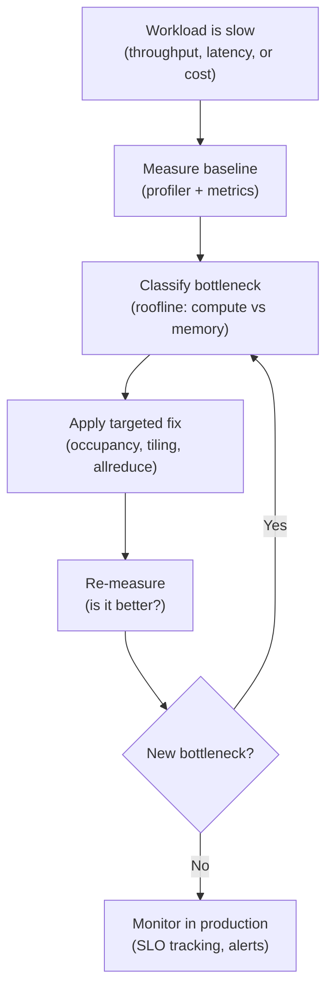

# Volume 17 — Performance Engineering

AI workloads do not run at full speed by default. An H100 can execute at up to 67 TFLOPS FP32 (or ~989 TFLOPS TF32 Tensor Core dense), but kernels often achieve only a fraction of that. Inference should return in 20ms, but latency reaches 200ms. Training should scale linearly to 8 GPUs, but adds only 5× throughput. Between hardware capability and actual performance lie measurement, analysis, diagnosis, and targeted optimization.

Performance engineering is the discipline of identifying why a workload is slow, understanding the fundamental limits (roofline model), and applying the right techniques to approach those limits. This volume teaches that discipline: how to profile, how to interpret profilers, how to classify bottlenecks, and how to know when optimization is complete.

| Volume field | Value |
|---|---|
| Difficulty | Intermediate to Advanced |
| Estimated reading time | 18–22 hours |
| Prerequisites | Volumes 01–04 (GPU fundamentals) |
| Primary focus | Measurement, diagnosis, and targeted optimization |
| Outcome | Profile and optimize training and inference workloads to reach hardware potential |

## Big Picture

Performance improvement follows a systematic flow:

**Figure 17.0 — The optimization cycle.** Measurement → diagnosis → targeted fix → re-measurement → monitoring.

## Chapters

1. [Performance Engineering Fundamentals](./chapter-01-performance-engineering-fundamentals.md) — Metrics, evidence ladders, roofline introduction
2. [Profiling Tools Landscape](./chapter-02-profiling-tools-landscape.md) — Nsight Compute, Nsight Systems, PyTorch profiler
3. [Roofline Model and Analytical Performance](./chapter-03-roofline-model-and-analytical-performance.md) — Hardware limits, compute intensity, bottleneck classification
4. [Bottleneck Identification and Diagnosis](./chapter-04-bottleneck-identification-and-diagnosis.md) — Decision trees, real examples, systematic isolation
5. [GPU Compute Optimization](./chapter-05-gpu-compute-optimization.md) — Occupancy, ILP, instruction throughput, reaching peak TFLOPS
6. [Memory Optimization](./chapter-06-memory-optimization.md) — Bandwidth utilization, tiling, coalescing, cache efficiency
7. [Communication and Collective Optimization](./chapter-07-communication-and-collective-optimization.md) — NCCL, allreduce latency, compute-collective overlap
8. [Inference Optimization](./chapter-08-inference-optimization.md) — Prefill vs decode, KV cache, batching, quantization
9. [Training Optimization](./chapter-09-training-optimization.md) — Gradient checkpointing, mixed precision, pipeline parallelism, scaling
10. [System-Level Performance Tuning](./chapter-10-system-level-performance-tuning.md) — Clocks, thermal throttling, NUMA, PCIe, power limits
11. [Production Performance Monitoring and SLOs](./chapter-11-production-performance-monitoring-and-slos.md) — SLO definition, instrumentation, regression detection, alerting
12. [Volume 17 Summary and Decision Trees](./chapter-12-volume-17-summary-and-decision-trees.md) — Integrated optimization workflow, technique catalog, real scenarios

## Labs

- Lab 01 — Profiling Fundamentals — Profile a PyTorch loop with Nsight Systems and PyTorch profiler
- Lab 02 — Roofline Analysis — Measure kernel metrics and plot on roofline model
- Lab 03 — Mixed Precision Training — FP32 vs BF16, measure speedup, validate accuracy
- Lab 04 — Distributed Training Performance — Multi-GPU throughput, scaling efficiency, collective profiling
