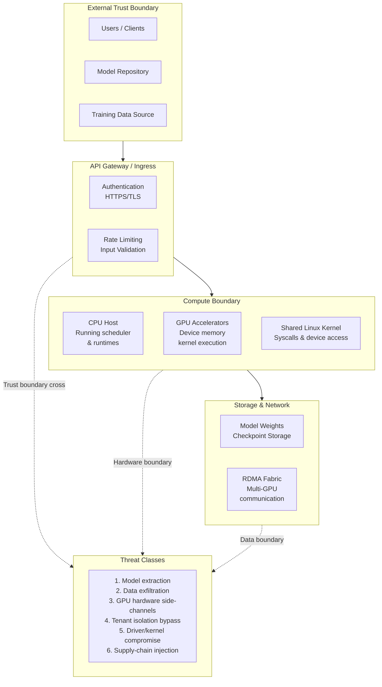
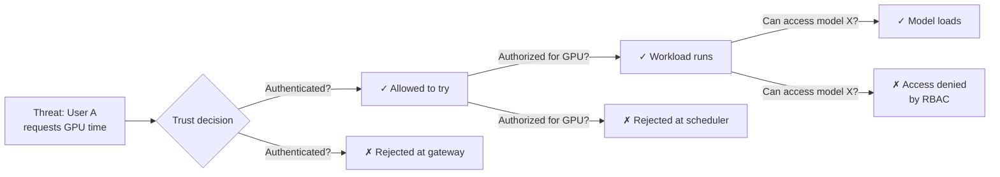
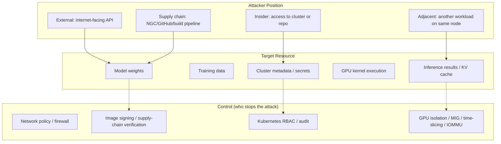
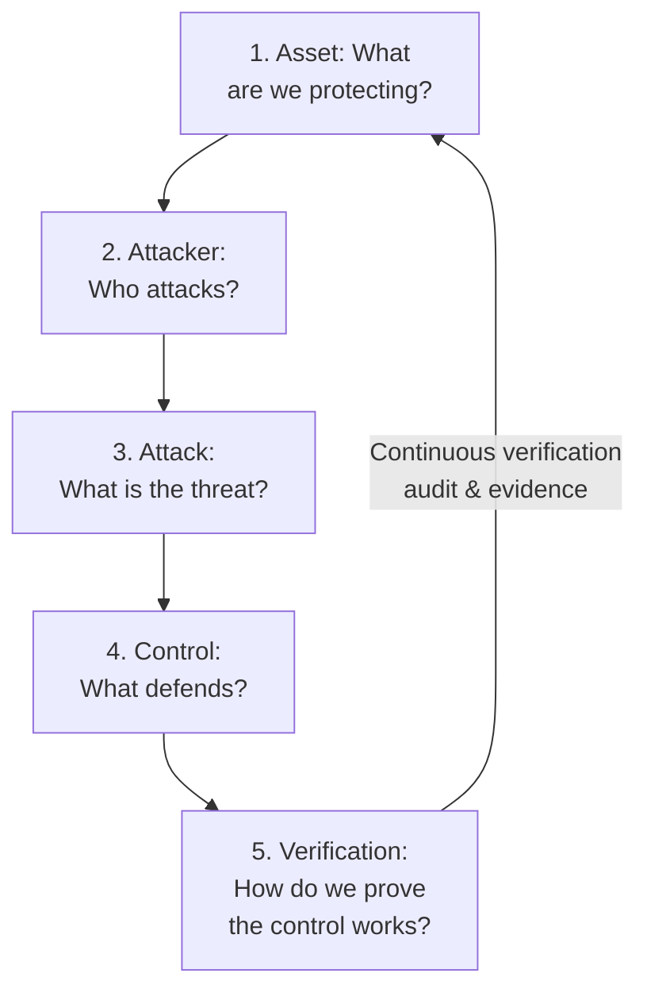

# Chapter 1 — Threat Modeling for AI Infrastructure

**Learning outcome:** Identify trust boundaries in an AI system, reason about attack surfaces, and distinguish between data compromise, code injection, resource exhaustion, and availability threats.

## 1.1 The attack surface is wider than traditional apps

A traditional web application has a clear boundary: users connect over HTTPS, the application handles requests, and data lives in a database. Security focuses on authentication, authorization, input validation, and network perimeter.

AI infrastructure adds multiple new boundaries:



**Key insight:** Every AI infrastructure layer becomes an attacker's potential entry point. Compromising a driver can access all GPU memory. Compromising a scheduler can read any model. A side-channel in GPU hardware can leak training data. This is distinctly different from "a web server got hacked."

## 1.2 Three fundamental trust boundaries

**Perimeter boundary:** Who is allowed to send requests to the system?
**Compute boundary:** What code runs on the GPU and with what permissions?
**Data boundary:** Who can access models, training data, and inference results?

These are not the same question.



**Scenario:** A data scientist requests GPU time for model inference.

1. **Perimeter:** Is this scientist a valid employee? (authentication via company OIDC or mutual TLS)
2. **Compute:** Does this scientist have GPU quota? (scheduler RBAC)
3. **Data:** Does this scientist have permission to load this model? (model registry ACLs, Kubernetes Pod security context)

Failing at any boundary is a security event. Succeeding at all three does not mean the workload is trustworthy — it means the person and their process passed authorization gates. The workload itself must be inspected separately.

## 1.3 Real threat classes in AI infrastructure

**Data compromise (confidentiality):**
- A competing researcher gains read access to unpublished model weights during training.
- An attacker reads GPU memory containing KV cache or training activations.
- A malicious container on a shared node uses GPU side-channels to leak tensor data from another tenant's GPU job.

**Evidence of compromise:**
```bash
# Check for unauthorized GPU access
nvidia-smi | grep -E 'COMPUTE|PID'
# Look for unexpected processes holding GPU memory
ps aux | grep -i cuda

# Check container image signatures
cosign verify gcr.io/myregistry/model-server:v1.0

# Inspect GPU memory permissions
cat /proc/<pid>/status | grep VmRSS
```

**Code injection (integrity):**
- An attacker modifies model weights in the model repository before download.
- A supply-chain compromise injects malicious code into an NGC container.
- A malicious Pod injected via Kubernetes YAML reads the cluster's secrets and exfiltrates them.

**Evidence of injection:**
```bash
# Verify model artifact signatures
sha256sum model.safetensors
# Compare against signed manifest: model.safetensors.asc

# Verify container image layers
docker inspect gcr.io/myregistry/model-server:v1.0 | jq '.RepoDigests'

# Validate Pod admission controller
kubectl get clusterrolebindings -o json | jq '.items[] | select(.metadata.name == "can-read-secrets")'
```

**Resource exhaustion (availability):**
- One tenant's GPU job runs forever and starves others.
- A denial-of-service attack submits 10,000 inference requests, saturating the inference server.
- A malicious model with intentional infinite loops causes the GPU scheduler to deadlock.

**Evidence of exhaustion:**
```bash
# Watch GPU utilization and memory per container
nvidia-smi dmon -s pucvmet -c 10

# Check scheduler queue and Pod eviction events
kubectl get events -n gpu-namespace --sort-by='.lastTimestamp' | grep Evicted

# Inspect kernel logs for scheduler issues
dmesg | grep -i 'gpu\|cuda\|timeout'
```

**Isolation breach (privilege escalation):**
- A user in one Kubernetes namespace reads secrets from another namespace.
- A GPU MIG instance is misconfigured and two tenants share the same physical GPU resources.
- A container escape via runc vulnerability gives shell access to the host.

**Evidence of breach:**
```bash
# Verify Kubernetes RBAC: can user/SA read secrets?
kubectl auth can-i get secrets --as=system:serviceaccount:namespace:name

# Check MIG configuration: verify instance isolation
nvidia-smi -L  # list GPU instances
nvidia-smi -i 0 -q -d MEMORY  # per-instance memory isolation

# Check for container runtime vulnerabilities
docker run --rm alpine sh -c 'id; cat /etc/hostname'
# Expected: runs as unprivileged user, cannot escape to host
```

## 1.4 Threat matrix: mapping attacker positions to boundaries



This matrix directly informs which security controls are non-negotiable:

| Attacker | Target | Risk | Control | Evidence |
|---|---|---|---|---|
| External | Model inference | Model extraction via timing attacks | Input rate limiting, output perturbation, HTTPS | `tcpdump` on inference server; compare response times |
| Supply chain | Container code | Malicious dependency in NGC | Image scanning, signature verification, air-gap build | `cosign verify` + signed SBOMs; audit image pull logs |
| Insider on cluster | Training data | Direct memory read via malicious Pod | GPU isolation, Pod Security Policy, Network Policy | `kubectl auth can-i get pods --as=malicious-user` |
| Adjacent workload on GPU | Inference KV cache | GPU memory side-channel | MIG isolation, time-slicing audit, IOMMU validation | `nvidia-smi` per-process memory; check MIG instance isolation |

## 1.5 Interview-ready reasoning: the threat model interview question

**Interview question:** "Walk us through how you would isolate two separate AI workloads on a shared GPU cluster, and what trust boundaries you would enforce."

**Model answer (spoken):**
> "I'd start by defining what we're protecting: the model weights for Job A, the training data for Job B, and the inference results from both. Then I'd identify three boundaries. First, the perimeter: both workloads come through the same Kubernetes API, so authentication and HTTPS are the first gate — I'd verify both jobs use the cluster's OIDC provider. Second, the compute boundary: I need to make sure Job A and Job B don't read each other's GPU memory or kernel state. That's where MIG or time-slicing matters — MIG gives hard physical isolation, time-slicing shares the GPU but with scheduler fairness guarantees. Third, the data boundary: Job A's model weights live in a specific namespace with RBAC, Job B's training data is in a different namespace with its own Pod Security Policy and Network Policy blocking cross-namespace traffic.
>
> To verify it actually works, I'd run `kubectl auth can-i` from both jobs' service accounts to confirm each can only read its own namespace. I'd check `nvidia-smi -L` to confirm MIG instances are created and separate. I'd deploy a test workload in Job A that tries to read Job B's persistent volume and confirm the access denied error in the logs.
>
> The hardest part is the GPU memory side-channel. If I'm using time-slicing instead of MIG, both jobs still share the same GPU die, and timing-based side-channels could leak data. That's why I'd prefer MIG or separate GPUs for high-security workloads, and document that time-slicing is a convenience trade-off that assumes workloads trust each other somewhat."

**What this answer shows:** understanding of authentication → authorization → data isolation, concrete tools and checks, and realistic risk acknowledgment.

## 1.6 Threat model template: the one to memorize

For any AI infrastructure question, ask:

1. **What are we protecting?** (Models, data, results, GPU resources, cluster metadata)
2. **Who is the attacker?** (External, supply-chain, insider, adjacent workload)
3. **What is the attack?** (Extract, inject, exhaust, escalate)
4. **Which boundary defends against it?** (Perimeter, compute, data, hardware)
5. **How do we verify the defense works?** (Audit logs, access tests, permission checks, signature verification)



## Key Takeaways

- AI infrastructure has multiple trust boundaries: perimeter (authentication), compute (authorization), and data (access control).
- Threat classes include data compromise, code injection, resource exhaustion, and isolation breaches.
- Every attacker position (external, supply-chain, insider, adjacent) targets a different boundary.
- Security is not a single gate; it is verification at every boundary.
- The best interview signal is reasoning through the five-step threat model for any specific scenario.

## Cross References

- Next: [Chapter 2 — Hardware and Firmware Trust](./chapter-02-placeholder.md)
- Related: [Chapter 5 — Kubernetes RBAC and Pod Security](./chapter-05-placeholder.md)
- Lab: [Lab 01 — Validate Secure Boot and Driver State](./labs/lab-01-placeholder.md)
