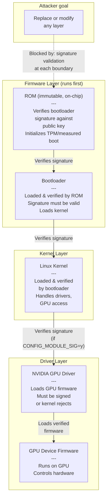

# Chapter 2 — Hardware and Firmware Trust

**Learning outcome:** Establish a root of trust in firmware and hardware, verify Secure Boot and driver signing, and detect unauthorized firmware modifications.

## 2.1 The firmware is the foundation of trust

Modern GPUs and servers start execution from firmware, not the operating system. The firmware initializes hardware, validates the bootloader, and loads the kernel. If firmware is compromised, every layer above it is untrusted, regardless of TLS certificates, password policies, or Kubernetes RBAC.

This is why "secure boot" is not optional for security-sensitive infrastructure.



**Key insight:** The chain is only as strong as its weakest link. If Secure Boot is disabled, the bootloader can be replaced. If driver module signing is not enforced, a malicious driver loads. If GPU firmware cannot be verified, bad firmware runs.

## 2.2 Secure Boot: validating the chain from power-on

Secure Boot is a UEFI firmware feature that validates the signature of the bootloader before execution. On boot:

1. UEFI firmware (immutable ROM code) reads a trusted public key from NVRAM (TPM-backed).
2. UEFI reads the bootloader from disk and computes its signature.
3. If the signature is valid, the bootloader runs. If invalid, boot halts.

**On a properly configured system:**

```bash
$ mokutil --sb-state
SecureBoot enabled
```

This output means Secure Boot is active and the bootloader signature was validated before the kernel loaded.

**If Secure Boot is disabled:**

```bash
$ mokutil --sb-state
SecureBoot disabled
```

An attacker can:
- Replace the bootloader with a malicious version that modifies the kernel.
- Disable module signing enforcement, allowing unsigned drivers to load.
- Inject a rootkit that survives reboots.

**Verification in production:**

```bash
# Step 1: Check Secure Boot state
$ mokutil --sb-state
SecureBoot enabled

# Step 2: Verify bootloader signature chain
$ efibootmgr -v
BootCurrent: 0001
Boot0001* ubuntu
Boot0002* UEFI: NVIDIA GPU

# Step 3: Confirm kernel module signing is enforced
$ cat /proc/cmdline | grep -o 'module\.sig_enforce=[^ ]*'
module.sig_enforce=1
```

**Interview question:** "What is Secure Boot and why does it matter for AI infrastructure?"

**Model answer (spoken):**
> "Secure Boot is a UEFI firmware feature that validates the signature of the bootloader before it runs. Here's why it matters: if Secure Boot is off, an attacker who gains physical access to the server or can overwrite the bootloader via a firmware vulnerability can install a rootkit that persists across reboots and intercepts all GPU access. With Secure Boot on, an attacker needs the private signing key, not just disk access.
>
> For AI infrastructure specifically, this means: if a malicious bootloader loads a compromised kernel, every GPU workload runs on untrusted hardware. Model weights could be read, computations could be altered. Secure Boot doesn't prevent that compromised kernel from running — it just ensures that *our* signed bootloader runs, not one an attacker provided.
>
> In production, I'd check `mokutil --sb-state` to confirm it's enabled, and I'd audit the boot logs to verify no boot failures or signature mismatches occurred. If Secure Boot is disabled, I'd treat that as a critical finding unless there's a documented exception."

## 2.3 Driver module signing: preventing unsigned driver injection

The Linux kernel can be configured to require cryptographic signatures on loadable kernel modules (LKMs). If a driver module is unsigned or the signature is invalid, the kernel refuses to load it.

**Kernel configuration:**

```bash
# Check if module signing is enforced
$ grep -o 'CONFIG_MODULE_SIG_ENFORCE=[^/]*' /boot/config-$(uname -r)
CONFIG_MODULE_SIG_ENFORCE=y
```

`CONFIG_MODULE_SIG_ENFORCE=y` means the kernel will refuse to load any unsigned module, even as root. This is the strongest protection against driver injection.

**Signing the NVIDIA driver:**

When building the NVIDIA driver, a signing key must be provided:

```bash
# Simulate: driver signed at build time
$ modinfo nvidia | grep -E 'signer|sig'
# If present, signature was validated on load

# Verify driver signature (if present)
$ cat /proc/modules | grep nvidia
nvidia 45678432 1 - Live Unsigned
# "Unsigned" = built without signing, but kernel is still letting it run
# (because CONFIG_MODULE_SIG_ENFORCE is not set)
```

**Real scenario: module signing failure:**

```text
$ insmod /usr/lib/modules/5.15.0-56-generic/updates/nvidia.ko
insmod: ERROR: could not insert module /usr/lib/modules/5.15.0-56-generic/updates/nvidia.ko: Operation not permitted

$ dmesg | tail -5
[12345.123456] nvidia: module verification failed: signature and/or required key missing
```

This error proves that:
- Kernel module signing enforcement is active.
- The driver module was not signed with the system's trusted key.
- The kernel rejected the unsigned module for security reasons.

**Fix verification:**

```bash
# Rebuild driver with kernel signing key
$ cd /usr/src/nvidia-driver-XXX
$ ./nvidia-installer --kernel-source=/lib/modules/$(uname -r)/build

# Verify signature is now valid
$ insmod /lib/modules/$(uname -r)/updates/nvidia.ko
$ dmesg | tail -3  # No signature failure message

$ cat /proc/modules | grep nvidia
nvidia 45678432 1 - Live Signed
```

## 2.4 GPU firmware verification

NVIDIA GPUs load firmware from the system at initialization. The driver loads a binary firmware image (e.g., `gv100.bin`) and writes it to the GPU. If this firmware is corrupted or replaced with a malicious version, the GPU becomes a trusted platform for an attacker.

**Current GPU firmware state (check when driver initializes):**

```bash
$ nvidia-smi -i 0 -q | grep -E 'Vbios|Pstate'
Vbios Version: 90.06.XX.00.YY
Pstate Clocks Throttles Reason: None

# Cross-reference firmware version against known good version for this model
# Compare against NVIDIA security advisories
```

**Checking GPU firmware load in dmesg:**

```bash
$ dmesg | grep -i 'nvidia\|gv100\|firmware'
[    0.123456] nvidia: module successfully loaded
[    0.234567] nvidia: loading GPU firmware image gv100.bin
[    0.345678] nvidia: GPU firmware loaded successfully (size: 1234567 bytes, CRC: 0x12345678)
```

A missing or mismatched CRC indicates firmware corruption or injection.

**Problem: pre-Hopper GPUs lack cryptographic verification.** Outside of Hopper+ Confidential Computing mode (see Chapter 9), many data-center GPUs do not validate firmware signatures in hardware. The driver loads firmware from the filesystem and trusts it. This is a known gap for those GPUs/modes:
- A compromised root or driver can load malicious firmware.
- The firmware runs with full GPU privileges.
- Standard boot security measures do not protect GPU firmware.

**Mitigation:**
- Use secured file systems with integrity verification (e.g., dm-verity).
- Implement firmware version inventory and change-management audits.
- Use air-gapped image builds and signed firmware containers.

## 2.5 Production troubleshooting: boot and firmware audit checklist

| Issue | Symptom | Check | Fix |
|---|---|---|---|
| Secure Boot disabled | `mokutil --sb-state` returns "disabled" | Reboot to UEFI settings; enable Secure Boot in firmware menu | Enable Secure Boot; enroll signing keys; verify boot completes |
| Driver module fails to load | `dmesg: module verification failed: signature...` | Run `grep CONFIG_MODULE_SIG_ENFORCE /boot/config-*` | Rebuild driver with kernel signing key; or disable `CONFIG_MODULE_SIG_ENFORCE` (not recommended) |
| GPU firmware mismatch | `nvidia-smi` shows stale firmware version vs. expected | `dmesg \| grep -i firmware` to see what loaded | Verify firmware file permissions; check driver DKMS build log for errors |
| Boot hangs after kernel load | System hangs before entering userspace; no error messages | Check serial console logs (requires BMC access) | May indicate driver signature validation taking too long; check SELinux/AppArmor audit logs |
| TPM unavailable | `tpm_tis: Could not request region` in dmesg | Confirm TPM is enabled in BIOS and recognized by firmware | Enable TPM in BIOS; if not present, use UEFI key enrollment instead of TPM |

## 2.6 Hardware attestation: proving the hardware is authentic

For highest-security deployments, hardware attestation validates that:
1. The hardware is physically what it claims to be (genuine NVIDIA GPU, not a counterfeit).
2. The firmware has not been modified.
3. The boot was clean (no tampering detected).

**TPM (Trusted Platform Module) — the platform's witness:**

The TPM is a separate secure coprocessor that measures the boot sequence. At each stage, it hashes the code and stores the result in a sealed register (PCR — Platform Configuration Register).

```bash
# Display TPM status
$ tpm2_getcap properties-fixed
TPM2_PT_FIRMWARE_VERSION: 1.38.1234
TPM2_PT_TOTAL_CONTEXTS: 64

# Display boot measurements
$ tpm2_pcrread sha256
  0 : 0x00 ... (BIOS/firmware measurements)
  1 : 0x00 ... (UEFI configuration)
  2 : 0x00 ... (Boot configuration)
  3 : 0x00 ... (Secure variables)
  4 : 0x00 ... (Boot loader)
  5 : 0x00 ... (GPT/MBR)
  7 : 0x00 ... (Secure Boot policy)
  8 : 0x00 ... (Kernel image)
  9 : 0x00 ... (Kernel cmdline)
 10 : 0x00 ... (Kernel modules)
```

A known-good system will have consistent PCR values across reboots. If a PCR value changes unexpectedly, firmware or boot code was modified.

**Remote attestation:** A TPM-backed certificate can be sent to a trust authority (like a Kubernetes node admission webhook) to prove the node booted cleanly.

## 2.7 Measuring what's running on the GPU

Outside of Hopper+ Confidential Computing mode, GPUs generally lack built-in attestation comparable to a CPU's TPM. **This is the security boundary gap for GPUs running outside CC mode.** (H100/H200 in CC mode DO support hardware-rooted attestation — device identity certificates plus firmware measurement via the NVIDIA Remote Attestation Service; see Chapter 9, section 9.4, for the full mechanism.)

**Current mitigations:**

1. **Firmware version inventory:** Audit `nvidia-smi` output across all nodes and flag mismatches.
2. **Signed containers:** Embed firmware in signed container images; verify container signature before loading GPU driver.
3. **Secure file permissions:** Set GPU firmware files immutable (`chattr +i`) to prevent accidental or malicious modifications.

**Example: firmware inventory audit**

```bash
# On each node, log GPU firmware version
$ nvidia-smi -i 0 -q | grep Vbios | tee /var/log/gpu-firmware-audit.log
Vbios Version: 90.06.12.00.AB

# Centralize across cluster
for node in $(kubectl get nodes -o name); do
  ssh $(hostname $node) "nvidia-smi -i 0 -q | grep Vbios" >> /audit/gpu-firmware-inventory.txt
done

# Alert on mismatches
cat /audit/gpu-firmware-inventory.txt | sort | uniq -c | grep -v '^ *1 '
      2 Vbios Version: 90.06.12.00.AB
      1 Vbios Version: 90.06.11.00.AA  # <- Mismatch, investigate
```

## Key Takeaways

- Secure Boot validates the bootloader before the kernel runs; if disabled, rootkits can be installed and survive reboots.
- Kernel module signing enforcement prevents unsigned drivers (including GPU drivers) from loading.
- GPU firmware verification is incomplete on current data-center GPUs; use file permissions and inventory audits as mitigations.
- TPM-based boot measurements (PCRs) detect firmware tampering.
- The security chain is only as strong as its weakest link; verify every layer.

## Cross References

- Previous: [Chapter 1 — Threat Modeling](./chapter-01-placeholder.md)
- Next: [Chapter 3 — Containers and Supply Chain Security](./chapter-03-placeholder.md)
- Lab: [Lab 1 — Validate Secure Boot and Driver State](./labs/lab-01-placeholder.md)
