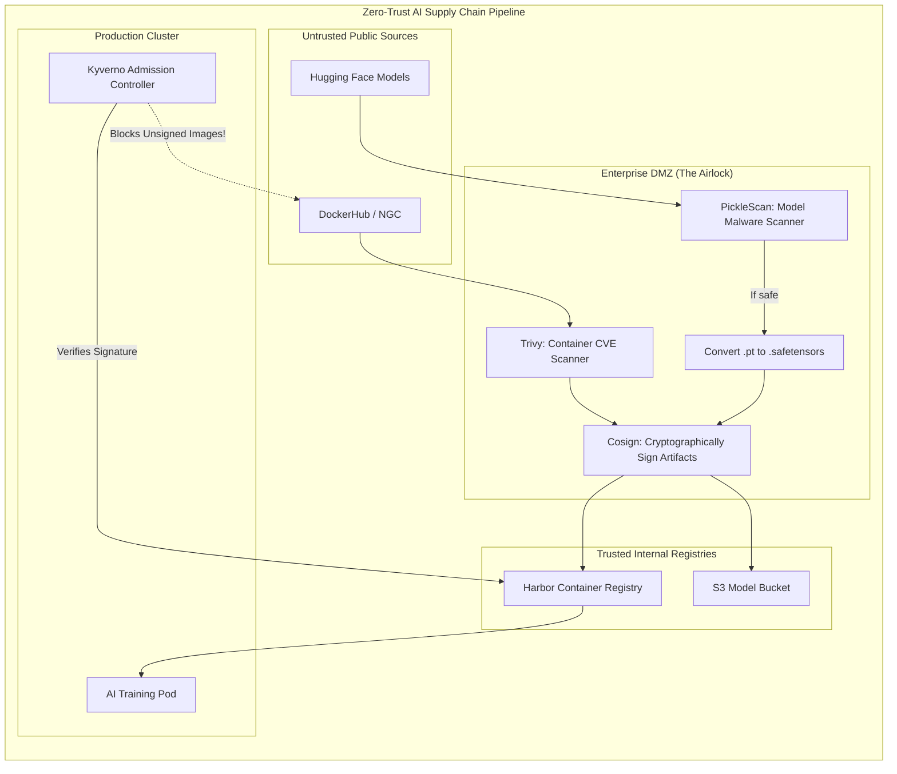

# Chapter 3 — Containers and Supply Chain Security

| Chapter metadata | Value |
|---|---|
| Volume | 18 — Security, Compliance, and Confidential Computing |
| Difficulty | Advanced |
| Estimated reading time | 30 minutes |
| Primary audience | DevSecOps, Platform Engineers |
| Core question | If a data scientist downloads an open-source PyTorch container and a Llama-3 model from the internet, how do you prove they don't contain a crypto-miner? |

## Introduction

The AI ecosystem moves at a blistering pace. To innovate, data scientists constantly pull pre-built Docker containers, Python libraries (pip), and massive model weights from public repositories like DockerHub, PyPI, and HuggingFace.

This represents the ultimate **Supply Chain Vulnerability**. 
You can build a perfectly secure, air-gapped data center, but if you allow a developer to pull a random Docker container into it, you have willingly installed a backdoor. 

A Senior Architect must design an automated, mathematically rigorous "air-lock" that intercepts, scans, and signs every single piece of software and data before it is allowed to execute on the GPU cluster.

## Beginner's Primer: The Trojan Horse

When you download a `.jpg` image off the internet, you are generally safe because an image is just static data. 
When you download an AI model from Hugging Face (often a `.bin` or `.pt` file), you might assume it is also just static data. 

**It is not.**
Historically, PyTorch models were saved using a Python tool called `pickle`. The problem with `pickle` is that it doesn't just save data; it can save *executable code*. 
If a bad actor uploads a "free, highly accurate AI model" to the internet, but hides a tiny Python script inside the `.pickle` file, the exact millisecond you load that model into your GPU, the script executes and gives the hacker full control of your server. 

To solve this, the AI industry invented a new file format called **Safetensors** (`.safetensors`). Safetensors is physically incapable of holding executable code; it can only hold raw numbers (math). 

As a Platform Engineer, you must build automated pipelines that scan every model downloaded from the internet, block `pickle` files, and force users to use `safetensors`. This is what it means to secure the "AI Supply Chain."

## 1. The Container Supply Chain

A developer writes a `Dockerfile`: `FROM pytorch/pytorch:latest`. 
This is a massive security failure. 

1.  **Immutability:** `latest` changes every day. You have no idea what software is actually running in production. You must pin to a specific SHA256 hash.
2.  **Vulnerabilities:** Public images contain hundreds of unpatched Linux libraries (CVEs). 

**The Secure Pipeline:**
1.  The developer commits code. The CI/CD pipeline builds the container.
2.  The pipeline pushes the container to a **Secure Registry** (e.g., Harbor, AWS ECR).
3.  The registry automatically scans the image for CVEs using a tool like Trivy or Clair.
4.  If the image passes the scan, the CI/CD pipeline cryptographically **Signs** the image using a tool like Cosign. 
5.  In Kubernetes, an Admission Controller (like OPA Gatekeeper or Kyverno) intercepts the Pod creation request. It mathematically verifies the Cosign signature. If the signature is missing or invalid, Kubernetes refuses to run the container. 

## 2. The Model Supply Chain (Pickles and Safetensors)

In traditional software, you scan code. In AI, you must scan *models*.

Historically, PyTorch models were saved using Python's `pickle` module (`.pkl` or `.pt`). 
**Pickle files are executable code, not just data.** If you load a malicious `pickle` file, it can execute arbitrary Python commands on your server. 

**The Architect's Defense:**
1.  **Ban Pickles:** A Senior Architect mandates that all models must be stored and loaded using the **`safetensors`** format. Safetensors only store pure mathematical data; they physically cannot execute code.
2.  **Model Scanning:** Before a model is allowed into the internal model registry, it must be scanned. Tools like `clamav` or specialized AI security scanners check the model weights for known malware signatures or embedded malicious scripts.

## 3. The Python Dependency Trap (`pip`)

AI runs on Python. Python relies on `pip install`. 

Attackers frequently use **Typosquatting**. They upload a malicious package to PyPI named `transfromers` (instead of `transformers`). A developer makes a typo, installs the malicious package, and the attacker steals their AWS credentials.

*Architectural Mandate:* Production clusters must never reach out to public PyPI. You must host an internal PyPI mirror (e.g., JFrog Artifactory). The mirror proxies the public packages, scans them for malware, and blocks known malicious packages. Developers `pip install` exclusively from the internal mirror.

## Customer Scenario (Senior Level)

**The Situation:**
A financial institution wants to rapidly prototype a GenAI application using an open-source model from HuggingFace. The data science team downloads the model weights (provided as `.bin` files) and a pre-built inference container from a community GitHub repository. They deploy the container to the development Kubernetes cluster. A week later, the InfoSec team detects that the GPU nodes are communicating with a known cryptocurrency mining pool. The platform team scrambles to figure out how the cluster was breached.

**The Senior Architect Response:**
"The cluster was breached because we allowed untrusted, unverified artifacts from the public internet to bypass our security perimeter and execute directly on our compute hardware.

The breach likely occurred through one of two vectors in the AI supply chain. 
First, the community inference container may have contained a malicious base image or a compromised Python dependency installed via an unverified `requirements.txt`. 
Second, the model weights themselves, downloaded as PyTorch `.bin` files (which are often wrappers around Python `pickle` objects), may have contained an embedded payload that executed a reverse shell when loaded into memory.

To secure this platform permanently, we must implement a **Zero-Trust AI Supply Chain Pipeline**.

We will immediately implement a Kubernetes Admission Controller (like Kyverno). We will configure a strict policy: Kubernetes will reject any Pod that attempts to pull an image from the public internet (e.g., DockerHub). All deployments must use images hosted in our internal, secure registry. 

Furthermore, we will implement a mandatory scanning phase for all AI models. Any model downloaded from HuggingFace must be staged in a quarantine zone. An automated pipeline will use tools like `picklescan` to inspect the `.bin` files for malicious bytecode. If the model passes, the pipeline will convert the weights into the secure, non-executable **`.safetensors`** format, and upload it to our internal S3 bucket. The data science team will only be allowed to load `.safetensors` files into the production inference containers, closing the arbitrary code execution loophole forever."

## Interview Preparation

**Conceptual:** Why is loading a standard PyTorch model file (`.pt` or `.pkl`) downloaded from the internet a massive security risk? *(Hint: Standard PyTorch model files use Python's `pickle` serialization format. Pickle is not secure; it allows for arbitrary code execution during deserialization. Loading a poisoned pickle file can instantly give an attacker a shell on your server. You should always use the `.safetensors` format, which only stores raw data and cannot execute code).*

**Architecture:** Explain how container signing (e.g., using Cosign) and Kubernetes Admission Controllers work together to secure a cluster. *(Hint: When a CI/CD pipeline builds and scans a container, it cryptographically signs the image to prove it is safe and approved. In Kubernetes, an Admission Controller intercepts every attempt to launch a Pod. It checks the signature of the requested container image. If the signature is invalid or missing (meaning the image was tampered with or pulled directly from an unapproved source), the Admission Controller blocks the Pod from starting).*

## Architecture Summary

Securing an AI cluster requires establishing a "Zero-Trust Airlock" between the public internet and the production environment. Platform teams must implement internal container mirrors (Harbor/Artifactory), force rigorous vulnerability scanning, and mathematically sign the approved containers. Furthermore, models downloaded from HuggingFace must be aggressively scanned for Python `pickle` exploits and converted to secure `.safetensors` before deployment.

