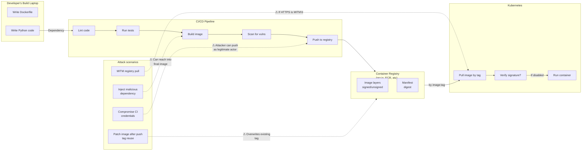

# Chapter 3 — Containers and Supply Chain Security

**Learning outcome:** Verify container signatures, audit image provenance, detect supply-chain compromises, and establish trust in NGC and third-party images.

## 3.1 The supply chain is a critical attack surface

An AI inference workload starts before the code runs. It starts with:

1. A developer on their laptop writes application code and Dockerfile.
2. CI/CD pipeline builds the image, runs tests, and publishes to a registry.
3. Kubernetes pulls the image and spawns a Pod.
4. The container runtime unpacks the layers and starts the application.

An attacker can compromise at any step:



**Key insight:** Using `docker pull myimage:latest` is only secure if:
1. The tag actually points to the expected code (not reused with different code).
2. The image has not been modified since build.
3. No attacker sits between the Kubernetes node and the registry.

Most deployments do **none** of these checks.

## 3.2 Image signatures: proving the image is what we expect

Container image signing uses cryptographic signatures to prove:
- The image came from a trusted builder (authentication).
- The image has not been modified since signing (integrity).
- The signer owns a specific identity (non-repudiation).

**Standard tool: Cosign** (part of the Sigstore project)

```bash
# Step 1: Sign an image at build time
cosign sign --key cosign.key gcr.io/myproject/model-server:v1.0

# Step 2: Verify the signature at runtime (before pulling)
cosign verify --key cosign.pub gcr.io/myproject/model-server:v1.0 | jq .

# Step 3: Kubernetes pod admission controller enforces verification
# (Via ClusterPolicy or admission webhook)
```

**Real scenario: successful verification**

```bash
$ cosign verify --key cosign.pub gcr.io/myproject/model-server:v1.0

Verification for gcr.io/myproject/model-server:v1.0 --
The following checks were performed on each of these signatures:
  - The cosign claims were validated
  - Existence of the claims in the transparency log was verified offline
  - The code-signing certificate was verified using trusted certificate authority data

[
  {
    "critical": {
      "identity": {
        "docker-reference": "gcr.io/myproject/model-server:v1.0"
      },
      "image": {
        "docker-manifest-digest": "sha256:3d7e6f8a9c1b4d2e5f6g7h8i9j0k1l2m3n4o5p"
      },
      "type": "cosign container image signature v1"
    },
    "optional": {
      "builder.id": "github-actions",
      "timestamp": "2026-08-07T14:32:15Z"
    }
  }
]
```

**Verification success means:**
- The signer's certificate was valid at signing time.
- The image digest (SHA256) matches the signed digest.
- The image has not been modified since signing.

**Real scenario: signature verification failure**

```bash
$ cosign verify --key cosign.pub gcr.io/myproject/model-server:v1.0
Error: no matching signatures found

$ # This means:
$ # 1. The image was never signed, OR
$ # 2. The signature was created with a different key, OR
$ # 3. The image was modified after signing
```

**Example: image tag reuse attack**

An attacker compromises the CI/CD system and pushes malicious code, reusing an existing tag:

```bash
# Initial trusted build
$ docker build -t gcr.io/myproject/model-server:v1.0 .
$ cosign sign --key cosign.key gcr.io/myproject/model-server:v1.0

# Attacker compromises CI, injects malicious code, rebuilds with same tag
$ docker build -t gcr.io/myproject/model-server:v1.0 . # contains backdoor
$ docker push gcr.io/myproject/model-server:v1.0        # overwrites v1.0 tag

# Kubernetes still sees tag:v1.0 but now pulls malicious image
$ kubectl set image deployment/model-server model-server=gcr.io/myproject/model-server:v1.0

# Mitigation: use image digest instead of tag
$ kubectl set image deployment/model-server \
    model-server=gcr.io/myproject/model-server@sha256:3d7e6f8a9c1b...
# Now image is immutable; pulling the digest always gets the exact same image

# Verification still works
$ cosign verify --key cosign.pub \
  gcr.io/myproject/model-server@sha256:3d7e6f8a9c1b...
```

## 3.3 Software Bill of Materials (SBOM): knowing what's in the image

An SBOM (Software Bill of Materials) is a document listing every software component in the image: base OS packages, Python libraries, system binaries, and their versions.

**Why it matters:** If a vulnerable package (e.g., OpenSSL 1.1.0g) is discovered, you can immediately identify which images contain it.

**Standard format: SPDX (ISO/IEC 5962)**

```bash
# Generate SBOM at build time
syft gcr.io/myproject/model-server:v1.0 > model-server.sbom.json

# Sign the SBOM
cosign attach sbom --sbom model-server.sbom.json --key cosign.key \
  gcr.io/myproject/model-server:v1.0

# Retrieve and inspect SBOM
cosign find sbom gcr.io/myproject/model-server:v1.0 | jq .
```

**Real SBOM structure (abbreviated):**

```json
{
  "spdxVersion": "SPDX-2.2",
  "creationInfo": {
    "created": "2026-08-07T14:32:15Z",
    "creators": ["Tool: syft-0.65.0"]
  },
  "packages": [
    {
      "name": "base-image",
      "downloadLocation": "docker-image:nvcr.io/nvidia/cuda:12.0-runtime-ubuntu20.04",
      "filesAnalyzed": false
    },
    {
      "name": "python3",
      "version": "3.8.10",
      "supplier": "Organization: canonical",
      "downloadLocation": "http://archive.ubuntu.com/ubuntu/pool/main/p/python3.8/"
    },
    {
      "name": "openssl",
      "version": "1.1.1f-1ubuntu2.17",
      "downloadLocation": "http://archive.ubuntu.com/ubuntu/pool/main/o/openssl/"
    },
    {
      "name": "transformers",
      "version": "4.30.0",
      "downloadLocation": "https://pypi.org/project/transformers/4.30.0/",
      "licenseConcluded": "Apache-2.0"
    }
  ]
}
```

**Using SBOM for vulnerability response:**

```bash
# When CVE-2023-12345 is published for openssl
# Check which images contain vulnerable version
for image in $(cat deployed-images.txt); do
  sbom=$(cosign find sbom $image 2>/dev/null | jq .payload -r | base64 -d)
  echo "$image"
  echo "$sbom" | jq '.packages[] | select(.name=="openssl" and .version=="1.1.1f-1ubuntu2.17")'
done
# Output: list of images that need rebuilding/redeployment
```

## 3.4 NGC (NVIDIA GPU Cloud): verifying trusted NVIDIA containers

NVIDIA publishes pre-built, optimized containers via NGC. These include:
- Base OS images with CUDA and drivers.
- Framework containers (PyTorch, TensorFlow).
- Inference servers (Triton, TensorRT-LLM).
- NIM microservices.

**NGC images are signed.** You can verify:

```bash
# Verify an NGC image signature
cosign verify --certificate-identity-regexp='.*' \
  --certificate-oidc-issuer-regexp='.*' \
  nvcr.io/nvidia/pytorch:24.07-py3
```

However, most users pull NGC images without verification. The recommended approach:

```bash
# In production CI/CD: always use a specific image digest, not a tag
# Tag example (bad):
FROM nvcr.io/nvidia/pytorch:24.07-py3

# Digest example (good):
FROM nvcr.io/nvidia/pytorch@sha256:a1b2c3d4e5f6... (exact hash from NGC)

# Retrieve the digest from the NGC console, or via a real digest-inspection tool:
$ docker manifest inspect nvcr.io/nvidia/pytorch:24.07-py3
# or: crane digest nvcr.io/nvidia/pytorch:24.07-py3
Image: nvcr.io/nvidia/pytorch:24.07-py3
Digest: sha256:a1b2c3d4e5f6g7h8i9j0k1l2m3n4o5p6q7r8s9t

# Now use the digest in your FROM statement
```

**Air-gapped deployment (no internet access):**

```bash
# Step 1: On internet-connected build machine, pull and sign NGC image
cosign copy nvcr.io/nvidia/pytorch:24.07-py3 \
  my-private-registry.example.com/nvidia-pytorch:24.07-py3

# Step 2: Verify signature
cosign verify --key mykey.pub \
  my-private-registry.example.com/nvidia-pytorch:24.07-py3

# Step 3: In air-gapped environment, pull from private registry
# Container runtime will not reach nvcr.io; uses only private registry
docker pull my-private-registry.example.com/nvidia-pytorch:24.07-py3
```

## 3.5 Image scanning: detecting vulnerabilities before deployment

**Automated scanning tools:**
- Trivy (open source)
- Grype (open source)
- Snyk (commercial)
- Google Cloud Vulnerability Scanning

```bash
# Scan an image for known CVEs
$ trivy image gcr.io/myproject/model-server:v1.0

NAME       VERSION  FIXED     SEVERITY  CVE
openssl    1.1.1f   1.1.1g    HIGH      CVE-2021-3449
curl       7.68.0   7.68.1    MEDIUM    CVE-2021-22911
pip        20.0.2   20.0.3    LOW       CVE-2021-3572

# Output: list of packages with known CVEs
# Policy decision: acceptable risk, or rebuild with patched versions?
```

**Production policy: zero-tolerance for critical/high CVEs**

```bash
# CI/CD pipeline: fail the build if critical/high vulns found
trivy image --exit-code 1 --severity HIGH,CRITICAL \
  gcr.io/myproject/model-server:v1.0

# Exit code 1 = vulnerabilities found; CI/CD pipeline stops; image not published
```

## 3.6 Production troubleshooting: supply-chain audit checklist

| Issue | Symptom | Check | Fix |
|---|---|---|---|
| Image signature missing | `cosign verify` fails; no signature found | `cosign find signatures <image>` | Sign all images at build time; enforce via admission controller |
| Vulnerable package in image | Trivy scan finds CVE; but image deployed anyway | Run `trivy image <deployed-image>` | Rebuild with patched package version; redeploy all affected images |
| Tag reuse / mutable tag | Same tag deployed twice; different code both times | `docker pull <tag>` twice; compare digests | Use image digests instead of tags in Kubernetes; enforce via policy |
| SBOM missing or stale | Vulnerability disclosure published; SBOM doesn't list the package | `cosign find sbom <image>` > /dev/null | Regenerate SBOM at build time; use signed SBOM attachment |
| NGC image freshness | NGC container has known CVE; deployed image still uses old tag | Check NGC advisory page; `trivy image nvcr.io/...` | Update FROM directive to newer NGC tag/digest; rebuild; redeploy |

## 3.7 Interview-ready: the supply-chain audit question

**Interview question:** "You deployed an inference service using a container image pulled from a public registry. Later, a critical vulnerability is discovered in one of the dependencies inside that image. Walk us through how you would detect this and respond."

**Model answer (spoken):**
> "First, I'd run Trivy or Grype on the deployed image to see if it's affected. That tells me which packages have the CVE. Then, I'd check our SBOM — if we signed the image with Cosign and attached the SBOM, I can query `cosign find sbom` to get the component list without pulling the image. That's faster and more trustworthy.
>
> Next, I'd audit which clusters/workloads are running the affected image. I'd query the Kubernetes API: `kubectl get pods --all-namespaces -o jsonpath='{.items[*].spec.containers[*].image}' | grep myimage`.
>
> Then, the response depends on severity. For a low-priority patch, I'd rebuild the image with the fixed package version, run a fresh Trivy scan to confirm the CVE is gone, sign it with Cosign, and push to the registry with a new tag like `v1.0.1`. Then I'd rolling-update the deployment to use the new digest.
>
> For a critical CVE, I'd fast-track the rebuild and do an immediate rollout, potentially with a targeted test first. I'd also check if the vulnerability is exploitable in our threat model — does an attacker need to be inside the container, or can they trigger it over the network?
>
> The hardest part is the tag reuse. If I'm using tags (e.g., `:latest`) instead of digests, an attacker could theoretically push a malicious image with the same tag, and I'd pull it. That's why I always use image digests in production, not tags. The Kubernetes deployment YAML includes the SHA256 digest, not just the tag."

## Key Takeaways

- Container images are mutable; verify signatures to detect tampering and tag reuse attacks.
- Use image digests (immutable SHA256 hashes) instead of tags in Kubernetes for reproducibility and security.
- Cosign + Sigstore provides production-grade image signing and verification.
- SBOMs enable rapid response to discovered vulnerabilities: identify affected images instantly.
- Automated scanning (Trivy, Grype) detects CVEs at build time; fail the build if critical vulns found.
- NGC images are signed; always use a specific digest, not a tag.

## Cross References

- Previous: [Chapter 2 — Hardware and Firmware Trust](./chapter-02-placeholder.md)
- Next: [Chapter 4 — Kubernetes RBAC and Access Control](./chapter-04-placeholder.md)
- Lab: [Lab 2 — Build and Verify a Signed AI Container](./labs/lab-02-placeholder.md)
