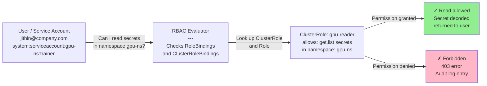

# Chapter 4 — Kubernetes RBAC and Access Control

**Learning outcome:** Design Kubernetes RBAC policies for GPU workloads, verify least-privilege enforcement, and detect and respond to authorization breaches.

## 4.1 RBAC: the guardrails around the cluster

Kubernetes Role-Based Access Control (RBAC) answers: "Who can do what in this cluster?"

Without RBAC, anyone with cluster access can:
- Read all secrets in all namespaces.
- Delete any Pod, including production workloads.
- Modify GPU scheduling quotas.
- Access model artifacts and training data.

With RBAC, access is restricted to specific principals (users, service accounts) and specific actions (verbs) on specific resources.



## 4.2 Core RBAC objects: Role, ClusterRole, RoleBinding, ClusterRoleBinding

**ClusterRole:** Defines a set of permissions (verbs on resources) across the entire cluster.

```yaml
---
apiVersion: rbac.authorization.k8s.io/v1
kind: ClusterRole
metadata:
  name: gpu-viewer
rules:
- apiGroups: [""]
  resources: ["pods"]
  verbs: ["get", "list", "watch"]  # Can read pods
  resourceNames: []  # Can read any pod name
  
- apiGroups: [""]
  resources: ["secrets"]
  verbs: []  # Cannot access secrets at all
  
- apiGroups: [""]
  resources: ["persistentvolumeclaims"]
  verbs: ["get", "list"]  # Can read PVCs
  
- apiGroups: ["nvidia.com"]
  resources: ["gpus"]  # NVIDIA GPU custom resource
  verbs: ["get", "list"]  # Can see GPU allocations
```

**ClusterRoleBinding:** Assigns a ClusterRole to a principal (user, group, or service account).

```yaml
---
apiVersion: rbac.authorization.k8s.io/v1
kind: ClusterRoleBinding
metadata:
  name: gpu-viewer-binding
roleRef:
  apiGroup: rbac.authorization.k8s.io
  kind: ClusterRole
  name: gpu-viewer
subjects:
- kind: User
  name: "alice@company.com"  # User alice
  
- kind: ServiceAccount
  name: trainer  # Service account named trainer
  namespace: gpu-ns  # In namespace gpu-ns
  
- kind: Group
  name: "data-scientists"  # LDAP/SAML group
```

**Role + RoleBinding:** Same as above, but scoped to a single namespace.

```yaml
---
apiVersion: rbac.authorization.k8s.io/v1
kind: Role
metadata:
  name: model-reader
  namespace: inference-ns  # Only valid in this namespace
rules:
- apiGroups: [""]
  resources: ["configmaps"]
  verbs: ["get", "list"]
  # Can read only configmaps in namespace inference-ns
  # Cannot read configmaps in other namespaces
---
apiVersion: rbac.authorization.k8s.io/v1
kind: RoleBinding
metadata:
  name: model-reader-binding
  namespace: inference-ns
roleRef:
  apiGroup: rbac.authorization.k8s.io
  kind: Role
  name: model-reader
subjects:
- kind: ServiceAccount
  name: inference-pod
  namespace: inference-ns
```

## 4.3 Audit: checking if someone can perform an action

Kubernetes provides `kubectl auth can-i` to test whether a principal can perform an action.

**Example: check if user alice can read secrets in namespace gpu-ns**

```bash
$ kubectl auth can-i get secrets --namespace gpu-ns --as alice
no
# alice does not have permission

$ # Now create a RoleBinding that grants the permission
$ kubectl create rolebinding secret-reader \
  --clusterrole=view \
  --user=alice \
  --namespace=gpu-ns

rolebinding.rbac.authorization.k8s.io/secret-reader created

$ # Re-check permission
$ kubectl auth can-i get secrets --namespace gpu-ns --as alice
yes
# alice can now read secrets in gpu-ns
```

**Example: check if service account trainer can delete pods**

```bash
$ kubectl auth can-i delete pods \
  --as=system:serviceaccount:gpu-ns:trainer

no
# Service account trainer does not have delete permission

# Create a Role with delete permission
$ cat <<EOF | kubectl apply -f -
apiVersion: rbac.authorization.k8s.io/v1
kind: Role
metadata:
  name: pod-manager
  namespace: gpu-ns
rules:
- apiGroups: [""]
  resources: ["pods"]
  verbs: ["delete", "deletecollection"]
EOF

# Bind it to the service account
$ kubectl create rolebinding pod-manager \
  --role=pod-manager \
  --serviceaccount=gpu-ns:trainer \
  --namespace=gpu-ns

# Re-check
$ kubectl auth can-i delete pods \
  --as=system:serviceaccount:gpu-ns:trainer --namespace=gpu-ns
yes
```

## 4.4 GPU-specific RBAC: nvidia.com/gpu resource

The NVIDIA GPU Operator exposes GPU allocation as a custom resource (CR). RBAC can control who can request GPUs.

**Example: restrict GPU access to a specific group**

```yaml
---
apiVersion: rbac.authorization.k8s.io/v1
kind: ClusterRole
metadata:
  name: gpu-requester
rules:
- apiGroups: [""]
  resources: ["pods"]
  verbs: ["create", "update", "patch"]
  # Can create/modify pods
  
- apiGroups: ["nvidia.com"]  # Custom resource from GPU Operator
  resources: ["gpu"]
  verbs: ["get", "list", "watch"]
  # Can see available GPU inventory
---
apiVersion: rbac.authorization.k8s.io/v1
kind: ClusterRoleBinding
metadata:
  name: gpu-users
roleRef:
  apiGroup: rbac.authorization.k8s.io
  kind: ClusterRole
  name: gpu-requester
subjects:
- kind: Group
  name: "ml-engineers"  # Only this group can request GPUs
```

## 4.5 Secrets: who can read your credentials

Secrets in Kubernetes store API tokens, model repository credentials, and encryption keys. **Unrestricted secret access is a critical breach.**

**Real scenario: a compromised workload reads all cluster secrets**

```bash
$ # Inside a Pod with excessive permissions
$ kubectl get secrets --all-namespaces -o json | jq '.items[] | {name: .metadata.name, namespace: .metadata.namespace}'
{
  "name": "model-registry-creds",
  "namespace": "inference-ns"
}
{
  "name": "github-ssh-key",
  "namespace": "training-ns"
}
{
  "name": "database-password",
  "namespace": "data-ns"
}

$ # Attacker can now read each secret
$ kubectl get secret model-registry-creds --namespace inference-ns -o json | jq '.data.username' | base64 -d
myuser@company.com

$ kubectl get secret model-registry-creds --namespace inference-ns -o json | jq '.data.password' | base64 -d
<actual password leaked>
```

**Mitigation: restrict secret access**

```yaml
---
apiVersion: rbac.authorization.k8s.io/v1
kind: Role
metadata:
  name: training-secrets
  namespace: training-ns
rules:
# Allow trainer to read only training-specific secrets
- apiGroups: [""]
  resources: ["secrets"]
  resourceNames: ["model-repo-creds", "training-data-creds"]  # Only these secrets
  verbs: ["get"]
  # Cannot list all secrets, cannot read other secrets
---
apiVersion: rbac.authorization.k8s.io/v1
kind: RoleBinding
metadata:
  name: trainer-secrets
  namespace: training-ns
roleRef:
  apiGroup: rbac.authorization.k8s.io
  kind: Role
  name: training-secrets
subjects:
- kind: ServiceAccount
  name: trainer
  namespace: training-ns
```

**Verify the restriction:**

```bash
$ kubectl auth can-i list secrets --as=system:serviceaccount:training-ns:trainer --namespace training-ns
no
# Trainer cannot list all secrets

$ kubectl auth can-i get secrets --as=system:serviceaccount:training-ns:trainer \
  --namespace training-ns --subresource="" --resource-name=model-repo-creds
yes
# Trainer can read this specific secret

$ # Attempt to read a forbidden secret fails
$ kubectl get secret database-password --namespace training-ns \
  --as=system:serviceaccount:training-ns:trainer
Error from server (Forbidden): secrets "database-password" is forbidden: User "system:serviceaccount:training-ns:trainer" cannot get resource "secrets" in API group "" in the namespace "training-ns"
```

## 4.6 Audit: detecting RBAC bypasses and suspicious access

Kubernetes audit logs record every API call and whether it was authorized or denied.

```bash
# Check if audit logging is enabled
$ cat /etc/kubernetes/audit-policy.yaml | head -20
apiVersion: audit.k8s.io/v1
kind: Policy
rules:
# Deny rules logged at RequestResponse level
- level: RequestResponse
  verbs: ["create", "update", "patch", "delete"]
  resources: ["*"]
  # Every modification is logged in detail

# Allow rules logged at Metadata level
- level: Metadata
  # Every request is logged, but not the request/response body
  
- level: None  # Ignore certain low-value calls
```

**Real scenario: detecting unauthorized secret access**

```bash
$ grep -i "forbidden\|denied" /var/log/kubernetes/audit.log | tail -5

{
  "level": "RequestResponse",
  "timestamp": "2026-08-07T14:32:15.123456Z",
  "auditID": "a1b2c3d4",
  "verb": "get",
  "objectRef": {
    "apiGroup": "",
    "kind": "Secret",
    "namespace": "training-ns",
    "name": "model-repo-creds"
  },
  "user": {
    "username": "system:serviceaccount:inference-ns:inference-pod"
  },
  "sourceIPs": ["10.0.1.2"],
  "requestStatus": {
    "code": 403,  # Forbidden
    "reason": "Forbidden",
    "message": "User \"system:serviceaccount:inference-ns:inference-pod\" cannot get resource \"secrets\" in API group \"\" in the namespace \"training-ns\""
  }
}
```

This log entry proves:
- Service account inference-pod tried to read a secret in training-ns.
- The access was denied (403 Forbidden).
- The attempt was logged for investigation.

**Example: audit alert on repeated Forbidden errors**

```bash
# Count Forbidden errors by principal
$ grep -i "forbidden" /var/log/kubernetes/audit.log | \
  jq -r '.user.username' | sort | uniq -c | sort -rn

    47 system:serviceaccount:inference-ns:inference-pod
     3 system:serviceaccount:training-ns:trainer
     1 alice@company.com
```

Inference-pod has 47 denied attempts — likely a misconfigured RBAC policy or a malicious attempt.

## 4.7 Production troubleshooting: RBAC audit checklist

| Issue | Symptom | Check | Fix |
|---|---|---|---|
| Permission Denied on pod read | Pod cannot list other pods; `Error: Forbidden` | `kubectl auth can-i list pods --as=system:serviceaccount:NAMESPACE:NAME` | Create Role with pods: get,list verbs; bind to service account |
| Secret access leaked | Workload can read secrets from other namespaces | `kubectl auth can-i get secrets --as=SA --namespace other-ns` | Create namespace-scoped Role instead of ClusterRole; restrict resourceNames |
| Excessive cluster-admin | Service account has cluster-admin role | `kubectl get clusterrolebindings \| grep -i admin` | Use minimal roles; apply least privilege principle |
| GPU quota not enforced | Workload requests more GPUs than quota allows | Check Pod spec resource requests vs. namespace quota | Create ResourceQuota; verify GPU Operator exposes nvidia.com/gpu resource |

## 4.8 Interview question: designing RBAC for multi-tenant inference

**Question:** "Design Kubernetes RBAC for a multi-tenant inference cluster where Team A trains models and Team B runs inference. Models are stored in a registry that requires credentials. What permissions does each team need, and which secrets can each team access?"

**Model answer (spoken):**
> "Okay, first the boundaries. Team A (training) needs: create/delete pods in their namespace, read their own training data from persistent storage, and push models to the registry. Team B (inference) needs: create/delete pods, pull models from the registry, and read their inference requests.
>
> I'd create two namespaces: training-ns and inference-ns. Each gets its own service account: trainer and inference-pod. The trainer SA gets a Role that allows pod lifecycle and PVC reads in training-ns only. The inference-pod SA gets a Role that allows pod lifecycle in inference-ns only.
>
> For the registry credentials: both teams need them, but storing one shared secret is risky. If Team A's workload is compromised, it can't leak Team B's models because it doesn't have access to the inference-ns secret. So I'd create two secret objects: one in training-ns and one in inference-ns, both containing registry creds. I'd restrict each SA to read only its own secret by name, not allow listing all secrets.
>
> To verify it works: I'd run `kubectl auth can-i` for both service accounts. Trainer should be able to create pods and read secrets in training-ns, but not in inference-ns. Inference-pod should be able to create pods and read secrets only in inference-ns.
>
> The hardest part is if a container escapes and gets a shell on the node. At that point, RBAC doesn't protect you — you need pod security policies, network policies, and container runtime restrictions. But within the Kubernetes API, this RBAC design enforces the least-privilege split."

## Key Takeaways

- RBAC restricts who can do what in Kubernetes; without it, anyone with cluster access can read all secrets and delete any workload.
- Use namespace-scoped Roles instead of ClusterRoles to enforce tenant isolation.
- Restrict secret access by name (resourceNames) and principle (least privilege).
- Use `kubectl auth can-i` to verify permissions before deployment.
- Audit logs record every API call and Authorization failures; monitor for repeated Forbidden errors.
- GPU access can be controlled via NVIDIA GPU Operator custom resources and RBAC.

## Cross References

- Previous: [Chapter 3 — Containers and Supply Chain](./chapter-03-placeholder.md)
- Next: [Chapter 5 — Pod Security and Network Policies](./chapter-05-placeholder.md)
- Lab: [Lab 3 — Design and Verify Multi-Tenant RBAC](./labs/lab-03-placeholder.md)
