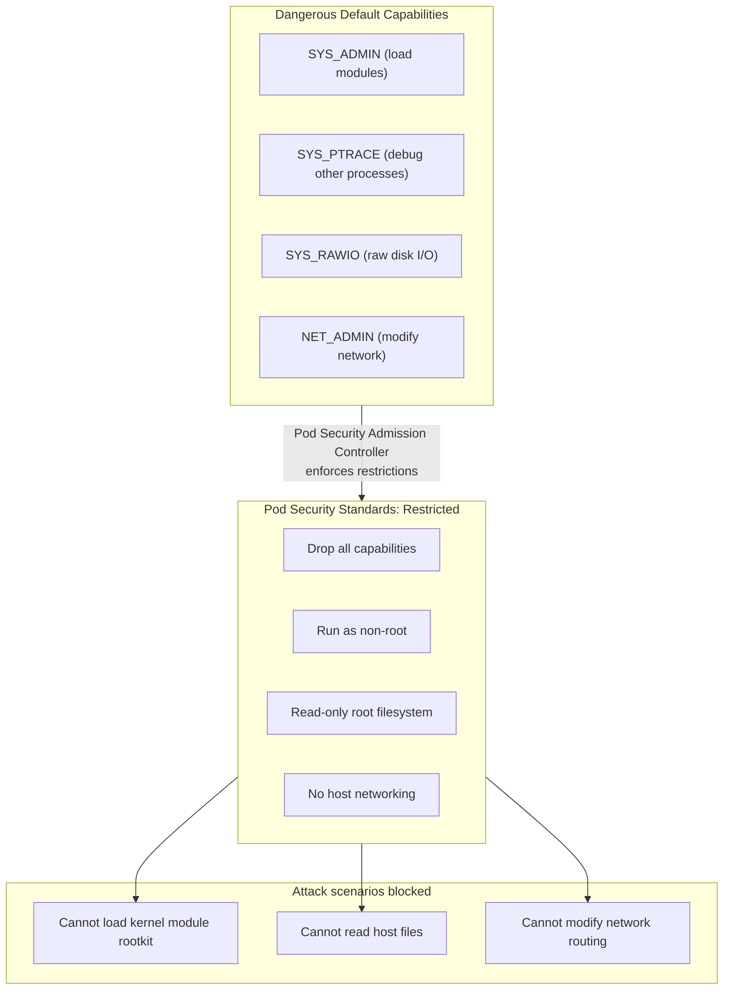

# Chapter 5 — Pod Security and Network Policies

**Learning outcome:** Design Pod Security Standards, implement network policies, and detect and prevent lateral movement attacks.

## 5.1 Pod Security: containers must run with minimal privileges

By default, Kubernetes allows containers to run with many dangerous capabilities:
- Read/write access to the host filesystem.
- Run as root.
- Use host IPC and network namespaces.
- Load kernel modules.

If a container is compromised or malicious, these capabilities let it:
- Read secrets from the host.
- Break out of the container and attack the kernel.
- Spy on other containers' network traffic.
- Install rootkits.



## 5.2 Pod Security Standards (PSS): admission policies

Kubernetes Pod Security Standards (PSS) define three levels of restriction applied via admission controllers:

**Baseline:** Minimal restrictions; allows risky configurations but prevents known container breakouts.

```yaml
apiVersion: v1
kind: Pod
metadata:
  name: baseline-pod
spec:
  securityContext:
    runAsUser: 0  # root — allowed at baseline level (not recommended)
  containers:
  - name: app
    image: ubuntu:20.04
    securityContext:
      allowPrivilegeEscalation: true  # allowed; risky
      capabilities:
        add: ["SYS_ADMIN"]  # risky capability; allowed at baseline
```

**Restricted:** Maximum restrictions; prevents most container escapes and privilege escalation.

```yaml
apiVersion: v1
kind: Pod
metadata:
  name: restricted-pod
spec:
  securityContext:
    runAsNonRoot: true  # must not be root
    runAsUser: 1000  # specific non-root user
    fsGroup: 2000  # files owned by non-root group
    seccompProfile:
      type: RuntimeDefault  # use default seccomp filter
  containers:
  - name: app
    image: ubuntu:20.04
    securityContext:
      allowPrivilegeEscalation: false  # critical; prevents setuid
      readOnlyRootFilesystem: true  # root filesystem is read-only
      capabilities:
        drop:
        - ALL  # drop all dangerous capabilities
        add:
        - NET_BIND_SERVICE  # add back only what's needed
    volumeMounts:
    - name: tmp
      mountPath: /tmp
  volumes:
  - name: tmp
    emptyDir: {}  # writable tmpfs for app's temporary files
```

**Pod Security Admission Controller: enforcing PSS**

```yaml
---
apiVersion: v1
kind: Namespace
metadata:
  name: gpu-inference
  labels:
    pod-security.kubernetes.io/enforce: restricted  # All pods must be restricted
    pod-security.kubernetes.io/audit: restricted
    pod-security.kubernetes.io/warn: restricted
```

**Example: pod violates restricted PSS**

```bash
$ kubectl apply -f baseline-pod.yaml --namespace gpu-inference
Error from server (Forbidden): error when creating "baseline-pod.yaml": pods "baseline-pod" is forbidden: violates PodSecurity "restricted:latest": runAsNonRoot != true (line 7), allowPrivilegeEscalation != false (line 13), unrestricted capabilities (line 16), runAsUser=0 (line 6)
```

The Pod is rejected because it violates multiple restricted PSS rules.

**Example: corrected pod passes restricted PSS**

```bash
$ kubectl apply -f restricted-pod.yaml --namespace gpu-inference
pod/restricted-pod created

$ # Verify it's running
$ kubectl get pod restricted-pod --namespace gpu-inference
NAME             READY   STATUS    RESTARTS   AGE
restricted-pod   1/1     Running   0          2m
```

## 5.3 Testing PSS: verify the restrictions work

**Test 1: cannot run as root**

```bash
$ # Create a restricted pod that tries to run as root
$ kubectl run test-root --image=ubuntu:20.04 \
  --namespace gpu-inference \
  --overrides='{"spec":{"securityContext":{"runAsUser":0}}}'

Error from server (Forbidden): pods "test-root" is forbidden: violates PodSecurity "restricted:latest": runAsUser=0
```

**Test 2: cannot escalate privileges**

```bash
$ # Pod tries to use setuid binary to escalate to root
$ kubectl run test-setuid --image=ubuntu:20.04 \
  --namespace gpu-inference \
  --overrides='{"spec":{"securityContext":{"allowPrivilegeEscalation":true}}}'

Error from server (Forbidden): pods "test-setuid" is forbidden: violates PodSecurity "restricted:latest": allowPrivilegeEscalation != false
```

**Test 3: can write to /tmp (emptyDir mount), cannot write to root**

```bash
$ # Deploy a restricted pod with emptyDir
$ kubectl run test-write --image=ubuntu:20.04 \
  --namespace gpu-inference \
  --command=sh -- -c "echo test > /tmp/test.txt && sleep 3600" \
  --overrides='{"spec":{"volumes":[{"name":"tmp","emptyDir":{}}],"containers":[{"name":"test-write","volumeMounts":[{"name":"tmp","mountPath":"/tmp"}],"securityContext":{"readOnlyRootFilesystem":true}}]}}'

pod/test-write created

$ # Verify write to /tmp succeeds
$ kubectl exec test-write --namespace gpu-inference -- cat /tmp/test.txt
test

$ # Verify write to root fails
$ kubectl exec test-write --namespace gpu-inference -- touch /root/test.txt
touch: cannot touch '/root/test.txt': Read-only file system
```

## 5.4 Network Policies: preventing lateral movement

NetworkPolicy is a Kubernetes resource that restricts network traffic between pods and external networks.

**Default behavior (no NetworkPolicy):** Any pod can talk to any other pod on the cluster network.

```bash
$ # Pod A (attacker) can reach Pod B (victim) by name
$ kubectl exec -it pod-a -- nc -zv pod-b.default.svc.cluster.local 5000
Connection to pod-b.default.svc.cluster.local port 5000 [tcp/*] succeeded!
```

**NetworkPolicy: deny all by default, allow specific paths**

```yaml
---
apiVersion: networking.k8s.io/v1
kind: NetworkPolicy
metadata:
  name: default-deny
  namespace: gpu-inference
spec:
  podSelector: {}  # Apply to all pods in this namespace
  policyTypes:
  - Ingress
  - Egress
  # Empty ingress/egress rules = deny all traffic
  # (unless explicitly allowed below)
---
apiVersion: networking.k8s.io/v1
kind: NetworkPolicy
metadata:
  name: allow-inference-ingress
  namespace: gpu-inference
spec:
  podSelector:
    matchLabels:
      app: inference-server  # Only pods with this label
  policyTypes:
  - Ingress
  ingress:
  - from:
    - podSelector:
        matchLabels:
          app: api-gateway  # Only from api-gateway pods
    ports:
    - protocol: TCP
      port: 8080  # Only port 8080
---
apiVersion: networking.k8s.io/v1
kind: NetworkPolicy
metadata:
  name: allow-inference-egress
  namespace: gpu-inference
spec:
  podSelector:
    matchLabels:
      app: inference-server
  policyTypes:
  - Egress
  egress:
  - to:
    - podSelector: {}  # To any pod
    ports:
    - protocol: TCP
      port: 5000  # Model repository pull on port 5000
  - to:
    - namespaceSelector:
        matchLabels:
          name: kube-system  # DNS queries to kube-system
    ports:
    - protocol: UDP
      port: 53
```

**Verify NetworkPolicy enforcement: test from another pod**

```bash
$ # Pod A tries to connect to inference-server (not allowed by policy)
$ kubectl exec -it pod-a --namespace gpu-inference -- \
  nc -zv inference-server.gpu-inference.svc.cluster.local 8080
nc: connect to inference-server.gpu-inference.svc.cluster.local port 8080 (tcp) failed: Connection timed out
# Connection denied; policy is working

$ # Pod B (api-gateway) connects to inference-server (allowed)
$ kubectl exec -it api-gateway --namespace gpu-inference -- \
  nc -zv inference-server.gpu-inference.svc.cluster.local 8080
Connection to inference-server.gpu-inference.svc.cluster.local port 8080 [tcp/*] succeeded!
# Connection allowed; traffic flowing
```

## 5.5 Seccomp profiles: restricting system calls

Seccomp (secure computing mode) restricts which Linux system calls a container can make. A malicious container with a limited seccomp profile cannot:
- Load kernel modules.
- Access raw sockets.
- Change file permissions.
- Use certain IPC mechanisms.

**RuntimeDefault seccomp profile (built into container runtimes):**

```bash
$ # Query which syscalls are blocked by RuntimeDefault
$ grep -A 10 '"defaultAction"' /etc/seccomp.json | head -20
"defaultAction": "SCMP_ACT_ERRNO",
"defaultErrnoRet": 1,
# Default: block most syscalls; allow specific safe ones

"syscalls": [
  {
    "names": [
      "accept", "accept4", "arch_prctl", "bind", "brk", ...
      "read", "readlink", "readv", "recvfrom", "recvmmsg", "recvmsg", "recvto"
      # Safe syscalls are in the allowed list
    ],
    "action": "SCMP_ACT_ALLOW"  # These are allowed
  }
]
```

**Pod using RuntimeDefault seccomp:**

```yaml
---
apiVersion: v1
kind: Pod
metadata:
  name: secure-pod
spec:
  securityContext:
    seccompProfile:
      type: RuntimeDefault  # Use the default safe profile
  containers:
  - name: app
    image: app:v1
```

**Verify: pod cannot load kernel modules**

```bash
$ kubectl exec secure-pod -- insmod /lib/modules/test.ko
insmod: ERROR: could not insert module /lib/modules/test.ko: Operation not permitted

$ # Syscall trace shows SYS_INIT_MODULE was blocked
$ dmesg | grep -i seccomp
seccomp: Blocked syscall 313 (init_module) in secure-pod container
```

## 5.5b The GPU device-plugin trust boundary (a different problem than workload pods)

Everything above describes securing a generic workload pod under a restricted Pod Security Standard. GPU workloads introduce a second, meaningfully different trust boundary that PSS alone doesn't address: **how the GPU gets exposed to the pod in the first place.**

The **NVIDIA device plugin** (a DaemonSet, part of the NVIDIA GPU Operator stack) and **nvidia-container-toolkit** typically require elevated host access to do their job — `hostPID`, access to `/dev/nvidia*` device nodes, and in some deployment modes, privileged mode or specific host capabilities. This is *not* a mistake or an oversight: device plugins and node-level device drivers are inherently privileged, cluster-infrastructure components, the same way a CNI plugin or a storage CSI driver needs elevated host access that an application pod never should.

The key distinction to keep straight (and the one an interviewer is likely probing for):

- **The device plugin DaemonSet** runs privileged, cluster-wide, once per GPU node — it is infrastructure, managed and audited like any other privileged DaemonSet (CNI, CSI driver), not like a tenant workload.
- **The GPU workload pod** (the actual training/inference container) does NOT need to be privileged to use a GPU. It requests the device via `resources.limits: {nvidia.com/gpu: 1}` in its pod spec, and the device plugin + kubelet handle exposing the already-initialized device node to that pod. A GPU workload pod can — and should — run under the "Restricted" PSS profile: non-root, no added capabilities, no privileged mode, read-only root filesystem.

**Reconciling PSS with GPU access:** apply "Restricted" PSS to the namespace where GPU workload pods run. Run the device plugin DaemonSet in a separate, infrastructure-owned namespace with its own (necessarily more permissive) PSS level or an explicit namespace-level exemption — the same pattern used for CNI/CSI DaemonSets. Never grant the workload namespace or workload pods `hostPID` or direct `/dev/nvidia*` host-path mounts just to get GPU access; if a workload pod needs that, the device plugin integration is misconfigured.

```bash
# Verify a GPU workload pod is NOT run privileged just to get GPU access
$ kubectl get pod inference-server -o jsonpath='{.spec.containers[0].securityContext}'
{"allowPrivilegeEscalation":false,"capabilities":{"drop":["ALL"]},"readOnlyRootFilesystem":true,"runAsNonRoot":true}
# GPU access comes from the resource request, not from privilege:
$ kubectl get pod inference-server -o jsonpath='{.spec.containers[0].resources.limits}'
{"nvidia.com/gpu":"1"}

# The device plugin DaemonSet, by contrast, legitimately runs with elevated
# host access — verify it's scoped to its own namespace and audited separately:
$ kubectl get daemonset nvidia-device-plugin -n gpu-operator -o jsonpath='{.spec.template.spec.hostPID}{"\n"}{.spec.template.spec.containers[0].securityContext}'
```

## 5.6 Production troubleshooting: pod security & network policy audit

| Issue | Symptom | Check | Fix |
|---|---|---|---|
| Pod rejected by PSS | "violates PodSecurity restricted" error | Check pod spec securityContext; compare against restricted PSS rules | Drop all capabilities; set runAsNonRoot; use readOnlyRootFilesystem; mount emptyDir for writable paths |
| Container cannot write to disk | "Read-only file system" error | Check readOnlyRootFilesystem in securityContext | Mount emptyDir at /tmp or /var/tmp for writable paths |
| Pod cannot reach service | "Connection timed out" | Run: `kubectl get networkpolicies --all-namespaces` | Create NetworkPolicy allowing the traffic; verify podSelector and port labels match |
| Lateral movement detected | Unexpected connections between pods | Check for default-deny NetworkPolicy | Deploy default-deny; create specific allow policies for required paths |
| Seccomp blocked legitimate syscall | Application crash; audit log shows "Blocked syscall" | Identify the blocked syscall from dmesg; check seccomp profile | Use custom profile allowing the syscall; audit the legitimate need |

## 5.7 Interview question: secure-by-default pod design

**Question:** "You have an AI inference service running in Kubernetes. Design a pod security and network policy such that if the container is compromised, an attacker's options are severely limited."

**Model answer (spoken):**
> "I'd start with a restrictive baseline. The pod runs as a non-root user — let's say UID 1000. I'd drop all Linux capabilities with `drop: ["ALL"]` and only add back what's needed — maybe NET_BIND_SERVICE if the service listens on port 80 or 443. I'd set readOnlyRootFilesystem: true so the container cannot modify system files even if compromised.
>
> For storage, I'd mount emptyDir at /tmp for the application's temporary files, so the app can write there but not to the root filesystem. I'd set allowPrivilegeEscalation: false so even if there's a setuid binary, it can't escalate to root.
>
> For network, I'd deploy a default-deny NetworkPolicy for the namespace, then create allow rules for just what's needed. Inference server ingress from the API gateway, and egress to the model repository and DNS. Nothing else. That way, if the container is compromised, the attacker can't pivot to other pods or exfiltrate data to an external server — the network policy blocks it.
>
> I'd also use a seccomp profile. RuntimeDefault blocks dangerous syscalls like init_module — so the attacker cannot load a kernel module even if they get a shell. It's worth being precise here: RuntimeDefault does not block the generic `socket()` syscall (regular TCP/UDP sockets are allowed and needed by virtually any networked container, including this inference server); raw sockets are restricted separately, via the `CAP_NET_RAW` capability we've already dropped, not by seccomp. So the syscall filter and the capability drop are covering different, complementary parts of the same attack surface.
>
> To verify: I'd deploy a test pod that tries to violate these policies and confirm it's rejected or blocked. Then I'd monitor the audit logs for any Forbidden events or seccomp blocks.
>
> The trade-off is that legitimate application features that need more privileges (e.g., raw socket access for network diagnostics) won't work. That's intentional — we're trading convenience for security."

## Key Takeaways

- Pod Security Standards restrict dangerous capabilities at admission time; use the Restricted standard for untrusted workloads.
- Drop all capabilities; add back only what the application needs (usually NET_BIND_SERVICE).
- Read-only root filesystem + emptyDir for /tmp prevents malicious writes to system directories.
- NetworkPolicy enforces default-deny; create allow rules for specific traffic paths only.
- Seccomp profiles block dangerous syscalls like init_module and socket.
- Security-hardened pods limit an attacker's post-compromise options even if the container is breached.

## Cross References

- Previous: [Chapter 4 — Kubernetes RBAC](./chapter-04-placeholder.md)
- Next: [Chapter 6 — GPU Sharing Security](./chapter-06-placeholder.md)
- Lab: [Lab 4 — Deploy Restricted Pod with Network Policy](./labs/lab-04-placeholder.md)
