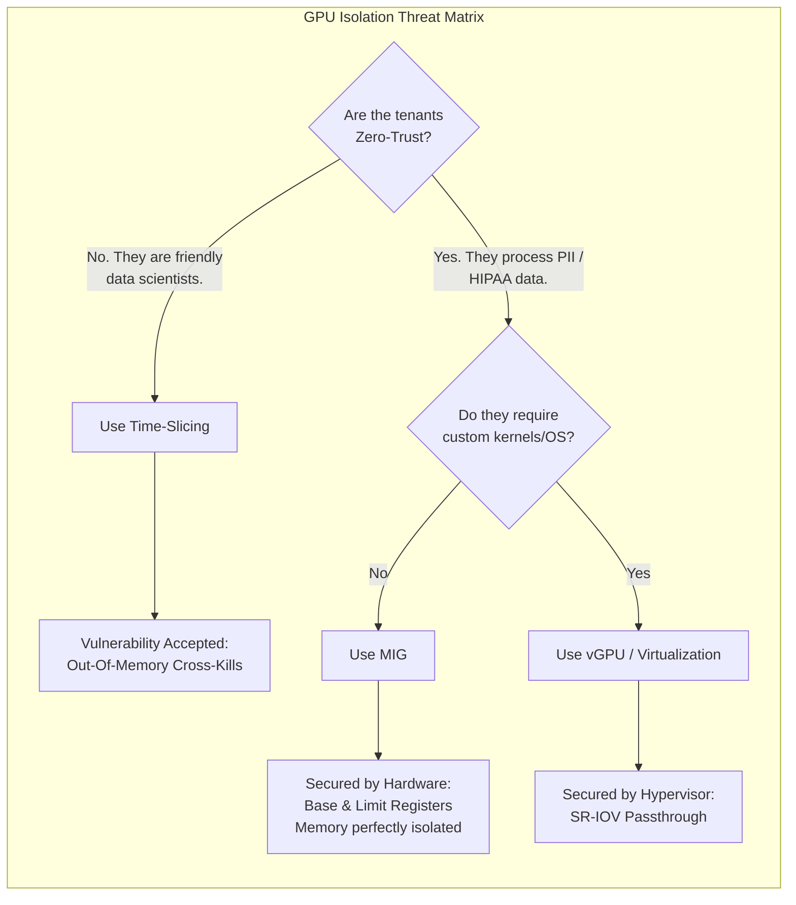

# Chapter 6 — GPU Sharing Security

| Chapter metadata | Value |
|---|---|
| Volume | 18 — Security, Compliance, and Confidential Computing |
| Difficulty | Expert |
| Estimated reading time | 30 minutes |
| Primary audience | Security Architects, Platform SREs |
| Core question | If Tenant A and Tenant B are assigned to the same physical GPU, what mathematically prevents Tenant A from reading Tenant B's VRAM? |

## Introduction

As discussed extensively in Volume 11, dedicating a full $30,000 GPU to a single low-utilization workload is financially irresponsible. Sharing GPUs is mandatory for ROI. 

However, sharing hardware introduces the ultimate security risk. 
A GPU is a massive memory bank. If two competing companies (or two restricted departments within a company) are running math on the same GPU, the architect must provide absolute proof that cross-tenant data leakage is physically impossible. 

This chapter analyzes the specific security boundaries of the three sharing technologies: Time-Slicing, MIG, and vGPU.

## Beginner's Primer: The Shared Hotel Room

In Volume 11, we talked about sharing GPUs to save money. Let's look at those same sharing mechanisms from a security perspective. 

Imagine your company rents a hotel.
- **Time-Slicing (The Hostel Room):** You put 10 strangers in the exact same room with 10 beds. It's incredibly cheap. But if one person blasts music, everyone suffers (No Compute Isolation). If one person leaves their diary on the table, anyone can read it (No Memory Isolation). You should *never* put rival companies in a Time-Sliced GPU.
- **MIG (The Hotel Suites):** You put up concrete walls, dividing the floor into 7 private suites. Each suite has its own locked door. The people in Suite 1 literally cannot break into Suite 2 to steal their data (Hardware Memory Isolation). This is perfectly safe for multi-tenancy.
- **vGPU (The VIP Penthouse):** You put a security guard (The Hypervisor) outside the door. The guard checks everyone's ID before they even get to the locked concrete suites. This is the absolute highest level of enterprise security.

A Junior Engineer configures Time-Slicing because "it lets us run more Pods." A Senior Security Architect audits the tenant relationships and enforces MIG to prevent cross-tenant data theft.

## 1. Time-Slicing: The Illusion of Isolation

Software Time-Slicing (via the NVIDIA GPU Operator `replicas` setting) is the most dangerous sharing method in an enterprise environment.

**The Physics:**
Time-Slicing operates entirely in software. Multiple containers share the exact same physical VRAM pool and the same L2 cache. The NVIDIA driver quickly context-switches between the workloads to give the illusion of concurrency.

**The Threat Vector:**
1.  **Memory Exhaustion (Denial of Service):** Because there are no hardware quotas, Tenant A can request 80GB of VRAM. This instantly crashes Tenant B's workload (OOM). This is a trivial DoS attack.
2.  **Out-of-Bounds Reads:** While standard CUDA drivers attempt to isolate process memory, a sophisticated attacker can write custom CUDA kernels to bypass software checks and read raw data out of the shared global memory pool.

*Security Mandate:* Time-slicing provides zero security isolation. It must only be used when all workloads belong to the exact same trust domain (e.g., a single team of data scientists working on the same project).

## 2. Multi-Instance GPU (MIG): Hardware Isolation

MIG (Multi-Instance GPU) fundamentally changes the security posture by implementing partitioning at the silicon level.

**The Physics:**
When an A100 or H100 is partitioned using MIG, the hardware configures distinct Base and Limit registers for the memory controllers and the L2 cache. 
If MIG Instance 0 is assigned memory blocks 0-100, and MIG Instance 1 is assigned blocks 101-200, the hardware mathematically prevents Instance 0 from addressing block 101. 

**The Threat Vector:**
MIG physically prevents cross-tenant memory reads on the GPU. It also prevents DoS attacks, as memory bandwidth and capacity are hard-capped per instance.
However, MIG shares a massive vulnerability: **The Host Kernel.**
Both MIG instances are controlled by the same Host OS. If Tenant A compromises their container and gains root access to the host server, they can run `nvidia-smi mig` to destroy the partitions, or read the memory of the Host CPU, compromising the entire system.

*Security Mandate:* MIG is secure against GPU-level attacks, but vulnerable to OS-level container escapes. It is suitable for internal enterprise multi-tenancy where users are not actively hostile.

## 3. NVIDIA vGPU: The Ultimate Boundary

To achieve absolute zero-trust isolation (e.g., a public cloud selling GPU compute to hostile strangers), you must introduce a Hypervisor. 

**The Physics:**
Using NVIDIA vGPU (or PCIe Passthrough), the hardware is abstracted. Tenant A runs inside a full Virtual Machine (Guest OS A). Tenant B runs inside Guest OS B. 

**The Threat Vector:**
To steal data, Tenant A must execute an incredibly complex "VM Escape" exploit to break out of their Guest OS, compromise the Hypervisor (ESXi/KVM), and reverse-engineer the vGPU manager. This is the strongest security boundary currently available in commercial architecture.

## Customer Scenario (Senior Level)

**The Situation:**
A university builds a centralized AI cluster using HGX H100 servers. They use software Time-Slicing to divide the GPUs among hundreds of students for machine learning coursework. A research team asks to use the same cluster to train a model on highly restricted, proprietary medical data (HIPAA compliant). The IT team tells them it is safe because the researchers will run in a separate Kubernetes Namespace.

**The Senior Architect Response:**
"Deploying highly restricted medical data onto a cluster utilizing software Time-Slicing is a catastrophic security violation that will instantly fail a HIPAA compliance audit.

The IT team is confusing logical orchestration boundaries with physical hardware boundaries. Kubernetes Namespaces only prevent students from seeing the researcher's API resources. They do absolutely nothing to secure the physical memory on the GPU. 

Because the cluster uses software Time-Slicing, all workloads share the same global VRAM pool on the H100s. A student could write a malicious, low-level CUDA script designed to scan the unallocated memory space on the GPU, potentially intercepting the plain-text medical data being processed by the research team's model. 

We must implement strict physical isolation. 
We will physically quarantine one of the HGX servers. We will disable Time-Slicing on this server and reformat the H100s using **Multi-Instance GPU (MIG)**. We will allocate dedicated MIG slices exclusively to the medical research team. 

Because MIG enforces Base and Limit registers at the silicon level, it physically prevents any other workload on the GPU from addressing the memory space containing the patient data. We will enforce this using Kubernetes Node Taints, ensuring student workloads can never schedule on the HIPAA-compliant nodes, restoring a mathematically defensible security perimeter."

## Interview Preparation

**Conceptual:** Why is software Time-Slicing a massive security vulnerability in a multi-tenant cluster? *(Hint: Time-Slicing relies on software context switching to share a single GPU. All workloads share the same physical pool of VRAM and L2 cache. This allows for Denial of Service attacks (one tenant hoarding all VRAM) and potential out-of-bounds memory read attacks, as there is no hardware-level isolation protecting the data).*

**Architecture:** Explain how MIG (Multi-Instance GPU) physically isolates memory. *(Hint: When you partition a GPU using MIG, the silicon configures strict Base and Limit registers for the memory controllers. These registers act as physical hardware firewalls. If a process in MIG Slice 1 attempts to request data from a memory address belonging to MIG Slice 2, the hardware instantly blocks the request, making cross-tenant memory snooping mathematically impossible).*

## Architecture Summary

Security architects must align the mechanism of GPU sharing with the strictness of the multi-tenant threat model. Time-Slicing provides density but exposes tenants to noisy neighbors and potential memory Snooping. MIG creates hardware-enforced concrete walls inside the silicon, making it safe for processing sensitive data across competing departments.

