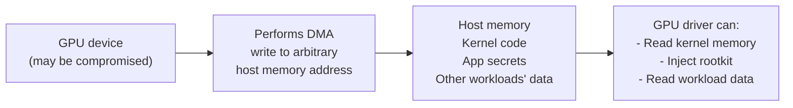
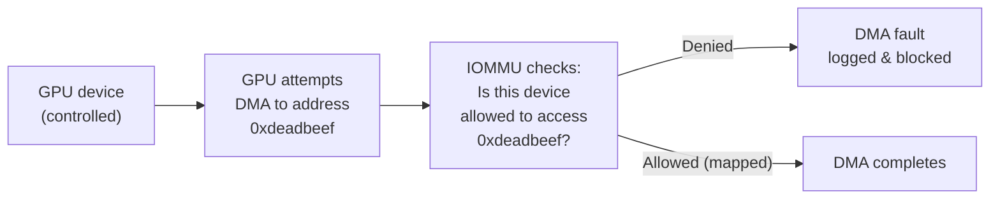

# Chapter 7 — DMA, IOMMU, and SR-IOV Security

**Learning outcome:** Understand DMA attacks and IOMMU protection, configure and verify IOMMU enforcement, validate SR-IOV isolation for device assignment.

## 7.1 The DMA vulnerability: direct memory access without CPU

Direct Memory Access (DMA) allows PCIe devices to read and write host memory directly, bypassing the CPU. This is essential for performance (GPU can load data without CPU intervention) but creates a security hole:

**Scenario: a malicious GPU driver performs DMA attack**



**IOMMU (Input/Output Memory Management Unit):** A hardware device that restricts which memory addresses a device can access via DMA.



## 7.2 Verifying IOMMU is enabled and active

**Step 1: check IOMMU support in BIOS**

```bash
# Check BIOS settings (requires reboot to UEFI menu)
# Look for: "VT-d" (Intel), "AMD-Vi" (AMD), or "IOMMU"
# Make sure: Enabled

# After enabling in BIOS and rebooting:
$ dmesg | grep -i 'iommu\|vt-d\|amd-vi' | head -10
[    0.000000] DMAR: IOMMU enabled
[    0.000000] AMD-Vi: IOMMU support enabled
[    0.000000] DMAR-IR: IOMMU support enabled for 4 devices
```

**Step 2: verify IOMMU is active in Linux kernel**

```bash
# Check kernel parameter
$ cat /proc/cmdline | grep -o 'iommu=[^ ]*'
iommu=pt

# Expected values:
# iommu=pt = passthrough mode (IOMMU on, no DMA restrictions by default; allows explicit per-device binding)
# iommu=on = strict mode (IOMMU restricts all DMA by default)
# If missing or iommu=off = IOMMU disabled; high security risk

# If disabled, enable it:
$ sudo grub-editenv set 'GRUB_CMDLINE_LINUX=$GRUB_CMDLINE_LINUX iommu=pt'
$ sudo update-grub
$ # Reboot required
```

**Step 3: check IOMMU groups (devices with separate isolation domains)**

```bash
# List IOMMU groups
$ for g in /sys/kernel/iommu_groups/*; do echo "Group $(basename $g):"; \
  for d in $g/devices/*; do echo "  $(lspci -nns $(basename $d))"; done; done

Group 0:
  00:00.0 Host bridge: Intel Corporation 8th Gen Core Processor Host Bridge/DRAM Registers
Group 1:
  00:02.0 VGA compatible controller: Intel Corporation UHD Graphics 630
Group 10:
  01:00.0 3D controller: NVIDIA Corporation GA100 [A100 SXM4-40GB]
  01:00.1 Serial bus controller: NVIDIA Corporation
Group 11:
  02:00.0 3D controller: NVIDIA Corporation GA100 [A100 SXM4-40GB]

# Each GPU is in its own group => can assign to VM/container separately with isolation
# If GPU 0 and 1 are in same group => cannot isolate them
```

## 7.3 SR-IOV: assigning physical devices to virtual machines

SR-IOV (Single-Root I/O Virtualization) allows one physical PCIe device (PF = Physical Function) to present multiple virtual devices (VFs = Virtual Functions) to VMs or containers. Each VF appears to be an independent GPU.

**Important:** the walkthrough below shows generic Linux SR-IOV mechanics (`sriov_numvfs`, manual VF unbind, raw `vfio-pci` passthrough) to illustrate the IOMMU isolation concept — it is not how NVIDIA's supported data-center GPU virtualization is deployed in production. NVIDIA data-center GPU SR-IOV is normally consumed internally by the **NVIDIA vGPU Manager** (installed in the hypervisor), which creates mediated devices (mdev) for licensed vGPU profiles rather than exposing raw VFs for manual `vfio-pci` passthrough. If vGPU licensing isn't in use, the common alternative for full isolation is **whole-GPU passthrough** (assign an entire physical GPU to one VM), not manual SR-IOV VF slicing. Treat what follows as "how SR-IOV/IOMMU isolation works underneath," not as NVIDIA's supported vGPU deployment procedure.

**Example: A100 GPU with SR-IOV (illustrative mechanics, not the supported NVIDIA vGPU deployment path)**

```bash
# Check if GPU supports SR-IOV
$ lspci -nn -k -s 01:00.0 | grep -E 'Kernel|Module|SR-IOV'
Kernel driver in use: nvidia
Kernel modules: nvidia

# If SR-IOV capable:
$ cat /sys/bus/pci/devices/0000:01:00.0/sriov_totalvfs
16  # This GPU can create up to 16 VFs

# Create VFs
$ echo 4 > /sys/bus/pci/devices/0000:01:00.0/sriov_numvfs
$ # Now 4 virtual functions available

# Verify
$ lspci | grep -i nvidia | grep Virtual
01:00.0 3D controller: NVIDIA Corporation GA100 [A100 SXM4-40GB]
01:00.1 Serial bus controller: NVIDIA Corporation
01:00.2 Serial bus controller: NVIDIA Corporation  # VF 0
01:00.3 Serial bus controller: NVIDIA Corporation  # VF 1
01:00.4 Serial bus controller: NVIDIA Corporation  # VF 2
01:00.5 Serial bus controller: NVIDIA Corporation  # VF 3
```

**Security: IOMMU + SR-IOV ensures device isolation**

```bash
# Verify each VF is in a separate IOMMU group
$ for g in /sys/kernel/iommu_groups/*; do
  grep -l 01:00 $g/devices/* 2>/dev/null && \
  echo "Group $(basename $g): $(lspci -nns $(basename $(ls $g/devices)))"
done

Group 10: 01:00.0 3D controller: NVIDIA A100
Group 10: 01:00.2 Serial bus controller: NVIDIA A100 VF 0
Group 10: 01:00.3 Serial bus controller: NVIDIA A100 VF 1

# If VFs are in the same group as PF => IOMMU cannot isolate them
# This is a misconfiguration; needs BIOS or firmware update
```

**Assign VF to a VM (with IOMMU isolation)**

```bash
# Detach VF from host driver
$ echo 0000:01:00.2 > /sys/bus/pci/drivers/nvidia/unbind

# Assign to VM via libvirt
$ virsh attach-device vm-name vf.xml

# vf.xml contains:
<hostdev mode='subsystem' type='pci' managed='yes'>
  <driver name='vfio-pci'/>  # Use vfio (IOMMU-aware driver)
  <source>
    <address domain='0x0000' bus='0x01' slot='0x00' function='0x2'/>
  </source>
</hostdev>

# Verify in VM
$ lspci | grep -i nvidia
00:05.0 3D controller: NVIDIA Corporation GA100  # VF assigned to VM
```

## 7.4 Detecting DMA attacks: monitoring IOMMU faults

When IOMMU blocks an unauthorized DMA, it logs a fault. Monitor for these:

```bash
# Monitor IOMMU faults in real-time
$ dmesg -w | grep -i 'iommu\|dma\|fault'

# Real example: GPU attempts unauthorized DMA
[12345.123456] AMD-Vi: Event logged [IO_PAGE_FAULT domain=0x0000 address=0xdeadbeef flags=0x0010]
[12345.234567] AMD-Vi: GPU Driver initiated DMA to forbidden address, blocked by IOMMU

# This proves IOMMU is protecting the system
```

**Malicious scenario: device firmware injection**

```bash
# Attacker gains root on host, loads malicious GPU firmware that does DMA
$ # But IOMMU limits what it can access...

# Kernel log shows repeated faults:
[12345.111111] DMAR: FAULT_ADDR: 0xffffffff81234567
[12345.111122] DMAR: [INTR-REMAP] Request from non-existent device
[12345.111133] DMAR: FAULT_ADDR: 0xffffffff81234568
# Pattern: malware trying to access kernel addresses and failing

# Alert on this; isolate the device; investigate
```

## 7.5 Troubleshooting: IOMMU not working

| Issue | Symptom | Check | Fix |
|---|---|---|---|
| IOMMU disabled in BIOS | `dmesg` shows no IOMMU/VT-d/AMD-Vi messages | Reboot to UEFI; check BIOS settings | Enable VT-d or AMD-Vi in BIOS; save; reboot |
| IOMMU disabled via kernel param | `cat /proc/cmdline` shows `iommu=off` | Check /etc/default/grub | Add `iommu=pt` or `iommu=on` to GRUB_CMDLINE_LINUX; update-grub; reboot |
| GPU in same IOMMU group as other devices | Multiple devices in one group; cannot isolate | `for g in /sys/kernel/iommu_groups/*; do echo Group $(basename $g): $(ls $g/devices); done` | This is hardware/BIOS limitation; may need firmware update or system redesign |
| DMA fault flooding logs | Repeated IOMMU_PAGE_FAULT messages | `journalctl -u kernel --since '5 min ago' \| grep -c FAULT` | Identify source device; check if driver is malicious or misconfigured; reset device or unload driver |

## Interview Question: Validating Device Assignment Security

**Question:** "You are deploying a Kubernetes cluster where untrusted containers will run. Some containers need GPU access. What would you do to ensure a malicious container cannot use DMA to escape and read host memory or other workloads' data?"

**Model answer (spoken):**
> "The key is IOMMU. I'd first make sure IOMMU is enabled in the BIOS and the kernel. Then I'd verify each GPU is in its own IOMMU group via the sysfs interface. If a GPU is in the same group as other devices, IOMMU cannot isolate it; I'd need to fix that in the BIOS or firmware.
>
> For the container runtime, I'd use a device driver that's IOMMU-aware, like VFIO. When a container is assigned a GPU, VFIO uses IOMMU to restrict that GPU's DMA to only the memory pages owned by that container.
>
> Then I'd monitor IOMMU faults. If a container tries to perform DMA to a forbidden address, the IOMMU blocks it and logs a fault. I'd set up an alert: if we see a spike in DMA faults, that's a red flag for a malicious attempt.
>
> I'd test it: create a container with GPU access, and try to make it perform DMA to forbidden addresses (via a kernel module or GPU firmware attack). The IOMMU should block every attempt, and the kernel should log each fault.
>
> The trade-off is performance: IOMMU translation adds latency. But for untrusted workloads, security is more important than squeezing the last percent of throughput."

## Key Takeaways

- DMA allows devices to access host memory directly; an attacker can read secrets or inject code.
- IOMMU restricts device DMA to only authorized memory ranges.
- Verify IOMMU is enabled in BIOS and kernel; check via `dmesg` and `/proc/cmdline`.
- IOMMU groups determine which devices can be isolated together; each group can be assigned to one VM/container.
- Monitor IOMMU fault logs for signs of DMA attacks; alert on fault spikes.
- SR-IOV creates virtual functions from one physical GPU; combined with IOMMU, enables per-container GPU assignment with isolation.

## Cross References

- Previous: [Chapter 6 — GPU Sharing Security](./chapter-06-placeholder.md)
- Next: [Chapter 8 — BlueField and DOCA Security](./chapter-08-placeholder.md)
- Lab: [Lab 6 — Verify IOMMU Configuration and Test DMA Isolation](./labs/lab-06-placeholder.md)
