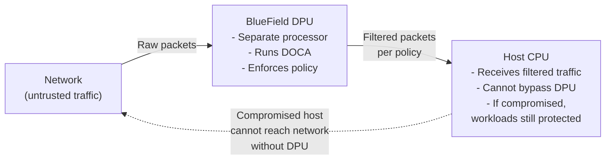
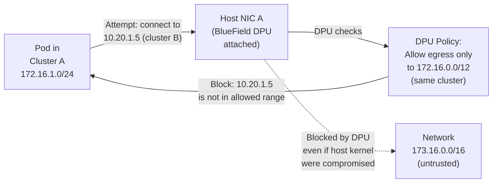

# Chapter 8 — BlueField and DOCA Security

**Learning outcome:** Understand BlueField as a security accelerator, configure DOCA security services, and detect DPU compromise.

## 8.1 BlueField: the security edge device

A BlueField Data Processing Unit (DPU) is a separate secure coprocessor that sits between the network and the host CPU. It can:

- **Offload network security:** Firewall, DDoS protection, rate limiting happen on the DPU, not the host.
- **Isolate workloads:** The DPU enforces network policies and encryption independent of the host kernel.
- **Attest to security posture:** The DPU has its own firmware and can report whether it has been tampered with.



## 8.2 DOCA: the DPU security framework

DOCA (Data Center-on-a-Chip Architecture) is NVIDIA's SDK for DPU applications. It provides security services. Note: the `doca-firewall`/`doca-crypto`/`doca-attest`/`doca-telemetry` commands below are illustrative shorthand for this chapter, not literal DOCA CLI tools — the real DOCA SDK exposes these capabilities through libraries (e.g., DOCA Flow, DOCA IPsec) and BlueField's `ovs-doca`/`mlnx` tooling, invoked from applications built against the DOCA SDK rather than a single unified CLI verb.

**DOCA Firewall:** Enforces packet filtering rules independent of host.

```bash
# Configure firewall on BlueField DPU
$ doca-firewall --config /etc/doca/firewall.conf

# firewall.conf content:
# Allow inbound inference requests on port 8080 from specific subnet
allow inbound tcp 172.16.0.0/12 any 8080

# Block all other inbound traffic
deny inbound all all all

# Verify rules loaded
$ doca-firewall --list-rules
Rule 1: Allow inbound tcp 172.16.0.0/12 any 8080
Rule 2: Deny inbound all all all
```

**DOCA Crypto:** Hardware-accelerated encryption/decryption offloaded to DPU.

```bash
# Encrypt inference results on DPU before sending over network
$ doca-crypto --algorithm AES-256-GCM --key-file /etc/doca/encryption.key

# Performance: encryption happens on DPU; host CPU is not slowed down
$ nvidia-smi  # GPU still at full utilization
```

**DOCA Attestation:** Report DPU firmware integrity.

```bash
# DPU reports its firmware PCR (Platform Configuration Register)
$ doca-attest --get-pcr
DPU PCR [0]:  0x12345678... (firmware hash)
DPU PCR [1]:  0x87654321... (config hash)

# Host verifies:
$ doca-attest --verify-pcr /etc/doca/trusted-pcr.txt
OK: DPU firmware is authentic and unmodified
```

## 8.3 Detecting BlueField compromise

If the DPU firmware is malicious or tampered with, all traffic can be intercepted or modified before reaching the host.

**Red flag: DPU attestation fails**

```bash
$ doca-attest --verify-pcr /etc/doca/trusted-pcr.txt
FAIL: DPU PCR mismatch. Trusted: 0x12345678..., Actual: 0xabcdef00...

# This means:
# - DPU firmware has been modified
# - Or DPU is running from untrusted source
# - All network traffic through this DPU is potentially compromised

# Action: isolate DPU; prevent traffic; investigate; reimage if needed
```

**Suspicious behavior: traffic bypass**

```bash
# Monitor that all traffic actually flows through DPU policy
$ tcpdump -i eth0 'ip.src == <host> and port 8080'  # Host interface
# Verify every packet matches firewall rules

# If you see packets that violate firewall rules:
#   - DPU firewall is not enforcing
#   - Possible DPU malfunction or compromise

# Action: Check doca-firewall status; test rule enforcement; reimage if needed
```

**Attack scenario: DPU firmware backdoor**

```bash
# Scenario: DPU firmware is backdoored to leak model weights over network
# Even if host is secure, DPU reads model weights from GPU, exfiltrates them

# Detection:
# 1. Monitor DPU outbound traffic for anomalies
$ iftop -i dpu0  # Unexpected large transfers?

# 2. Verify DPU attestation
$ doca-attest --verify-pcr ...  # Should fail if firmware is altered

# 3. Compare DPU power and thermal signature
$ doca-telemetry --get-power-draw
# Unexpected high power = DPU crypto engine active for non-standard operations

# Mitigation: reimage DPU firmware from signed source
```

## 8.4 BlueField networking: enforcement boundary

**Scenario: Kubernetes Pod in cluster A tries to access workload in cluster B**



**Configuration: DOCA access control list (ACL)**

```yaml
---
# Deploy network policy via DOCA on DPU
apiVersion: doca.nvidia.com/v1
kind: NetworkPolicy
metadata:
  name: cluster-isolation
spec:
  egressRules:
  - to:
      cidr: "172.16.0.0/12"  # Only cluster network
    protocol: tcp
    ports: [443, 8080, 5000]  # Only needed ports
    
  # All other egress is implicitly denied
```

## 8.5 Monitoring: DPU telemetry and health

```bash
# Check DPU operational health
$ doca-telemetry --get-health
DPU Status: OK
Firmware Version: 3.2.1 (latest)
Temp: 42C (normal)
Power Draw: 12W (normal)
Uptime: 123456 seconds

# Check DPU statistics
$ doca-telemetry --get-stats
Packets Processed: 1234567
Firewall Rules Enforced: 1
Crypto Operations: 5678
Attestation Checks: 42
```

## 8.6 Troubleshooting: DPU security checklist

| Issue | Symptom | Check | Fix |
|---|---|---|---|
| DPU attestation fails | `doca-attest --verify-pcr` shows mismatch | Retrieve PCR from DPU; compare against known-good value | Reimage DPU firmware from signed source |
| Firewall rules not enforced | Traffic violates firewall policy but succeeds | `doca-firewall --list-rules`; verify rules are loaded | Reload firewall config; restart DOCA services |
| Traffic bypasses DPU | Host can send packets that don't go through DPU filter | Check network routing; verify DPU is inline | Reconfigure NIC to route through DPU; physical cabling verification |
| Unexpected DPU power draw | DPU power consumption 2x normal | Check `doca-telemetry --get-power-draw`; check for crypto ops | Investigate background crypto tasks; check for unauthorized DPU code |
| DPU firmware version mismatch | One DPU in cluster has old firmware | `doca-telemetry --get-firmware-version` across all DPUs | Update firmware to consistent version across cluster |

## Interview Question: BlueField as a Security Boundary

**Question:** "Your cluster was compromised; the host kernel running Kubernetes has a vulnerability that was exploited. You cannot guarantee the host is trustworthy. However, you have BlueField DPUs in your network. What does BlueField allow you to do to limit the damage?"

**Model answer (spoken):**
> "Even though the host is compromised, the BlueField DPU is a separate processor that sits between the network and the host. The host cannot directly access the network without going through the DPU.
>
> First, I'd verify the DPU's firmware is authentic via attestation. If the DPU attestation passes, I know the DPU itself is trustworthy. Then, I'd enforce a strict firewall policy on the DPU: only allow egress traffic to specific trusted destinations (like the model registry for pulling models). Even if the compromised host kernel tries to send data to an attacker's server, the DPU firewall blocks it at the network level.
>
> This limits what an attacker on the host can do. They can't exfiltrate data over the network; the DPU blocks it. They can't pivot to other clusters; same deal.
>
> For encryption, I'd ensure the model weights and inference results are encrypted before reaching the NIC. On the DPU, I'd offload decryption of incoming requests and encryption of outgoing responses. Even if the host RAM is readable by the attacker, the data on the wire is protected by the DPU.
>
> The DPU doesn't fix the compromised host, but it limits the blast radius to just the host. The network and other clusters stay protected."

## Key Takeaways

- BlueField DPU is a separate secure processor; network traffic must flow through it.
- DOCA provides firewall, crypto, and attestation; enforce policy independent of host.
- DPU attestation verifies firmware integrity; failure indicates possible compromise.
- Even if host kernel is compromised, DPU firewall can prevent exfiltration and lateral movement.
- Monitor DPU telemetry and attestation continuously; alert on failures.

## Cross References

- Previous: [Chapter 7 — DMA, IOMMU, SR-IOV](./chapter-07-placeholder.md)
- Next: [Chapter 9 — Confidential Computing and Attestation](./chapter-09-placeholder.md)
- Lab: [Lab 7 — Deploy and Verify BlueField Security Policy](./labs/lab-07-placeholder.md)
