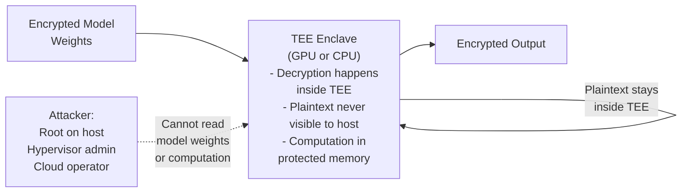
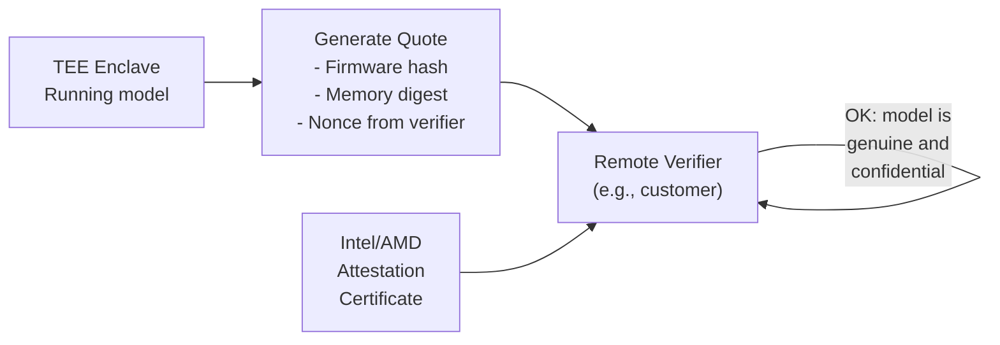

# Chapter 9 — Confidential Computing and Attestation

**Learning outcome:** Design confidential computing architectures using TEEs, verify attestation proofs, protect model confidentiality from privileged attackers.

## 9.1 The threat: even privileged insiders can see model weights

Traditional encryption protects data in transit and at rest, but not in use. When a model runs on a GPU and decrypts weights into device memory, any root-level attacker (cloud admin, host kernel, hypervisor) can read the plaintext.

Confidential Computing solves this: the workload and its data are encrypted even during execution inside a hardware-protected Trusted Execution Environment (TEE).



## 9.2 Intel SGX and AMD SEV-SNP: CPU-based TEEs

**SGX (Software Guard Extensions):** Protects a portion of CPU memory (enclave) from even the operating system.

**Verification:**

```bash
# Check if SGX is supported
$ cpuid | grep -i sgx
SGX: Supported
SGX1: Supported
SGX2: Supported

# Enable in BIOS if not enabled
# Reboot and verify
$ dmesg | grep -i sgx
[    0.000000] sgx: EPC section 0x80000000-0x81ffffff
[    0.000000] sgx: Intel SGX initialized
```

**Attestation:**

```bash
# Generate quote (proof that enclave is running in SGX)
$ sgx-quote-generator --enclave-hash 0x1234567... > quote.bin

# Verify quote with Intel Attestation Service (IAS)
$ curl -X POST https://api.trustedservices.intel.com/sgx/dev/attestation \
  --data-binary @quote.bin > verification.json

$ jq '.result.isv_enclave_trust_level' verification.json
"Ok"  # Enclave is authentic
```

## 9.3 GPU Confidential Computing (NVIDIA H100+)

NVIDIA H100 and newer GPUs support confidential computing: GPU memory and execution are protected from the host.

**Important distinction:** GPU Confidential Computing (CC) mode is a completely different feature from the legacy `nvidia-smi -c` **Compute Mode** flag (`DEFAULT` / `EXCLUSIVE_THREAD` / `EXCLUSIVE_PROCESS` / `PROHIBITED`). Compute Mode controls how many host processes/contexts may use the GPU concurrently — it has nothing to do with confidentiality or memory encryption, and setting it does not enable, disable, or verify CC in any way. Do not confuse the two in a hands-on interview.

**Verification and enablement (real workflow):**

```bash
# Check if the GPU supports confidential compute
$ nvidia-smi -i 0 -q | grep -i 'confidential\|trusted'
Confidential Compute Supported: Yes

# CC mode is a firmware/BIOS-level toggle, not a runtime nvidia-smi flag you
# flip and immediately use. In broad strokes:
#   1. Enable CC support in system BIOS/firmware (host platform vendor-specific
#      — consult the server/BIOS vendor's documentation for the exact toggle)
#   2. On the driver side, query and manage CC mode via the `nvidia-smi
#      conf-compute` subcommand family (exact flags vary by driver release —
#      check `nvidia-smi conf-compute --help` on the target driver version),
#      e.g. querying the current CC feature state and CC mode (off / on /
#      devtools)
#   3. A GPU reset (or reboot) is typically required after changing CC mode
#      before it takes effect
#   4. The workload/container stack must also support CC (recent CUDA driver,
#      CC-aware container runtime)

# Query current CC mode (subcommand and exact output format are driver-version
# dependent — verify against the driver release actually deployed)
$ nvidia-smi conf-compute -m
CC status: ON
```

This is intentionally a description of the mechanism rather than a single copy-pasteable command: the precise CLI syntax has evolved across driver/CUDA releases, and the BIOS-level step is vendor-specific. Verify exact flags against the deployed driver version and server vendor documentation before using this in production or in an interview.

**Example: training with model confidentiality**

```bash
# Illustrative only — the specific container-runtime flags for CC-aware
# workloads are driver/runtime-version specific, not a fixed env var. The
# concept: once CC mode is enabled at the GPU/BIOS level (above), a
# CC-aware container runtime + driver combination is required for the
# workload to actually run inside the protected/encrypted memory region.
$ docker run --gpus all \
  pytorch:latest \
  python train.py

# Once CC mode is active end-to-end, model weights in GPU HBM are encrypted
# and the host cannot read GPU memory plaintext, even with root access.
```

## 9.4 Remote Attestation: proving trust to stakeholders

Remote attestation allows a third party (e.g., cloud customer) to verify that:
1. The model is running in a TEE.
2. The firmware/software is authentic.
3. No unauthorized modifications.

**Attestation flow:**



**Real example: customer verifies model integrity before inference**

```bash
# Customer challenges the service
$ attest-client --target inference-service.example.com \
  --challenge $(date +%s)

# Service responds with quote
$ attest-service --enclave-hash $MODEL_HASH \
  --challenge <received-nonce> > attestation.json

# Customer verifies
$ attest-verify --quote attestation.json \
  --ca-cert intel-ias-ca.pem \
  --expected-hash <known-model-hash>

Verification OK: Model is authentic and running in TEE
```

**NVIDIA's actual attestation architecture:** the `attest-client`/`attest-service`/`attest-verify` flow above is a generic illustration (it mirrors the Intel IAS-style pattern from 9.2), not NVIDIA's specific mechanism. In practice, NVIDIA's GPU attestation is device-identity and firmware-measurement based: each CC-capable GPU has a device identity certificate, generates an SPDM-based attestation report at boot/runtime, and firmware/driver state is measured against a Reference Integrity Manifest (RIM) that NVIDIA publishes for known-good firmware versions. Verification is typically performed via the NVIDIA Remote Attestation Service (a local or NVIDIA-hosted verifier), not by re-purposing Intel's or AMD's CPU-TEE attestation certificate chain — GPU attestation is a distinct trust chain layered alongside (and correlated with) any CPU-side SGX/SEV-SNP attestation in a full end-to-end confidential-computing deployment.

This also resolves the gap flagged in Chapter 2: it's not accurate to say "GPUs lack attestation" as a blanket statement — H100/H200 in CC mode DO support hardware-rooted attestation via this device-identity + RIM flow. The accurate scoping is "GPUs outside of Hopper+ confidential computing mode lack attestation."

**MIG and Confidential Computing interaction:** at H100's initial CC launch, MIG and CC mode were mutually exclusive — a GPU running in CC mode could not simultaneously be partitioned into MIG instances, and vice versa. This is a concrete, testable interaction between this chapter and Chapter 6 (GPU Sharing Security): you could not combine MIG-based multi-tenancy with CC-based confidentiality on the same GPU in the initial Hopper CC implementation. Verify current compatibility against the latest NVIDIA CC/MIG documentation before stating this in an interview, since this is an area that evolves across driver and CUDA releases — but know that the constraint existed and be ready to explain why (CC's memory-encryption and attestation boundary was designed around a single trust domain per GPU at launch).

## 9.5 Detecting TEE compromise or misuse

```bash
# Monitor for attestation anomalies
- Attestation quote fails verification (firmware modified)
- Quote timestamp is stale (system rolled back)
- Memory measurements change unexpectedly (model weights changed)

# Alert if any above occurs; isolate immediately
```

## Production Troubleshooting

| Issue | Symptom | Check | Fix |
|---|---|---|---|
| Confidential compute not supported | App reports feature unavailable | `nvidia-smi -i 0 -q \| grep Confidential` | Requires H100 or newer GPU; check hardware |
| SGX not enabled | Enclave initialization fails | `dmesg \| grep -i sgx` | Enable SGX in BIOS; reboot |
| Attestation quote validation fails | Quote verification error; timestamp or signature mismatch | Run `attest-verify --quote ...` with correct CA cert | Update Intel/AMD CA certificate; regenerate quote |
| TEE memory insufficient for model | Model loading fails inside enclave | Reduce model size or use quantization | Some TEEs have limited memory; trade-off between security and model size |

## Key Takeaways

- Confidential computing protects model weights even from privileged attackers (root, hypervisor).
- SGX protects CPU memory; GPU CCM protects GPU memory.
- Remote attestation proves TEE integrity and authenticity to third parties.
- Monitor attestation continuously; failures indicate compromise.

## Cross References

- Previous: [Chapter 8 — BlueField and DOCA](./chapter-08-placeholder.md)
- Next: [Chapter 10 — Data and Model Protection](./chapter-10-placeholder.md)
- Lab: [Lab 8 — Deploy Model in GPU Confidential Compute Mode and Verify Attestation](./labs/lab-08-placeholder.md)
