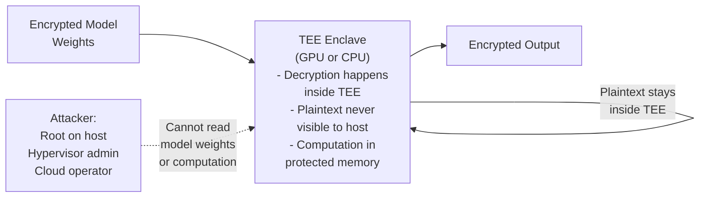
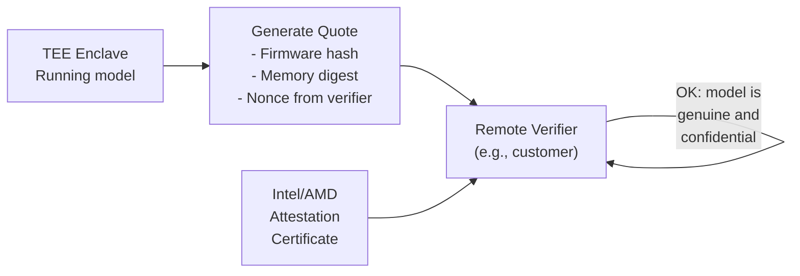

# Chapter 9 — Confidential Computing and Attestation

**Learning outcome:** Design confidential computing architectures using TEEs, verify attestation proofs, protect model confidentiality from privileged attackers.

## 9.1 The threat: even privileged insiders can see model weights

Traditional encryption protects data in transit and at rest, but not in use. When a model runs on a GPU and decrypts weights into device memory, any root-level attacker (cloud admin, host kernel, hypervisor) can read the plaintext.

Confidential Computing solves this: the workload and its data are encrypted even during execution inside a hardware-protected Trusted Execution Environment (TEE).



## 9.2 Intel SGX and AMD SEV-SNP: CPU-based TEEs

**SGX (Software Guard Extensions):** Protects a portion of CPU memory (enclave) from even the operating system.

**Verification:**

```bash
# Check if SGX is supported
$ cpuid | grep -i sgx
SGX: Supported
SGX1: Supported
SGX2: Supported

# Enable in BIOS if not enabled
# Reboot and verify
$ dmesg | grep -i sgx
[    0.000000] sgx: EPC section 0x80000000-0x81ffffff
[    0.000000] sgx: Intel SGX initialized
```

**Attestation:**

```bash
# Generate quote (proof that enclave is running in SGX)
$ sgx-quote-generator --enclave-hash 0x1234567... > quote.bin

# Verify quote with Intel Attestation Service (IAS)
$ curl -X POST https://api.trustedservices.intel.com/sgx/dev/attestation \
  --data-binary @quote.bin > verification.json

$ jq '.result.isv_enclave_trust_level' verification.json
"Ok"  # Enclave is authentic
```

## 9.3 GPU Confidential Computing (NVIDIA H100+)

NVIDIA H100 and newer GPUs support confidential computing: GPU memory and execution are protected from the host.

**Verification:**

```bash
# Check if GPU supports confidential compute
$ nvidia-smi -i 0 -q | grep -i 'confidential\|trusted'
Confidential Compute Supported: Yes

# Enable confidential compute mode
$ nvidia-smi -i 0 -c EXCLUSIVE_THREAD

# Verify
$ nvidia-smi -i 0 -q | grep Compute
Compute Mode: Default
```

**Example: training with model confidentiality**

```bash
# Launch training job inside GPU CCM (Confidential Compute Mode)
$ docker run --gpus all \
  --env NVIDIA_GPU_CONF_ENABLE_CONFIDENTIAL=1 \
  pytorch:latest \
  python train.py

# Inside container, model weights are protected in GPU HBM
# Host cannot read GPU memory plaintext
```

## 9.4 Remote Attestation: proving trust to stakeholders

Remote attestation allows a third party (e.g., cloud customer) to verify that:
1. The model is running in a TEE.
2. The firmware/software is authentic.
3. No unauthorized modifications.

**Attestation flow:**



**Real example: customer verifies model integrity before inference**

```bash
# Customer challenges the service
$ attest-client --target inference-service.example.com \
  --challenge $(date +%s)

# Service responds with quote
$ attest-service --enclave-hash $MODEL_HASH \
  --challenge <received-nonce> > attestation.json

# Customer verifies
$ attest-verify --quote attestation.json \
  --ca-cert intel-ias-ca.pem \
  --expected-hash <known-model-hash>

Verification OK: Model is authentic and running in TEE
```

## 9.5 Detecting TEE compromise or misuse

```bash
# Monitor for attestation anomalies
- Attestation quote fails verification (firmware modified)
- Quote timestamp is stale (system rolled back)
- Memory measurements change unexpectedly (model weights changed)

# Alert if any above occurs; isolate immediately
```

## Production Troubleshooting

| Issue | Symptom | Check | Fix |
|---|---|---|---|
| Confidential compute not supported | App reports feature unavailable | `nvidia-smi -i 0 -q \| grep Confidential` | Requires H100 or newer GPU; check hardware |
| SGX not enabled | Enclave initialization fails | `dmesg \| grep -i sgx` | Enable SGX in BIOS; reboot |
| Attestation quote validation fails | Quote verification error; timestamp or signature mismatch | Run `attest-verify --quote ...` with correct CA cert | Update Intel/AMD CA certificate; regenerate quote |
| TEE memory insufficient for model | Model loading fails inside enclave | Reduce model size or use quantization | Some TEEs have limited memory; trade-off between security and model size |

## Key Takeaways

- Confidential computing protects model weights even from privileged attackers (root, hypervisor).
- SGX protects CPU memory; GPU CCM protects GPU memory.
- Remote attestation proves TEE integrity and authenticity to third parties.
- Monitor attestation continuously; failures indicate compromise.

## Cross References

- Previous: [Chapter 8 — BlueField and DOCA](./chapter-08-placeholder.md)
- Next: [Chapter 10 — Data and Model Protection](./chapter-10-placeholder.md)
- Lab: [Lab 8 — Deploy Model in GPU Confidential Compute Mode and Verify Attestation](./labs/lab-08-placeholder.md)
