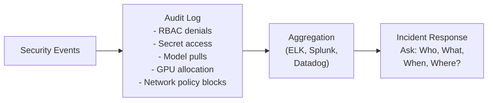

# Chapter 11 — Audit, Logging, and Compliance

**Learning outcome:** Design audit logging for security incidents, correlate logs across layers, demonstrate compliance evidence, detect and respond to breaches.

## 11.1 Audit logging: the "who did what when" record

Audit logs record security-relevant events so you can:
- **Investigate:** What happened? Who accessed what?
- **Respond:** Contain breach; revoke compromised credentials.
- **Comply:** Prove to auditors/regulators that controls were in place.



## 11.2 Multi-layer audit logging

**Layer 1: Kubernetes API audit**

```bash
# Every API call is logged (if audit policy is configured)
$ grep -i "get.*secret" /var/log/audit/audit.log | head -3
{
  "apiVersion": "audit.k8s.io/v1",
  "kind": "Event",
  "level": "RequestResponse",
  "verb": "get",
  "objectRef": {"kind": "Secret", "name": "model-registry-creds"},
  "user": {"username": "alice"},
  "sourceIPs": ["172.16.1.100"],
  "requestStatus": {"code": 200}
}
# Proves alice read the model registry secret
```

**Layer 2: GPU access logs**

```bash
# DCGM logs GPU allocation and usage
$ dcgmi dmon -i <gpu-id> -c 10  # 10 samples
GPU 0: User: trainer-pod, Process: python, Memory: 5000 MiB, Utilization: 95%

# Or via NVIDIA Container Toolkit logging
$ docker logs <inference-container> | grep -i 'cuda\|gpu'
CUDA Initializing GPU 0...
```

**Layer 3: Network security logs**

```bash
# Network policies that block traffic
$ journalctl -u kubelet --since "1 hour ago" | grep -i 'denied\|dropped'
nf_conntrack: protocol 6 helper: unknown [TCP]
netlink: Policy blocked: source 172.16.2.5 dest 172.16.3.10
# Proves network policy enforcement
```

**Layer 4: Application logs**

```bash
# Inference server logs model load events
$ docker logs inference-server | grep -i 'loading\|loaded'
2026-08-07 14:32:15 INFO: Loading model gpt-3-v1.0.4 from registry
2026-08-07 14:32:16 INFO: Model signature verified successfully
2026-08-07 14:32:17 INFO: Model loaded into GPU memory (12GB)
```

## 11.3 Audit log analysis: detecting security incidents

**Scenario: Suspicious access to model weights**

```bash
# Query: who read model secrets in the last hour?
$ grep -i "get.*secret.*model" /var/log/audit/audit.log | \
  jq -r '.user.username' | sort | uniq -c

      1 alice
      5 inference-pod  # Expected
     42 unknown-service  # <= Red flag: many reads by unrecognized account

# Investigation:
$ grep -i "unknown-service" /var/log/audit/audit.log | \
  jq '[.user.username, .sourceIPs, .requestTime]' | head -10

["unknown-service", ["10.0.1.99"], "2026-08-07T14:20:00Z"]
["unknown-service", ["10.0.1.99"], "2026-08-07T14:20:05Z"]
["unknown-service", ["10.0.1.99"], "2026-08-07T14:20:10Z"]

# Action: Block IP 10.0.1.99; revoke credentials; investigate source
```

**Anomaly detection: impossible travel**

```bash
# Alice logs in from San Francisco at 2pm, then Tokyo at 2:05pm (impossible)
$ grep -i "alice" /var/log/audit/audit.log | grep -E '14:0[0-5]|14:05'

2026-08-07T14:00:00 alice from San Francisco (58.12.34.0)
2026-08-07T14:05:00 alice from Tokyo (203.0.113.0)

# Alert: Credential compromise; revoke tokens; force password reset
```

## 11.4 Compliance mapping: audit logs to regulatory requirements

**SOC2 Type II:** Prove controls existed and were tested over a period.

| Control | Audit Evidence | How to Collect |
|---|---|---|
| Access control (A1) | RBAC denials logged; least privilege verified | `kubectl auth can-i` test; RBAC audit logs |
| Monitoring (CC6.1) | Security events logged and retained | Audit logs aggregated; retention ≥90 days |
| Change management (CC7.2) | Model updates approved before deploy | Approval log + deployment manifest + audit trail |
| Incident response (IR1) | Incident detected and responded to | Alert fired; ticket created; evidence archived |

**HIPAA (health data):** Requires audit trails for PHI access.

```bash
# Prove: patient data was accessed by authorized personnel only
$ grep -i "patient" /var/log/audit/audit.log | \
  jq '[.verb, .objectRef.name, .user.username, .requestTime, .requestStatus.code]'

["get", "patient-data-v2", "data-scientist-alice", "2026-08-07T14:00:00Z", 200]
["delete", "patient-data-v1", "platform-admin", "2026-08-07T14:01:00Z", 200]

# Evidence: only alice (authorized DS) accessed patient data; audit trail is complete
```

## 11.5 Incident response playbook using audit logs

**Scenario: Model weights were exfiltrated**

```
1. Identify the breach
   - Alert: "Model secret accessed 100 times in 5 minutes"
   - Query: Who accessed it? From where? When?

2. Gather evidence (via audit logs)
   - Extract all API calls by attacker
   - Extract network logs (what data left the cluster?)
   - Extract GPU logs (which models were loaded?)

3. Contain (via access revocation)
   - Revoke attacker's credentials
   - Rotate model registry tokens
   - Reimage any suspected-compromised nodes

4. Investigate root cause
   - Was this phishing? (check audit logs for impossible travel)
   - Was this a vulnerability? (check for container escape)
   - Was this an insider? (check access logs during work hours)

5. Communicate
   - Notify affected customers
   - Provide evidence from audit logs
```

## Production Troubleshooting

| Issue | Symptom | Check | Fix |
|---|---|---|---|
| Audit logs missing | Cannot answer "who accessed X" | Verify audit policy is loaded; check `/var/log/audit/` size | Enable audit logging; configure retention policy |
| Audit log lag | Events logged hours after they occur | Check log aggregation system performance | Increase aggregation buffer; add more disk space |
| Sensitive data in logs | Passwords or secrets visible in plain logs | Search audit logs for secret patterns | Configure log redaction; hash sensitive fields |
| Compliance audit failing | Auditor asks "where is evidence of control X?" | Query audit logs for evidence; prepare report | Run audit log analysis queries; document evidence trail |

## Interview Question: Audit Trail for Incident Investigation

**Question:** "A customer complains that their proprietary model was stolen and ended up on GitHub. You have full access to audit logs. Walk us through your investigation using the logs."

**Model answer (spoken):**
> "First, I'd determine the window: when was the model added to GitHub? Let's say Aug 5th. I'd query audit logs for all model access on Aug 5th:
>
> `grep model-secret /var/log/audit/audit.log | grep 2026-08-05`
>
> This shows who accessed the model that day. If most access was expected (inference team pulling for serving), but there's one unexpected principal (e.g., contractor-xyz who shouldn't have access), that's my lead.
>
> Next, I'd check when contractor-xyz's credentials were created and if they're still active:
> `kubectl get secret contractor-xyz-token -o jsonpath=.metadata.creationTimestamp`
>
> Then network logs: did contractor-xyz's workload exfiltrate data? I'd check egress traffic:
> `grep contractor-xyz /var/log/audit/audit.log | grep -E 'exec.*curl|wget|scp'`
>
> If they ran a curl command to an external IP, that's the exfiltration path. Combine that with the network policy logs to see if they bypassed firewall.
>
> Finally, timeline: when was the GitHub repo created? Cross-reference with when the audit shows the secret was read and when traffic left the cluster.
>
> This gives the full story: contractor-xyz accessed the secret at 14:32, exfiltrated to 203.0.113.50 at 14:35, and GitHub repo was created at 14:40. Clear timeline, clear evidence of who did it and how."

## Key Takeaways

- Audit logs are the primary evidence for security incidents and compliance.
- Collect logs from multiple layers: Kubernetes, GPU, network, application.
- Centralize and index logs for efficient querying during investigation.
- Define audit alert thresholds: repeated Forbidden errors, suspicious access patterns, impossible travel.
- Prove compliance to auditors using audit logs: access control, monitoring, change management.

## Cross References

- Previous: [Chapter 10 — Data and Model Protection](./chapter-10-placeholder.md)
- Next: [Chapter 12 — Incident Response and Troubleshooting](./chapter-12-placeholder.md)
- Lab: [Lab 10 — Query Audit Logs and Generate Incident Report](./labs/lab-10-placeholder.md)
