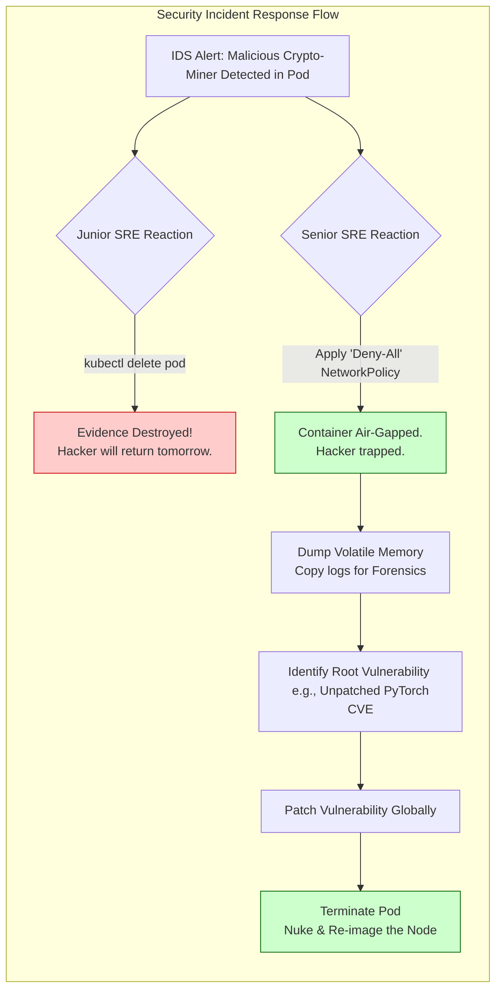

# Chapter 12 — Incident Response and Troubleshooting

| Chapter metadata | Value |
|---|---|
| Volume | 18 — Security, Compliance, and Confidential Computing |
| Difficulty | Expert |
| Estimated reading time | 30 minutes |
| Primary audience | Security Responders, Platform SREs |
| Core question | If you suspect a container has been breached and the attacker is currently reading your GPU memory, what are the first three commands you run? |

## Introduction

In standard SRE, when a server crashes, you reboot it to restore service. 
In Security Incident Response (IR), when a server is breached, **rebooting it destroys the evidence**.

If an attacker has compromised a GPU node, their malware, active network connections, and stolen credentials exist entirely in the volatile system RAM and GPU VRAM. 
A Senior Architect designs incident response workflows that prioritize **Containment and Forensic Preservation** over immediate uptime.

## Beginner's Primer: Do Not Touch the Crime Scene

In traditional DevOps (Volume 16), the goal is MTTR (Mean Time To Recovery). If a Pod dies, you restart it. If a Node hangs, you reboot it. You want the service back online in 5 minutes.

In DevSecOps, the rules change entirely. 
If an alert fires saying *"Unauthorized Crypto-Miner detected on GPU 4"*, you do not have an IT problem. You have a crime scene.

If your first instinct is to type `kubectl delete pod`, you have just grabbed a broom and swept away all the fingerprints. You destroyed the attacker's code, their IP address, and their memory footprint. You don't know how they got in, which means they will just get back in tomorrow. 

**The Golden Rule of Security IR:** Isolate, don't terminate. 
Instead of deleting the Pod, you apply a Kubernetes Network Policy that cuts the Pod's internet connection. The hacker is trapped inside the running container, but they can't send data out. You then use forensic tools to freeze the container, copy the GPU's memory, and figure out exactly what vulnerability they exploited. *Then*, you wipe the server. 

## 1. The Incident Response Workflow (Containment)

**Symptom:** Your IDS (Intrusion Detection System) alerts that a specific GPU worker node (`gpu-node-42`) is making outbound connections to a known cryptocurrency mining pool.

**The Junior Mistake:** `kubectl delete pod malicious-pod` or rebooting the server. The attacker is kicked out, but you have no idea how they got in, and they will simply break in again tomorrow.

**The Senior SRE Workflow:**
1.  **Cordon:** `kubectl cordon gpu-node-42`. This stops Kubernetes from sending new workloads to the compromised node.
2.  **Network Quarantine:** Do NOT power off the server. Use the hypervisor, the Top-of-Rack switch, or Calico NetworkPolicies to drop all inbound and outbound traffic to the node, *except* for your specific forensic management IP address. The attacker is now trapped in a cage.
3.  **Snapshot:** If running on VMs, take an immediate snapshot of the VM's RAM and Disk. This preserves the exact state of the malware for the security team to analyze.

## 2. Forensic Artifacts in AI Clusters

To understand how the attacker breached the AI cluster, you must analyze specific AI telemetry.

*   **The Audit Logs:** Check the Kubernetes API audit logs. Did a legitimate user's compromised Service Account deploy the malicious pod?
*   **The Container Image:** Inspect the image hash running on the node. Does it match the secure registry? If not, the attacker bypassed the Admission Controller. 
*   **DCGM Metrics:** Did the GPU power draw spike to 700W constantly? Crypto-miners leave highly specific, sustained thermal and power signatures in DCGM that look very different from the bursty nature of standard AI inference.

## 3. Eradication and Recovery

Once the forensic snapshot is secure and the security team has identified the entry vector (e.g., an unpatched CVE in the PyTorch container), you must eradicate the threat.

**The Golden Rule of Eradication:** You never "clean" a compromised server. You destroy it.

If an attacker gained root on `gpu-node-42`, you cannot trust the OS, the drivers, or the firmware. 
1. Re-image the bare-metal server using an automated PXE boot pipeline.
2. Force a cryptographic firmware flash on the GPU and ConnectX NICs to ensure the attacker didn't leave a persistent rootkit in the silicon (as discussed in Chapter 2).
3. Rotate all Kubernetes Secrets, Registry credentials, and S3 API keys that were present on that node.
4. Allow the node to rejoin the cluster.

## Customer Scenario (Senior Level)

**The Situation:**
A security analyst receives an alert that a Jupyter notebook pod in the research namespace is scanning the internal corporate network (port 22). The platform engineer immediately runs `kubectl delete pod jupyter-research-1`, terminating the pod to stop the scan. They report the incident as resolved. The next week, the entire cluster is encrypted by ransomware. The CISO demands a postmortem.

**The Senior Architect Response:**
"The platform engineer executed a destructive remediation that destroyed the forensic evidence and left the root vulnerability wide open, leading directly to the ransomware event.

Deleting a compromised pod does not fix the vulnerability; it merely resets the attacker's session. Because the container was deleted, the security team lost the ability to inspect the running processes, analyze the attacker's bash history, or identify exactly which CVE was exploited to gain entry. The attacker simply waited a few days, used the exact same exploit to break into a new pod, and continued their attack until they achieved lateral movement.

We must implement a strict **Forensic Containment Protocol** for all future incidents. 

When a pod is suspected of compromise, engineers are strictly forbidden from deleting it. Instead, they must apply a **Quarantine NetworkPolicy**. This policy will instantly drop all egress and ingress traffic for that specific pod, neutralizing the threat while keeping the container physically running. 

Next, the security team will execute `kubectl debug` or use forensic tools to attach to the quarantined container and dump its memory and filesystem state. Only after the exact vulnerability (e.g., an unpatched Jupyter vulnerability or a leaked token) has been identified and patched globally across the cluster are we allowed to terminate the compromised pod and rebuild the node."

## Interview Preparation

**Conceptual:** If you suspect a GPU server has been compromised by an attacker, why should you avoid rebooting it immediately? *(Hint: Rebooting the server clears the volatile System RAM and GPU VRAM. This destroys the most critical forensic evidence, such as the attacker's active network connections, injected malware payloads, and decrypted passwords. You should isolate the server from the network (quarantine) and take a memory snapshot before powering it down).*

**Architecture:** Explain the difference between 'cleaning' a compromised node and 'destroying' it. *(Hint: 'Cleaning' involves trying to find and delete the malware using antivirus tools. This is a massive security risk, as sophisticated attackers install hidden rootkits deep in the OS or firmware. In modern cloud-native architecture, you 'destroy' the node by completely wiping the hard drives, reflashing the hardware firmware, and re-imaging the OS from a known-good immutable image, guaranteeing the threat is eradicated).*

## Architecture Summary

Security Incident Response requires fighting the SRE instinct to "just reboot it." When an AI Pod or Node is compromised, platform engineers must execute a forensic containment strategy: applying NetworkPolicies to instantly air-gap the workload without killing the process, capturing volatile memory state (VRAM/RAM) for analysis, and finally executing a scorched-earth hardware wipe (re-imaging OS and re-flashing GPU firmware) to eradicate persistent rootkits.

