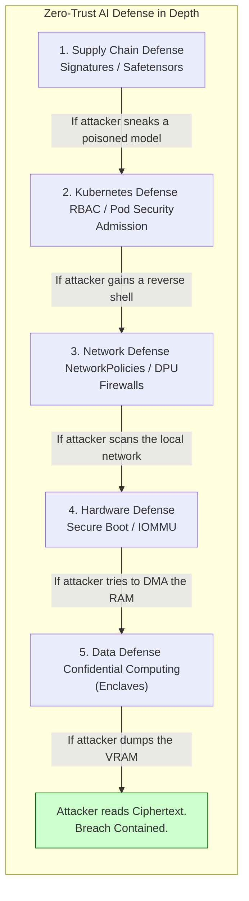

# Chapter 12 — Volume 18 Summary

This volume established that AI infrastructure expands the enterprise attack surface exponentially. Massive, unverified open-source models running on shared hardware require strict, zero-trust security boundaries to prevent data exfiltration and container escapes.

## Core Concepts Reviewed

1.  **The Threat Model:** AI introduces unique vectors: Model Poisoning (malicious pickle files), Supply Chain vulnerabilities, and Multi-Tenant memory leaks. Security must transition from perimeter firewalls to deep, defense-in-depth isolation.
2.  **Hardware Trust (Secure Boot & IOMMU):** You must verify the firmware of the GPUs and NICs before the OS boots. The **IOMMU** is mandatory to prevent rogue PCIe devices from executing unauthorized Direct Memory Access (DMA) attacks against the host RAM. 
3.  **Supply Chain Security:** Never run `latest` tags. Implement a pipeline that pulls images, scans them for CVEs, signs them (e.g., Cosign), and uses a Kubernetes Admission Controller to mathematically reject unsigned containers. Models must be converted to the non-executable `.safetensors` format.
4.  **RBAC and Pod Security:** Implement the Principle of Least Privilege. The `gpu-operator` must run in a locked-down namespace. Apply Pod Security Admission (PSA) set to `Restricted` to ensure no data scientist can run a container as `root` and escape to the host kernel.
5.  **Micro-Segmentation (DPUs):** Standard firewalls suffer from the Shared Fate problem; if the host is compromised, the firewall is disabled. **BlueField DPUs** physically offload the firewall and encryption logic onto isolated ARM processors, preventing a compromised host from moving laterally across the data center.
6.  **Confidential Computing:** Encrypting data at rest (S3) and in transit (TLS) is not enough. NVIDIA Hopper GPUs utilize hardware-level encryption (Secure Enclaves) to protect Data in Use. It encrypts the VRAM and PCIe bus, preventing hypervisor administrators from dumping memory and stealing proprietary model weights.
7.  **Incident Response:** Never reboot a compromised server. Cordon the node, apply strict Network Policies to cage the attacker, capture memory snapshots for forensic evidence, and then completely destroy and re-image the hardware.

## The Senior Architect's Mandate

A Senior Solutions Architect understands that security is a math problem. 
They do not trust humans to follow policies; they enforce policies in the silicon and the orchestration layer. They mandate IOMMU to secure the PCIe bus, they require Admission Controllers to block unsigned containers, and they deploy DPUs to physically isolate the security perimeter. By designing a system that assumes the host OS will eventually be compromised, the Architect ensures that a breach is contained, preventing a localized container escape from becoming a multi-million dollar corporate data disaster.

## Beginner's Primer: Putting it all together

Volume 18 covered the entire security lifecycle of an AI Factory. To visualize how these concepts fit together, think of your data center like a medieval castle:

- **The Supply Chain (The Drawbridge):** You check everyone who tries to enter the castle. You scan their bags (Trivy CVE Scanning) and check their ID (Cosign Image Signing) to ensure no Trojan Horses get inside.
- **RBAC & Network Policy (The Internal Doors):** Once inside the castle, the chef can only enter the kitchen. The guard can only enter the barracks. If a guest goes rogue, they are locked in their room.
- **DPUs & IOMMU (The Bulletproof Glass):** The security guards (Firewalls) and the vault managers are placed behind unbreakable glass, completely physically separated from the guests. 
- **Confidential Computing (The Vault):** Even if someone breaks into the vault room, the gold bars are individually encrypted with biometric locks, rendering them useless to the thief.

## Architecture Summary

