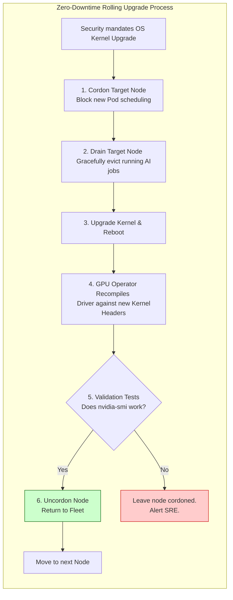

# Chapter 1 — Cluster Lifecycle and Upgrade Operations

| Chapter metadata | Value |
|---|---|
| Volume | 19 — AI SRE and Operations |
| Difficulty | Advanced |
| Estimated reading time | 30 minutes |
| Primary audience | SREs, Platform Engineers |
| Core question | When NVIDIA releases a critical driver patch, how do you upgrade 1,000 GPUs without interrupting a multi-million dollar training run? |

## Introduction

Day 1 of building an AI cluster is exciting: racking the hardware, installing the GPU Operator, and running the first `nccl-test`. 
Day 2 is a relentless war against entropy. 

Software rots. Security vulnerabilities are discovered in the Linux kernel. New LLM serving engines require newer CUDA toolkits, which require newer NVIDIA kernel drivers. If you do not have a mathematically rigorous lifecycle management strategy, upgrading the cluster will result in cascading failures, kernel panics, and massive SLA breaches.

A Senior SRE does not "hope" an upgrade works. They architect a system where upgrades are routine, automated, and imperceptible to the end-user.

## Beginner's Primer: The Jenga Tower of AI Upgrades

In traditional IT, upgrading a server is easy. You type `apt-get update`, reboot, and you're done. 

In AI, upgrading a server is like pulling a block from the bottom of a Jenga tower. The software stack is deeply interconnected:
- The AI Framework (e.g., PyTorch) requires a specific version of **CUDA**.
- The CUDA library requires a specific **NVIDIA Linux Driver**.
- The NVIDIA Driver requires a specific **Linux Kernel**.

If your security team demands an emergency Linux Kernel patch, but you don't upgrade the NVIDIA Driver alongside it, the new Kernel will violently reject the old NVIDIA Driver. The GPU goes dark. The node crashes. 

Because AI workloads take weeks to finish, you cannot simply reboot all your servers at midnight. You have to use surgical "Cordon and Drain" maneuvers to gently move AI workloads off a server, update the entire Jenga tower, test it, and put the server back into the cluster. This chapter teaches you how to execute this flawlessly across thousands of GPUs.

## 1. The Blast Radius of Upgrades

In an AI cluster, upgrades fall into three categories, ranked by their blast radius:

1.  **Application / Container Upgrades (Low Risk):** Deploying a new Triton or vLLM container. If it crashes, Kubernetes simply restarts the old version.
2.  **GPU Operator / Driver Upgrades (High Risk):** Unloading the `nvidia.ko` kernel module and loading a new one. If this fails, the GPU disappears from the host OS, and all pods crash.
3.  **OS Kernel / Firmware Upgrades (Extreme Risk):** Rebooting the physical server to apply BIOS patches or Linux kernel updates. 

*Architectural Mandate:* You must decouple these lifecycles. As discussed in Volume 10, never bake drivers into immutable OS images. Use the GPU Operator to manage drivers as containers, allowing you to update drivers without rebooting the host OS.

## 2. The Golden Rule of Eviction

You cannot upgrade a component that is actively doing math. 

If you force-delete an `nvidia-driver-daemonset` pod while a data scientist's Jupyter notebook is running, the host kernel module will attempt to unload, fail because the device is busy, and the node will enter an irrecoverable zombie state requiring a hard hardware reset.

**The Safe Eviction Pipeline:**
1.  **Cordon:** `kubectl cordon node-42`. Stop the Kubernetes scheduler from sending new workloads.
2.  **Drain:** `kubectl drain node-42 --ignore-daemonsets --delete-emptydir-data`. Forcefully but safely evict the user pods. *Crucially, if the pod is part of a massive distributed training ring, the orchestration framework (like Slurm or Kubeflow) must catch this eviction and trigger an automated checkpoint save before the pod is killed.*
3.  **Verify Idle:** Query `nvidia-smi` to ensure zero processes are holding a lock on the GPU.
4.  **Execute Upgrade:** Upgrade the driver via Helm, or reboot the OS.
5.  **Validation:** Run an automated DCGM diagnostic burn-in test (Volume 16) to prove the new driver works.
6.  **Uncordon:** Return the node to the active pool.

## 3. The Canary Rollout Strategy

Never upgrade the entire cluster at once. 

**1. The Vanguard Node:** Pick one isolated node. Execute the eviction and upgrade pipeline. Allow low-priority batch jobs to run on it for 24 hours. Monitor DCGM for XID errors or unexpected thermal throttling introduced by the new driver.
**2. The Rack-Level Rollout:** If the Vanguard succeeds, upgrade one entire rack. Why a rack? Because in Leaf-Spine architectures, a rack often represents a single InfiniBand fault domain. 
**3. The Global Rollout:** Upgrade the rest of the cluster using Kubernetes RollingUpdates, ensuring at least 90% of cluster capacity remains online at all times.

## Customer Scenario (Senior Level)

**The Situation:**
A financial institution runs a 500-node GPU cluster on bare-metal Kubernetes. The security team mandates an immediate, emergency patch of the Ubuntu Linux kernel to fix a critical CVE. The IT team executes an automated Ansible script that runs `apt-get upgrade -y && reboot` across all 500 nodes simultaneously at 2:00 AM. When the cluster boots back up, 400 nodes fail to advertise any `nvidia.com/gpu` capacity. All morning trading AI models are completely down. 

**The Senior Architect Response:**
"The IT team has executed a catastrophic, 'Big Bang' upgrade without understanding the strict dependency chain of the GPU platform layer.

By rebooting the nodes with a new Linux kernel without coordinating with the GPU Operator, they severed the golden triangle of compatibility. When the nodes booted into the new Ubuntu kernel, the existing pre-compiled NVIDIA driver (`nvidia.ko`) was mathematically incompatible with the new kernel headers. The OS rejected the driver, blinding the nodes to the physical GPUs.

Because the upgrade was executed globally without a Canary node, the blast radius consumed 80% of the cluster's capacity instantly. 

To restore service, we must immediately force the GPU Operator's driver containers to recompile against the new kernel headers. We will delete the crashed `nvidia-driver-daemonset` pods, forcing them to pull the new kernel headers, run DKMS, and inject the newly compiled drivers into the host. 

To prevent this permanently, we will revoke the IT team's access to execute raw Ansible reboots against the GPU fleet. We will implement a Kubernetes-native **Node Upgrade Operator** (e.g., Kured or a custom GitOps pipeline). This operator will intercept the reboot request, safely cordon and drain the node, perform the reboot, and strictly validate the DCGM metrics before allowing the node back into the scheduling pool, guaranteeing rolling, zero-downtime compliance patching."

## Interview Preparation

**Conceptual:** What is the critical difference between Cordoring and Draining a Kubernetes node before an upgrade? *(Hint: Cordoning simply marks the node as unschedulable; no new pods will be placed there, but existing pods continue to run. Draining actively evicts the running pods, forcing them to terminate and reschedule elsewhere, ensuring the GPU is completely idle and safe for driver unloading or hardware reboots).*

**Architecture:** Why is a 'Canary' node mandatory when deploying a new NVIDIA driver version to a production cluster? *(Hint: A new driver version might contain a subtle regression bug that causes memory leaks or unexpected XID hardware errors under specific workload conditions. Deploying it globally risks taking down the entire cluster. Upgrading a single Canary node and observing it under production load limits the blast radius of a bad patch to a single server).*

## Architecture Summary

Upgrading an AI cluster is an exercise in Blast Radius containment. Because the Linux kernel, NVIDIA Driver, and CUDA libraries are tightly coupled, upgrades cannot be executed blindly via Ansible reboots. SREs must utilize Kubernetes Rolling Updates, cordoning and draining nodes sequentially, and forcing the new Driver Containers to compile against the new Kernel Headers before allowing the node to rejoin the active scheduling pool.

