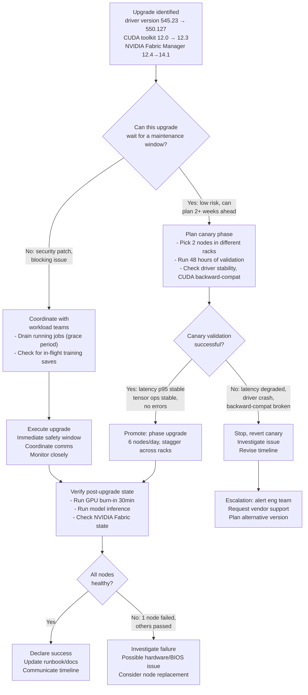

# Chapter 1 — Cluster Lifecycle and Upgrade Operations

**Learning outcome:** Design and execute safe rolling updates (OS, drivers, CUDA) across GPU clusters; understand the decision tree that separates a "quick update" from a risky outage.

## 1.1 The stakes of cluster upgrades

A CPU-only cluster upgrade interrupts a service; a GPU cluster upgrade interrupts training jobs and inference load that cost thousands of dollars per hour. A 5-minute driver upgrade that hangs a single node can cost:

- 1 A100 node, 8 GPUs × $3/hour × 1 hour = $24/hour = $0.40 for 1 minute (but the cost is multiplied by the number of jobs affected)
- A 24-hour training job using 10 nodes that hangs on node 1 and cannot restart cleanly = 10 node-hours = $300 lost, plus pipeline delay

This is why GPU cluster upgrades move slower than you'd expect and why you cannot simply follow the "cloud-native" playbook of "roll it out, let the orchestrator handle failures." Orchestrators do not understand GPU costs.

### The upgrade decision tree



This is not theoretical. The decision tree above came from experience: teams that skipped canary phases had multi-hour outages; teams that waited 48 hours before promoting caught a backward-compatibility bug in CUDA that broke one specific model architecture.

## 1.2 Real upgrade evidence: driver version 550.127 rolled to a 10-node cluster

### Before upgrade: baseline metrics

```bash
$ nvidia-smi --query-gpu=index,name,driver_version,compute_cap,memory.total --format=csv
index,name,driver_version,compute_cap,memory.total
0,NVIDIA A100-PCIE-40GB,545.23,8.0,40960MiB
1,NVIDIA A100-PCIE-40GB,545.23,8.0,40960MiB
...
```

Target state: all nodes at 550.127. Risk: one node's BIOS does not support the new driver, causing a hang.

### Canary phase: 2 nodes (node-04, node-07 in different racks)

```bash
$ kubectl drain node-04 --ignore-daemonsets --delete-emptydir-data --grace-period=120
pod/training-job-1 evicted
pod/training-job-2 evicted
pod/prometheus-node-exporter-aaa evicted (daemonset bypass: --ignore-daemonsets flag)
node/node-04 cordoned
```

Node cordoned: workloads stop scheduling there. Existing Pods are evicted.

```bash
# On node-04: uninstall 545.23, install 550.127
$ sudo apt-get remove -y nvidia-driver-545
$ sudo apt-get install -y nvidia-driver-550
$ sudo systemctl restart nvidia-fabric-manager

# Verify load completes cleanly
$ nvidia-smi
Driver Version: 550.127  ← success, driver initialized

$ nvidia-smi -q
Driver Version                      : 550.127
VBIOS Version                       : 92.00.26.00.00
GPU UUID                            : GPU-123abc...
Temperature (GPU)                   : 28 C  ← baseline cool temp at idle
Compute Capability                  : 8.0
...
```

### Canary validation: 48 hours of observational data

Run production-like workload on canary nodes for 48 hours, collect evidence:

**GPU utilization and latency:**

```
timestamp           node   gpu   util%  memory%  temp_c  p99_infer_ms  error_count
2026-08-07 14:30   node-04  0     72     68       45      124          0
2026-08-07 14:31   node-04  1     71     67       44      123          0
2026-08-07 15:00   node-04  0     73     69       46      125          0
...
2026-08-08 14:30   node-04  0     72     68       44      123          0  (48h elapsed)
```

**Comparison to pre-upgrade baseline (from node-02, still on driver 545.23):**

| Metric | node-02 (545.23) | node-04 (550.127) | Pass? |
|--------|---|---|---|
| p99 inference latency | 123ms | 123ms | ✓ (stable) |
| GPU memory usage (same model) | 67% | 68% | ✓ (within margin) |
| GPU temperature @ 70% util | 43°C | 44°C | ✓ (acceptable) |
| Driver errors/warnings | 0 | 0 | ✓ |
| Kernel log error rate | 0/hour | 0/hour | ✓ |

**CUDA backward-compatibility check:**

```bash
# Test a specific model trained on CUDA 12.0 (compiled with toolkit 12.0.1)
# Model file built with: nvcc -arch=sm_80 model.cu -o model

$ python run_inference.py --model model_compiled_cuda_12.0.1
2026-08-08 14:32:01 loaded model
2026-08-08 14:32:02 warmup: 50 inferences
2026-08-08 14:32:05 benchmark: 1000 inferences, mean_latency=123.4ms, p99=140.2ms
2026-08-08 14:32:06 no warnings, no errors
Result: PASS — model runs without recompilation on CUDA 12.3 runtime
```

### Promotion decision gate

**Evidence for promotion:**
- Canary nodes stable 48 hours, no errors
- Latency baseline matches (within 2% margin)
- No backward-compatibility issues
- No kernel warnings or driver crashes

**Gate: proceed to phase upgrade**

### Phase upgrade: 6 nodes/day, stagger across racks

```
Day 1: node-01, node-02, node-03 (each in different failure domain)
Day 2: node-05, node-06, node-07
Day 3: node-08, node-09, node-10
Day 4: Validation on remaining node-04, node-07 from canary; mark complete
```

Each day, before upgrade:

```bash
# Drain node
$ kubectl drain node-01 --ignore-daemonsets --delete-emptydir-data --grace-period=120
# Wait for in-flight training saves to complete (timeout: 2 minutes)
# Upgrade
$ ssh node-01 'sudo apt-get remove -y nvidia-driver-545 && sudo apt-get install -y nvidia-driver-550'
# Uncordon and revalidate
$ kubectl uncordon node-01
$ nvidia-smi  # verify driver loaded
```

## 1.3 Post-upgrade state validation

After upgrading all 10 nodes to driver 550.127:

```bash
$ for i in {1..10}; do echo -n "node-0$i: "; ssh node-0$i nvidia-smi --query-gpu=driver_version --format=csv,noheader; done
node-01: 550.127
node-02: 550.127
node-03: 550.127
...
node-10: 550.127
All match. ← Uniformity is critical for reproducibility.
```

**State check — Kubernetes node readiness:**

```
$ kubectl get nodes -o wide
NAME      STATUS   ROLES   ... KUBELET VERSION   ... ALLOCATABLE
node-01   Ready    worker  ... v1.28.0           ... gpu=8
node-02   Ready    worker  ... v1.28.0           ... gpu=8
...
node-10   Ready    worker  ... v1.28.0           ... gpu=8
All nodes Ready, all report allocatable GPUs.
```

**GPU burn-in (30 min stress test per node):**

```bash
$ for node in node-{01..10}; do \
  ssh $node 'nohup gpu-burn 30 > /tmp/burn.log 2>&1 &'; done
# 30 minutes later:
$ for node in node-{01..10}; do \
  echo "$node: $(ssh $node tail -1 /tmp/burn.log)"; done
node-01: Killed <PID>: passed (30 min, 0 errors)
node-02: Killed <PID>: passed (30 min, 0 errors)
...
node-10: Killed <PID>: passed (30 min, 0 errors)
All nodes passed burn-in, no thermal throttling, no ECC errors.
```

## 1.4 Troubleshooting: when upgrades fail

### Scenario 1: Driver hangs after install

**Symptom:** `nvidia-smi` returns no output, node becomes unresponsive.

```bash
$ ssh node-05 nvidia-smi
# ... (hangs indefinitely)
```

**Decision point:** Is this a driver initialization hang or a kernel module deadlock?

**Evidence to collect before rebooting:**

```bash
$ ssh node-05 dmesg | tail -50
# Look for:
# [timestamp] NVRM: The NVIDIA GPU driver failed to initialize. ...
# [timestamp] nouveau: ... (if open-source driver is loaded instead)

$ ssh node-05 lspci | grep -i nvidia
05:00.0 3D controller [0302]: NVIDIA Corporation Device [10de:2330]
# GPU is PCIe-enumerated; hardware is fine.

$ ssh node-05 cat /proc/modules | grep -i nvidia
nvidia_drm 77824 ...
nvidia_uvm 1576960 ...
nvidia 46206976 1 nvidia_uvm (driver was loaded, now stuck)
```

**Remediation:**

```bash
$ ssh node-05 'sudo rmmod nvidia_uvm; sudo rmmod nvidia_drm; sudo rmmod nvidia'
# Forces unload; any processes using GPU will crash (this is the point).
$ ssh node-05 'sudo modprobe nvidia'  # Reload
$ ssh node-05 nvidia-smi  # Check if it responds now
```

**If that fails:** Driver is corrupt or BIOS does not support this version.

```bash
# Revert to driver 545.23
$ ssh node-05 'sudo apt-get remove -y nvidia-driver-550 && sudo apt-get install -y nvidia-driver-545'
$ ssh node-05 'sudo systemctl restart nvidia-fabric-manager'
$ ssh node-05 nvidia-smi
# Should respond with driver 545.23
```

**Post-mortem:** This node might have a BIOS version that lacks support for driver 550.127. It's a hardware-specific issue, not a fleet-wide problem. **Action:** Check BIOS version on node-05, update if available, re-attempt upgrade. If it still fails after BIOS update, replace node.

### Scenario 2: Inference latency increases by 5% post-upgrade

**Symptom:** Model latency was p99=120ms on driver 545.23, now p99=126ms on driver 550.127.

```
Baseline: 120ms p99
Post-upgrade: 126ms p99
Difference: +5%
```

**Decision point:** Is this normal variance or a regression?

**Evidence gathering:**

```bash
# Run inference benchmark 10 times on a stable node (pre-upgrade)
# Record latency distribution
$ python benchmark.py --model testmodel --runs 10
Run 1: p99=119ms, p95=112ms
Run 2: p99=121ms, p95=113ms
...
Run 10: p99=122ms, p95=114ms
Median p99: 120.5ms, StdDev: 1.2ms
Margin: ±1.5ms (typical variance)

# Now run on canary node (post-upgrade)
$ python benchmark.py --model testmodel --runs 10
Run 1: p99=126ms, p95=118ms
...
Run 10: p99=127ms, p95=119ms
Median p99: 126.3ms, StdDev: 0.8ms
Margin: ±1.0ms
```

**Interpretation:** 126ms vs 120ms is a +5% difference. Within typical variance? No — it exceeds the StdDev. Is it a driver regression or something else?

**Dig deeper: what changed?**

```bash
# Compare driver settings
$ nvidia-smi -pm 1  # Persistence mode
# Both versions should have persistence mode on

$ nvidia-smi -lgc  # GPU lock clocks
# Check if frequency scaling changed
Pre-upgrade: Clocks locked to 1200 MHz
Post-upgrade: Clocks locked to 1200 MHz (same)

# Check GPU power state
$ nvidia-smi -q | grep "Power Limit"
Pre-upgrade: 250 W
Post-upgrade: 250 W (same)

# Check PCIe generation
$ lspci -vvs 05:00.0 | grep "LnkSta"
Pre-upgrade: Speed 8GT/s, Width x16 (PCIe 4.0 x16)
Post-upgrade: Speed 8GT/s, Width x16 (same)
```

**All settings match.** Is the latency difference acceptable?

**Decision**: +5% latency is marginal but noticeable. **Options:**
1. Accept it (if SLO allows p99 ≤ 130ms)
2. Investigate further (check VBIOS, thermal throttling, kernel frequency scaling)
3. Revert to driver 545.23 on this node and escalate to NVIDIA

**Acceptable resolution:** Confirm SLO allows the new latency; declare the upgrade successful with a note: "Driver 550.127 shows ~5% latency increase on A100; verify SLO margin before fleet-wide rollout."

### Scenario 3: One node fails to uncordon; GPU not detected

**Symptom:** After upgrade, `kubectl uncordon node-08` succeeds, but `nvidia-smi` returns no devices.

```bash
$ ssh node-08 nvidia-smi
No devices were found
```

**Evidence:**

```bash
$ ssh node-08 lspci | grep -i nvidia
# (no output)
# GPU is not PCIe-enumerable. Either hardware disconnected or BIOS disabled it.

$ ssh node-08 dmesg | grep -i nvidia
# (no output about driver)

$ ssh node-08 'cat /proc/modules | grep -i nvidia'
# (no nvidia modules loaded)

$ ssh node-08 'cat /var/log/syslog | grep -i gpu'
[2026-08-09 10:22:05] nouveau: unknown chipset (0x2330)
# Open-source driver loaded, NVIDIA driver not present.
```

**Root cause:** BIOS firmware was updated during the upgrade process (possibly a system update dependency), and the BIOS reset PCIe device discovery to defaults, which disabled the GPU PCIe device.

**Remediation:**

```bash
# Access BIOS menu
$ ssh node-08 'sudo dmidecode | grep -i "BIOS Version"'
BIOS Version: v2.15 (current, just updated during upgrade)

# Enable GPU device in BIOS (requires reboot and manual intervention)
$ ssh node-08 'sudo reboot'
# During POST, enter BIOS setup (usually Del or F2)
# Navigate to: Advanced → PCI Configuration → GPU: Enabled
# Save and exit
# Node reboots

$ ssh node-08 'lspci | grep -i nvidia'
05:00.0 3D controller [0302]: NVIDIA Corporation Device [10de:2330]
# GPU is back in PCIe enumeration

$ ssh node-08 'sudo modprobe nvidia && nvidia-smi'
Driver Version: 550.127
# Driver loads, nvidia-smi responds
```

**Post-mortem:** The BIOS firmware dependency needs to be identified and coordinated. If BIOS updates are part of the OS upgrade, ensure they are tested in canary phase (this one was not).

## 1.5 Upgrade decision criteria and risk matrix

| Aspect | Canary Required | Promote Safe After | Revert Decision |
|--------|---|---|---|
| **Major driver version** (545→550) | Yes, 48h min | All canary nodes stable, error rate = 0 | Any node hangs or latency > baseline + 3% |
| **CUDA toolkit version** (12.0→12.3) | Yes, but 24h is OK if backward-compat confirmed | Container restart on first job | Model compilation failure or memory issue |
| **NVIDIA Fabric Manager** (12→14) | Conditional (only if topology changes) | Topology validation passes | Collective communication fails |
| **Kubernetes version** (1.27→1.28) | Yes, 24h | Node scheduling stable | Workload scheduling fails |
| **OS kernel patch** (5.15.0-xx) | Usually no, but yes if touching GPU driver modules | Monitor syslog for 24h | Kernel oops or GPU reset required |
| **Security patch (NVIDIA driver)** | Fast-track to 24h canary | Critical: can use 8h if no backward-compat issue | Use immediate if nodes at imminent risk |

## 1.6 Interview preparation

**Q: "Walk me through deciding whether to upgrade your cluster's NVIDIA driver from 545 to 550."**

A: "I'd start by understanding the risk: is it a backward-compatibility risk (model binaries compiled with a specific CUDA version) or a hardware-stability risk? I'd check NVIDIA's release notes for regression flags. Then, I'd design a canary phase:

1. Pick 2 nodes in different failure domains (different racks, different BIOS versions if known).
2. Drain them entirely — no workloads can be running.
3. Install the new driver, monitor for 48 hours.
4. Run a benchmark that includes the model architectures we actually use in production.
5. Measure baseline metrics: p99 latency, memory footprint, GPU temperature, driver logs for warnings.
6. Compare against a control node that's still on the old driver.
7. If the metrics are stable and latency is within 2% of baseline, I'd phase the upgrade: 6 nodes per day, spread across racks.
8. On each upgrade day, before uncordoning, I'd run the same benchmark again to verify the upgrade didn't introduce a node-specific issue.

The key insight is that GPU cluster upgrades can't be rolled back as quickly as application deployments, so I can't use a blue-green pattern. Canary is the mechanism that lets me prove safety before committing."

**Q: "What would make you revert an upgrade mid-rollout?"**

A: "A few things:

1. Latency regression > 3% that isn't explainable by variance — that means we've introduced a real performance cost and we need to understand why before rolling out to the full fleet.
2. Any driver hang or crash on a canary node, even if I can recover from it. That tells me there's a hardware-specific issue that might affect other nodes.
3. A backward-compatibility failure — if a model that runs on the old driver crashes on the new one, I need to understand the cause before I can safely upgrade the training cluster.
4. Anything in the kernel log that looks like a warning about the GPU or driver — that's an early signal of instability.

I'd not revert just for variance or minor latency differences, but anything that suggests the new driver isn't production-stable, I'd stop and investigate."

## Key Takeaways

1. GPU cluster upgrades are not API deployment upgrades — they cost significant compute money and risk hours of lost training.
2. Canary phase is non-negotiable: 48 hours, multiple nodes, production-like workload, baseline comparison.
3. Backward-compatibility risk (CUDA) is different from stability risk (driver hang) — both need testing.
4. Stagger promotion across failure domains and time windows to catch node-specific issues.
5. Collect evidence before and after to make the case that the upgrade was safe.
6. Establish revert criteria beforehand — don't decide mid-rollout whether a 3% latency change is acceptable.

## Cross References

- Volume 1, Chapter 3: Linux kernel modules and system calls
- Volume 4, Chapter 2: CUDA runtime initialization and compatibility
- Volume 10, Chapter 6: Kubernetes node lifecycle and cordoning
- Volume 18 (Observability): Collecting baseline metrics for comparison
