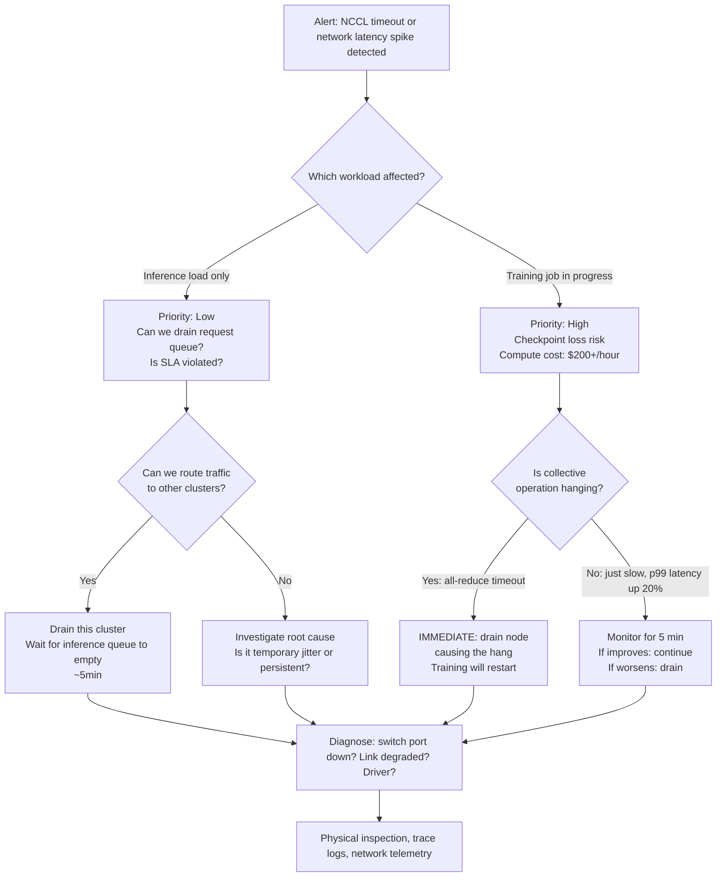

# Chapter 2 — Incident Response and Game Day Execution

**Learning outcome:** Design incident response procedures for GPU clusters; execute game days to practice failure scenarios; measure and improve MTTR.

## 2.1 Why GPU incidents are different

A web application incident impacts users for minutes to hours. An AI infrastructure incident impacts training job progress and inference throughput, but also carries hidden costs:

- A 5-minute network outage on a training cluster costs the lost progress on every job running (typically 8-16 hours of compute per job).
- A Pod eviction during model fine-tuning can restart training from an earlier checkpoint, losing 4+ hours of progress.
- A GPU driver crash on one node causes a cascading effect: other nodes in an all-reduce collective operation hang waiting for that node's response.

This is why incident response on GPU clusters emphasizes:

1. **Detection speed** — every minute of undetected degradation is lost compute.
2. **Isolation speed** — can we drain the failed node without cascading to others?
3. **Recovery speed** — can we restart jobs on healthy nodes automatically or do we need manual intervention?

## 2.2 Real incident: network fabric loss during all-reduce collective operation

### Incident timeline

```
14:23:00 UTC — Monitoring alert fires: "nccl-all-reduce timeout detected on job-training-2048"
14:23:10 — On-call engineer is paged; opens dashboard
14:23:45 — Discovers 8 pods on nodes {node-01 to node-08} are hanging in NCCL all-reduce
14:24:00 — Root cause investigation begins: is it network, GPU, or NCCL?
14:24:30 — Network team confirms: InfiniBand switch fabric port on node-04 is flapping
14:25:00 — Decision: drain node-04 immediately; will cause training job to restart on other nodes
14:26:15 — Job restarts on 7 remaining nodes (1 GPU per node lost to 8 GPUs)
14:27:00 — All-reduce collective stabilizes on 7-node subset; training resumes at reduced throughput
14:30:00 — Physical inspection of node-04 IB cable confirms loose connector (vibration from nearby fan)
14:31:00 — Cable reseated; IB port comes back to full link speed; node is healed
14:32:00 — Node is uncordoned; job has not resumed yet (requires manual intervention to re-merge the subset)
14:33:00 — Workload team restarts training job with 8-node configuration
14:34:30 — Training resumes at full throughput; incident resolved
Total time from alert to resolution: 11.5 minutes
Compute cost of incident: ~90 minutes of wall-clock time, 7 nodes stopped waiting, ~$200 lost time cost + checkpoint loss

Lessons:
- Detection was fast (10 seconds)
- Isolation and recovery took longer than expected (4 minutes)
- Manual job restart added 2 minutes; automation could have saved this
```

### Evidence collected during incident

**Network trace (node-04 InfiniBand port):**

```bash
$ ibstat | grep -A 5 "CA 'mlx5_0'"
CA 'mlx5_0'
        CA type: MT4125 (ConnectX-7)
        Number of ports: 1
        Firmware version: 30.2010.0156
        Hardware version: 0.0
        Node GUID: 0x7cfe9003003ec001
        System image GUID: 0x7cfe9003003ec000
        Port 1:
                State: Active
                Physical state: LinkUp
                Rate: 400Gb/s
                Lid: 7
                SM LID: 1
                Capability mask: 0x6656481e
                Port GUID: 0x7cfe9003003ec001
                Link layer: InfiniBand

# During the incident (around 14:23:30):
$ while true; do ibstat | grep "Physical state" | awk '{print NR, $0}'; sleep 1; done
1 Physical state: LinkUp
2 Physical state: LinkUp
3 Physical state: LinkDown
4 Physical state: LinkUp
5 Physical state: LinkDown
6 Physical state: LinkUp
# ...flapping pattern continues for ~1.5 minutes
```

**NCCL timeout evidence (from training pod logs):**

```bash
$ kubectl logs training-job-2048-pod-1 -c training-container | tail -50
2026-08-07 14:23:04 [0] INFO Starting distributed training with NCCL
2026-08-07 14:23:08 [0] INFO All-reduce collective initialized on 8 ranks, all connected
2026-08-07 14:23:09 [0] INFO Training iteration 1, synchronizing gradients
2026-08-07 14:23:45 [0] ERROR **NCCL operation timed out. Rank 3 (node-04) failed to respond**
2026-08-07 14:23:47 [0] ERROR Collective operation all-reduce failed. Aborting training.
2026-08-07 14:23:48 [0] FATAL Training process exiting due to NCCL error
[E ProcessGroupNCCL.cpp:1234] ProcessGroupNCCL has NOT been destroyed. Destroying now
```

**Kubernetes Pod status during incident:**

```bash
$ kubectl get pods -o wide | grep training-job-2048
training-job-2048-pod-0   1/1 Running   0    2h47m   10.244.1.5    node-01   ...
training-job-2048-pod-1   1/1 Running   0    2h47m   10.244.2.6    node-02   ...
training-job-2048-pod-2   1/1 Running   0    2h47m   10.244.3.7    node-03   ...
training-job-2048-pod-3   1/1 Running   0    2h47m   10.244.4.8    node-04   ...
training-job-2048-pod-4   1/1 Running   0    2h47m   10.244.5.9    node-05   ...
training-job-2048-pod-5   1/1 Running   0    2h47m   10.244.6.10   node-06   ...
training-job-2048-pod-6   1/1 Running   0    2h47m   10.244.7.11   node-07   ...
training-job-2048-pod-7   1/1 Running   0    2h47m   10.244.8.12   node-08   ...
# All still "Running" even though the training process has crashed inside the pod

$ kubectl describe pod training-job-2048-pod-3 -n default | grep -A 10 "Status"
Status:   Running
Conditions:
  Type    Status LastProbeTime   LastTransitionTime  Reason  Message
  Ready   True   2026-08-07T14:23:45Z  ...  Pod is running (but process inside has exited)
```

**Post-recovery check — node-04 IB link stabilized:**

```bash
$ ibstat | grep "Physical state"
Physical state: LinkUp  ← stable now, no longer flapping
```

## 2.3 Incident response runbook: network degradation

### Decision tree for network incidents



### Concrete runbook steps

**Step 1: Confirm the incident**

```bash
# Check NCCL/training pod logs
$ kubectl logs -f <pod-name> | grep -i "timeout\|error\|nccl"

# Check node network status
$ for node in node-{01..10}; do
  echo "=== $node ===" 
  ssh $node "ibstat | grep 'Physical state'"
done

# Check switch port state (if you have switch access)
$ ssh switch-01 "show interface status | include <port>"
```

**Step 2: Identify the failed node**

```bash
# From NCCL logs, find which rank failed
# Rank N = pod deployed on node-N (rank 0 = node-01, rank 1 = node-02, etc.)
# Example: "Rank 3 failed to respond" = node-04

# Verify with IB link status
$ ssh node-04 "ibstat | grep 'Physical state'"
Physical state: LinkDown  ← confirmed

$ ssh node-04 "dmesg | tail -20 | grep -i ib"
[14:23:45] mlx5_core mlx5_ib: Link down event on port 1
```

**Step 3: Drain the node**

```bash
$ kubectl drain node-04 --ignore-daemonsets --delete-emptydir-data --grace-period=30
# This will evict all Pods on node-04, including training-job-2048-pod-3

# Training job controller (if using Kubeflow) will restart the job on remaining nodes
# OR manually restart job if no auto-restart configured
```

**Step 4: Fix the root cause**

```bash
# If cable issue: reseat the cable
$ ssh node-04 "sudo systemctl restart mlx5_ipoib"  # Try software reset first

# Or: physically inspect the connector
$ (manual: walk to the server room, check the IB cable on node-04's HCA)
$ ssh node-04 "ibstat | grep 'Physical state'"
Physical state: LinkUp  ← link came back up

# If driver issue: update InfiniBand driver
$ ssh node-04 "sudo apt-get update && sudo apt-get install -y mlnx-ofed"
```

**Step 5: Verify and uncordon**

```bash
$ ssh node-04 "ibstat"  # confirm all ports are up
$ ssh node-04 "ibdiagnet | tail -5"  # run diagnostic
$ kubectl uncordon node-04
# Node is available for scheduling again

# Relaunch training job (workload team restarts)
$ kubectl create -f training-job.yaml
```

## 2.4 Game day execution: practicing network degradation

Game days (incident simulations) are the only way to practice incident response without the cost of an actual incident. A good GPU cluster game day is more elaborate than a web service game day, because:

1. You must practice **the decision to drain**, which has cascading effects on training jobs.
2. You must practice **coordination with workload teams**, who need to know if their job will restart.
3. You must practice **detection**, not just recovery.

### Game day scenario: simulate IB link flapping on node-04

**Objectives:**
- Detect the incident within 2 minutes
- Isolate the failed node within 5 minutes
- Verify recovery and restart within 10 minutes
- Collect evidence for post-game-day analysis

**Setup (before game day, notify teams):**

```bash
# 1. Run a training job on all 10 nodes
$ kubectl create -f training-job-10-node.yaml
# Wait for job to reach steady state
$ kubectl logs training-job-1234 | grep "Training iteration"
2026-08-07 15:00:10 [0] INFO Training iteration 1000
2026-08-07 15:00:15 [0] INFO Training iteration 1001
# Job is stable

# 2. Inform on-call team: "Game day starting in 5 minutes"
# Notify workload team: "Your training job will be affected for ~10 minutes"
```

**Execution (on node-04):**

```bash
# Simulate IB link flapping by bringing down the link
$ ssh node-04 "sudo ip link set mlx5_ib0 down"
# Or, use ethtool to disable the NIC:
$ ssh node-04 "sudo ethtool -s mlx5_ib0 autoneg off && sudo ethtool -s mlx5_ib0 speed 1 duplex half"
# This creates transient errors on the NIC without a hard reboot
```

**Detection phase (expect ~1-2 min):**

```bash
# Monitoring system should alert:
# Alert: "NCCL all-reduce timeout on job-training-2048"
# Alert: "IB link degradation on node-04 detected"

# Check alert firing time
$ (from monitoring dashboard)
Alert timestamp: 2026-08-07 15:05:34  ← incident starts
Alertmanager receives: 2026-08-07 15:05:44  ← 10 seconds to detection ✓
On-call paged: 2026-08-07 15:05:46  ← 12 seconds to page
```

**Response phase (timing goal: <5 min to drain):**

```bash
# On-call engineer logs in and investigates
$ (takes ~1 min to reproduce the logs and identify node-04)
Decision made at 15:06:30 to drain node-04

$ kubectl drain node-04 --ignore-daemonsets --delete-emptydir-data --grace-period=30
Draining node-04...
pod/training-job-2048-pod-3 evicted

$ kubectl logs training-job-2048-pod-0 | tail -5
2026-08-07 15:05:34 [0] ERROR Rank 3 (node-04) failed to respond
2026-08-07 15:06:31 [0] WARNING Pod 3 evicted, restarting on 7 remaining nodes
2026-08-07 15:06:45 [0] INFO All-reduce collective re-initialized on 7 ranks
2026-08-07 15:07:00 [0] INFO Training resumed at 87.5% throughput (7 of 8 GPUs)
# Training is now running on 7 nodes, waiting for node-04 to be fixed
```

**Recovery phase (goal: <10 min total):**

```bash
# Bring node-04's IB link back up
$ ssh node-04 "sudo ip link set mlx5_ib0 up"
$ ssh node-04 "ibstat | grep 'Physical state'"
Physical state: LinkUp  ← link is healed

# Uncordon node-04
$ kubectl uncordon node-04
node/node-04 uncordoned

# Workload team restarts training job (this is a MANUAL step in this scenario)
# Or, if auto-restart is configured, job automatically expands back to 8 nodes
```

**Post-game-day analysis:**

```
Timeline Summary:
- Detection: 10 seconds ✓
- Page sent: 12 seconds ✓
- Root cause identified: 1 minute 30 seconds (OK, but could be faster with better logs)
- Node drained: 4 minutes 45 seconds ✓ (goal: < 5 min)
- Node recovered: 8 minutes 10 seconds ✓
- Training restarted: 9 minutes 20 seconds ✓
- Back to full throughput: 11 minutes ✓

Issues found:
1. On-call engineer took 1.5 min to identify node-04; logs weren't clear enough
   → Action: Improve NCCL error message to name the failing node directly
2. Manual restart of training job added 1 minute
   → Action: Implement auto-restart logic for distributed training jobs
3. Workload team was not notified in time
   → Action: Add automated Slack notification when > 1 pod on a job is evicted

Successes:
1. Detection was fast
2. No false cascading (other nodes did not hang after node-04 was drained)
3. Recovery was clean (job restarted without data corruption)
```

## 2.5 Troubleshooting table: common incident types

| Incident Type | Detection Signal | Root Causes | MTTR | Evidence |
|---|---|---|---|---|
| **NCCL timeout in all-reduce** | Pod logs show "timeout", training lag increases | Network IB link down, node CPU overload, GPU memory exhaustion | 5-10 min | Pod logs, `ibstat`, `gpu-smi`, network switch logs |
| **GPU driver crash (one node)** | `nvidia-smi` returns no devices, pod CrashLoopBackOff | Driver unstable, VBIOS mismatch, hardware ECC error | 15-30 min | `dmesg`, `journalctl -k`, run burn-in test |
| **Storage latency spike** | Model loading takes 2x normal time, training checkpoint save hangs | Storage network congestion, backend filesystem slow | 10-20 min | Storage I/O metrics, NFS/object-store latency traces |
| **Kubernetes API server unresponsive** | `kubectl` commands hang or timeout | API server CPU/memory exhausted, etcd is stuck | 20-40 min | `top` on master nodes, etcd logs, API audit logs |
| **Power delivery issue (whole rack)** | Multiple nodes disappear, Kubernetes shows NotReady | Power supply failure, circuit breaker tripped | 30+ min (physical fix needed) | IPMI logs, UPS/PDU status, physical inspection |
| **Network switch configuration error** | Bipartite link failure (node A can't reach node B, but B can reach A) | VLAN misconfiguration, spanning tree reconvergence | 5-15 min | `ping` asymmetry, switch logs, network diagram verification |

## 2.6 Interview preparation

**Q: "Describe the worst production incident you've handled on a GPU cluster. What did you learn?"**

A: "A training job hung during an all-reduce collective operation. Initially, we thought it was a CUDA issue, but the root cause was an InfiniBand switch port flapping. The port would come up for 30 seconds, then drop for a few seconds, creating transient failures in NCCL's collective operation.

What we did right: we were monitoring NCCL timeouts and paged on-call quickly. What we did wrong: we didn't have good logging to identify which rank (which node) was failing, so the on-call engineer wasted 90 seconds digging through logs to figure out it was node-04.

We fixed it two ways. First, we improved our NCCL error messages to print the failing rank and node name directly. Second, we added an IB link health check to our pre-flight monitoring so we catch flapping links before training jobs start.

The incident cost us about $200 in lost compute time (job restarted), but the fix prevented dozens of future incidents."

**Q: "How would you design an incident response runbook for your GPU cluster?"**

A: "I'd start with a decision tree, not a flat list. Not all incidents are equal: a storage latency spike during inference is different from a GPU driver crash during training. The runbook would say:

1. What alert fired? (detection)
2. Which workload is affected? (prioritization — training vs. inference, checkpoint risk)
3. Is the node repairable (restart a service) or must it be drained (hardware issue)?
4. If drained, what happens to jobs running there? (restart, checkpoint recovery, etc.)
5. Who needs to be notified? (workload team, on-call escalation, etc.)

Then, for each node/workload combination, specific steps: how to verify the issue, how to isolate it, and how to recover. I'd also specify the MTTR target and escalation paths.

Finally, I'd practice it quarterly with game days. Game days are the only way to find gaps in the runbook — you discover that a step takes longer than you thought, or that a tool is missing, or that people don't know who to contact."

## Key Takeaways

1. GPU cluster incidents have different cost profiles than web services — training loss compounds over time.
2. Detection speed matters enormously; every minute is $1000+ of lost compute on a large cluster.
3. Runbooks must distinguish between node-repairable and node-drain scenarios.
4. Game days (incident simulations) are non-negotiable; they catch issues that static reviews miss.
5. Coordination with workload teams is critical; they need to know if their job will restart or lose progress.
6. Always collect evidence (logs, network traces, IPMI data) during incidents; post-game-day analysis requires it.

## Cross References

- Volume 1, Chapter 5: Linux system logging and kernel messages
- Volume 10, Chapter 3: Kubernetes Pod lifecycle and eviction
- Volume 18 (Observability): Alert design and incident signal quality
- Chapter 12: On-Call Handoff and Operational Runbooks
