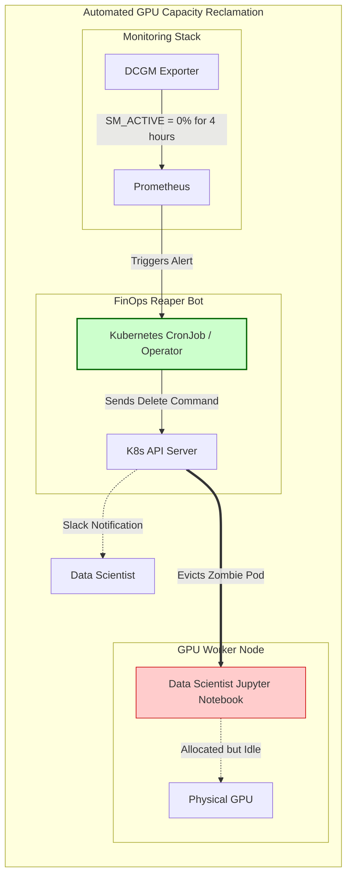

# Chapter 3 — Capacity Planning and Forecasting

| Chapter metadata | Value |
|---|---|
| Volume | 19 — AI SRE and Operations |
| Difficulty | Advanced |
| Estimated reading time | 30 minutes |
| Primary audience | FinOps, Platform Leads, Capacity Planners |
| Core question | If the data science team asks for 500 new H100 GPUs, how do you mathematically prove they only actually need 50? |

## Introduction

In the cloud era, engineers are used to infinite, instant elasticity. If you need 100 more CPUs, you click a button in AWS, and they appear in seconds. 

GPU infrastructure does not work this way. 
Whether on-premises or in the cloud, high-end GPUs (like H100s or B200s) are scarce, incredibly expensive, and subject to massive supply chain delays. If you need 500 GPUs, you might have to wait 6 months for delivery.

A Senior Architect must execute rigorous **Capacity Planning**. You must forecast exactly how much compute the business will need 6 to 12 months in the future, balancing the risk of under-provisioning (stalling the business) against the risk of over-provisioning (wasting tens of millions of dollars).

## Beginner's Primer: The Empty Hotel

Imagine you manage a very expensive hotel. You look at your booking system, and 100% of the rooms are reserved. People are waiting outside, demanding rooms. You panic and tell the owner to spend $10 Million to build a new wing.

But before you build, you physically walk down the hallway and open the doors. 
You find that 80% of the rooms are completely empty. The guests paid for them, dropped their bags off, and never came back. 

This is exactly what happens in AI clusters. 
A Data Scientist writes a Kubernetes Pod requesting `nvidia.com/gpu: 1`. Kubernetes gives them the GPU (Booking the room). The Data Scientist runs a 5-minute training job, but forgets to delete the Pod. The Pod sits there for 3 weeks, doing absolutely zero math, but holding the GPU hostage. 

Kubernetes says the cluster is 100% full (Allocated). 
The physical silicon (DCGM) says it is 0% busy (Utilized). 

FinOps (Financial Operations) in AI is the practice of building automated "Reaper" bots that scan the physical silicon metrics (DCGM), find these empty hotel rooms, and automatically kick the data scientists out so other people can use the hardware. 

## 1. The Fallacy of Linear Forecasting

If your user base doubles, your AI infrastructure does not necessarily double. 

**The Economies of Scale (Batching):**
If an inference API goes from 10 requests per second to 20 requests per second, you rarely need twice as many GPUs. Thanks to **Dynamic Batching** (Volume 12), the Triton Inference Server will simply group those extra 10 requests into the existing CUDA kernels. The GPU utilization might only increase from 40% to 55%. 

**The Diseconomies of Scale (Context Windows):**
Conversely, if your user base stays exactly the same, but the product team launches a new feature allowing users to upload 100-page PDFs instead of 1-page PDFs, your infrastructure will collapse. As discussed in Volume 12, the KV Cache memory requirements scale linearly with sequence length. Your GPUs will OOM crash immediately, requiring a massive expansion in VRAM capacity despite zero growth in actual user counts.

## 2. The Three-Tier Capacity Model

To forecast accurately, SREs divide capacity into three distinct tiers:

1.  **Baseline (Reserved / On-Prem):** The absolute minimum capacity required to serve the steady-state, 24/7 inference traffic, plus the baseline R&D workloads. This should be purchased via long-term cloud reserved instances (1-3 years) or built on-premises to achieve massive cost savings (often 60%+ cheaper than on-demand).
2.  **Burst (On-Demand Cloud):** The capacity required for Black Friday traffic spikes or massive, infrequent training runs. You pay a premium for cloud on-demand elasticity, but you only pay for the exact hours you use it. 
3.  **Spot / Preemptible (The Scavenger Tier):** Excess cloud capacity sold at a massive discount (often 70% off), but the cloud provider can kill the instance with 2 minutes of warning. Perfect for resilient, fault-tolerant batch jobs (like asynchronous data processing) or highly checkpointed training jobs.

## 3. FinOps: Ruthless De-Allocation

Capacity planning is not just about buying hardware; it is about reclaiming wasted hardware.

**The Zombie Pod Problem:**
Data scientists routinely spin up Jupyter notebooks requesting a full GPU, run a script for 10 minutes, and leave for the weekend. The GPU sits at 0% utilization but 100% allocation. 

*Architectural Mandate:* You must implement an automated FinOps reaper. Deploy a Kubernetes operator that continuously queries DCGM metrics. If a pod holds a GPU but `DCGM_FI_PROF_SM_ACTIVE` remains below 5% for 4 hours, the operator automatically kills the pod, freeing the $30,000 piece of hardware back to the scheduling pool, and sends an automated Slack message to the user.

## Customer Scenario (Senior Level)

**The Situation:**
A SaaS company hosts a generative AI tool. The AI team demands a budget of $5 Million to purchase 16 new HGX H100 servers. They justify this by showing a Datadog dashboard where the Kubernetes cluster's `nvidia.com/gpu` allocation metric has been pegged at 98% for three weeks. They claim they are completely out of capacity. The CFO asks the platform architect to validate the request.

**The Senior Architect Response:**
"We will reject the $5 Million hardware request. The cluster is not out of capacity; it is suffering from catastrophic resource fragmentation and hoarding. 

The AI team is confusing Kubernetes *Allocation* with Silicon *Utilization*. 

I analyzed the **DCGM Exporter** metrics across the cluster for the last 30 days. While 98% of the GPUs are locked by Kubernetes Pods, the actual mathematical utilization of the Streaming Multiprocessors (`DCGM_FI_PROF_SM_ACTIVE`) averages only 12%. We are sitting on an ocean of idle compute.

The root cause is a lack of Multi-Tenancy strategy. The AI team is assigning full, unpartitioned 80GB GPUs to lightweight development and staging workloads that only require 5GB of VRAM and tiny amounts of compute. 

Before we spend a single dollar on new hardware, we will immediately implement **GPU Sharing**. We will utilize the GPU Operator to configure **Multi-Instance GPU (MIG)** on the staging nodes, slicing the physical GPUs into `1g.10gb` profiles, and we will implement **Time-Slicing** for the developer Jupyter notebooks. 

This simple software reconfiguration will instantly multiply our usable cluster capacity by 7x, easily absorbing all current and projected workloads for the next 12 months using the hardware we already own."

## Interview Preparation

**Conceptual:** Why is buying GPU capacity in the cloud using standard 'On-Demand' pricing usually a terrible financial strategy for steady-state AI inference? *(Hint: On-Demand pricing charges a massive premium for flexibility. Steady-state inference workloads run 24/7. By committing to Reserved Instances (1 or 3-year contracts) or moving the steady-state baseline to on-premises bare-metal, organizations can reduce their hardware costs by 50% to 70%, reserving On-Demand solely for unpredictable, bursty traffic).*

**Architecture:** How does an automated FinOps 'Reaper' operator identify zombie workloads? *(Hint: It cannot use Kubernetes API metrics, because zombie pods are fully 'allocated' and look healthy to Kubernetes. The reaper must query the deep hardware metrics from the DCGM Exporter (e.g., SM Activity or Tensor Core utilization). If the physical hardware registers near-zero math execution for an extended period, the reaper mathematically proves the workload is idle and automatically terminates it).*

## Architecture Summary

AI Capacity Planning requires navigating extreme hardware costs and long supply-chain lead times. Senior Architects must divorce "Kubernetes Allocation" from "Silicon Utilization." By implementing strict GPU Sharing techniques (MIG/Time-Slicing) and deploying automated "Reaper" bots that terminate idle pods based on raw DCGM hardware metrics, platform teams can reclaim massive amounts of stranded capacity before resorting to buying new hardware.

