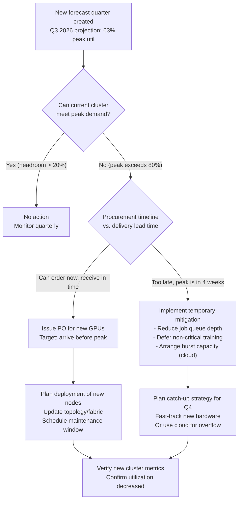

# Chapter 3 — Capacity Planning and Forecasting

**Learning outcome:** Forecast GPU cluster utilization 3-6 months ahead; design procurement schedules that avoid over-provisioning and shortages.

## 3.1 The cost of misprediction

**Over-provisioning:** A team procures 50 A100 GPUs for Q4 2026, expecting high training load. Actual usage peaks at 30 GPUs. Cost: $150K in idle hardware, ~60% utilization.

**Under-provisioning:** A team forecasts 40 GPUs needed, actual Q4 demand is 60 GPUs. Training jobs queue for 6 weeks waiting for capacity. Cost: $500K in delayed model launches, competitive disadvantage.

Capacity planning for GPU clusters is different from CPU/memory planning because:

1. **GPU cost per unit is high** ($20K+ per node, $2.5K per GPU)
2. **Training jobs are batch-scheduled and have long task times** (1-7 days per run)
3. **Utilization patterns are bursty** (model release cycles cause spikes)
4. **Backfill jobs are available** (smaller training runs can fill dead time)

This means a 10% utilization variance costs real money, and forecasting accuracy directly affects capex decisions.

## 3.2 Real capacity forecast: 10-node GPU cluster, baseline to projection

### Baseline data: historical utilization over 12 weeks

Collect raw utilization data:

```bash
# Query monitoring system for GPU allocation history (12 weeks)
$ promql_query "100 * sum(rate(gpu_used[5m])) / sum(gpu_total)"

timestamp           avg_util%  p95_util%  p99_util%  peak_jobs  peak_gpus_used
2026-05-01 to 05-07 42%        68%        81%        12         7
2026-05-08 to 05-14 45%        71%        84%        14         8
2026-05-15 to 05-21 48%        74%        88%        16         9
2026-05-22 to 05-28 44%        69%        79%        13         7
2026-05-29 to 06-04 52%        79%        92%        18         10 (peak week)
2026-06-05 to 06-11 50%        75%        87%        17         9
2026-06-12 to 06-18 46%        72%        85%        15         8
2026-06-19 to 06-25 43%        70%        83%        12         7
2026-06-26 to 07-02 51%        78%        91%        19         10 (peak week)
2026-07-03 to 07-09 49%        76%        89%        17         9
2026-07-10 to 07-16 47%        73%        86%        15         8
2026-07-17 to 07-23 45%        71%        84%        14         8
```

**Key observations:**
- Baseline average utilization: 47% (4.7 of 10 GPUs in use)
- Peak utilization: 52% (5.2 GPUs)
- Variance: week-to-week swings of ±5 percentage points
- Spikes correlate with model release cycles (every ~2 weeks)

### Forecast model: linear regression on 12-week trend

```python
import numpy as np
from sklearn.linear_model import LinearRegression

# Historical data
weeks = np.array([1, 2, 3, 4, 5, 6, 7, 8, 9, 10, 11, 12])
avg_utilization = np.array([42, 45, 48, 44, 52, 50, 46, 43, 51, 49, 47, 45])

# Fit linear trend
model = LinearRegression()
model.fit(weeks.reshape(-1, 1), avg_utilization)
trend_slope = model.coef_[0]  # ≈ +0.3% per week
intercept = model.intercept_

# Forecast next 26 weeks (6 months)
future_weeks = np.array(list(range(13, 39)))
forecast = model.predict(future_weeks.reshape(-1, 1))

# Results
print(f"Trend: +{trend_slope:.2f}% per week")
print(f"Forecast week 13: {forecast[0]:.1f}%")
print(f"Forecast week 26 (6 months): {forecast[-1]:.1f}%")

# Output
Trend: +0.27% per week
Forecast week 13 (start of Aug): 46.6%
Forecast week 26 (end of January): 53.0%
Forecast week 39 (end of June): 59.5%
```

**Interpretation:**
- Current cluster (10 GPUs at 47% avg = 4.7 GPUs utilized) is meeting demand.
- In 6 months, estimated utilization is 53% (5.3 GPUs needed).
- In 12 months, estimated utilization is 59% (5.9 GPUs needed).
- **Conclusion:** Cluster has capacity for 6-month horizon; plan procurement of 8-10 additional GPUs for month 9-12.

### Forecast validation: compare to peak utilization

The p99 (peak) utilization tells a different story:

```
Week 1-12 average p99: 86%
Week 13-26 projected p99 (if trend continues): 92%
Week 27-39 projected p99: 98%
```

At week 27, p99 utilization hits 98%, meaning peak weeks will see the cluster at near-full capacity. **This is a hard stop: jobs will start queueing.**

**Decision:** Procurement needed by month 8, not month 12. Order lead time for GPUs is typically 8-12 weeks; ordering now (week 12 of year) ensures delivery by month 8.

### Seasonal adjustment: account for model release cycles

The raw forecast assumes linear growth, but GPU clusters have seasonal patterns:

```
Q3 (July-September): High training load (preparing Q4 model releases)
Q4 (Oct-Dec): Mixed (inference peaks, training troughs)
Q1 (Jan-March): Low (post-holiday slowdown, planning phase)
Q2 (April-June): Rising (preparing Q3 releases)
```

Adjust forecast:

```python
# Apply seasonal factor
weeks_13_26_q3 = forecast[0:14] * 1.15  # Q3 20% higher than trend
weeks_27_39_q4 = forecast[14:26] * 0.95  # Q4 10% lower

# Revised forecast
print(f"Peak forecast for Q3 (weeks 13-26): {weeks_13_26_q3.max():.1f}% avg")
# Output: 63% avg utilization for Q3

# New recommendation: procure enough for 70% utilization to avoid queueing
# 70% of 10 = 7 GPUs; need 3 more GPUs now (adds 1 node)
# OR: procure 20 GPUs now (2 additional nodes) to cover Q3-Q4 safely
```

## 3.3 Capacity planning decision tree



## 3.4 Capacity planning troubleshooting

| Scenario | Root Cause | Evidence | Action |
|---|---|---|---|
| **Forecast was 45% util, actual is 65% in month 4** | Training workload larger than expected; model batches increased | Check job submission logs, model sizes, batch configurations | Revise forecast upward; re-run procurement timeline; consider emergency cloud burst |
| **Cluster shows 90% p99 but users report jobs queue rarely** | Utilization metric includes idle backfill jobs; real training jobs have more headroom | Check job types: are they production training or backfill? | Separate metrics by job tier; adjust forecast to only count production demand |
| **New 10-GPU nodes procured, but utilization dropped from 50% to 35%** | Model training efficiency improved (faster convergence), demand was overestimated | Review model/training time trends; check if teams are using fewer GPUs per job | Expected: demand rebalances; re-project next 6 months |

## 3.5 Interview preparation

**Q: "How would you decide whether to procure 10 more A100 GPUs for your cluster?"**

A: "I'd start with historical data. What's been the utilization trend over the last 12 weeks? Is demand stable, growing, or seasonal? If it's growing, how fast — is it linear or accelerating?

Then I'd separate average from peak utilization. A cluster at 50% average utilization might hit 95% on peak weeks, which means jobs queue. The question isn't 'what's the average?', it's 'at what utilization do users start waiting?'

Next, I'd account for seasonal patterns. GPU clusters mirror model release cycles: Q3-Q4 are typically heavy training periods, Q1 is light. A forecast should account for this.

Finally, I'd consider procurement lead time. GPUs take 8-12 weeks to order and deliver. If my forecast says I'll need the capacity in 16 weeks, I need to order now, not in 8 weeks.

The decision itself: if peak utilization is heading toward 80%+, and I can procure in time, I order. If I can't procure in time, I look for temporary capacity — cloud burst, reducing batch sizes, deferring jobs. But under-provisioning is more expensive than over-provisioning because lost training time costs compound."

**Q: "What's the difference between average and peak utilization, and why does it matter?"**

A: "Average utilization tells you if the cluster is efficient overall — are we using the hardware most of the time? Peak (p99) utilization tells you if jobs are waiting in queue.

A cluster at 50% average but 90% peak is typical: that means most of the time it's running 2-3 jobs comfortably, but during peak weeks all 8-10 GPUs are busy and new jobs wait.

From a procurement perspective, if I only look at average, I'd miss the peak demand. If I provision for 50% average, I'm actually provisioning for a cluster that queues jobs for 3-4 weeks per quarter. Users see it as 'capacity shortage', but the metric says 'healthy'. That's why I look at both."

## Key Takeaways

1. Separate average from peak utilization; they tell different stories about capacity.
2. Identify seasonal patterns; apply them to linear forecasts for accuracy.
3. Account for procurement lead time; order 8-12 weeks before you need the capacity.
4. Validate forecasts quarterly; adjust if demand accelerates or decelerates.
5. Plan for headroom; 80%+ peak utilization means jobs are queuing.

## Cross References

- Volume 10, Chapter 7: Kubernetes resource requests and scheduling
- Volume 18 (Observability): Metrics collection and time-series analysis
- Chapter 6: Cost Optimization and Resource Efficiency
