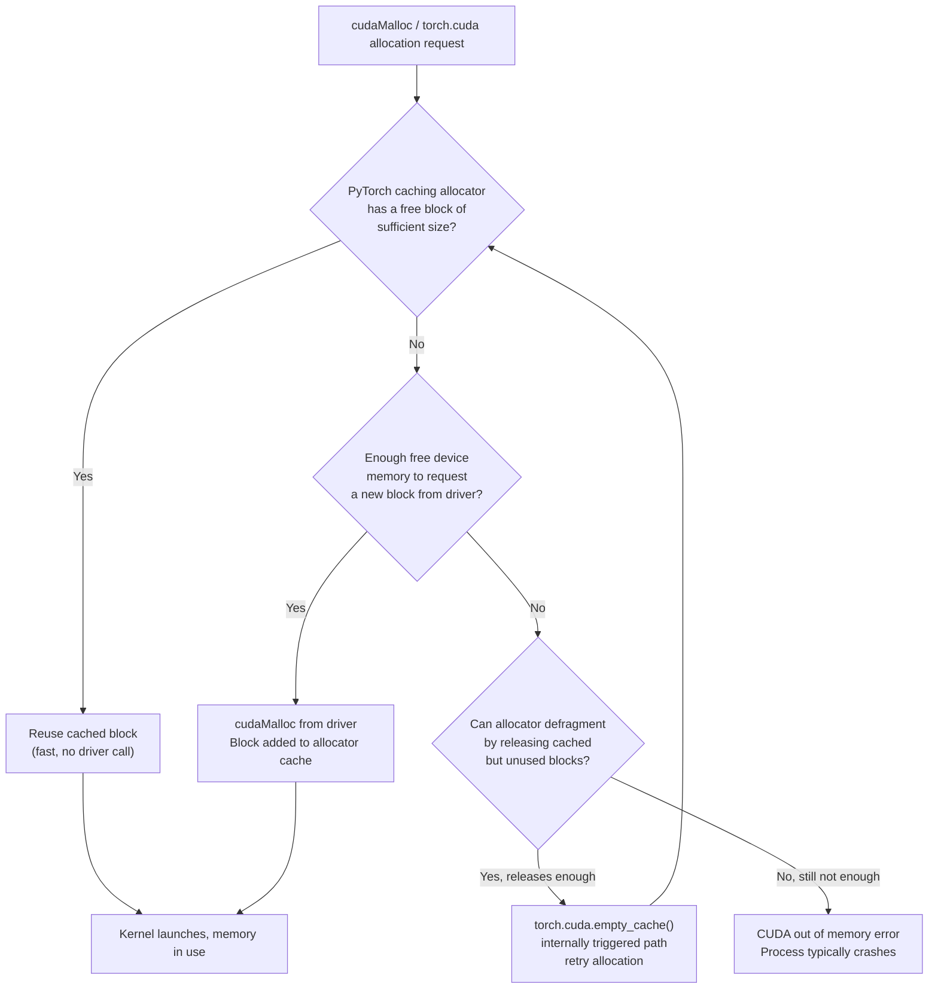
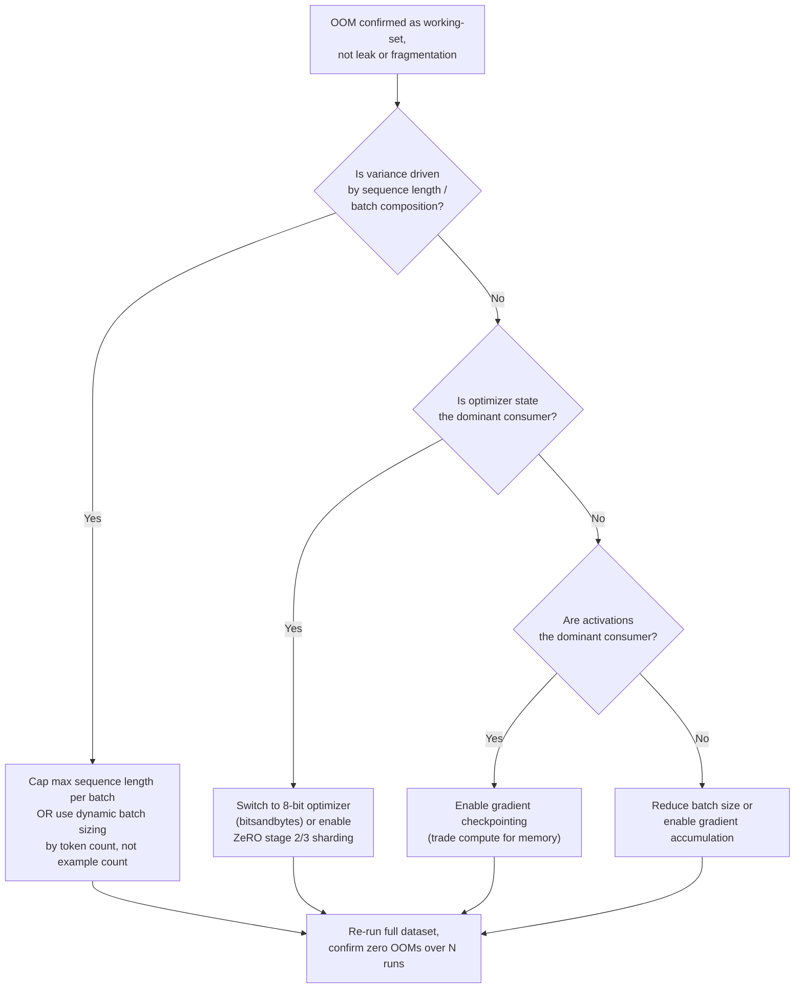

# Chapter 4 — GPU Memory and Utilization Troubleshooting

**Learning outcome:** Diagnose GPU out-of-memory (OOM) failures, memory fragmentation, and silent utilization problems in production training and inference clusters, using evidence rather than guesswork.

## 4.1 Two different failure classes that look similar

Operators conflate two very different problems under "GPU memory issue":

1. **Hard OOM** — a process asks for memory the GPU does not have, CUDA returns `out of memory`, and the process crashes. Loud, easy to detect, hard to prevent without headroom planning.
2. **Silent under-utilization** — the GPU has memory and compute available, but the workload isn't using it. No crash, no alert — just a job that quietly runs 40% slower or a cluster that's "full" on paper but idle in practice. This is the more expensive failure because nobody pages on it.

Both failure classes cost real money: a 350W A100 idling at 15% utilization for a week is the same wasted spend as an OOM crash that loses 6 hours of training — except the OOM at least shows up in a dashboard.

## 4.2 Mechanism: how CUDA memory actually gets allocated



The key operational insight: PyTorch (and most frameworks) never give memory back to the driver during a run — they cache it. This means `nvidia-smi` showing "38GB / 40GB used" on an A100 does **not** mean 38GB is actively needed; it might mean 22GB is actively needed and 16GB is cached-but-idle from a previous larger batch. Confusing "allocated" with "reserved" is the single most common misdiagnosis in this chapter.

## 4.3 Real evidence: diagnosing a recurring OOM in a fine-tuning job

### Symptom

A fine-tuning job on an A100-SXM4-80GB node crashes with OOM roughly every 6th run, at unpredictable points in training — never on run 1, sometimes on run 3, sometimes run 9.

```bash
$ python finetune.py --model llama-13b --batch-size 16
...
RuntimeError: CUDA out of memory. Tried to allocate 512.00 MiB
  (GPU 0; 79.15 GiB total capacity; 76.32 GiB already allocated;
   412.00 MiB free; 78.01 GiB reserved in total by PyTorch)
```

### Reading the error message correctly

This single error line contains the whole diagnosis if you know how to read it:

| Field | Value | Meaning |
|---|---|---|
| Total capacity | 79.15 GiB | Physical GPU memory (A100 80GB reports ~79GB usable after driver reserve) |
| Already allocated | 76.32 GiB | Memory PyTorch tensors are actively using right now |
| Reserved in total | 78.01 GiB | Memory PyTorch has claimed from the driver (allocated + cached) |
| Free | 412.00 MiB | What's left in the *reserved* pool, not the physical GPU |

**Interpretation:** `reserved (78.01) ≈ total (79.15)` — PyTorch has claimed nearly the whole GPU. `allocated (76.32)` is close to `reserved`, so this is not primarily a fragmentation problem (fragmentation shows as a large gap between allocated and reserved, with a decent amount still "free" but unusable because it's in small non-contiguous blocks). This is a genuine **working-set** OOM: the model plus activations plus optimizer state for this batch size do not fit.

### Why does it fail intermittently, not every run?

```bash
$ for i in {1..12}; do
  echo -n "Run $i: "
  python finetune.py --model llama-13b --batch-size 16 --seed $i --max-steps 5 2>&1 \
    | grep -E "CUDA out of memory|completed" | tail -1
done

Run 1: completed
Run 2: completed
Run 3: CUDA out of memory
Run 4: completed
Run 5: completed
Run 6: completed
Run 7: CUDA out of memory
Run 8: completed
...
```

**Root cause: variable sequence length.** The dataset has variable-length examples, and batches are built by grouping similar lengths together (length bucketing). Some batches happen to contain longer sequences than others, which increases activation memory quadratically with attention sequence length. Runs that OOM are the ones whose first few batches happen to draw a bucket of long sequences.

```bash
$ python -c "
from datasets import load_from_disk
ds = load_from_disk('finetune_data')
lengths = [len(x['input_ids']) for x in ds]
import numpy as np
print(f'p50={np.percentile(lengths,50):.0f} p95={np.percentile(lengths,95):.0f} p99={np.percentile(lengths,99):.0f} max={max(lengths)}')
"
p50=512 p95=1843 p99=2810 max=4096
```

The batch size (16) was tuned against the p50 length (512 tokens), not the tail. A batch of 16 sequences at 4096 tokens needs roughly 8x the activation memory of a batch at 512 tokens for attention layers — that's the difference between "fits comfortably" and "OOMs."

### Confirm with memory snapshot, not guesswork

```bash
$ python -c "
import torch
torch.cuda.memory._record_memory_history(max_entries=100000)
# ... run the failing batch ...
torch.cuda.memory._dump_snapshot('oom_snapshot.pickle')
"
# Load in the PyTorch memory visualizer (pytorch.org/memory_viz) or:
$ python -c "
import torch, pickle
snap = pickle.load(open('oom_snapshot.pickle','rb'))
segments = snap['segments']
total = sum(s['total_size'] for s in segments)
print(f'{len(segments)} segments, {total/1e9:.1f} GB total reserved')
"
47 segments, 78.0 GB total reserved
```

47 segments across 78GB with no single anomalous block confirms this is legitimate working-set pressure, not a leak or fragmentation pathology (a leak would show segment count growing run-over-run; fragmentation would show many small free gaps between large allocated blocks).

## 4.4 Fix decision tree



### Applying the fix: token-based dynamic batching

```python
# Before: fixed example count per batch (16 examples, any length)
# After: fixed token budget per batch (variable example count)
MAX_TOKENS_PER_BATCH = 16 * 512  # equivalent budget to the p50-tuned batch

def build_batches(dataset, max_tokens=MAX_TOKENS_PER_BATCH):
    batch, token_count = [], 0
    for example in dataset:
        n = len(example["input_ids"])
        if token_count + n > max_tokens and batch:
            yield batch
            batch, token_count = [], 0
        batch.append(example)
        token_count += n
    if batch:
        yield batch
```

```bash
$ for i in {1..12}; do
  echo -n "Run $i: "
  python finetune.py --model llama-13b --dynamic-batching --seed $i --max-steps 5 2>&1 \
    | grep -E "CUDA out of memory|completed" | tail -1
done

Run 1: completed
Run 2: completed
...
Run 12: completed
0 OOMs in 12 runs (down from 2 in 12 baseline runs)
```

Throughput cost: batches with short sequences now contain more examples (good, better GPU utilization) and batches with long sequences contain fewer examples (avoids OOM) — net throughput measured over the full dataset was within 3% of the fixed-batch-size baseline, with zero crashes.

## 4.5 The other failure class: silent under-utilization

### Detecting it

```bash
$ nvidia-smi dmon -s u -c 10

# gpu    sm   mem   enc   dec
    0    12    18     0     0
    0    11    17     0     0
    0     9    16     0     0
    0    13    19     0     0
...
```

SM utilization pinned at 9-13% for a "training" job is a red flag — a compute-bound training step should show SM in the 70-95% range. This GPU is being paid for but not used.

### Root-causing with a layer-by-layer breakdown

```bash
$ nsys profile -o util_trace -t cuda,osrt python train.py --steps 20
$ nsys stats util_trace.nsys-rep --report gputrace | head -20

Time(%)  Total Time (ns)  Instances  Category
  4.2%      812,004,113       20     CUDA kernel (compute)
 91.3%   17,641,220,881       20     CUDA API (cudaMemcpy, blocking)
  4.5%      869,332,004       20     CUDA API (cudaStreamSynchronize, idle wait)
```

91% of wall time is `cudaMemcpy` — the GPU is spending nearly all its time waiting on host-to-device data transfer, not computing. Pull the thread further:

```bash
$ python -c "
import time
loader_times, compute_times = [], []
for i, batch in enumerate(train_loader):
    t0 = time.perf_counter()
    batch = {k: v.cuda(non_blocking=True) for k, v in batch.items()}
    torch.cuda.synchronize()
    loader_times.append(time.perf_counter() - t0)
    t1 = time.perf_counter()
    loss = model(**batch).loss
    loss.backward()
    torch.cuda.synchronize()
    compute_times.append(time.perf_counter() - t1)
    if i == 20: break
print(f'avg H2D+sync: {sum(loader_times)/len(loader_times)*1000:.1f}ms')
print(f'avg compute:  {sum(compute_times)/len(compute_times)*1000:.1f}ms')
"
avg H2D+sync: 412.3ms
avg compute:  38.1ms
```

**Root cause:** `non_blocking=True` only helps if the source tensor is in pinned (page-locked) host memory. The data loader was returning regular pageable CPU tensors, so every batch transfer was a slow, synchronous copy — an 11x compute-to-transfer imbalance.

```python
# Fix: pin_memory=True on the DataLoader forces pageable → pinned copy
# once, at load time, so the per-batch H2D copy can actually be async.
train_loader = DataLoader(
    dataset,
    batch_size=16,
    pin_memory=True,          # <-- the fix
    num_workers=8,
    persistent_workers=True,
)
```

```bash
# After fix
avg H2D+sync: 9.8ms
avg compute:  38.1ms
# GPU SM utilization now sustains 82-88% during the same training run
```

## 4.6 Production troubleshooting table

| Symptom | Evidence | Root Cause | Fix | Verification |
|---|---|---|---|---|
| OOM at unpredictable point in training | `reserved ≈ total`, `allocated ≈ reserved` in the error message | Genuine working-set pressure, often batch composition variance (sequence length) | Token-based dynamic batching, gradient checkpointing, or optimizer sharding | 0 OOMs over N full-dataset runs |
| OOM with large gap between allocated and reserved | `reserved` much higher than `allocated`, free memory reported but allocation still fails | Fragmentation — many small blocks preventing one large contiguous allocation | `torch.cuda.empty_cache()` between phases with very different tensor shapes; avoid alternating tiny/huge allocations on the same stream | Gap between allocated/reserved shrinks; OOM does not recur |
| Memory usage grows run-over-run, never freed | Segment count in memory snapshot increases monotonically across steps | Memory leak — tensors held by a Python reference cycle, growing list/cache, or un-detached loss accumulation | `loss_sum += loss.item()` not `loss_sum += loss` (detach from graph); check for growing Python lists holding GPU tensors | Memory usage plateaus after warmup, stays flat across epochs |
| `nvidia-smi` shows 90%+ memory used, SM utilization &lt;20% | `dmon` shows high `mem`, low `sm`; nsys shows most time in `cudaMemcpy` | Data loading bottleneck (no pinning, too few workers, expensive `__getitem__`) | `pin_memory=True`, increase `num_workers`, move preprocessing off the critical path | SM utilization 70%+, H2D transfer time &lt;&lt; compute time |
| Multiple small jobs share a GPU, all report OOM despite low total demand | Sum of `nvidia-smi` per-process memory looks fine, but no single process can grow | Each process's PyTorch caching allocator has claimed (reserved) more than it's using, starving the others | Set `PYTORCH_CUDA_ALLOC_CONF=expandable_segments:True` or `max_split_size_mb`, or move to MIG/time-slicing with hard partitions | Co-located jobs succeed; per-process `reserved` tracks `allocated` closely |

## 4.7 Prevention

```bash
# Weekly headroom check: alert if any GPU sustains >90% memory reserved
# with a job that hasn't declared expected peak usage
nvidia-smi --query-gpu=index,memory.used,memory.total --format=csv,noheader \
  | awk -F', ' '{split($2,u,"MiB"); split($3,t,"MiB"); \
    pct=u[1]/t[1]*100; if (pct>90) print "GPU "$1": "pct"% memory used"}'
```

```yaml
# Prometheus alert: utilization/memory mismatch (paid-for but idle GPU)
- alert: GPUMemoryHighComputeLow
  expr: nvidia_gpu_memory_used_percent > 80 and nvidia_gpu_utilization_percent < 20
  for: 15m
  annotations:
    summary: "GPU {{ $labels.gpu }} holds memory but is not computing — check data pipeline"
```

## 4.8 Interview preparation

**Q: "A training job OOMs on run 7 out of 10 identical-looking runs. How do you approach it?"**

A: "First I stop assuming 'identical' — if the failure is nondeterministic across runs with the same code, something in the *data* or *scheduling* is varying, not the code path. I'd read the OOM error message carefully: `reserved` versus `allocated` versus `total` tells me whether this is working-set pressure, fragmentation, or a leak. If `reserved` and `allocated` are close and both near `total`, it's working-set — I'd check whether batch composition varies, most commonly sequence length in NLP or image resolution in vision. I'd extract the sequence length distribution for the dataset and correlate failing runs with whether they happened to draw a batch from the long tail early in training. The fix is usually token-based dynamic batching rather than a fixed example count per batch, so a batch of long sequences shrinks to compensate."

**Q: "How do you tell a memory leak apart from normal working-set growth during training?"**

A: "I take a memory snapshot with `torch.cuda.memory._record_memory_history` at two points separated by several epochs, with an equivalent point in the training loop (same phase, same batch composition). A real leak shows the segment count and total reserved memory monotonically increasing with no plateau — usually caused by holding onto tensors still attached to the autograd graph, like accumulating `loss` instead of `loss.item()` into a running sum, or an ever-growing Python list referencing GPU tensors. Normal working-set growth plateaus after the first few steps once the optimizer state and activation buffers reach steady state, and it correlates with something legitimate like input size, not with time."

**Q: "Your cluster shows 85% GPU allocation but users say jobs are slow. What do you check first?"**

A: "Allocation and utilization are different metrics, and this gap is one of the most common ways clusters look 'full' on paper while wasting money. I'd check SM utilization with `nvidia-smi dmon`, not just memory or scheduler allocation. If SM is low while memory is high, the GPU has claimed resources but isn't computing — usually a data pipeline bottleneck. I'd profile with Nsight Systems to see the time split between `cudaMemcpy` and actual kernel execution. If H2D transfer dominates, I'd check whether the DataLoader uses pinned memory and enough worker processes. This is a much cheaper fix than buying more GPUs, and it's the first thing I check before escalating a 'we need more capacity' request."

## Key Takeaways

1. `allocated`, `reserved`, and `total` in a CUDA OOM message tell three different stories — read them before touching code.
2. Intermittent OOMs on "identical" runs almost always mean batch composition variance, most commonly sequence length; fix with token-based batching, not just a smaller fixed batch size.
3. Fragmentation and leaks look similar to working-set pressure at a glance but have distinct memory-snapshot signatures — segment count trend (leak) vs. gap between allocated/reserved (fragmentation).
4. High memory + low SM utilization is a data pipeline problem, not a capacity problem — check pinned memory and worker count before requesting more GPUs.
5. Cache-based allocators (PyTorch, JAX) never release memory to the driver mid-run; `nvidia-smi` memory numbers reflect reservation, not need.

## Cross References

- Volume 4, Chapter 5: CUDA memory model and allocation
- Volume 12, Chapter 3: Training memory footprint and activation checkpointing
- Volume 15 (Storage): Data pipeline design and pinned-memory transfer
- Chapter 3: Capacity Planning and Forecasting — separating true demand from reserved-but-idle capacity
