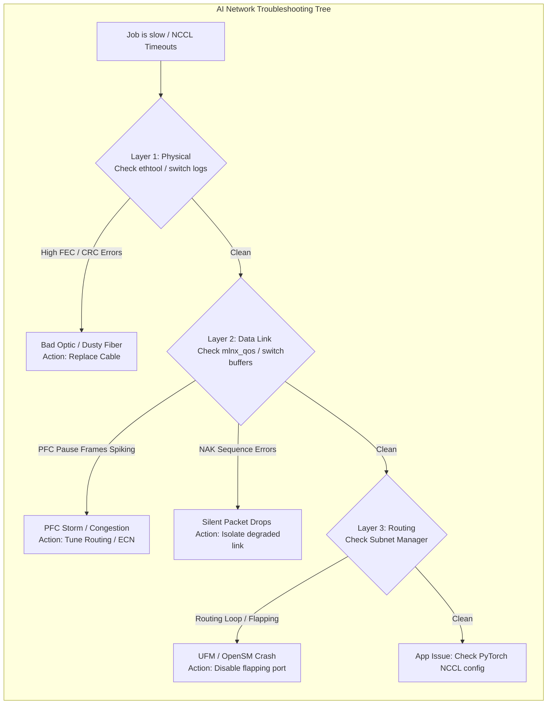

# Chapter 5 — Network Reliability and Fabric Validation

| Chapter metadata | Value |
|---|---|
| Volume | 19 — AI SRE and Operations |
| Difficulty | Expert |
| Estimated reading time | 30 minutes |
| Primary audience | Network Architects, AI Platform Leads |
| Core question | If `ping` works perfectly, why is the distributed training job completely deadlocked across the InfiniBand switches? |

## Introduction

In standard enterprise networks, if `ping` works and TCP packets are flowing, the network is declared healthy. 

In AI clusters, `ping` is a useless diagnostic tool. 
Distributed training relies on NCCL, RDMA, and lossless fabrics (InfiniBand or RoCEv2). If an optical transceiver is slightly degraded, it won't drop a ping packet, but it will drop 1 out of every 10,000 RDMA packets. 

In a standard TCP network, that dropped packet causes a 1-millisecond retransmission delay. In a synchronous `AllReduce` training ring spanning 1,000 GPUs, that single dropped packet causes the entire supercomputer to pause, wait for a hardware timeout, and execute a Go-Back-N retransmission. The cluster's performance will collapse by 80%, with zero obvious errors on the application dashboard.

A Senior SRE must debug the physical layer, the data link layer, and the routing layer simultaneously.

## Beginner's Primer: The Broken Walkie-Talkie

Imagine a team of 1,000 construction workers building a skyscraper. They must all act in perfect synchrony. They use walkie-talkies (The Network) to coordinate.

If a worker's walkie-talkie battery dies, it's easy to fix. The worker yells "I'm offline!" and the manager replaces it. (A dead network cable).

But what if the walkie-talkie is just *slightly* broken? Every 10th word the worker hears is static. The worker constantly has to reply: *"What did you say? Repeat that."* (A dropped packet causing a Go-Back-N Retransmission). 

Because the entire 1,000-person team has to wait for this one worker to hear the instructions clearly before they can lift the steel beam together, the entire construction site grinds to a halt. 

In AI networks (InfiniBand or RoCEv2), a degraded fiber optic cable (a broken walkie-talkie) is the most dangerous failure mode possible. The link stays green. The monitoring dashboard says "Healthy." But the microsecond-level static (FEC errors or NAKs) forces the entire 1,000-GPU cluster to crawl. This chapter explains how to use low-level switch metrics to hunt down that one degraded cable.

## 1. Layer 1: The Optical Degradation

Data center networks use complex fiber optic transceivers. These lasers degrade over time.

When a transceiver starts dying, it begins flipping bits. The switch hardware detects this and uses Forward Error Correction (FEC) to fix it. 
*   **The Symptom:** The link stays 'UP'. The ping succeeds. But the latency is destroyed because the hardware is constantly executing FEC math.
*   **The Diagnostic:** You must log into the InfiniBand or Spectrum switches and check the port error counters. Specifically, look for `SymbolErrors` and `LinkDownedCounters`. If a specific port has millions of symbol errors, the optic is dying. You must physically replace the cable/transceiver.

## 2. Layer 2: The Congestion Nightmare (PFC Storms)

As extensively covered in Volume 9, RoCEv2 Ethernet relies on Priority Flow Control (PFC) to prevent packet loss. 

If you configure the buffer thresholds incorrectly, the network will experience a **PFC Storm**. 
Switch A tells Switch B to pause. Switch B tells Switch C to pause. 
*   **The Symptom:** All links are 'UP'. The optical transceivers are perfect. But the network throughput drops to 0 GB/s. 
*   **The Diagnostic:** Check the ConnectX NIC telemetry (`ethtool -S`) for `rx_pause_ctrl`. Check the switch dashboards for PFC Pause frames generated. If these counters are skyrocketing, you do not have a hardware failure; you have a QoS configuration failure or an application causing massive, unmanaged Incast microbursts.

## 3. Layer 3: Routing and Subnet Management

In InfiniBand, routing is not handled by standard BGP. It is handled by the **Subnet Manager (OpenSM)**.

The Subnet Manager calculates the optimal path for every packet across the entire topology. If you reboot a spine switch, the Subnet Manager must quickly recalculate all the routes (a Heavy Sweep).
*   **The Symptom:** NCCL timeouts. The job crashes. 
*   **The Diagnostic:** Check the OpenSM logs. If the fabric has a "routing loop" or an unstable link that is constantly "flapping" (going up and down every few seconds), the Subnet Manager will get stuck in an endless loop of recalculating routes. The fabric will freeze. You must identify the flapping link via the logs and physically disable that port to stabilize the Subnet Manager.

## Customer Scenario (Senior Level)

**The Situation:**
A massive 128-node cluster uses RoCEv2 over 400G Ethernet. The cluster has been stable for months. Suddenly, all multi-node training jobs begin failing randomly with `NCCL WARN Call to epoll_wait failed`. The network team checks the core switches; CPU usage is low, links are up, and there are no PFC storms. They blame a recent PyTorch version update.

**The Senior Architect Response:**
"The PyTorch update is a coincidence. The `epoll_wait` timeout is the definitive signature of a silent RDMA packet drop causing a hardware-level Queue Pair timeout. 

Because the network team confirmed that PFC storms are not occurring and the core switches are healthy, we are likely dealing with a **Layer 1 Physical Degradation** that is failing silently.

We must immediately bypass the high-level network dashboards and query the low-level hardware counters on the ConnectX-7 Network Interface Cards (NICs) across all 128 nodes. 

We will run `ethtool -S` and specifically filter for the `rx_roce_v2_nak_seq_err` counter. This counter tracks how many times the RDMA hardware detected a missing packet and requested a Go-Back-N retransmission. In a healthy, lossless RoCEv2 fabric, this number must be exactly zero. 

We will likely find that exactly one node (e.g., Node 84) has a skyrocketing `nak_seq_err` counter. This mathematically proves that the optical transceiver or the fiber cable attached to Node 84 is physically degraded and dropping packets. Because distributed training relies on synchronous `AllReduce` rings, this single degraded cable on Node 84 is poisoning the entire 128-node collective. We will cordon Node 84 and dispatch a technician to replace the physical optics, instantly restoring cluster stability."

## Interview Preparation

**Conceptual:** If an InfiniBand network cable is slightly damaged, why does the link usually stay 'UP' instead of completely failing? *(Hint: Modern networks use Forward Error Correction (FEC). If a cable is damaged and flips a few bits, the hardware detects the error and mathematically reconstructs the corrupted data on the fly. The link stays 'UP', but the constant error correction introduces massive latency, which can cripple a synchronous AI training job).*

**Architecture:** In a RoCEv2 network, what is the significance of the `rx_roce_v2_nak_seq_err` counter on a ConnectX NIC? *(Hint: RoCEv2 is a lossless protocol built on top of UDP. If a packet is dropped by a switch, the receiving NIC detects a gap in the sequence numbers and generates a Negative Acknowledgment (NAK) to force a retransmission. If this counter is incrementing, it proves the network is not truly lossless, and the resulting retransmission latency is likely destroying the performance of the AI workload).*

## Architecture Summary

Network reliability in an AI cluster is fundamentally different from traditional IT. Because distributed training relies on synchronous `AllReduce` rings, a single slightly degraded optical cable (causing FEC corrections) or a congested switch (causing PFC Pause frames) on Node 84 will force the other 999 GPUs to sit completely idle. SREs must proactively monitor deep hardware counters (`nak_seq_err`, `FEC uncorrectable`) to hunt down and isolate degraded links before they poison the entire cluster's MFU.

