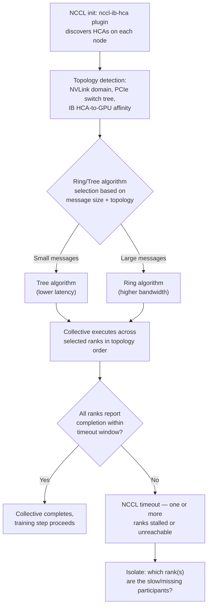
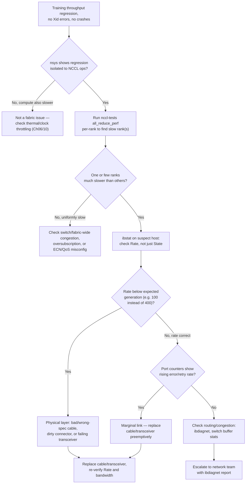

# Chapter 5 — Network Reliability and Fabric Validation

**Learning outcome:** Validate GPU-to-GPU fabric health (InfiniBand/RoCE), diagnose collective-communication slowdowns, and build the health checks that catch fabric degradation before it becomes a training incident.

## 5.1 Why fabric issues are different from node issues

A single failed GPU takes down one job. A degraded fabric link can silently slow down *every* job that happens to route through it, because NCCL collectives (all-reduce, all-gather) run at the speed of the slowest participant. A rack with one marginal IB cable doesn't crash — it just makes every large training run 15-30% slower, and because nothing crashes, nobody investigates until someone compares throughput numbers across jobs and notices one is chronically behind.

This is why fabric validation has to be **proactive** (continuous health checks) rather than purely **reactive** (wait for a job to complain), unlike most of this volume's other chapters.

## 5.2 Mechanism: how a topology-aware collective actually routes



The critical operational fact: NCCL picks its algorithm and rank ordering based on the topology it discovers *at init time*. If the topology map is wrong (a link reported healthy that isn't, or a link that changed after a cable swap), NCCL will route through it anyway — it doesn't re-validate mid-training.

## 5.3 Real evidence: diagnosing a fleet-wide 22% throughput regression

### Symptom

A 64-GPU (8-node) training job's step time increased from 1.8s to 2.2s (22% slower) after a routine rack maintenance window. No errors, no crashes, no Xid codes — just slower.

### Step 1 — confirm it's network, not compute

```bash
$ nsys profile -o step_trace -t cuda,nvtx,nccl python train.py --steps 20
$ nsys stats step_trace.nsys-rep --report nccl-sum

NCCL Operation      Count   Avg Duration   % of Step Time
AllReduce            160     284.3 ms          38.7%
AllGather              40      41.2 ms           5.6%
Broadcast               8       2.1 ms           0.3%
```

Compare against the pre-maintenance baseline captured the week before: AllReduce averaged 198.6ms then, now 284.3ms — a 43% slowdown isolated entirely to the collective, not the compute kernels (which are unchanged step-over-step). Network confirmed as the culprit.

### Step 2 — isolate which node/link

```bash
$ /opt/nccl-tests/build/all_reduce_perf -b 128M -e 128M -f 2 -g 8 \
    -w 5 --nnodes 8 --nhosts host01,host02,...,host08 2>&1 | tail -15

# rank    bandwidth (GB/s)
    0        187.2
    1        186.9
    2        188.1
    3         71.4   <- degraded
    4        187.6
    5        188.3
    6        187.0
    7        186.5

Avg bus bandwidth: 165.4 GB/s (expected: ~190 GB/s for healthy 8x NDR fabric)
```

Rank 3 (host04) is running at 38% of expected bandwidth. Every other rank is healthy, but because AllReduce is synchronous, the whole collective runs at rank 3's speed — this is why *one* degraded link produces a *fleet-wide* slowdown.

### Step 3 — confirm at the hardware layer

```bash
$ ssh host04 'ibstat mlx5_0'

CA 'mlx5_0'
    CA type: MT4129
    Number of ports: 1
    Port 1:
        State: Active
        Physical state: LinkUp
        Rate: 100                    <- expected 400 (NDR)
        Base lid: 12
        LMC: 0
```

**Root cause found:** the HCA on host04 negotiated at 100 Gb/s instead of the expected 400 Gb/s NDR rate. `LinkUp` and `Active` both report healthy — this is why a naive health check that only greps for "Active" misses this class of failure. The link is *up*, just not at the *right speed*.

```bash
$ ssh host04 'ibstatus mlx5_0 | grep -A2 rate'
    rate:                   100 Gb/sec (1X QDR)
```

The rack maintenance the week before included a cable swap. The replacement cable was rated for QDR/EDR, not NDR — physically compatible connector, wrong signaling rate, so the link trains down instead of failing outright.

### Step 4 — remediate and verify

```bash
$ ssh host04 'sudo mlxconfig -d mlx5_0 query | grep -i link_speed'
# Confirm no config-level cap; issue is physical layer, not software

# Physically replace cable with correct NDR-rated cable
$ ssh host04 'ibstat mlx5_0 | grep Rate'
        Rate: 400
# Confirmed: correct rate now negotiated

$ /opt/nccl-tests/build/all_reduce_perf -b 128M -e 128M -f 2 -g 8 --nnodes 8 2>&1 | tail -3
Avg bus bandwidth: 189.8 GB/s
# Back to expected baseline (~190 GB/s)
```

## 5.4 Diagnosis decision tree



## 5.5 Production troubleshooting table

| Symptom | Evidence | Root Cause | Fix | Verification |
|---|---|---|---|---|
| Fleet-wide throughput regression after maintenance, no errors | `nccl-tests` shows one rank at a fraction of others' bandwidth; `ibstat` shows `Active` but wrong `Rate` | Link trained down to a lower generation (wrong-spec cable, degraded transceiver) | Replace cable/transceiver with correct-generation part; re-run `ibstat` to confirm rate | `all_reduce_perf` bus bandwidth returns to baseline (±5%) |
| Intermittent NCCL timeout, not every run | `ibstat` counters show rising `port_rcv_errors` / `port_xmit_discards` over time | Marginal cable/connector — works most of the time, fails under sustained load | Preemptive cable replacement before full failure; log counter trend | Error counters flat at 0 for 7+ days post-replacement |
| All ranks uniformly slower, not one outlier | `nccl-tests` shows even degradation across all ranks | Switch-level congestion, oversubscribed uplink, or ECN/QoS misconfiguration | Check switch port utilization and buffer occupancy with `ibdiagnet`; escalate to network team if switch-level | Bandwidth uniform and at baseline across all ranks |
| NCCL picks a suboptimal algorithm after topology change | `NCCL_DEBUG=INFO` shows unexpected ring/tree choice; job restarted after a node swap | Stale topology cache or NCCL init before new hardware fully settled | Clear NCCL topology cache, restart job cleanly, verify `NCCL_DEBUG=INFO` topology dump matches physical layout | NCCL topology dump matches actual hardware; algorithm choice matches expected message-size heuristics |
| One node consistently the last to finish AllReduce across many different jobs | Cross-job correlation shows same node/rank always trailing | Persistent hardware issue on that node's HCA, not job-specific | Drain node, run `ib_write_bw`/`ib_read_bw` point-to-point test in isolation to confirm before returning to pool | Point-to-point bandwidth test matches fleet baseline before node is returned to service |

## 5.6 Prevention: continuous fabric health checks

```bash
#!/bin/bash
# Daily fabric health sweep — run outside of production job windows
# Checks link RATE (not just state) and cumulative error counters

EXPECTED_RATE=400  # NDR

for host in $(cat cluster_hosts.txt); do
  rate=$(ssh $host "ibstat mlx5_0 | grep Rate | awk '{print \$2}'")
  errors=$(ssh $host "ibstat -p mlx5_0 2>/dev/null; \
    perfquery -x \$(ibstat mlx5_0 | grep 'Base lid' | awk '{print \$3}') 1 2>/dev/null \
    | grep -E 'PortRcvErrors|SymbolErrorCounter' | awk '{print \$2}' | paste -sd+ | bc")

  if [[ "$rate" -lt "$EXPECTED_RATE" ]]; then
    echo "ALERT: $host HCA rate degraded: ${rate} Gb/s (expected ${EXPECTED_RATE})"
  fi
  if [[ -n "$errors" && "$errors" -gt 0 ]]; then
    echo "WARNING: $host cumulative port errors: $errors"
  fi
done
```

```yaml
# Prometheus alert: NCCL collective time trending up week-over-week
# (catches gradual fabric degradation, not just outright failure)
- alert: NCCLCollectiveSlowdown
  expr: avg_over_time(nccl_allreduce_duration_ms[1d]) > 1.2 * avg_over_time(nccl_allreduce_duration_ms[7d] offset 7d)
  for: 30m
  annotations:
    summary: "AllReduce duration up >20% week-over-week — check fabric health before compute"

- alert: IBLinkRateDegraded
  expr: ib_port_rate_gbps < ib_port_rate_expected_gbps
  for: 5m
  annotations:
    summary: "{{ $labels.host }} HCA {{ $labels.hca }} link rate below expected generation"
```

**Post-maintenance validation gate:** any rack that had cables touched (swap, reseat, new install) must pass a per-node `ib_write_bw` point-to-point test *and* a full-scale `nccl-tests` run before being returned to the production scheduling pool. This is the single highest-leverage prevention step — the incident in 5.3 would have been caught in minutes at maintenance time instead of discovered days later via a throughput comparison.

## 5.7 Interview preparation

**Q: "A training job gets 22% slower after a maintenance window, but there are no errors or crashes anywhere. How do you diagnose it?"**

A: "No errors means I can't grep my way to the answer — I need to profile. First I'd confirm the regression is actually in the network, not compute, by profiling with Nsight Systems and checking whether the slowdown is isolated to NCCL collective operations versus compute kernels. If it's the collectives, I'd run `nccl-tests` per-rank across the same node set to find whether one rank is dragging down the whole synchronous collective — that's the classic signature of a fabric issue hiding behind healthy-looking node metrics. Once I find the slow rank, I'd check `ibstat` on that host, and specifically the negotiated *Rate*, not just whether the port shows Active — a link can be Active but trained down to a lower generation after a bad cable swap, which is exactly what maintenance windows tend to introduce."

**Q: "Why does NCCL not just automatically avoid a degraded link during training?"**

A: "NCCL builds its topology map and picks its ring/tree communication pattern once, at initialization — it's not continuously re-benchmarking links mid-training, because that overhead would itself cost performance on every single collective call. So if a link degrades after init, or the topology it discovered was wrong to begin with, NCCL keeps routing through it and the whole job pays the synchronous cost of the slowest participant. That's why fabric health has to be validated *before* a job starts, not discovered by watching the job run slow."

**Q: "How would you design a fabric validation gate for a maintenance process?"**

A: "Any time cables, HCAs, or switches are touched, the affected nodes shouldn't go back into the scheduling pool until they pass two checks: a point-to-point bandwidth test between the touched node and a known-good peer, confirming both link state *and* negotiated rate — not just 'up' — and a small-scale `nccl-tests` run across the full node set that includes the maintained nodes, to catch topology-level issues that a point-to-point test can't see. I'd make this an automated gate in the maintenance runbook, not a manual step someone might skip under time pressure, because this exact failure — link trains down to a lower generation after a cable swap — is common enough that it should never reach production training jobs."

## Key Takeaways

1. A degraded fabric link doesn't crash a job — it slows down *every* job whose collective happens to route through it, because synchronous collectives run at the speed of the slowest participant.
2. `ibstat` showing `Active`/`LinkUp` is not sufficient evidence of health — always check the negotiated `Rate` against the expected generation.
3. NCCL discovers topology once at init and does not re-validate mid-training; fabric health must be validated *before* a job starts.
4. Per-rank `nccl-tests` bandwidth is the fastest way to isolate a slow participant from a fleet-wide symptom.
5. Any maintenance that touches cables/HCAs/switches should gate node return-to-pool on a bandwidth+rate check, not just a link-up check.

## Cross References

- Volume 8 (Networking): InfiniBand/RoCE fundamentals and NCCL topology
- Volume 9 (NVSwitch/NVLink): Intra-node fabric mechanisms
- Chapter 2: Incident Response and Game Day Execution — the network-fabric incident referenced there follows this chapter's diagnostic pattern
- Chapter 11: Performance Debugging and Bottleneck Identification
