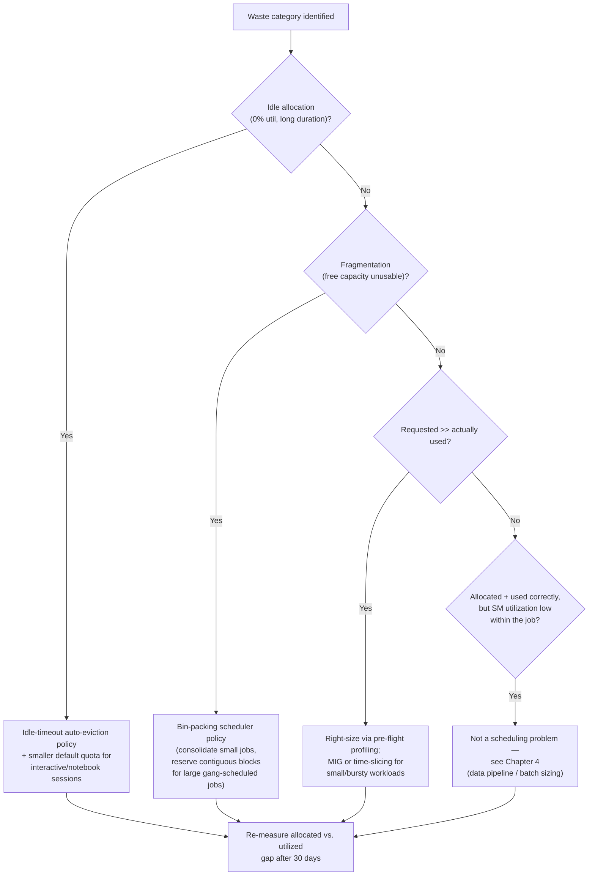

# Chapter 6 — Cost Optimization and Resource Efficiency

**Learning outcome:** Identify GPU spend waste with evidence (not opinion), apply the right optimization lever for each waste pattern, and quantify savings before and after a change.

## 6.1 The cost model operators actually need

GPU cost optimization conversations often start with "let's buy fewer GPUs," which is the wrong first question. The right first question is: **where is current spend not converting into useful work?** There are four distinct waste patterns, and each has a different fix — applying the wrong fix (e.g., buying more hardware when the real problem is scheduling fragmentation) burns budget without solving anything.

| Waste pattern | Signature | Typical fix |
|---|---|---|
| **Idle allocation** | GPU reserved by a job/user, 0% utilization for extended periods | Idle-timeout eviction, smaller default allocations |
| **Fragmentation** | Enough aggregate free GPU-hours exist, but not in a shape any pending job can use | Bin-packing scheduler policy, gang-scheduling awareness |
| **Over-provisioned per-job requests** | Job requests 8 GPUs, actually uses 3 effectively | Right-sizing via profiling before scheduling, MIG/time-slicing for small jobs |
| **Low utilization within allocation** | GPU is running the job, but SM utilization is chronically low (see Chapter 4) | Data pipeline fixes, batch size tuning — not a scheduling problem at all |

## 6.2 Real evidence: finding $180K/quarter of unconverted spend

### Step 1 — establish the baseline: allocated vs. utilized

```bash
$ promql_query 'avg_over_time(gpu_allocated_percent[30d])'
84.2

$ promql_query 'avg_over_time(gpu_sm_utilization_percent[30d])'
51.7
```

Allocation (84%) looks healthy on a capacity dashboard. Utilization (52%) tells a different story: roughly 32 percentage points of "allocated" GPU-hours are not doing compute. On a 200-GPU cluster at a blended $2.80/GPU-hour cost, that gap is:

```
200 GPUs × 24h × 90 days × 32% × $2.80/hr = $387,072/quarter of allocated-but-idle capacity
```

Not all of that is recoverable — some slack is required for scheduling headroom and burst capacity — but it's the number that motivates digging further.

### Step 2 — break the gap down by cause

```bash
$ python analyze_gpu_waste.py --window 30d

Category                          GPU-hours   % of total waste
Idle allocation (0% util > 1h)      8,412         31%
Fragmentation (unschedulable free)  6,890         26%
Over-provisioned jobs (req>>used)   9,140         34%
Low intra-job utilization           2,558          9%
Total wasted GPU-hours              27,000        100%
```

### Step 3 — quantify each category with evidence

**Idle allocation:**

```bash
$ kubectl get pods -A --field-selector=status.phase=Running \
  -o jsonpath='{range .items[*]}{.metadata.namespace}/{.metadata.name} {.spec.containers[*].resources.requests.nvidia\.com/gpu}{"\n"}{end}' \
  | while read pod gpus; do
      idle=$(promql_query "gpu_sm_utilization_percent{pod=\"${pod##*/}\"} < 5" --duration 1h)
      [[ -n "$idle" ]] && echo "$pod: $gpus GPU(s) idle >1h"
    done

dev-notebooks/jupyter-alice-a3f2: 2 GPU(s) idle >1h
dev-notebooks/jupyter-bob-9c11: 1 GPU(s) idle >1h
research/exploratory-run-771: 4 GPU(s) idle >1h
```

Interactive notebook sessions dominate the idle-allocation category — a common pattern: a researcher requests 2 GPUs for an experiment, runs a 10-minute test, then leaves the notebook open (and the GPUs reserved) overnight.

**Fragmentation:**

```bash
$ kubectl describe nodes | grep -A2 "nvidia.com/gpu" | grep -E "Allocatable|Allocated"

# Aggregate across cluster: 38 GPUs "free" cluster-wide
# But: spread as 1-2 free GPUs per node across 24 different nodes
# A pending 8-GPU gang-scheduled job cannot use any of them
$ kubectl get pods --field-selector=status.phase=Pending -o json \
  | jq -r '.items[] | select(.spec.containers[].resources.requests."nvidia.com/gpu" != null) | .metadata.name'

training-job-large-8gpu   <- pending 6h, needs 8 GPUs on fewer nodes than available fragments allow
```

38 GPUs free, 0 usable for the one job that needs them contiguously — this is fragmentation, not a capacity shortage, and buying more GPUs would not fix it.

**Over-provisioned jobs:**

```bash
$ python check_request_vs_actual.py --window 7d --min-gpus 4

Job                         Requested   Peak Used   Avg Used   Waste
finetune-batch-run-42            8         3           2.1      63%
inference-service-v2             4         4           3.8       5%
data-prep-pipeline               6         1           0.4      93%
```

`data-prep-pipeline` requesting 6 GPUs while averaging 0.4 used is a data preprocessing job that's mostly CPU-bound (file I/O, tokenization) with an occasional GPU-accelerated step — it should have requested 1 GPU with CPU-heavy pod resources, not 6.

## 6.3 Decision tree: which lever for which waste



## 6.4 Applying the fixes

### Fix 1: idle-timeout eviction for interactive sessions

```yaml
# Kubernetes CronJob: evict notebook pods idle >2h
apiVersion: batch/v1
kind: CronJob
metadata:
  name: idle-gpu-notebook-reaper
spec:
  schedule: "*/15 * * * *"
  jobTemplate:
    spec:
      template:
        spec:
          containers:
          - name: reaper
            image: internal/gpu-reaper:v3
            command: ["/bin/sh", "-c"]
            args:
              - |
                for pod in $(kubectl get pods -n dev-notebooks -o name); do
                  util=$(query_dcgm_utilization "$pod" --window 2h)
                  if [ "$util" -lt 5 ]; then
                    kubectl annotate "$pod" idle-warning="evicting in 15m"
                    sleep 900
                    kubectl delete "$pod"
                  fi
                done
          restartPolicy: OnFailure
```

### Fix 2: bin-packing scheduler policy for fragmentation

```yaml
# Kubernetes scheduler config: prefer consolidating small jobs
# onto fewer nodes, keep large-node blocks free for gang-scheduled jobs
apiVersion: kubescheduler.config.k8s.io/v1
kind: KubeSchedulerConfiguration
profiles:
- schedulerName: gpu-bin-packing
  plugins:
    score:
      enabled:
      - name: NodeResourcesFit
  pluginConfig:
  - name: NodeResourcesFit
    args:
      scoringStrategy:
        type: MostAllocated   # pack small jobs tight instead of spreading them
```

### Fix 3: right-sizing via pre-flight profiling

```bash
# Require a 5-minute profiling run before granting a >4-GPU allocation
$ python profile_before_schedule.py --job data-prep-pipeline --gpus 6 --dry-run
Profiling with 1 GPU for 5 minutes...
Peak SM utilization: 22%
Peak memory: 8GB / 80GB
Recommendation: 1 GPU sufficient (CPU/IO-bound workload)
Requested 6 GPUs, recommended 1 — flagging for review before scheduling
```

### Result after 60 days

```bash
$ promql_query 'avg_over_time(gpu_allocated_percent[30d])'
79.1   # down slightly — expected, less over-allocation

$ promql_query 'avg_over_time(gpu_sm_utilization_percent[30d])'
71.4   # up from 51.7%

# Recovered capacity, expressed as cost:
# 19.7 percentage-point improvement in allocated-hours converting to
# useful work ≈ $180K/quarter in avoided incremental hardware spend
# (measured as: jobs that previously queued for capacity now fit in
# the existing fleet without a procurement request)
```

## 6.5 Production troubleshooting table

| Symptom | Evidence | Root Cause | Fix | Verification |
|---|---|---|---|---|
| Allocation dashboard shows 85%+ "full," but new jobs queue for hours | Utilization dashboard shows <55% SM usage during the same window | Idle allocation or low intra-job utilization masquerading as capacity shortage | Break down allocated-vs-used gap by category before approving procurement | Utilization rises after targeted fixes; queue times drop without new hardware |
| Cluster-wide free GPU-hours exist, but large jobs still queue | Free capacity is scattered as 1-2 GPUs across many nodes | Fragmentation — scheduler spreads small jobs instead of packing them | Switch to bin-packing scheduler policy; reserve contiguous node blocks for gang-scheduled jobs | Large jobs schedule without artificial queueing once fragmentation resolved |
| One team's jobs always request far more GPUs than they use | `check_request_vs_actual.py` shows requested >> peak used for that team consistently | Team defaults to a "safe" large request without profiling actual need | Require pre-flight profiling for requests above a threshold (e.g., 4 GPUs) | Requested/used ratio for that team approaches 1.0–1.3x over following month |
| Interactive/notebook GPUs show high allocation, near-zero utilization overnight | `gpu_sm_utilization_percent` near 0% for pods running 8+ hours unattended | No idle-timeout policy; users forget to release sessions | Idle-timeout auto-eviction with warning grace period | Overnight idle-allocation GPU-hours drop to near zero |
| Cost per model iteration increasing quarter over quarter with no model-size change | GPU-hours per successful training run trending up | Regression in one of the above categories, or a data pipeline regression (Chapter 4) | Re-run the waste-category breakdown; compare to prior quarter's baseline | Cost per iteration returns to trend line |

## 6.6 Prevention: making waste visible by default

```yaml
# Prometheus recording rule: gap between allocated and utilized,
# per team/namespace, surfaced on every capacity dashboard by default
- record: gpu:allocated_minus_utilized:ratio
  expr: |
    (avg by (namespace) (gpu_allocated_percent))
    -
    (avg by (namespace) (gpu_sm_utilization_percent))

- alert: HighAllocationLowUtilizationByTeam
  expr: gpu:allocated_minus_utilized:ratio > 40
  for: 6h
  annotations:
    summary: "Namespace {{ $labels.namespace }} allocated-vs-utilized gap > 40 points for 6h+"
```

**Policy-level prevention:** require every capacity procurement request to include the current cluster-wide allocated-vs-utilized gap in the justification. This single process change eliminates the most common cost-optimization failure mode: buying more hardware to solve a scheduling or data-pipeline problem that new hardware won't fix.

## 6.7 Interview preparation

**Q: "Your GPU cluster shows 85% allocation but the team wants to buy more capacity. How do you evaluate that request?"**

A: "Allocation isn't the number I trust for a procurement decision — utilization is. I'd pull SM utilization alongside allocation for the same window. If there's a large gap, the cluster isn't actually capacity-constrained; it's converting allocated GPU-hours into useful work at a low rate. I'd break the gap down into idle allocation, fragmentation, over-provisioned requests, and low intra-job utilization, because each has a completely different fix and none of them is 'buy more GPUs.' Only if utilization is genuinely high and jobs are still queueing would I support a procurement request — and even then I'd want the capacity forecast from Chapter 3 to justify the size of the ask."

**Q: "How do you distinguish fragmentation from a real capacity shortage?"**

A: "I look at the shape of the free capacity, not just the total. If there are 40 free GPU-hours available but they're spread as 1-2 GPUs across 20 different nodes, and the pending job needs 8 GPUs together for gang scheduling, that's fragmentation — the aggregate number lies. A real shortage is when the aggregate free capacity itself is below what pending demand needs, regardless of how it's arranged. The fix for fragmentation is a bin-packing scheduler policy, not more hardware; the fix for a real shortage is procurement. Conflating the two means you either buy hardware you don't need or ignore a scheduling problem that's actually solvable for free."

**Q: "A team says their job needs 8 GPUs but you suspect it doesn't. How do you have that conversation with data instead of opinion?"**

A: "I'd run their job with a smaller allocation in a profiling mode first — even just 1-2 GPUs for a few minutes — and measure actual SM utilization and memory usage. If it's clearly compute-bound and scaling linearly, that's evidence they need the GPUs. If it's I/O-bound or shows most GPUs sitting near-idle while one does the work, I have concrete numbers to bring to the conversation instead of just saying 'that seems like too many.' I've found this converts most of these conversations from a negotiation into a shared debugging exercise, because most teams don't actually know their own utilization numbers until someone shows them."

## Key Takeaways

1. Allocation and utilization are different metrics; a "full" cluster by allocation can still be wasting a third or more of its spend.
2. There are four distinct waste patterns — idle allocation, fragmentation, over-provisioning, and low intra-job utilization — and each needs a different fix.
3. Fragmentation means the *shape* of free capacity doesn't match demand, not that capacity is actually short; check this before approving procurement.
4. Pre-flight profiling turns "we need 8 GPUs" from an assertion into a measurable claim.
5. Making the allocated-vs-utilized gap visible on every dashboard, by team, is the cheapest and most durable prevention mechanism.

## Cross References

- Chapter 3: Capacity Planning and Forecasting — procurement decisions should be gated on utilization evidence, not allocation alone
- Chapter 4: GPU Memory and Utilization Troubleshooting — low intra-job utilization root causes
- Chapter 7: Multi-Tenancy and Workload Isolation — scheduler policy and quota design
- Volume 10-11: Kubernetes GPU scheduling mechanics
