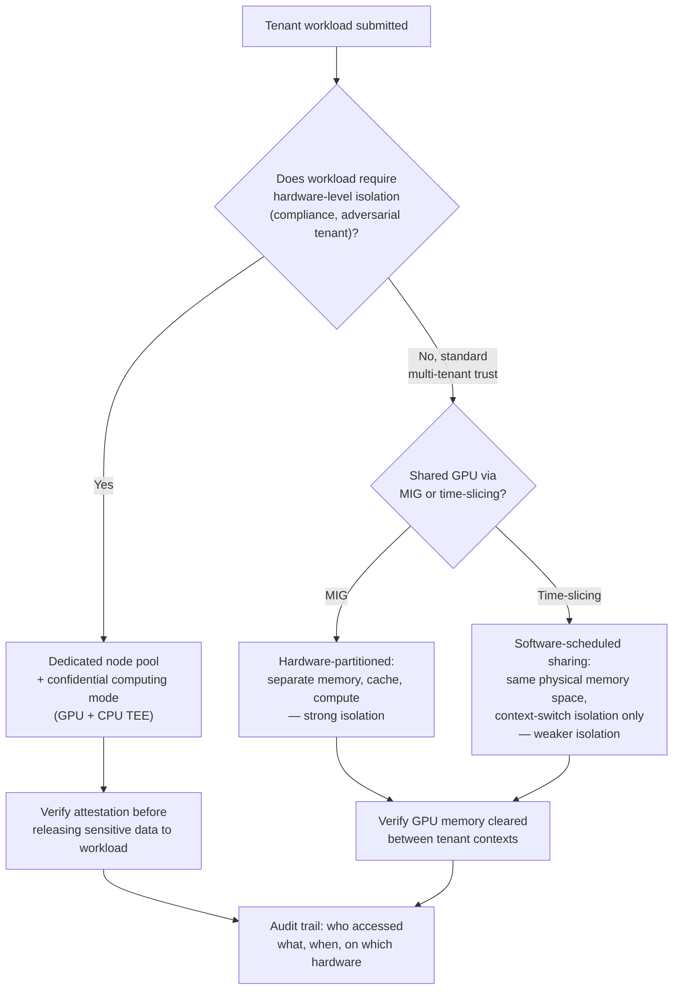

# Chapter 8 — Security Operations and Compliance

**Learning outcome:** Identify the GPU-cluster-specific attack surface beyond standard infrastructure security, apply the right isolation and attestation controls, and produce audit-ready evidence.

## 8.1 Why GPU clusters need more than standard infra security

Standard infrastructure security (network segmentation, IAM, patching) still applies to GPU clusters, but three things are specific to this domain and get missed by generic security reviews:

1. **Multi-tenant GPU sharing creates a side-channel and residual-data surface** that CPU-only multi-tenancy mostly doesn't — GPU memory isn't always zeroed between tenants by default, and MIG/time-sliced sharing (Chapter 7) puts untrusted workloads physically closer together than namespace isolation alone implies.
2. **Model weights and training data are the crown jewels**, not just infrastructure config — a compromised training node can exfiltrate a model worth more than the cluster it ran on, and standard "protect the database" security models don't map cleanly onto "protect the checkpoint files scattered across distributed storage."
3. **Firmware and driver supply chain matters more here than in typical compute** — a compromised GPU driver or VBIOS has access to every tenant's data that touches that GPU, and the update mechanism itself (Chapter 1) is a security-relevant process, not just a stability one.

## 8.2 Mechanism: the GPU-cluster trust boundary



The operational decision that matters: **time-slicing is not the same isolation guarantee as MIG**, and MIG is not the same guarantee as confidential computing. Treating them interchangeably in a compliance conversation is the single most common security gap in this domain.

## 8.3 Real evidence: closing a GPU-memory residual-data gap

### Symptom found in a security review

```bash
# Security review question: "After tenant A's job finishes and tenant B's
# job starts on the same physical GPU (time-sliced), can tenant B recover
# any of tenant A's data from GPU memory?"

$ nvidia-smi --query-gpu=index,memory.used --format=csv,noheader
0, 2048 MiB   # GPU 0 shows memory still marked used after tenant A's pod terminated

$ kubectl get pods -n tenant-a
# (no pods running — tenant A's job completed and pod was deleted 3 minutes ago)
```

Memory still shows as used after the tenant's process exited. This alone isn't proof of a leak — the CUDA driver retains allocations until explicitly freed or the context is destroyed — but it's the first signal that memory *hygiene* between tenants needs verification, not assumption.

### Verifying the actual risk

```bash
# Test: allocate GPU memory, write a known pattern, free it,
# then immediately allocate again from a different process and read
$ python3 << 'EOF'
import torch
x = torch.full((1024, 1024, 256), 0xDEADBEEF % 2**31, dtype=torch.int32, device='cuda')
torch.cuda.synchronize()
del x
torch.cuda.empty_cache()
EOF

# Simulate tenant B's process on the same GPU
$ python3 << 'EOF'
import torch
y = torch.empty((1024, 1024, 256), dtype=torch.int32, device='cuda')
torch.cuda.synchronize()
nonzero = (y != 0).sum().item()
print(f"Non-zero values in freshly allocated buffer: {nonzero} / {y.numel()}")
EOF
Non-zero values in freshly allocated buffer: 0 / 268435456
```

**Result: no residual data recovered** — the driver's memory allocator zeroes newly returned pages in this configuration. This is expected behavior on current NVIDIA data-center GPU drivers for standard CUDA allocations, but the review's value wasn't the "clean" result — it was **establishing the test exists and is repeatable**, so the answer is evidence-based rather than assumed, and so it's re-run after every driver upgrade (Chapter 1) as a regression check, since driver behavior in this area is exactly the kind of thing a routine upgrade could silently change.

```bash
# This test is now part of the post-upgrade verification checklist (Ch01 §1.3)
$ ./verify_gpu_memory_hygiene.sh --gpu 0
Allocating and marking 1GB with known pattern...
Freeing allocation...
Re-allocating 1GB from separate process context...
Scanning for residual pattern...
PASS: 0 bytes of residual data recovered
```

### The gap that *was* found: MIG boundary documentation

```bash
$ nvidia-smi mig -lgip

GPU instance profiles:
+--------------------------------------------------------------------+
| GPU  Name             ID    Instances   Memory     P2P    SM       |
|                              Free/Total                            |
|======================================================================|
|   0  MIG 1g.10gb      19     7/7        9728MiB    No     14       |
|   0  MIG 2g.20gb      14     3/3        19968MiB   No     28       |
|   0  MIG 3g.40gb       9     2/2        39936MiB   No     42       |
+--------------------------------------------------------------------+
```

Review found: MIG instances correctly isolate memory and compute (hardware-partitioned, not shared), **but P2P is disabled between MIG instances on the same physical GPU by design** — which is the correct secure default, but the cluster's documentation had incorrectly implied MIG instances could be used for a multi-instance NCCL collective. A tenant had attempted this, hit a confusing NCCL init failure, and filed it as a bug — it was actually the isolation boundary working as intended, surfaced through a confusing error message rather than a clear one.

```bash
# The actual, correct failure mode when attempting cross-MIG NCCL
$ NCCL_DEBUG=INFO python train.py --gpus mig0,mig1
NCCL INFO NET/IB: No device found  # misleading — real cause is MIG P2P restriction
```

**Fix applied:** documentation corrected to state clearly that MIG instances cannot participate together in a single NCCL job (this is a security-relevant boundary, not a bug), and the error message mapping was added to the troubleshooting runbook so the next person doesn't lose time misdiagnosing intended isolation as broken hardware.

## 8.4 Confidential computing for hard isolation requirements

For tenants with genuine adversarial-trust or regulatory requirements (e.g., processing data under a contractual "must never be visible to the infrastructure operator" clause), MIG/time-slicing isolation is not sufficient — the infrastructure operator (and anyone with root on the host) can still, in principle, inspect GPU memory or driver state. **Confidential computing mode** (available on H100-class GPUs and later) extends a CPU trusted-execution-environment (TEE) boundary to include the GPU, encrypting data and code in GPU memory such that even a compromised or malicious hypervisor/host cannot read it.

```bash
# Confirm confidential computing mode is active (H100 example)
$ nvidia-smi conf-compute -f

CC status: ON
CC Environment: PRODUCTION

# Attestation: verify the GPU's identity and firmware measurement
# before releasing any sensitive workload to it
$ nv-attestation-cli verify --gpu 0
GPU Attestation Report:
  GPU UUID: GPU-8f3a...
  Driver measurement: MATCH (expected hash)
  VBIOS measurement: MATCH (expected hash)
  Attestation: PASSED
```

**Decision rule for this cluster:** any workload whose data-handling agreement includes a "not visible to infrastructure operator" clause is routed only to nodes running confidential computing mode with a passing attestation check before job start — not to standard MIG/time-sliced multi-tenant nodes, regardless of how trusted the co-located tenants are believed to be.

## 8.5 Production troubleshooting table

| Symptom | Evidence | Root Cause | Fix | Verification |
|---|---|---|---|---|
| Tenant reports "can I see previous tenant's data" concern | GPU memory shows non-zero usage after prior tenant's pod terminated | Driver hasn't yet reclaimed allocation (normal), or genuine hygiene gap (rare, driver-version-dependent) | Run repeatable memory-hygiene test (allocate known pattern, free, re-allocate, scan) rather than relying on `nvidia-smi` snapshot alone | Test passes with 0 bytes residual; add to post-upgrade regression suite |
| NCCL job across MIG instances fails with a misleading network error | `NCCL_DEBUG=INFO` shows IB/network errors despite healthy fabric | MIG instances intentionally block P2P between instances on the same physical GPU (security boundary, not a bug) | Do not attempt multi-instance-NCCL across MIG slices; document this as an intended isolation boundary | Job runs correctly when redesigned to use whole GPUs or a single MIG instance per rank |
| Compliance team asks whether time-sliced sharing meets a regulatory isolation requirement | Only software-scheduled context-switch isolation exists on that node pool | Time-slicing shares the same physical memory space; it is not a hardware isolation boundary | Route regulated workloads to MIG or confidential-computing node pools per the decision tree in 8.2 | Compliance sign-off documents the specific isolation mechanism (not just "isolated") used for the workload class |
| Driver upgrade suspected of changing memory-clearing behavior | Memory-hygiene regression test fails post-upgrade where it previously passed | Driver version change altered allocator zeroing behavior | Block the driver promotion (Ch01 revert criteria); escalate to NVIDIA with the specific driver version and failing test | Hygiene test passes again after reverting or after a fixed driver version is confirmed |
| Confidential-computing workload processed on a node without verifying attestation | Job logs show it ran, but no attestation record exists for that run | Attestation check missing from job submission pipeline (soft requirement not enforced) | Make attestation verification a hard admission-control gate for the confidential-computing node pool, not a manual pre-check | Every job on that pool has a corresponding PASSED attestation record before execution |

## 8.6 Compliance evidence: what auditors actually ask for

```bash
# Standard audit evidence bundle for a GPU cluster security review
echo "=== GPU Cluster Security Audit Evidence ===" > audit_evidence.log

# 1. Isolation mechanism per node pool (not just "isolated: yes")
kubectl get nodes -o json | jq -r '.items[] | "\(.metadata.name): \(.metadata.labels["isolation-tier"])"' >> audit_evidence.log

# 2. Driver/firmware version and attestation status fleet-wide
for node in $(cat cluster_hosts.txt); do
  ssh $node 'nvidia-smi --query-gpu=driver_version,vbios_version --format=csv,noheader'
done >> audit_evidence.log

# 3. Memory-hygiene regression test results, last 90 days
cat memory_hygiene_test_history.log >> audit_evidence.log

# 4. Access audit trail: who ran what, on which hardware, when
kubectl get events -A --field-selector reason=Scheduled -o json \
  | jq -r '.items[] | "\(.firstTimestamp) \(.involvedObject.namespace)/\(.involvedObject.name) -> \(.source.host)"' \
  >> audit_evidence.log
```

Auditors care most about three things this evidence bundle answers directly: **which isolation mechanism is actually in place per workload class** (not a blanket claim), **is the driver/firmware supply chain tracked and attested**, and **is there a durable access trail** connecting a workload to the specific hardware it ran on, for incident forensics after the fact.

## 8.7 Interview preparation

**Q: "How is securing a multi-tenant GPU cluster different from securing a multi-tenant CPU cluster?"**

A: "The core difference is that GPU sharing mechanisms have varying isolation strength, and it's easy to conflate them in a security review. Time-slicing shares the same physical memory space between tenants with only software context-switch isolation; MIG gives you actual hardware-partitioned memory and compute, which is a much stronger guarantee; and confidential computing extends a trusted-execution-environment boundary to the GPU itself, protecting data even from the infrastructure operator. A generic cloud security review often just checks 'is this workload isolated from that one' without asking which of these three mechanisms is providing the isolation — and for a workload with real compliance requirements, that distinction is the entire answer."

**Q: "A compliance team asks if your GPU cluster can guarantee no data leakage between tenants sharing a GPU. What do you tell them?"**

A: "I'd first ask which sharing mechanism their workload is on, because the honest answer depends on that. If it's MIG, I can point to hardware-partitioned memory and a repeatable memory-hygiene test as evidence. If it's time-slicing, I'd be upfront that the isolation is software-level context-switching in a shared physical memory space — sufficient for cooperative, mutually-trusted tenants, but not the guarantee I'd want to put in front of a regulator for adversarial-trust data. If their requirement is genuinely 'no leakage, full stop, even from us as the operator,' the honest answer is that requires confidential computing mode with attestation, and I'd route that workload to a node pool configured for it rather than claiming a lower isolation tier meets a requirement it doesn't."

**Q: "You find that GPU memory shows as still 'used' after a tenant's job completes. Is that a security incident?"**

A: "Not necessarily, but it's worth verifying rather than assuming either way. `nvidia-smi` showing memory as used after process exit is often just the driver not having reclaimed the allocation instantly — that's normal and not a leak by itself. But I wouldn't take that assumption on faith for a security question; I'd run an actual test: allocate memory, write a known pattern, free it, then immediately allocate the same region from a different process and scan for the pattern. If it comes back clean, I have evidence, not an assumption, and I'd make that test a standing regression check that reruns after every driver upgrade — because driver behavior in exactly this area is the kind of thing an upgrade could silently change without anyone noticing until it's a real incident."

## Key Takeaways

1. GPU multi-tenancy has a spectrum of isolation strength — time-slicing (software, shared memory space), MIG (hardware-partitioned), confidential computing (TEE-protected, even from the operator) — and compliance conversations need to name which one applies, not assert "isolated" generically.
2. Memory-hygiene claims should be backed by a repeatable test (allocate known pattern, free, re-allocate, scan), not just a `nvidia-smi` snapshot — and that test belongs in the post-driver-upgrade regression suite.
3. MIG's P2P restriction between instances on the same GPU is a security boundary working as intended, not a bug — but it produces confusing NCCL error messages if undocumented, so document it explicitly.
4. Confidential computing with attestation is the right tier for workloads with a "not visible to infrastructure operator" requirement; it should be a hard admission-control gate, not a manual pre-check.
5. Audit evidence should show *which* isolation mechanism applies per workload class, driver/firmware attestation status fleet-wide, and a durable workload-to-hardware access trail.

## Cross References

- Chapter 1: Cluster Lifecycle and Upgrade Operations — driver/firmware supply chain and post-upgrade regression testing
- Chapter 7: Multi-Tenancy and Workload Isolation — MIG/time-slicing/dedicated-pool decision tree this chapter builds on
- Volume 9: NVSwitch/NVLink and MIG hardware partitioning mechanics
- Volume 17 (if covering confidential computing/TEE fundamentals): CPU/GPU trusted-execution-environment mechanics
