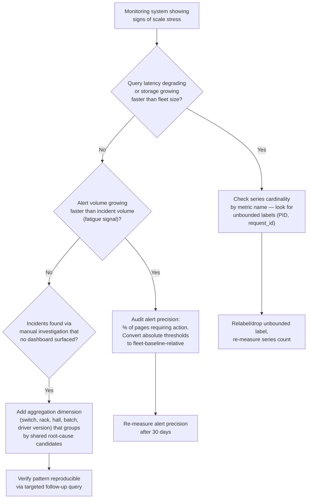

# Chapter 9 — Monitoring and Observability at Scale

**Learning outcome:** Design a metrics and alerting system that stays useful — not just alive — when a fleet grows from tens to thousands of GPUs, and avoid the specific failure modes that make monitoring systems fail exactly when you need them most.

**Note on scope:** Volume 18 covers observability fundamentals — metrics, logs, traces, and DCGM exporter setup. This chapter assumes that foundation and focuses on what specifically breaks when you scale it: cardinality explosions, alert fatigue, and cross-cluster aggregation.

## 9.1 The failure mode that's specific to scale

A monitoring stack that works cleanly at 20 nodes commonly breaks in one of three ways once a fleet crosses roughly 500-1000 GPUs — not because the underlying tools (Prometheus, DCGM) are wrong, but because assumptions that were free at small scale become expensive:

1. **Cardinality explosion** — per-GPU, per-process labels multiply combinatorially; a metrics backend that handled 20 nodes fine falls over or becomes unqueryable at 1000.
2. **Alert fatigue** — a threshold tuned for "this is unusual at 20 nodes" fires constantly at 1000 nodes purely from larger sample size, and on-call starts ignoring pages.
3. **Aggregation blind spots** — per-node dashboards are fine for one node, useless for spotting a pattern that only exists across hundreds of nodes (e.g., "every node on this specific switch model shows elevated ECC rates").

## 9.2 Cardinality: the silent scaling killer

### Diagnosing a cardinality problem

```bash
$ curl -s http://prometheus:9090/api/v1/status/tsdb | jq '.data.seriesCountByMetricName[:10]'

[
  {"name": "DCGM_FI_DEV_GPU_UTIL", "value": 48200},
  {"name": "DCGM_FI_DEV_FB_USED", "value": 48200},
  {"name": "nvidia_smi_process_memory_used", "value": 892400}   <- outlier
]
```

`nvidia_smi_process_memory_used` has 892,400 active time series — nearly 20x the per-GPU metrics. Cause: this metric is labeled by `process_id`, and PIDs are ephemeral (a new training run gets a new PID). Every job restart creates a brand new, permanently-retained time series instead of reusing one.

```bash
# Confirm: how many distinct PID labels has this metric seen in 24h?
$ curl -s -G http://prometheus:9090/api/v1/query \
  --data-urlencode 'query=count(count by (process_id) (nvidia_smi_process_memory_used))'
{"data": {"result": [{"value": [1699999999, "41200"]}]}}
```

41,200 distinct PID values in 24 hours on a fleet of 2,000 GPUs — each one a permanent, never-reused series in Prometheus's TSDB until it ages out. This is what silently degrades query performance and memory usage cluster-wide, often before anyone notices, because no single query "breaks" — everything just gets slower.

### Fix: label design that doesn't grow with process churn

```yaml
# Before: unbounded cardinality from process_id label
# nvidia_smi_process_memory_used{gpu="0", process_id="482913", pod="train-xyz"}

# After: aggregate at scrape time to job/pod granularity, drop process_id
# in the exporter relabel config — process-level detail still available
# via on-demand nvidia-smi query during incident response, just not
# permanently retained as a time series
- job_name: 'dcgm-exporter'
  metric_relabel_configs:
    - source_labels: [__name__]
      regex: 'nvidia_smi_process_memory_used'
      target_label: __tmp_drop_pid
      replacement: 'true'
    - source_labels: [__tmp_drop_pid]
      regex: 'true'
      action: labeldrop
      # drops the process_id label, Prometheus merges resulting duplicate
      # series by summing — acceptable because pod-level total is what's needed
```

```bash
# After fix, 30 days later
$ curl -s -G http://prometheus:9090/api/v1/query \
  --data-urlencode 'query=count(count by (pod) (nvidia_smi_process_memory_used))'
{"data": {"result": [{"value": [1699999999, "312"]}]}}
# 312 active pods vs. 41,200 PIDs — cardinality reduced ~130x, same operational visibility
```

## 9.3 Alert fatigue: thresholds that don't scale with fleet size

### The problem

```yaml
# This alert looked reasonable at 20 nodes
- alert: HighECCErrorRate
  expr: rate(dcgm_ecc_sbe_volatile_total[1h]) > 0
  for: 5m
```

At 20 nodes, a handful of correctable ECC events per week is unusual enough to page on. At 2,000 nodes, correctable single-bit ECC events (which HBM is designed to handle transparently) happen dozens of times per day across the fleet purely from larger sample size — this alert now fires constantly, and on-call has learned to acknowledge and ignore it, which is the exact failure mode that causes a *real* problem to get missed later.

```bash
# Evidence: alert firing frequency over 90 days as fleet grew
$ promql_query 'increase(alertmanager_notifications_total{alertname="HighECCErrorRate"}[90d])'
1,847   # ~20 pages/day across the review period

$ promql_query 'count(alertmanager_alerts{alertname="HighECCErrorRate", state="resolved"}) by (severity)'
# 1,839 auto-resolved with no operator action taken, 8 required actual intervention
# Precision: 0.4% of pages required action — this alert is noise, not signal
```

### Fix: rate-based and rank-based thresholds instead of absolute occurrence

```yaml
# Before: any correctable ECC event pages — noise at scale
# After: page only if a GPU's ECC rate is anomalous relative to the fleet,
# not relative to zero
- alert: HighECCErrorRateAnomalous
  expr: |
    rate(dcgm_ecc_sbe_volatile_total[1h])
    >
    (avg(rate(dcgm_ecc_sbe_volatile_total[1h])) + 3 * stddev(rate(dcgm_ecc_sbe_volatile_total[1h])))
  for: 15m
  labels:
    severity: page
  annotations:
    summary: "GPU {{ $labels.gpu }} ECC rate is a fleet-wide statistical outlier, not just nonzero"

# Uncontained/double-bit ECC (Xid 48, 95) is genuinely always page-worthy
# regardless of fleet size — severity, not frequency, justifies the page
- alert: UncontainedECCError
  expr: increase(dcgm_ecc_dbe_volatile_total[5m]) > 0
  for: 0m
  labels:
    severity: page
```

```bash
# After fix, 90 days later
$ promql_query 'increase(alertmanager_notifications_total{alertname="HighECCErrorRateAnomalous"}[90d])'
23   # down from 1,847
$ # Precision check
$ promql_query 'count(alertmanager_alerts{alertname="HighECCErrorRateAnomalous", state="resolved"}) by (severity)'
# 19 required action (thermal issue on 3 nodes, memory degradation on 16) — 83% precision
```

**Principle:** at scale, alert on *deviation from fleet baseline*, not *deviation from zero*, for anything that has a nonzero healthy rate. Reserve absolute-threshold alerts for events that are genuinely always actionable regardless of fleet size (uncontained ECC, node unreachable, thermal shutdown).

## 9.4 Aggregation: seeing patterns that only exist across the fleet

### Real example: switch-model-correlated failure pattern

A per-node dashboard shows nothing unusual — every individual node's ECC rate looks like normal background noise. The pattern only becomes visible aggregated by a dimension no single-node view has: switch model.

```promql
# Aggregate ECC rate by leaf switch model, not by node
avg by (switch_model) (rate(dcgm_ecc_sbe_volatile_total[6h]))
```

```
switch_model        avg_ecc_rate
sw-model-A (n=340)   0.02/hr
sw-model-B (n=180)   0.11/hr   <- 5.5x higher, statistically significant given n=180
```

```bash
# Confirm with a targeted query: is this switch-model or something confounded
# with it (e.g., all model-B switches happen to be in one older datacenter hall)?
$ promql_query 'count(count by (switch_model, dc_hall) (node_info))'
sw-model-A, hall-1: 200   sw-model-A, hall-2: 140
sw-model-B, hall-1: 180   sw-model-B, hall-2: 0
```

Model-B switches are entirely in hall-1, so this could be the switch model, the hall's power/cooling profile, or both — the aggregation surfaced a *lead*, not a final diagnosis. It gives the hardware team a specific, falsifiable hypothesis ("model-B switch firmware or hall-1 environmental factors") instead of "ECC errors happen sometimes," which is what every individual node's dashboard would have shown.

## 9.5 Decision tree: scaling a monitoring system



## 9.6 Production troubleshooting table

| Symptom | Evidence | Root Cause | Fix | Verification |
|---|---|---|---|---|
| Prometheus query latency degrading, storage growing faster than fleet | `seriesCountByMetricName` shows one metric with disproportionate series count | Unbounded label (PID, request ID, ephemeral container ID) creating permanent per-occurrence series | Relabel to drop the unbounded label at scrape time; aggregate to a stable identifier (pod, job) instead | Series count for that metric drops to expected order of magnitude; query latency returns to baseline |
| On-call reports alert fatigue, pages being acknowledged without investigation | Alert firing frequency high, resolved-without-action rate near 100% | Absolute threshold tuned for small fleet now fires from sample-size effects alone | Convert to fleet-baseline-relative threshold (stddev-based); keep absolute thresholds only for always-actionable severity classes | Alert precision (% requiring action) rises substantially; page volume drops without missing real incidents |
| A hardware issue found by chance (someone manually compared logs) that dashboards never flagged | No existing dashboard aggregates by the dimension that correlates with the issue (switch, rack, batch, driver version) | Dashboards built around per-node views only; no fleet-wide grouping dimension for the relevant hardware/software attribute | Add the missing aggregation dimension; re-run historical query to confirm the pattern was present and detectable retroactively | New dashboard panel would have surfaced the pattern days/weeks earlier than manual discovery did |
| Metrics backend runs fine most of the time, falls over during incident response (worst possible moment) | Query load spikes during incidents (everyone querying at once) coincide with backend degradation | No query-load isolation between routine dashboards and ad-hoc incident-response queries; single backend instance for both | Separate read replicas or federated tier for ad-hoc/incident queries vs. steady-state dashboards; rate-limit expensive ad-hoc queries | Incident-time query latency stays acceptable even under simulated concurrent-query load test |
| Two teams report the "same" metric showing different values for the same GPU | Metric collected by two different exporters/paths with different aggregation windows or units | No single source of truth for a given metric; drift between exporters | Designate one canonical exporter/metric per signal; deprecate or clearly label the others as derived/legacy | Both teams' dashboards reference the same canonical metric; discrepancy resolved |

## 9.7 Prevention: capacity-planning the monitoring system itself

```bash
# Monitoring-system self-monitoring: this system needs the same
# capacity-planning discipline as Chapter 3 applies to the GPU fleet
$ promql_query 'predict_linear(prometheus_tsdb_symbol_table_size_bytes[7d], 86400*90)'
# Forecast TSDB growth 90 days out — if it exceeds provisioned storage,
# that's a capacity-planning action, not a surprise outage
```

```yaml
# Alert on the monitoring system's own health — a monitoring system
# that silently degrades is worse than one that's visibly down
- alert: PrometheusHighCardinalityGrowth
  expr: increase(prometheus_tsdb_head_series[7d]) > 1.5 * increase(prometheus_tsdb_head_series[7d] offset 7d)
  for: 1h
  annotations:
    summary: "Time series count growing >50% faster week-over-week — check for new unbounded label"

- alert: AlertPrecisionDegraded
  # requires an internal precision-tracking pipeline that tags whether
  # a page led to operator action; a common addition once fleet scale
  # makes alert-fatigue tracking worth automating
  expr: alert_precision_ratio_7d < 0.3
  for: 1d
  annotations:
    summary: "{{ $labels.alertname }} precision below 30% over past week — review threshold design"
```

## 9.8 Interview preparation

**Q: "Your monitoring stack worked fine at 50 nodes but is falling over at 2,000. What do you check first?"**

A: "I wouldn't assume it's a capacity problem that just needs bigger hardware for the metrics backend — the first thing I check is cardinality, specifically whether any metric has an unbounded label like a process ID or request ID that creates a permanent new time series for every occurrence instead of reusing one per stable identity. That's the single most common cause of a monitoring system that scales badly, because it's invisible at small scale — a handful of processes doesn't generate enough series to matter — and becomes catastrophic at scale because process churn across thousands of nodes generates tens of thousands of permanent series per day. I'd query the series count broken down by metric name to find the outlier before assuming I need to throw more storage at the problem."

**Q: "On-call says they're ignoring pages because there are too many. How do you fix that without missing real incidents?"**

A: "I'd start by measuring alert precision — for each alert rule, what fraction of firings actually required operator action versus auto-resolving with nothing done. Alerts with very low precision are usually using an absolute threshold that made sense at a smaller fleet size but now fires from pure sample-size effects. The fix isn't to just raise the threshold arbitrarily — it's to change what the alert is measuring: compare each GPU or node against the fleet's own statistical baseline (mean plus a few standard deviations) rather than against a fixed absolute number, so the threshold naturally scales with fleet size. I'd keep absolute thresholds only for the class of events that are genuinely always actionable regardless of scale, like uncontained ECC errors or a node going fully unreachable — severity, not frequency, justifies skipping the baseline comparison for those."

**Q: "How would you catch a hardware issue that's spread thin across many nodes, where no single node looks obviously broken?"**

A: "That's exactly the class of problem that per-node dashboards miss by design — each node's metrics look like normal background noise individually. I'd build aggregation dimensions that group nodes by shared physical or configuration attributes that aren't 'which node' — switch model, rack, datacenter hall, driver version, hardware batch — and look for statistically significant differences between groups, not just outlier individual nodes. When I find a group-level anomaly, I treat it as a lead, not a diagnosis — I'd check for confounding factors, like whether a suspect switch model happens to be concentrated in one physical location that could itself be the actual cause. The value of this kind of aggregation is turning 'errors happen sometimes' into a specific, falsifiable hypothesis the hardware team can actually investigate."

## Key Takeaways

1. Cardinality explosions from unbounded labels (PID, request ID) are the most common cause of a monitoring system that silently degrades as fleet size grows — check series count by metric name before assuming a capacity problem.
2. Alert thresholds tuned at small scale generate fatigue at large scale purely from sample-size effects; alert on deviation from fleet baseline, not deviation from zero, except for genuinely always-actionable severity classes.
3. Per-node dashboards cannot surface patterns that only exist in aggregate — build dashboards around dimensions like switch, rack, hall, and driver version, not just per-node views.
4. Track alert precision (fraction of pages requiring action) as a first-class metric; it's the concrete evidence for whether alert fatigue is real and whether a threshold fix worked.
5. The monitoring system itself needs the same capacity-planning discipline (Chapter 3) applied to it — forecast its own storage/cardinality growth rather than discovering it via an outage.

## Cross References

- Volume 18: Observability fundamentals — metrics, logs, traces, DCGM exporter setup (prerequisite for this chapter)
- Chapter 2: Incident Response and Game Day Execution — alert precision directly affects detection speed
- Chapter 3: Capacity Planning and Forecasting — the same forecasting discipline applied to the monitoring system's own storage
- Chapter 5: Network Reliability and Fabric Validation — the switch-model aggregation example connects to fabric health checks
