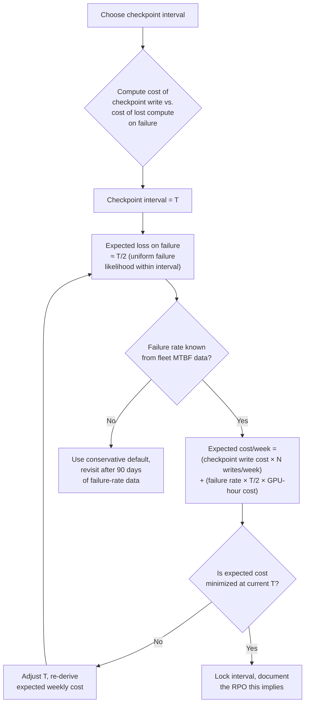
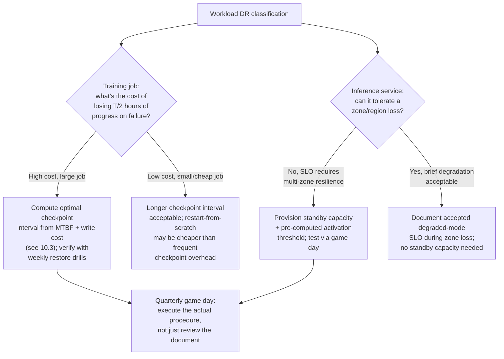

# Chapter 10 — Disaster Recovery and Data Resilience

**Learning outcome:** Design checkpoint and backup strategy for GPU training/inference workloads with explicit RPO/RTO targets, and prove recovery procedures actually work through practiced drills rather than untested documentation.

## 10.1 RPO/RTO for GPU workloads — different math than stateless services

Standard disaster-recovery planning talks about Recovery Point Objective (how much data/progress can you afford to lose) and Recovery Time Objective (how long can you afford to be down). For GPU training and inference, both numbers are driven by GPU-specific cost structures that a generic DR framework doesn't capture:

- **RPO for training** is denominated in **GPU-hours of lost compute**, not just "data loss." Losing 4 hours of checkpoint interval on a 512-GPU training run isn't 4 hours of downtime — it's 2,048 GPU-hours of wasted compute, directly convertible to dollars.
- **RTO for inference** is denominated in **serving capacity gap**, not just "service down." If an inference cluster loses a zone, RTO isn't "when does something respond again" — it's "when is serving capacity back above the level that avoids cascading overload on the surviving zones."
- **Checkpoint frequency is a cost tradeoff, not a free safety margin.** Checkpointing a large model is itself expensive (I/O bandwidth, storage cost, and a training stall during the write) — more frequent checkpoints reduce RPO but increase steady-state cost and can meaningfully slow overall training throughput.

## 10.2 Mechanism: checkpoint strategy as an RPO dial



This is the calculation operators skip and then can't defend when asked "why every 4 hours and not every hour" — the answer should be a number, not a habit.

## 10.3 Real evidence: deriving and testing a checkpoint interval

### Step 1 — get real failure-rate data, not an assumption

```bash
$ python analyze_node_failures.py --window 180d --fleet-size 512

Node failures requiring job restart (last 180 days): 34
Fleet-wide MTBF: 512 nodes × 180 days × 24h / 34 failures ≈ 65,082 node-hours/failure
For a 512-node job: expected failure roughly every 65,082 / 512 ≈ 127 hours (~5.3 days)
```

### Step 2 — compute expected weekly cost at candidate intervals

```python
gpu_hour_cost = 2.80
nodes = 512
gpus_per_node = 8
checkpoint_write_cost_hours = 0.05   # measured: 3 min stall for a full checkpoint write
expected_failure_interval_hours = 127

def weekly_expected_cost(interval_hours):
    writes_per_week = 168 / interval_hours
    write_cost = writes_per_week * checkpoint_write_cost_hours * nodes * gpus_per_node * gpu_hour_cost
    failure_prob_per_week = 168 / expected_failure_interval_hours
    expected_loss_hours = interval_hours / 2
    loss_cost = failure_prob_per_week * expected_loss_hours * nodes * gpus_per_node * gpu_hour_cost
    return write_cost + loss_cost

for interval in [0.5, 1, 2, 4, 8]:
    print(f"Interval={interval}h: weekly expected cost=${weekly_expected_cost(interval):,.0f}")
```

```
Interval=0.5h: weekly expected cost=$196,224
Interval=1h:   weekly expected cost=$101,861
Interval=2h:   weekly expected cost=$56,730   <- minimum
Interval=4h:   weekly expected cost=$62,003
Interval=8h:   weekly expected cost=$95,973
```

**Result: 2-hour checkpoint interval minimizes expected weekly cost** given this fleet's measured MTBF and this model's checkpoint write cost. This is the number that goes in the runbook, with the derivation attached — so when fleet size or model size changes, the interval gets recalculated instead of copy-pasted forward indefinitely.

### Step 3 — verify checkpoint integrity, not just checkpoint existence

A checkpoint that exists but can't be loaded is worse than no checkpoint — it wastes the recovery attempt's time before failing.

```bash
# Post-write integrity check, run automatically after every checkpoint
$ python verify_checkpoint.py --path s3://checkpoints/run-771/step-48200/

Checking manifest completeness... OK (all 512 shard files present)
Checking shard checksums... OK (512/512 match manifest)
Attempting partial load (optimizer state, rank 0 shard only)... OK
Checkpoint verified: LOADABLE
```

```bash
# Weekly full-restore drill: not just "does the file exist,"
# but "does training actually resume correctly from it"
$ python restore_and_verify.py --checkpoint s3://checkpoints/run-771/step-48200/ --steps 5

Restoring from checkpoint...
Resumed at step 48200
Running 5 verification steps...
Step 48201: loss=2.341 (expected range from training log: 2.30-2.38) OK
Step 48202: loss=2.339 OK
...
Restore verified: training resumes with expected loss trajectory
```

**This is the check that catches the failure mode "checkpoint file exists and passes checksum, but was written with a bug that silently corrupts optimizer state" — a class of failure a checksum alone cannot detect, because the file is internally consistent but semantically wrong.**

## 10.4 Real evidence: a zone failure and inference RTO

### Incident: one availability zone loses power, taking 1/3 of inference capacity offline

```
09:14:02 — Zone-B power event; 40 of 120 inference-serving nodes unreachable
09:14:15 — Load balancer health checks begin failing for zone-B backends
09:14:30 — Traffic automatically shifts to zone-A and zone-C (80 remaining nodes)
09:14:45 — p99 latency alert fires: 340ms (baseline 120ms) — surviving zones overloaded
09:16:00 — On-call confirms: 80 nodes now serving 100% of traffic previously spread over 120
09:17:30 — Decision: activate burst capacity (pre-provisioned but normally idle standby pool)
09:19:00 — 24 standby nodes brought online in zone-A and zone-C
09:21:00 — p99 latency recovers to 165ms — still elevated but within degraded-mode SLO
09:47:00 — Zone-B power restored; nodes rejoin pool after health check passes
09:52:00 — Standby pool scaled back down; p99 returns to 118ms baseline
```

```bash
# The evidence that made the "activate burst capacity" decision fast
# instead of a judgment call under pressure: a pre-computed threshold
$ cat runbooks/zone-failure-capacity-thresholds.yaml
# If serving capacity drops below 75% of provisioned, activate standby
# pool immediately — do not wait to see if latency "settles"
capacity_threshold_pct: 75
current_capacity_pct: 66.7   # 80/120 nodes — below threshold, action was correct
```

**RTO achieved: 5 minutes from alert to standby activation, ~7 minutes to SLO-acceptable latency.** This number is only meaningful because it was the result of a pre-computed threshold and a rehearsed procedure (see 10.5), not because the on-call engineer happened to make good decisions under pressure that day.

## 10.5 Game days: why untested DR procedures are just documentation

A DR runbook that has never been executed is a hypothesis, not a procedure. The gap between "we have a documented failover process" and "we have a working failover process" is only closed by actually running it — ideally on a schedule, not just after an incident forces the first real test.

```bash
# Quarterly DR game day: simulate the zone failure above, deliberately,
# during a low-traffic window, with the on-call rotation that would
# actually respond to a real one
$ ./gameday_zone_failure.sh --zone zone-b --dry-run false --window "sunday 03:00-04:00"

Simulating zone-b network partition (not actual power loss — safer to test)...
[03:00:15] Health checks begin failing for zone-b (simulated)
[03:00:45] On-call paged (real page, real on-call rotation)
[03:04:20] On-call activated standby capacity  <- 4m20s response time this drill
[03:07:00] p99 latency back to acceptable range
[03:15:00] Drill concluded, zone-b restored
```

```
Game day findings, logged for the runbook:
1. Standby-pool activation script had a stale AMI reference — fixed
   before it caused a real-incident failure (found only by executing it)
2. On-call response time 4m20s vs. runbook's assumed "immediate" —
   updated capacity_threshold_pct headroom to account for realistic
   human response latency, not an idealized instant response
3. Alerting correctly fired within 15s of simulated failure — no change needed
```

**The value of the game day wasn't confirming the runbook worked — it was finding the stale AMI reference that would have turned a 5-minute real incident into an open-ended one, discovered on a Sunday morning drill instead of during an actual outage.**

## 10.6 Decision tree: choosing DR strategy by workload class



## 10.7 Production troubleshooting table

| Symptom | Evidence | Root Cause | Fix | Verification |
|---|---|---|---|---|
| Checkpoint interval "feels" too frequent or too rare, no one can justify the number | No documented derivation; interval was copy-pasted from another project or picked arbitrarily | No cost-based derivation tying checkpoint interval to measured MTBF and write cost | Derive interval from fleet MTBF and checkpoint write cost (10.3); document the calculation in the runbook | Interval has a documented, reproducible derivation; recalculated when fleet/model size changes materially |
| Recovery from checkpoint fails despite checksum passing | Checksum matches manifest, but loaded optimizer state produces divergent loss vs. pre-failure trajectory | Checksum validates file integrity, not semantic correctness — a bug in the checkpoint-write path can produce internally-consistent but wrong data | Add a restore-and-verify drill (partial resume + N training steps, compare loss trajectory) as standard post-write validation, not just checksum | Restore drills routinely confirm loss trajectory matches expectation before trusting checkpoint |
| Zone/region failure causes cascading overload on surviving capacity | Surviving nodes' latency spikes well beyond proportional degradation | No pre-provisioned standby capacity, or no pre-computed activation threshold — decision made ad hoc under pressure | Pre-provision standby pool; define and document a capacity-percentage activation threshold in advance | Game-day drill shows activation happens within target response time without a judgment call being required |
| DR runbook exists but has never been executed | No game-day log; procedure has only ever been theoretically reviewed | DR testing treated as documentation exercise, not an operational practice | Schedule recurring game days (quarterly minimum) that execute the actual procedure with the real on-call rotation | Game-day log shows regular execution; findings from each drill are tracked and closed out |
| Standby capacity activation script fails during a real incident | Real incident is the first time the script has run against current infrastructure | Infrastructure drifted (stale AMI, changed network config) since the script was last validated | Game days catch this drift before a real incident does; re-validate activation scripts every drill, not just the concept | Activation script runs cleanly on every game day, kept in sync with infrastructure changes |

## 10.8 Prevention: making DR posture visible, not assumed

```bash
# Dashboard panel: time since each DR procedure was last actually executed
# (not last reviewed, not last written — last executed)
$ cat dr_posture_report.sh
#!/bin/bash
echo "DR Procedure          Last Executed    Days Since"
echo "Zone failover          $(cat gameday_logs/zone_failover_last.txt)"
echo "Checkpoint restore     $(cat gameday_logs/checkpoint_restore_last.txt)"
echo "Full cluster rebuild   $(cat gameday_logs/cluster_rebuild_last.txt)"
```

```yaml
# Alert if a DR procedure hasn't been drilled within its required cadence
- alert: DRDrillOverdue
  expr: (time() - dr_procedure_last_executed_timestamp) > (90 * 86400)
  for: 1h
  annotations:
    summary: "{{ $labels.procedure }} has not been drilled in 90+ days"
```

## 10.9 Interview preparation

**Q: "How do you decide how often to checkpoint a large training run?"**

A: "I treat it as a cost-minimization problem, not a rule of thumb. More frequent checkpoints reduce the expected compute lost on failure, but each checkpoint write has its own cost — I/O, storage, and a training stall. I'd get the fleet's measured mean time between failures from historical data, and the actual measured cost of a checkpoint write for this specific model size, then compute expected weekly cost as a function of checkpoint interval: write cost scales up as the interval shrinks, expected failure-loss cost scales down. There's a minimum somewhere in between, and that's the interval I'd choose — with the calculation documented so it gets revisited when fleet size or model size changes, instead of being copied forward as an assumption nobody remembers the basis for."

**Q: "A checkpoint file passes its checksum but training doesn't resume correctly from it. How is that possible, and how do you catch it earlier?"**

A: "A checksum proves the file wasn't corrupted in transit or storage — it doesn't prove the file's contents are semantically correct. If there's a bug in the checkpoint-writing code itself — say, optimizer state gets serialized in the wrong order, or a distributed shard boundary is off by one — the resulting file is internally consistent and will pass a checksum, but loading it produces wrong behavior. The way to catch this is a restore-and-verify drill: actually load the checkpoint, resume a few training steps, and compare the loss trajectory against what the training log showed before the failure. That's a fundamentally different check than a checksum, and it's the one that actually validates the thing you care about — that recovery works, not just that the file is intact."

**Q: "Your team has a documented DR runbook for zone failure. Is that sufficient?"**

A: "No — a runbook that's never been executed is a hypothesis about what will happen, not evidence of what will happen. I'd want to see a history of game days where the actual procedure was run, ideally with the real on-call rotation that would respond to a genuine incident, not just a tabletop review of the document. In my experience, the value of a game day isn't usually confirming the runbook works — it's finding the thing that's drifted since the runbook was written: a stale AMI reference in an activation script, a threshold that assumed instant human response instead of realistic multi-minute response time, a capacity number that's stale because the fleet grew. Those are the failures that turn a real incident into a much longer one, and they're specifically the kind of thing that only shows up when you actually execute the procedure."

## Key Takeaways

1. RPO for training workloads is denominated in GPU-hours of lost compute, and checkpoint interval should be derived from a cost model (write cost vs. expected failure loss), not picked by convention.
2. A checksum validates file integrity, not semantic correctness — restore-and-verify drills (resume + compare loss trajectory) catch a class of failure checksums cannot.
3. RTO for inference workloads is about closing the serving-capacity gap fast enough to avoid cascading overload on survivors, and needs a pre-computed activation threshold so the response isn't a judgment call under pressure.
4. A DR runbook that has never been executed is documentation, not a procedure — quarterly game days with the real on-call rotation are what convert it into something you can actually rely on.
5. Track "time since last actually executed" for every DR procedure, not just "time since last reviewed" — infrastructure drift between drills is exactly what turns a rehearsed 5-minute recovery into an unrehearsed hour-long one.

## Cross References

- Chapter 2: Incident Response and Game Day Execution — the game-day methodology this chapter applies specifically to DR/backup procedures
- Chapter 3: Capacity Planning and Forecasting — standby-pool sizing is a capacity-planning decision
- Chapter 9: Monitoring and Observability at Scale — the alerting that detects a zone/node failure fast enough for RTO targets to be achievable
- Volume 15 (Storage): Checkpoint storage architecture and distributed shard management
