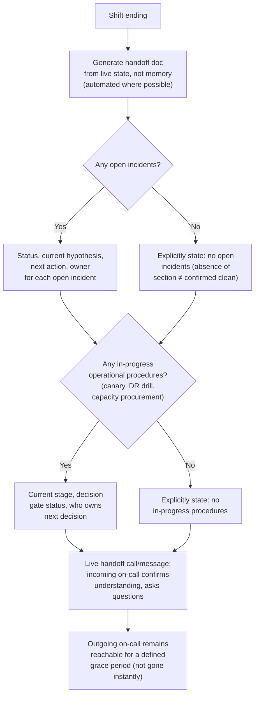
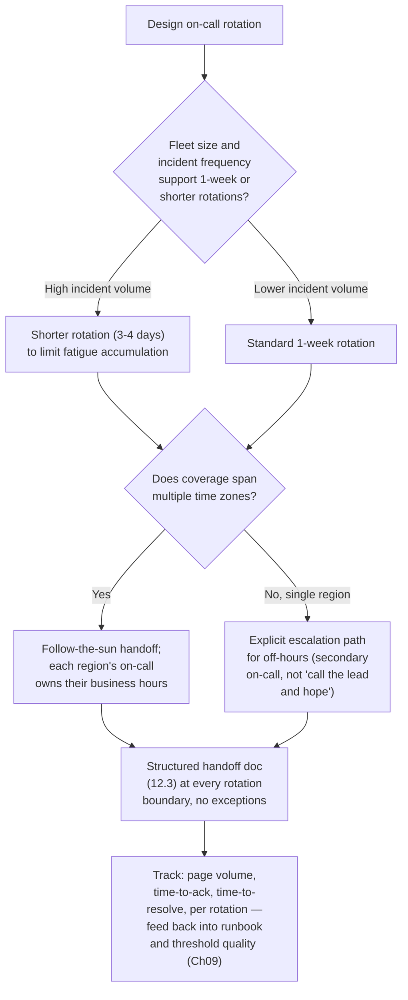

# Chapter 12 — On-Call Handoff and Operational Runbooks

**Learning outcome:** Design an on-call rotation and handoff process that doesn't lose context between shifts, write runbooks that get used under pressure instead of ignored, and integrate this volume's chapters into one operating model.

## 12.1 Why GPU on-call handoff is harder than typical infrastructure on-call

A web-service on-call handoff is usually "here's what's open, here's what to watch." GPU cluster on-call handoff carries more state because incidents in this domain unfold over longer timescales than a typical shift:

- **A training job's health status spans days**, not minutes — an on-call engineer coming onto shift needs to know not just "is anything on fire right now" but "is job X still on the checkpoint-interval recovery plan from two days ago, and where is it in that plan."
- **Degraded-but-not-failed states are common and easy to lose track of** — a node running at reduced PCIe link width (Chapter 20-adjacent) that's scheduled for maintenance next week isn't an active incident, but it's context the next on-call shift needs, or they'll rediscover it from scratch when a job on that node runs slow.
- **Decisions made under Chapter 1-11's frameworks (canary status, capacity headroom, DR posture) need to survive the handoff** — if the incoming on-call doesn't know a canary is mid-validation, they might promote it early or panic when its metrics look different from the rest of the fleet.

## 12.2 The handoff mechanism



The key discipline: **explicit "nothing to report" beats silent absence**. A handoff doc with no incident section could mean "no incidents" or "the outgoing engineer forgot to write one" — the reader can't tell the difference, so ambiguity itself becomes a risk. Every handoff should positively confirm both states.

## 12.3 Real evidence: a handoff doc that worked, and one that didn't

### A handoff that failed silently

```
# Handoff notes, 2026-07-14, shift ending 20:00 UTC
Nothing major today. node-047 was acting weird earlier but seems fine now.
Capacity looks ok. See you tomorrow.
```

Six hours later, node-047 caused a training job to hang. The incoming on-call had no context: what was "weird," what was checked, what "seems fine" was based on. They spent 40 minutes rediscovering information the outgoing engineer already had.

```bash
# What the incoming on-call had to reconstruct from scratch
$ ssh node-047 dmesg | grep -i "xid\|error" | tail -20
[reconstructing timeline that the outgoing engineer already knew]
```

### The same situation, handled with a structured handoff

```markdown
## Handoff — 2026-07-14, shift ending 20:00 UTC

### Open Incidents
None.

### Watch Items (not incidents, but relevant context)
1. **node-047**: Xid 13 (Graphics Engine Exception) observed at 14:22 UTC,
   single occurrence, no recurrence in 5+ hours since. Ran `dcgmi diag -r 2`
   at 14:35 — passed clean. **Not drained**, but flagged for extra
   attention; if it recurs, treat as a candidate for preventive drain
   even without a second confirmed failure (see Ch20 diagnostic
   framework — single Xid 13 with clean diag is inconclusive, not cleared).
   Next check: if no recurrence by end of your shift, downgrade from
   watch item to closed.

### In-Progress Procedures
1. **Driver canary** (Ch01 framework): node-04, node-07 on driver
   550.140, started 2026-07-13 09:00. 48h validation window ends
   2026-07-15 09:00. Metrics nominal so far (see canary dashboard link).
   **Do not promote before the window closes** even if metrics look
   good — that's the whole point of the 48h window.

### Capacity Status
Q3 forecast (Ch03): p99 utilization tracking toward the 98% threshold
around week 30 (~late Nov). Procurement order not yet placed — action
owner: platform-lead, due by mid-September. Not blocking, just tracking.
```

Six hours later, when node-047 does show a second issue, the incoming on-call already has the timeline, the prior diagnostic result, and an explicit decision criterion — the 40 minutes of reconstruction never happens.

```bash
$ ssh node-047 dmesg | grep -i xid | tail -5
[timestamp] Xid (PCI 0000:0a:00.0): 13, Graphics Engine Exception
# Second occurrence — matches the "if it recurs" criterion from the handoff.
# Decision already made in advance: drain and diagnose further, don't
# debate whether one Xid 13 six hours ago plus this one is "enough."
```

## 12.4 Runbooks that survive contact with 3 AM

### What makes a runbook get ignored

A runbook full of prose paragraphs, written for someone with full context and calm nerves, gets skipped by an exhausted on-call engineer at 3 AM who just wants the next concrete action. The failure mode is a runbook that reads well in a design review and is useless in the moment it's needed.

### What makes a runbook get used

```markdown
## Runbook: NCCL AllReduce Timeout — Active Training Job

**Trigger:** Alert `NCCLAllReduceTimeout` fires.

**Step 1 (2 min):** Identify affected job and ranks.
```
kubectl get pods -l app=training --field-selector status.phase=Running \
  -o custom-columns=NAME:.metadata.name,NODE:.spec.nodeName
```
→ If unclear which rank is stalled, go to Step 1a. Otherwise, Step 2.

**Step 1a (3 min):** Isolate stalled rank.
```
kubectl logs <pod> --tail=50 | grep -i "nccl\|timeout"
```
→ Note the rank number and node. Go to Step 2.

**Step 2 (2 min):** Check node health for the stalled rank's node.
```
ssh <node> nvidia-smi -q | grep -E "Xid|ECC|Throttle"
```
→ Xid error found? Go to **Chapter 20, relevant Xid chapter** for that
  specific code. Not found? Go to Step 3.

**Step 3 (2 min):** Check fabric health for that node (Ch05 method).
```
ssh <node> ibstat mlx5_0 | grep Rate
```
→ Rate below expected generation? This is the cause — go to Ch05
  remediation. Rate normal? Go to Step 4.

**Step 4:** Neither hardware nor fabric shows an issue. **Escalate to
platform on-call lead** — this is now outside the standard runbook's
coverage; don't keep guessing solo past this point.

**Decision authority:** You (on-call) can drain a node and restart a
job unilaterally. You need platform-lead sign-off before touching
switch configuration or escalating to the vendor.
```

Every step has a time estimate, a concrete command, and an explicit next branch — no step requires the reader to decide what to do next from open-ended judgment until Step 4, where the runbook explicitly hands off to a human decision rather than pretending to cover every case.

## 12.5 Decision tree: designing the on-call rotation itself



## 12.6 Production troubleshooting table

| Symptom | Evidence | Root Cause | Fix | Verification |
|---|---|---|---|---|
| Incoming on-call repeatedly rediscovers context the outgoing engineer already had | Handoff docs are informal/prose, missing structured incident/watch-item/in-progress-procedure sections | No enforced handoff template; relies on individual engineer's memory and writing habits | Adopt structured handoff template (12.3) with explicit "none" states; make it a submission requirement before shift ends | Post-handoff surveys/retros show reduced time-to-context for incoming on-call |
| On-call engineer freezes or improvises during a 3 AM incident despite a runbook existing | Runbook exists but is prose-heavy, assumes context, has no explicit step timing or branch points | Runbook written for design-review readability, not for use under pressure/fatigue | Rewrite as numbered steps, each with a time estimate, a concrete command, and an explicit next-branch — see 12.4 pattern | Game-day drills (Ch10 methodology) using the runbook show consistent step-by-step execution without improvisation |
| A "watch item" from a prior shift causes an incident, but nobody remembers it was flagged | Watch item was verbal or buried in chat history, not in a structured, searchable handoff doc | No durable, structured record of sub-incident-level context between shifts | Structured handoff doc with explicit watch-item section and closure criteria; store in a searchable, timestamped system, not chat | Watch items have a documented lifecycle (opened, monitored, closed) that survives across multiple shift boundaries |
| Same type of incident escalates differently depending on which engineer is on-call | No documented decision-authority boundaries (what on-call can decide unilaterally vs. what needs sign-off) | Escalation criteria exist only as unwritten convention, varying by individual engineer's risk tolerance | Document decision authority explicitly per runbook (12.4's "Decision authority" pattern) | Escalation behavior consistent across different on-call engineers for the same incident type |
| On-call burnout, rising incident response time over successive rotations | Page volume and time-to-ack trending worse across shifts for the same person/rotation | Alert fatigue (Ch09) compounding with insufficient rotation length or unclear off-hours escalation path | Address alert precision (Ch09) first; verify rotation length and secondary-escalation path are adequate for actual page volume | Time-to-ack and page volume stabilize or improve after alert-precision and rotation-length fixes |

## 12.7 Interview preparation

**Q: "How do you design an on-call handoff process for a GPU cluster, specifically — what's different from a typical software service?"**

A: "The biggest difference is that state in this domain spans much longer than a typical shift — a driver canary validation window is 48 hours, a capacity procurement decision unfolds over weeks, a 'watch item' on a node might matter three shifts later, not just during the shift it was noticed. So the handoff can't just be 'here's what's on fire' — it needs three explicit sections: open incidents, watch items that aren't incidents but need attention, and in-progress multi-day procedures with their current stage and decision-gate status. And critically, every section needs an explicit 'none' state — a handoff doc with a missing incident section is ambiguous about whether there are no incidents or the writer forgot, and that ambiguity is itself a risk I want to eliminate structurally, not rely on discipline to avoid."

**Q: "What makes a runbook actually get used during a real incident instead of ignored?"**

A: "The test I apply is: would this work for someone at 3 AM, tired, without the full context the author had when writing it? That means numbered steps, not prose paragraphs; a concrete command at each step, not a description of what to check; an explicit time estimate so the reader knows if they're falling behind; and an explicit branch to the next step based on what the command returns, so there's no moment where the reader has to improvise what to do next until the runbook deliberately hands off to human judgment — usually at an escalation point, not buried in the middle. I've seen well-written design documents fail as runbooks because they were optimized for readability in a calm review, not for execution under pressure, and those are different documents even if they cover the same content."

**Q: "How does this chapter tie together with the rest of the volume?"**

A: "This chapter is where the frameworks from every other chapter have to actually survive a shift change. A canary in progress from Chapter 1's upgrade framework, an open incident using Chapter 2's response process, a capacity threshold from Chapter 3, a watch item that might be an early Chapter 4 memory issue or a Chapter 5 fabric degradation — all of that context exists in someone's head at 8 PM and needs to be in someone else's head at 8:01 PM. The handoff and runbook discipline in this chapter isn't a separate topic from the rest of the volume; it's the mechanism that makes sure the other eleven chapters' frameworks actually get followed consistently, by whoever happens to be on shift, instead of only working when the specific engineer who designed them is the one responding."

## Key Takeaways

1. GPU on-call handoff carries more state than typical infrastructure on-call because incidents, canaries, and procurement decisions unfold over days, not minutes — the handoff doc needs explicit sections for open incidents, watch items, and in-progress procedures.
2. Every handoff section needs an explicit "none" state — silent absence is ambiguous between "nothing to report" and "forgot to report," and that ambiguity is itself a risk worth eliminating structurally.
3. A runbook that reads well in a design review can still fail as an operational document — test it against "would this work for someone at 3 AM without full context," which means numbered steps, concrete commands, time estimates, and explicit branches.
4. Runbooks should explicitly hand off to human judgment at a defined escalation point rather than pretending to cover every case — and document decision authority (what on-call can act on unilaterally vs. what needs sign-off) explicitly.
5. This chapter is the integration point for the whole volume: every other chapter's framework only works consistently across shift boundaries if the handoff and runbook discipline here is followed.

## Cross References

- Chapter 1: Cluster Lifecycle and Upgrade Operations — canary status is exactly the kind of in-progress-procedure state a handoff must carry
- Chapter 2: Incident Response and Game Day Execution — the incident-response process this chapter's handoff structure feeds into and out of
- Chapter 9: Monitoring and Observability at Scale — alert precision directly affects on-call fatigue and rotation sustainability
- Chapter 10: Disaster Recovery and Data Resilience — game-day methodology applied here to test runbooks, not just DR procedures
- Volume 20: Troubleshooting Encyclopedia — the Xid/diagnostic reference this chapter's runbook pattern routes into
