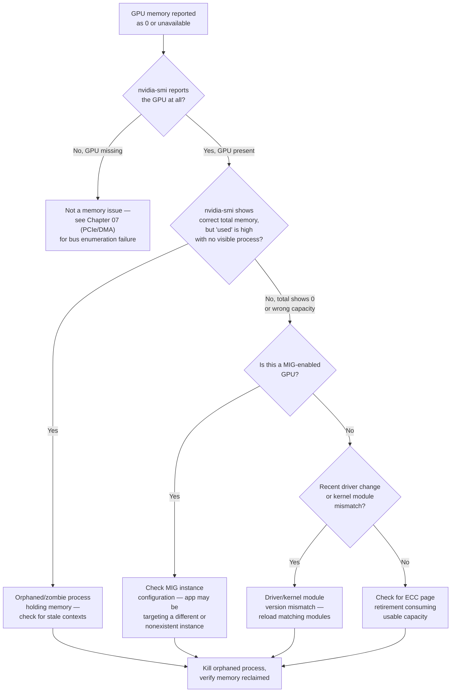

## Symptoms

- CUDA applications report insufficient memory despite GPU having ample capacity
- `nvidia-smi` shows `0 MiB` memory available
- `cudaGetDeviceProperties()` returns `totalGlobalMem = 0`
- Job fails during GPU memory allocation phase

## Evidence

### Key Metrics to Collect

- Memory reported by `nvidia-smi -q`
- CUDA API memory queries (`cudaMallocManaged`, `cudaGetDeviceProperties`)
- Memory fragmentation state
- GPU reset history
- Driver version compatibility

## Diagnosis

### Diagnosis flowchart



### First diagnostic step: confirm what the driver actually sees

```bash
$ nvidia-smi --query-gpu=index,name,memory.total,memory.used,memory.free --format=csv

index, name, memory.total [MiB], memory.used [MiB], memory.free [MiB]
0, NVIDIA A100-SXM4-80GB, 0 MiB, 0 MiB, 0 MiB
```

`memory.total` reporting 0 is the critical signal — this is not a "someone used it all up" problem, the driver itself doesn't believe the GPU has memory. Compare against a healthy GPU on the same node:

```bash
$ nvidia-smi --query-gpu=index,name,memory.total,memory.used,memory.free --format=csv
index, name, memory.total [MiB], memory.used [MiB], memory.free [MiB]
1, NVIDIA A100-SXM4-80GB, 81920 MiB, 2048 MiB, 79872 MiB
```

GPU 1 on the same node reports normally — this rules out a node-wide driver installation problem and narrows the investigation to GPU 0 specifically.

### Check for MIG misconfiguration first — the most common cause of this exact symptom

```bash
$ nvidia-smi -i 0 -q | grep -A5 "MIG Mode"
    MIG Mode
        Current                       : Enabled
        Pending                       : Enabled

$ nvidia-smi mig -lgi
No MIG-enabled GPU instances found on GPU 0.
```

**Root cause found in this case:** MIG mode is enabled on the GPU, but no GPU instances have been created — a GPU in MIG mode with zero instances configured reports 0 total memory to the top-level device query, because in MIG mode, memory only becomes visible to CUDA through an instance, not the parent device. This is by design, not a fault, and it's the single most common cause of this symptom on a freshly-provisioned or recently-reconfigured MIG node.

```bash
# Confirm: check if the application is even MIG-aware
$ echo $CUDA_VISIBLE_DEVICES
0
# App is targeting the whole device index, but MIG mode means it
# needs a MIG instance UUID (MIG-GPU-xxxx/N/N), not a device index
```

### If MIG is not the cause: check for a driver/kernel module mismatch

```bash
$ nvidia-smi
Failed to initialize NVML: Driver/library version mismatch

$ cat /proc/driver/nvidia/version
NVRM version: NVIDIA UNIX x86_64 Kernel Module  550.90.07
$ modinfo nvidia | grep ^version
version:        550.90.07

$ dmesg | grep -i nvidia | tail -5
[12345.678] NVRM: API mismatch: the client has the version 545.23.08,
            but this kernel module has the version 550.90.07.
```

A userspace library (545.23.08) mismatched against the loaded kernel module (550.90.07) — this happens when a driver package upgrade completes for the kernel module but a container image or stale library path still ships the old userspace libraries. The GPU is fully healthy; the driver stack is inconsistent.

### If neither: check for ECC page retirement eating into usable capacity

```bash
$ nvidia-smi -i 0 -q -d ECC | grep -A3 "Aggregate"
Aggregate
    Single Bit
        Volatile                   : 0
        Aggregate                  : 142
    Double Bit
        Volatile                   : 0
        Aggregate                  : 3

$ nvidia-smi -i 0 -q -d PAGE_RETIREMENT
Retired Pages
    Single Bit ECC             : 12
    Double Bit ECC             : 2
    Pending Page Blacklist     : Yes
```

`Pending Page Blacklist: Yes` combined with retired pages means the GPU has permanently removed some memory pages from the addressable pool due to ECC events — this reduces `memory.total` from its nameplate capacity, but should be a small, gradual reduction (megabytes), not the total collapse to 0 seen in this incident. If `memory.total` is fully 0, page retirement is very unlikely to be the sole cause and the MIG/driver-mismatch checks above should be exhausted first.

## Resolution

### Fix 1: MIG mode enabled with no instances configured

```bash
# Option A: create GPU instances matching the workload's needs
$ sudo nvidia-smi mig -cgi 9,9 -C   # two 3g.40gb instances, for example
Successfully created GPU instance ID 1 on GPU 0
Successfully created GPU instance ID 2 on GPU 0

$ nvidia-smi -L
GPU 0: NVIDIA A100-SXM4-80GB (UUID: GPU-8f3a...)
  MIG 3g.40gb Device 0: (UUID: MIG-GPU-8f3a.../1/0)
  MIG 3g.40gb Device 1: (UUID: MIG-GPU-8f3a.../2/0)

# Option B: if MIG was enabled unintentionally, disable it
$ sudo nvidia-smi -i 0 -mig 0
Disabled MIG Mode for GPU 00000000:0A:00.0
# GPU requires a reset (or reboot) to fully apply
$ sudo nvidia-smi -i 0 --gpu-reset
```

### Fix 2: driver/kernel module mismatch

```bash
# Identify and remove the stale userspace library path (common in
# containers with a baked-in old driver library, or after a host
# driver upgrade that a running container didn't pick up)
$ ldconfig -p | grep libnvidia-ml
libnvidia-ml.so.1 (libc6,x86-64) => /usr/lib/x86_64-linux-gnu/libnvidia-ml.so.545.23.08
libnvidia-ml.so.1 (libc6,x86-64) => /usr/lib/x86_64-linux-gnu/libnvidia-ml.so.550.90.07

# Remove/update the stale symlink so it resolves to the matching version
$ sudo ln -sf /usr/lib/x86_64-linux-gnu/libnvidia-ml.so.550.90.07 \
              /usr/lib/x86_64-linux-gnu/libnvidia-ml.so.1
$ sudo ldconfig

$ nvidia-smi
# Should now initialize successfully
```

For containerized workloads specifically, this usually means the container's base image bundles an old driver library independent of the host — the fix is ensuring the container uses the NVIDIA Container Toolkit's runtime, which mounts the host's driver libraries into the container instead of relying on ones baked into the image.

### Fix 3: orphaned process holding memory with no visible owner

```bash
$ nvidia-smi --query-compute-apps=pid,used_memory --format=csv
pid, used_memory [MiB]
48213, 71234

$ ps -p 48213
  PID TTY          TIME CMD
# (no output — process doesn't exist at the OS level, but the GPU
# still thinks it owns memory: a zombie CUDA context)

$ sudo fuser -k /dev/nvidia0
# Or, more targeted:
$ sudo nvidia-smi --gpu-reset -i 0
```

## Verification

### Verification Checklist

1. **`memory.total` reports the correct nameplate capacity:**
   ```bash
   nvidia-smi --query-gpu=memory.total --format=csv,noheader
   # Expected: 81920 MiB for an A100-SXM4-80GB (or the correct value
   # for your GPU model)
   ```

2. **A test CUDA allocation succeeds:**
   ```bash
   python3 -c "import torch; x = torch.zeros(1024, 1024, 1024, device='cuda'); print(x.numel() * 4 / 1e9, 'GB allocated OK')"
   ```

3. **For MIG fixes: instances are visible and correctly sized:**
   ```bash
   nvidia-smi -L
   # Expected: MIG instances listed with correct profile sizes
   ```

4. **For driver-mismatch fixes: `nvidia-smi` initializes without error:**
   ```bash
   nvidia-smi
   # Expected: normal output, no "Driver/library version mismatch"
   ```

5. **No orphaned processes remain:**
   ```bash
   nvidia-smi --query-compute-apps=pid,used_memory --format=csv
   # Expected: only currently-legitimate processes listed
   ```

### Production Troubleshooting Table

| Symptom | Evidence | Root Cause | Fix | Verification |
|---|---|---|---|---|
| `memory.total` reports 0, GPU otherwise responds normally | `nvidia-smi -q` shows MIG Mode: Enabled, `nvidia-smi mig -lgi` shows no instances | MIG enabled with zero GPU instances configured — expected behavior, not a fault | Create MIG instances matching workload needs, or disable MIG if unintended | `nvidia-smi -L` shows instances or full device correctly |
| `nvidia-smi` fails entirely with "Driver/library version mismatch" | `dmesg` shows API mismatch between userspace library version and kernel module version | Stale userspace driver library (often baked into a container image) not matching the host's loaded kernel module | Use NVIDIA Container Toolkit runtime to mount host driver libraries; update stale library symlinks | `nvidia-smi` initializes cleanly, no mismatch error |
| `used_memory` high with no corresponding OS process | `nvidia-smi --query-compute-apps` lists a PID that doesn't exist per `ps` | Zombie CUDA context — process crashed without cleanly releasing GPU memory | `nvidia-smi --gpu-reset` or `fuser -k /dev/nvidiaN` to force-clear | `nvidia-smi --query-compute-apps` shows no orphaned entries; memory.free returns to expected |
| `memory.total` slightly reduced from nameplate capacity | `nvidia-smi -q -d PAGE_RETIREMENT` shows retired pages, `Pending Page Blacklist: Yes` | ECC page retirement — GPU permanently removed a small number of pages after correctable errors | Usually no action needed for small reductions; track trend (see Chapter 02's Xid 92/63 guidance) and escalate if retired-page count is climbing | Retired-page count stable; memory.total reduction proportionate to known retirement events |
| App reports OOM despite `nvidia-smi` showing ample free memory | Discrepancy between `nvidia-smi` device-level view and app's CUDA context view | App targeting the wrong device index or MIG instance UUID | Verify `CUDA_VISIBLE_DEVICES` and, for MIG, that the app references the correct instance UUID, not a bare device index | App successfully allocates on the intended device/instance |

## Prevention

```bash
# Post-provisioning health check: verify every GPU reports its full
# nameplate memory before a node is accepted into the scheduling pool
#!/bin/bash
EXPECTED_MEM_MIB=81920  # A100-SXM4-80GB
for i in $(nvidia-smi --query-gpu=index --format=csv,noheader); do
  total=$(nvidia-smi -i $i --query-gpu=memory.total --format=csv,noheader,nounits)
  if [[ "$total" -lt $((EXPECTED_MEM_MIB - 100)) ]]; then
    echo "FAIL: GPU $i reports ${total}MiB, expected ~${EXPECTED_MEM_MIB}MiB"
    exit 1
  fi
done
echo "PASS: all GPUs report expected memory capacity"
```

```yaml
- alert: GPUMemoryTotalMismatch
  expr: nvidia_smi_memory_total_bytes < 0.95 * nvidia_smi_memory_total_expected_bytes
  for: 10m
  annotations:
    summary: "GPU {{ $labels.gpu }} reports memory total below 95% of expected nameplate capacity"
```

## Escalation

### When to Escalate

**Escalate to platform/hardware team if:**
- `memory.total` reports 0 and neither MIG misconfiguration nor driver mismatch explains it
- Retired-page count is climbing steadily (connect to Chapter 02's Xid 92/63 rate-trend guidance)
- The same node repeatedly develops driver/library mismatches after routine upgrades (points to a provisioning pipeline bug, see Chapter 01/Volume 19 Chapter 1)

**Escalation data to collect:**

```bash
echo "=== GPU Memory Escalation Data ===" > memory_escalation.log
nvidia-smi -q >> memory_escalation.log
nvidia-smi mig -lgi >> memory_escalation.log 2>&1
cat /proc/driver/nvidia/version >> memory_escalation.log
modinfo nvidia | grep version >> memory_escalation.log
dmesg | grep -i nvidia | tail -50 >> memory_escalation.log
```

### Interview Preparation

**Q: "`nvidia-smi` shows a GPU with 0 MiB total memory, but the GPU is otherwise visible and responding. What's your first hypothesis?"**

A: "My first check is whether MIG mode is enabled with no instances created — that's by far the most common cause of exactly this symptom, and it's expected driver behavior, not a fault: in MIG mode, the parent device doesn't expose memory directly, only individual GPU instances do. I'd run `nvidia-smi -q` to check MIG mode status and `nvidia-smi mig -lgi` to see if any instances exist. If MIG explains it, the fix is either creating the right-sized instances or disabling MIG if it was enabled unintentionally. If MIG isn't the cause, I'd move to checking for a driver/library version mismatch, which is the second most common cause and shows up as a distinct `nvidia-smi` initialization error rather than a clean 0 MiB report."

**Q: "How do you distinguish a real hardware memory problem from a MIG configuration issue?"**

A: "The key differentiator is whether the GPU is otherwise fully responsive. If `nvidia-smi` returns clean output for everything except memory — correct name, correct UUID, correct clock and temperature readings — and only memory.total is zero, that's a strong signal this is a configuration-layer issue like MIG or a library mismatch, not hardware. A genuine hardware memory problem usually comes with corroborating evidence elsewhere: Xid codes in dmesg, ECC errors, or the GPU failing to enumerate at all. I'd always check `nvidia-smi mig -lgi` and the dmesg log before assuming hardware failure, because the fix for a configuration issue takes minutes and the fix for a hardware issue takes a node replacement — jumping to the wrong conclusion is expensive in either direction."

**Q: "A containerized job reports CUDA errors that the same code doesn't produce on bare metal. Why might that be memory-related?"**

A: "A common cause is a driver/library version mismatch specific to the container — if the container image bundles its own CUDA/driver userspace libraries rather than using the NVIDIA Container Toolkit runtime to mount the host's matching libraries, the container's userspace can end up talking to a kernel module of a different version than it expects. This often manifests as memory allocation failures or outright `nvidia-smi` initialization failures inside the container, while the host's own `nvidia-smi` works fine. The fix is making sure the container runtime is configured to inject the host driver stack rather than shipping its own, which is what the NVIDIA Container Toolkit is specifically designed to handle."

