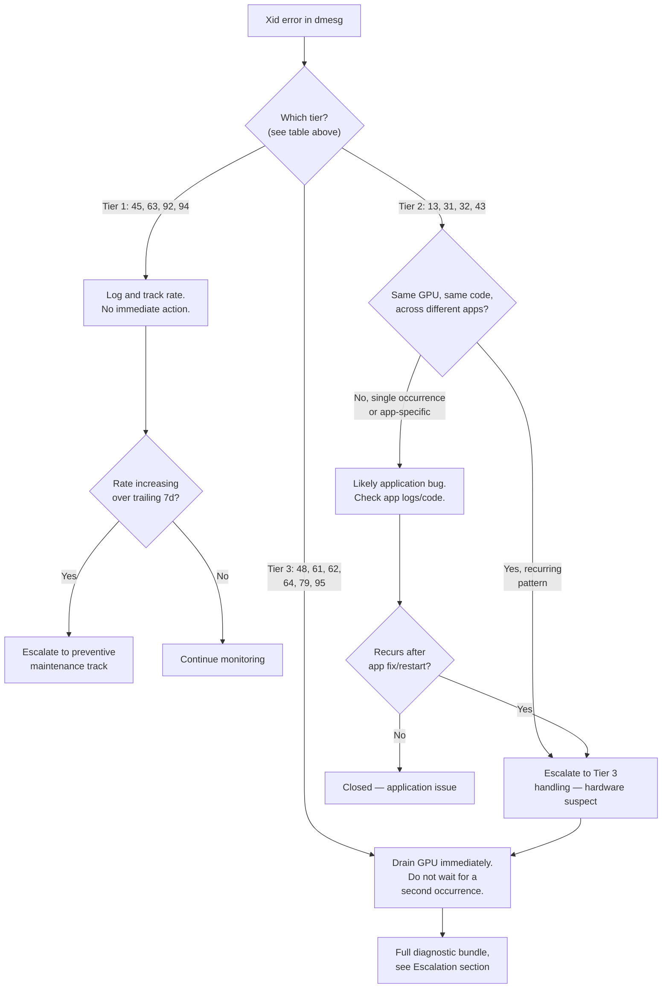

## Symptoms

- Xid error messages in `dmesg` output
- CUDA context suddenly becomes invalid
- GPU processes terminate abruptly
- `nvidia-smi` becomes unresponsive or reports GPU as "Not Supported"
- NCCL hangs with "unhandled cuda error"

## Evidence

### Key Metrics to Collect

- Xid error code and full dmesg output
- GPU state before/after crash
- Power consumption at time of error
- Temperature readings
- ECC error counters

## Diagnosis

### The Xid reference table

Every Xid diagnosis in this curriculum starts here. An Xid is a driver-reported error code, logged to `dmesg`/`/var/log/kern.log` in the form `NVRM: Xid (PCI:<bus>): <code>, <message>`. The code is what matters for triage — the free-text message varies by driver version and should never be pattern-matched on its own.

| Xid | Meaning | Typical Cause | Recoverable? |
|---|---|---|---|
| 13 | Graphics Engine Exception | Illegal instruction or address in a compute/graphics kernel; can be an application bug or a hardware fault if recurring on the same GPU with different applications | Usually yes (process-level); escalate if it recurs across unrelated workloads |
| 31 | GPU memory page fault | Out-of-bounds or invalid GPU memory access (application bug), or a genuine DMA/memory-controller fault if it recurs with no code change | Usually yes if application-caused; treat as hardware suspect if recurring |
| 32 | Invalid or corrupted push buffer stream | Driver/application command stream corruption, sometimes PCIe-related | Usually yes; escalate if paired with PCIe errors |
| 43 | GPU stopped processing | The GPU's command processor hung; often follows another Xid as a downstream symptom | Depends on root cause — reset and check for a preceding Xid |
| 45 | Preemptive cleanup, due to previous errors | The driver recovered/cleaned up a context after an earlier fault — **look at what came immediately before this one in dmesg**, it's rarely the root cause itself | Yes — it's a symptom, not a root cause |
| 48 | Double Bit ECC Error (uncorrectable) | Uncorrectable memory error — the GPU cannot continue safely | **No** — GPU should be drained and the affected memory page retired/GPU serviced |
| 61 | Internal micro-controller breakpoint/warning | GPU firmware-level fault | No — treat as hardware issue, escalate |
| 62 | Internal micro-controller halt | GPU firmware/embedded controller halted | No — treat as hardware issue, escalate |
| 63 | ECC page retirement or row remapping recording event | The GPU is recording a memory location for retirement/remap after a correctable ECC event — informational/preventive, not a link or bus failure | Yes — GPU keeps running; track frequency |
| 64 | ECC page retirement or row remapping failure | The GPU failed to record/complete a page retirement or row remap | No — escalate, this indicates the self-healing mechanism itself is failing |
| 74 | NVLink Error | NVLink link-level error detected | Depends — see Chapter 04 (NVLink Errors and Topology Issues) for the full diagnostic path |
| 79 | GPU has fallen off the bus | The GPU is no longer enumerable on PCIe — the headline "GPU fell off the bus" symptom | No, without intervention — see Chapter 07 (DMA Engine Failures and PCIe Issues) |
| 92 | High single-bit ECC error rate | Correctable ECC events occurring at an elevated rate — precursor signal, not yet a failure | Yes for now — monitor trend, plan preventive maintenance if rate keeps rising |
| 94 | Contained ECC error | A correctable/contained memory error the GPU handled itself without disruption | Yes — no action needed beyond logging; see Chapter 07 for why this is often confused with bus-fall-off codes |
| 95 | Uncontained ECC error | An ECC error the GPU could **not** contain — data integrity at risk | **No** — treat as an immediate drain-and-diagnose case, same severity tier as Xid 48 |

**How to use this table under pressure:** first classify the code into one of three tiers before doing anything else:

- **Tier 1 — informational/self-healing (63, 92, 94, 45):** GPU keeps running. Log it, track frequency, don't page anyone at 3 AM for a single occurrence.
- **Tier 2 — process/application-recoverable (13, 31, 32, 43):** likely recoverable at the process level; only escalate to hardware suspicion if the *same GPU* repeats the *same code* across *different, unrelated* applications.
- **Tier 3 — GPU-level failure (48, 61, 62, 64, 79, 95):** stop scheduling new work on this GPU immediately; these do not self-heal and false-negative on this tier costs far more than a false-positive drain.

### Diagnosis flowchart



### First diagnostic step: capture the full context, not just the code

```bash
$ dmesg -T | grep -B5 -A5 "Xid" | tail -60

[Tue Aug  4 14:22:03 2026] NVRM: Xid (PCI:0000:0a:00): 79, pid=48213, name=python, GPU has fallen off the bus.
[Tue Aug  4 14:22:03 2026] NVRM: GPU 0000:0a:00.0: RmInitAdapter failed!
[Tue Aug  4 14:21:58 2026] NVRM: Xid (PCI:0000:0a:00): 45, pid=48213, name=python, Preemptive cleanup, due to previous errors
[Tue Aug  4 14:21:52 2026] NVRM: Xid (PCI:0000:0a:00): 92, pid=48213, name=python, High single-bit ECC error rate
```

**Reading this in order (oldest first, since dmesg prints newest-first with `-T`):** Xid 92 (Tier 1, informational) fired first, followed six seconds later by Xid 45 (Tier 1, cleanup after "previous errors" — pointing back at the 92), followed five seconds after that by Xid 79 (Tier 3, GPU fell off the bus). **The Xid 92 and 45 were early warning, not noise — in hindsight, the rising ECC rate was a precursor to the bus failure.** This is why Tier 1 codes get tracked for rate trends (Prevention section) rather than ignored outright, even though no single Tier 1 occurrence is actionable by itself.

```bash
# Confirm current GPU state matches the Xid 79 diagnosis
$ lspci | grep -i nvidia
# (no output — GPU 0a:00.0 missing entirely, confirms Xid 79)

$ nvidia-smi -i 0
No devices were found
```

### Second diagnostic step: check ECC/retirement history for context

```bash
$ nvidia-smi -i 0 -q -d ECC 2>&1 || echo "GPU unreachable — pull from DCGM historical data instead"

$ dcgmi diag -r 1 --json 2>/dev/null | jq '.tests[] | select(.name=="ECC")'
# (if GPU is off the bus, query the last-known-good DCGM snapshot instead of live)
$ dcgmi dmon -e 202 --list-history --gpu 0 --window 24h
Timestamp             DBE_Count   SBE_Count
2026-08-04 08:00:00       0          12
2026-08-04 10:00:00       0          31
2026-08-04 12:00:00       0          58
2026-08-04 14:00:00       0          94   <- rate accelerating in the hours before the Xid 79
```

Single-bit (correctable) ECC count rising from 12/2h to 94/2h over 6 hours, with zero double-bit events, confirms the pattern: this GPU's memory subsystem was degrading progressively, generating Tier 1 warnings the whole time, before finally producing an unrecoverable Tier 3 event.

## Resolution

### Step 1: Confirm tier and stop new scheduling immediately for Tier 3

```bash
# Kubernetes: cordon and drain before touching anything else
$ kubectl cordon gpu-node-14
$ kubectl drain gpu-node-14 --ignore-daemonsets --delete-emptydir-data --grace-period=60

# Slurm equivalent
$ scontrol update NodeName=gpu-node-14 State=DRAIN Reason="Xid 79 - GPU fell off bus"
```

### Step 2: Attempt recovery appropriate to the tier

**For Tier 3 bus-fall-off (Xid 79):** attempt a PCIe rescan before assuming hardware replacement (full procedure in Chapter 07):

```bash
$ echo 1 > /sys/bus/pci/devices/0000:0a:00.0/remove
$ sleep 3
$ echo 1 > /sys/bus/pci/rescan
$ sleep 3
$ lspci | grep -i nvidia
0a:00.0 3D controller [0302]: NVIDIA Corporation Device [10de:20f1] (rev a1)
# GPU re-enumerated — attempt driver reload
$ sudo modprobe nvidia && nvidia-smi -i 0
```

**For Tier 3 uncontained/double-bit ECC (Xid 48, 95):**

```bash
# Do NOT attempt a simple reset and return to service — uncontained ECC
# means data integrity was compromised for whatever was in that memory
# region. Any job that was running needs to be treated as having
# produced unreliable output, not just "the GPU crashed."
$ sudo nvidia-smi -i 0 --reset
# Reset is for returning the GPU to a clean state to run diagnostics,
# not a fix — proceed to Step 3 before returning to the scheduling pool.
```

**For Tier 2 application-recoverable codes (13, 31, 32, 43):**

```bash
# Restart the affected process/pod; if it's a Kubernetes-managed job,
# this typically happens automatically via the pod's restart policy
$ kubectl get pod <pod> -o jsonpath='{.status.containerStatuses[0].restartCount}'
3
# Track restart count — a healthy app-bug case shows 1 restart and then
# stability; a GPU hardware issue shows restarts continuing to fail
```

### Step 3: Run full diagnostics before returning any Tier 3 GPU to service

```bash
$ dcgmi diag -r 3 -i 0

Successfully ran diagnostic for group.
+---------------------------+------------------------------------------------+
| Diagnostic                | Result                                          |
+===========================+==================================================+
| Deployment                | Pass                                            |
| Integration                | Pass                                            |
| Hardware (Memory)          | **Fail** - Row remap pending, ECC test failed   |
| Stress                     | Skipped (blocked by Hardware failure)           |
+---------------------------+------------------------------------------------+
```

A `Hardware` test failure at level 3 is a hard stop — this GPU does not go back into the scheduling pool. Proceed to Escalation.

## Verification

### Verification Checklist

1. **For Tier 3 GPUs: confirm `dcgmi diag -r 3` passes clean before uncordoning:**
   ```bash
   dcgmi diag -r 3 -i 0
   # Expected: all stages Pass, including Hardware and Stress
   ```

2. **For Tier 2 recoveries: confirm no Xid recurrence over a monitoring window:**
   ```bash
   dmesg -T | grep Xid | tail -20
   # Expected: no new Xid entries for this GPU since the fix
   ```

3. **ECC rate trend confirmed flat, not just currently zero:**
   ```bash
   dcgmi dmon -e 202 --list-history --gpu 0 --window 24h
   # Expected: SBE count stable/low, not accelerating like the pre-failure pattern
   ```

4. **GPU re-enumerated correctly on PCIe (for Xid 79 recoveries):**
   ```bash
   lspci -s 0a:00.0 -vvv | grep LnkSta
   # Expected: full negotiated width/speed, not down-trained
   ```

5. **Node returned to scheduling pool only after all above pass:**
   ```bash
   kubectl uncordon gpu-node-14
   kubectl get node gpu-node-14 -o jsonpath='{.status.conditions[?(@.type=="Ready")].status}'
   # Expected: True
   ```

### Production Troubleshooting Table

| Symptom | Evidence | Root Cause | Fix | Verification |
|---|---|---|---|---|
| Xid 79, GPU disappears from `lspci` | GPU missing from PCIe enumeration; `nvidia-smi` reports no devices | GPU fell off the PCIe bus — check preceding dmesg lines for a Tier 1 precursor pattern first | Rescan PCIe bus; if GPU re-enumerates, run `dcgmi diag -r 3` before returning to service; if it doesn't re-enumerate, hardware replacement (Chapter 07) | `lspci` shows GPU at full link width/speed; `dcgmi diag -r 3` passes clean |
| Xid 48 or 95, GPU still enumerable | dmesg shows double-bit/uncontained ECC; GPU responds to `nvidia-smi` but should not be trusted with new work | Uncontained memory error — any job running at the time may have produced corrupted output | Drain immediately, do not just restart the job on the same GPU; run `dcgmi diag -r 3`; flag any output from the affected job for review | Diagnostic passes clean; affected job's output independently verified or discarded |
| Xid 92 firing repeatedly over days, no Tier 3 event yet | `dcgmi dmon` shows SBE count trending upward over the trailing week | Progressive memory degradation — Tier 1 today, likely Tier 3 eventually | Schedule preventive maintenance/replacement before it becomes an unplanned Tier 3 incident; do not wait for the double-bit event | SBE rate trend flat or GPU proactively replaced before failure |
| Xid 13 or 31 on one GPU, different unrelated apps, days apart | Same GPU, same code, but application logs show no shared bug pattern | Likely a hardware issue masquerading as recurring application-level faults | Escalate to Tier 3 handling despite the code technically being Tier 2 — recurrence across unrelated applications overrides the default tier classification | `dcgmi diag -r 3` run proactively; GPU drained if hardware fault confirmed |
| Xid 45 seen with nothing else nearby in dmesg | Cleanup event with no obvious preceding fault in the visible log window | The triggering event scrolled out of the visible tail — dmesg buffer wrapped, or log rotation trimmed it | Pull a wider dmesg window or check persistent journal (`journalctl -k`) rather than assuming Xid 45 has no cause | Root cause Xid identified further back in the log; treat 45 as confirmation something else needs investigation, never as self-explanatory |

## Prevention

### Health Checks

```bash
# Continuous Xid classification and tiered alerting
#!/bin/bash
TIER3="48|61|62|64|79|95"
TIER1="45|63|92|94"

dmesg -T | grep "Xid" | tail -n 20 | while read -r line; do
  code=$(echo "$line" | grep -oP 'Xid \(PCI:[^)]+\): \K[0-9]+')
  if [[ "$code" =~ ^($TIER3)$ ]]; then
    echo "PAGE: Tier 3 Xid $code detected — $line"
    # trigger immediate drain via scheduler API
  elif [[ ! "$code" =~ ^($TIER1)$ ]]; then
    echo "INVESTIGATE: Tier 2 Xid $code — $line"
  fi
done
```

```yaml
# Prometheus alert rules — tiered by Xid classification, not uniform severity
- alert: XidTier3Critical
  expr: increase(dcgm_xid_errors{xid=~"48|61|62|64|79|95"}[5m]) > 0
  for: 0m
  labels: {severity: page}
  annotations:
    summary: "GPU {{ $labels.gpu }} Tier 3 Xid {{ $labels.xid }} — drain immediately"

- alert: XidTier1RateRising
  expr: increase(dcgm_xid_errors{xid=~"63|92|94"}[7d]) > 3 * increase(dcgm_xid_errors{xid=~"63|92|94"}[7d] offset 7d)
  for: 6h
  labels: {severity: ticket}
  annotations:
    summary: "GPU {{ $labels.gpu }} Tier 1 Xid rate up >3x week-over-week — precursor pattern, schedule preventive check"
```

### Weekly Xid trend review

```bash
$ python xid_trend_report.py --window 7d --group-by gpu,xid_code

GPU        Xid   Count(this week)   Count(prior week)   Trend
gpu-014     92         94                  12            +683% <- would have caught this incident 2 days early
gpu-089     94          8                   9              -11%
gpu-102     13          2                   1             +100% (low absolute count, low priority)
```

## Escalation

### When to Escalate

**Escalate to GPU vendor/hardware team if:**
- Any Tier 3 Xid (48, 61, 62, 64, 79, 95) occurs — hardware team notification is standard practice for this tier, not an exception
- `dcgmi diag -r 3` Hardware or Stress stage fails
- A Tier 2 code recurs on the same GPU across unrelated applications (see troubleshooting table)
- Tier 1 rate has increased more than 3x week-over-week with no corresponding workload change

**Escalation data to collect:**

```bash
echo "=== Xid Escalation Data ===" > xid_escalation.log

# Full Xid history for this GPU, widest available window
journalctl -k --since "-30 days" | grep -i xid >> xid_escalation.log

# ECC/retirement history
dcgmi dmon -e 202 --list-history --gpu 0 --window 720h >> xid_escalation.log

# Full diagnostic run
dcgmi diag -r 3 -i 0 >> xid_escalation.log 2>&1

# GPU identity and firmware versions (for vendor correlation across a fleet)
nvidia-smi -i 0 -q | grep -E "GPU UUID|VBIOS|Serial" >> xid_escalation.log
```

### Interview Preparation

**Q: "What does Xid 79 mean, and how is it different from Xid 94?"**

A: "Xid 79 is 'GPU has fallen off the bus' — the GPU is no longer enumerable on PCIe at all, confirmed by checking `lspci`. Xid 94 is 'Contained ECC error' — a correctable memory error the GPU handled internally without any disruption; the GPU keeps running and doesn't need any recovery action. They're easy to confuse because both can show up in a stream of dmesg output around a GPU incident, but they're not related codes — 79 is a bus/link failure, 94 is a routine, self-healed memory event. I'd never treat a 94 as evidence the GPU is failing on its own; I'd only escalate it if I saw it combined with a rising rate over time or paired with a genuinely disruptive code like 79 or 48."

**Q: "How do you decide whether to page someone immediately versus just logging an Xid error?"**

A: "I classify by tier, not by treating every Xid as equally urgent. Codes like 48, 61, 62, 64, 79, and 95 are GPU-level failures that don't self-heal — I page and drain immediately for those, no exceptions, because the cost of a false-negative there is much higher than a false-positive drain. Codes like 45, 63, 92, and 94 are informational or self-healing — a single occurrence gets logged, not paged, but I track the rate over time, because I've seen a rising rate of Tier 1 codes be the early-warning signal for a Tier 3 failure hours later. And codes like 13, 31, 32, 43 are usually application-recoverable, but if the same GPU shows the same code across genuinely unrelated applications, that pattern overrides the default classification and I treat it as a hardware suspect worth a proactive diagnostic run."

**Q: "A GPU shows Xid 92 a few times over a week — do you take it offline?"**

A: "Not immediately, but I don't ignore it either. Xid 92 is a high single-bit ECC error rate — it's a precursor signal, not a failure by itself, since single-bit ECC events are correctable and the GPU's memory is designed to handle them. What matters is the trend: I'd pull the DCGM ECC history and check whether the rate is flat or accelerating week-over-week. If it's accelerating, I'd schedule preventive maintenance or replacement before it progresses to an uncontained error, rather than waiting for a Tier 3 event to force an unplanned outage. I've seen exactly this pattern — rising Xid 92 for hours, then an Xid 79 bus failure — so treating the early rate increase as a real signal, not noise, is the difference between a scheduled maintenance window and an unplanned incident."

