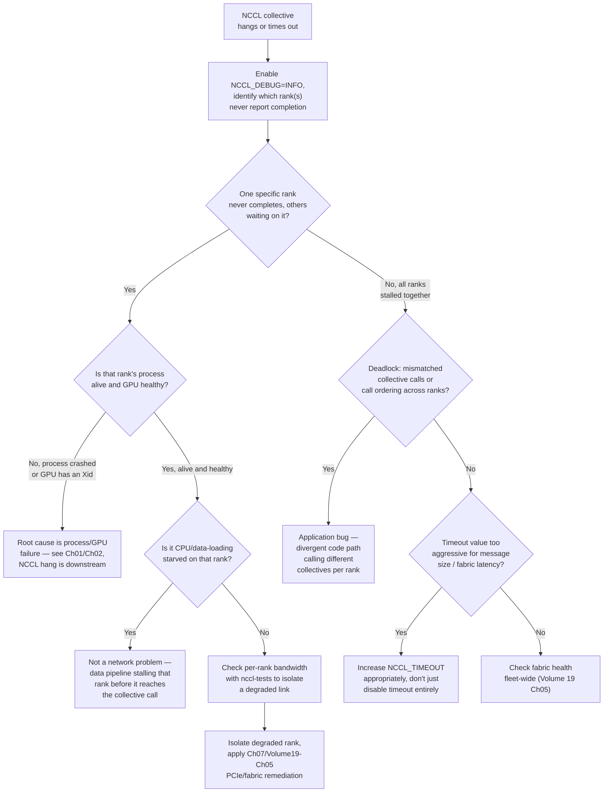

## Symptoms

- NCCL AllReduce hangs indefinitely
- `NCCL operation timed out` error after several minutes
- Distributed training stalls on collective operations
- One GPU in a ring hangs the entire collective
- `ncclInternalError` with cryptic message

## Evidence

### Key Metrics to Collect

- NCCL_DEBUG=TRACE output from hang
- NCCL timeout value set
- Network bandwidth measurements
- Ring topology from `nvidia-smi topo -m`
- Per-GPU iteration timing from profiler

## Diagnosis

### Diagnosis flowchart



### First diagnostic step: enable NCCL debug tracing to find the stalled rank

```bash
$ NCCL_DEBUG=INFO NCCL_DEBUG_SUBSYS=COLL python train.py 2>&1 | tee nccl_trace.log &
# Let it hang for ~2 minutes, then interrupt and inspect

$ grep "AllReduce" nccl_trace.log | tail -40

[rank0] NCCL INFO AllReduce: opCount 4821, sendbuff ..., count 268435456, root=0
[rank1] NCCL INFO AllReduce: opCount 4821, sendbuff ..., count 268435456, root=0
[rank2] NCCL INFO AllReduce: opCount 4821, sendbuff ..., count 268435456, root=0
# rank3 never logs opCount 4821 — it's still stuck on the previous op
[rank3] NCCL INFO AllReduce: opCount 4820, sendbuff ..., count 268435456, root=0
```

Ranks 0-2 have moved on to `opCount 4821`; rank 3 is still processing `opCount 4820` — this identifies the stalled rank precisely, without guessing. Every other rank is blocked waiting for rank 3 to reach the same collective call, which is the expected, correct behavior of a synchronous collective — the fix target is rank 3, not the collective mechanism itself.

### Second step: is rank 3's process alive, and is its GPU healthy?

```bash
$ kubectl exec -it training-pod-3 -- ps aux | grep python
root       1  0.3  2.1 python train.py --rank 3   # process alive

$ ssh node-hosting-rank3 dmesg | grep -i xid | tail -5
# (no output — no Xid errors on this GPU)

$ ssh node-hosting-rank3 nvidia-smi -i 0 --query-gpu=utilization.gpu,temperature.gpu,power.draw --format=csv,noheader
2, 61, 78.3 W
```

Process is alive, no Xid errors, but SM utilization is 2% and power draw is near-idle — the GPU isn't crashed, it's **starved of work**, meaning something upstream of the GPU (most likely the CPU-side data pipeline) is the actual bottleneck, not NCCL or the network.

### Third step: confirm the data-pipeline hypothesis

```bash
$ kubectl exec -it training-pod-3 -- python -c "
import time
t0 = time.perf_counter()
batch = next(iter(train_loader))
print(f'batch fetch took {time.perf_counter()-t0:.2f}s')
"
batch fetch took 47.31s
```

47 seconds to fetch one batch on rank 3, versus a healthy sub-second fetch on the other ranks (confirmed by running the same check there) — this rank's data loader is the actual root cause. The NCCL "timeout" is a downstream symptom: rank 3 simply hasn't reached the collective call yet because it's still waiting on data, and NCCL's synchronous design means every other rank waits for it.

```bash
# Root-cause the slow data fetch itself
$ kubectl exec -it training-pod-3 -- df -h /data
Filesystem      Size  Used Avail Use% Mounted on
storage-pv-3    500G  480G   20G  96% /data
# Storage volume for rank 3 specifically is near capacity, causing I/O contention
```

## Resolution

### Step 1: if the hang traces to a starved rank (data pipeline), fix the pipeline, not NCCL

```bash
# Immediate: free up space / redistribute the storage-heavy node's load
$ kubectl exec -it training-pod-3 -- find /data/tmp -mtime +7 -delete

# Structural fix: this rank's storage volume shouldn't have diverged
# from the others — check whether data sharding is uneven
$ kubectl exec -it training-pod-3 -- du -sh /data/shard-3
187G
$ kubectl exec -it training-pod-0 -- du -sh /data/shard-0
41G
# Shard 3 is 4.5x larger than shard 0 — uneven sharding is the real
# root cause, not the storage volume size itself
```

### Step 2: if the hang traces to a crashed process or unhealthy GPU

```bash
# NCCL will not recover on its own once a rank has actually died —
# the whole job needs to restart, ideally from the last checkpoint
$ kubectl delete pod training-pod-3
$ kubectl get pods -l app=training-job-771 -o wide
# Verify replacement pod schedules cleanly
$ ./resume_from_checkpoint.sh --job training-job-771
```

### Step 3: if the hang traces to a genuinely degraded fabric link

```bash
# Follow Volume 19 Chapter 5's fabric-validation methodology exactly:
$ /opt/nccl-tests/build/all_reduce_perf -b 128M -e 128M -f 2 -g 8 --nnodes <n>
# Isolate the slow rank by bandwidth, then check ibstat Rate on that
# specific host before assuming a software cause
```

### Step 4: if the hang traces to a timeout value mismatched to message size

```bash
# NCCL's default timeout can be too aggressive for very large collectives
# on a congested or high-latency fabric — but raising it should be a
# deliberate, bounded decision, not "disable timeout entirely"
$ export NCCL_TIMEOUT=1800   # was default ~600s; raised deliberately
                              # after confirming large messages legitimately
                              # need more time on this topology, not
                              # papering over a real hang
```

**Do not set an unbounded or extremely large timeout as a default fix** — a genuinely hung rank should still surface as a timeout within a reasonable window; disabling the safety net just delays detection of a real problem by hours instead of minutes.

### Step 5: if the hang traces to a code-level deadlock (divergent collective calls)

```python
# Common bug pattern: a conditional that causes different ranks
# to call different collectives, or a different number of them
if rank == 0:
    dist.all_reduce(tensor_a)
    dist.all_reduce(tensor_b)   # <- only rank 0 calls this second one
else:
    dist.all_reduce(tensor_a)
# Every non-zero rank is now waiting for a collective that rank 0
# will call, but no other rank will ever call — permanent deadlock,
# not a timing issue, and increasing NCCL_TIMEOUT will never fix it
```

```bash
# Confirm via NCCL trace: does op count diverge structurally, or is
# it just running behind? A structural deadlock shows every rank
# stuck at a *different* op count with no forward progress ever,
# not converging like the starved-rank case above
```

## Verification

### Verification Checklist

1. **Job completes a full collective cycle without hanging:**
   ```bash
   NCCL_DEBUG=INFO python train.py --steps 5 2>&1 | grep -c "AllReduce"
   # Expected: count matches (num_ranks × num_collective_calls_per_step × steps)
   ```

2. **Per-rank data fetch time is uniform:**
   ```bash
   # Re-run the batch-fetch timing check across all ranks
   # Expected: fetch times within the same order of magnitude across ranks
   ```

3. **`nccl-tests` bandwidth matches fleet baseline for all ranks:**
   ```bash
   /opt/nccl-tests/build/all_reduce_perf -b 128M -e 128M -f 2 -g 8
   # Expected: no per-rank outlier (see Volume 19 Chapter 5)
   ```

4. **No recurrence over an extended run:**
   ```bash
   # Run 100+ steps, confirm zero timeouts
   ```

### Production Troubleshooting Table

| Symptom | Evidence | Root Cause | Fix | Verification |
|---|---|---|---|---|
| One rank never reaches the current op count, others waiting | NCCL trace shows one rank stuck at a lower opCount; that rank's GPU shows low utilization, no Xid | Rank is starved upstream of NCCL — usually a slow/uneven data pipeline, not a network issue | Fix data pipeline bottleneck (uneven sharding, slow storage); NCCL itself isn't the problem | All ranks progress through opCounts in lockstep, fetch times uniform |
| One rank stuck, GPU shows an Xid error | dmesg on that rank's node shows a Tier 2/3 Xid (Chapter 02) | GPU or process fault, NCCL hang is a downstream symptom | Resolve per Chapter 02's tiered Xid guidance; restart job from checkpoint | Job resumes cleanly on replacement hardware |
| All ranks stall simultaneously, none progressing | NCCL trace shows every rank stuck at differing, non-converging op counts | Application-level deadlock — divergent collective call pattern across ranks (a code bug) | Fix the code path so every rank calls the same sequence of collectives unconditionally | Code review/test confirms symmetric collective calls across all ranks; job completes |
| Timeout fires on legitimately large collectives on a slower/longer-latency link | No hardware fault found; message size and fabric topology explain the duration | NCCL_TIMEOUT set too aggressively for this workload's actual collective duration | Deliberately raise NCCL_TIMEOUT to a bounded, justified value — not disable it | Collectives complete within the new timeout consistently; timeout doesn't mask a real future hang |
| Bandwidth to one rank measurably lower than others | `nccl-tests` per-rank bandwidth shows an outlier | Degraded fabric link (see Volume 19 Chapter 5 methodology) | Apply Chapter 5's `ibstat` Rate check and remediation | Per-rank bandwidth uniform across the job after fix |

## Prevention

```bash
# Pre-flight check: verify data shard balance before a large job starts,
# not after it hangs mid-training
#!/bin/bash
for shard in /data/shard-*; do
  size=$(du -sh "$shard" | cut -f1)
  echo "$shard: $size"
done
# Alert if any shard is >2x the median shard size
```

```yaml
- alert: NCCLCollectiveStalledRank
  # Requires per-rank opCount export from NCCL_DEBUG or an app-level heartbeat
  expr: (max(nccl_op_count) - min(nccl_op_count)) by (job) > 2
  for: 3m
  annotations:
    summary: "Job {{ $labels.job }} has a rank lagging >2 collective ops behind the fastest rank"
```

## Escalation

### When to Escalate

**Escalate to platform/network team if:**
- Per-rank bandwidth isolation points to a fabric-layer issue after ruling out data pipeline and process health (see Volume 19 Chapter 5)
- The same rank/node combination stalls across multiple, unrelated jobs — suggests a persistent node issue, not job-specific
- A code-level deadlock is suspected but the team cannot locate the divergent code path — pair with the application owner, not just infra on-call

**Escalation data to collect:**

```bash
echo "=== NCCL Timeout Escalation Data ===" > nccl_escalation.log
NCCL_DEBUG=INFO NCCL_DEBUG_SUBSYS=ALL python train.py --steps 3 2>&1 | tee -a nccl_escalation.log
nvidia-smi topo -m >> nccl_escalation.log
/opt/nccl-tests/build/all_reduce_perf -b 128M -e 128M -f 2 -g 8 >> nccl_escalation.log 2>&1
```

### Interview Preparation

**Q: "A distributed training job hangs with an NCCL timeout. How do you find which rank is the problem?"**

A: "I enable `NCCL_DEBUG=INFO` and let it run long enough to capture trace output, then grep for the collective operation counts per rank. Ranks that have moved on to a higher op count are healthy and waiting; the rank still stuck at a lower op count is the one to investigate — everyone else is correctly blocked on it because that's how a synchronous collective works. Once I have that rank identified, I check whether its process is alive and whether its GPU shows any Xid errors. If both look healthy but SM utilization is near zero, that tells me the rank isn't even reaching the collective call yet — it's starved somewhere upstream, most commonly a slow or unevenly-sharded data pipeline, not a network problem at all."

**Q: "Why shouldn't you just set a very large NCCL_TIMEOUT as a default fix for these hangs?"**

A: "Because the timeout is a safety net for detecting a genuine hang, and disabling it or setting it enormously large just delays detection of a real problem — instead of finding out in 10 minutes that a rank has died or a process is deadlocked, you find out hours later, after wasting far more compute time waiting. If large collectives genuinely need more time on a particular topology, I'd raise the timeout deliberately and by a bounded, justified amount based on measured collective duration — but that's a different decision than treating the timeout as an annoyance to suppress. I'd rather have a timeout that fires and forces investigation than a job that silently wastes GPU-hours for hours before anyone notices."

**Q: "How do you tell a network problem apart from a code-level deadlock when NCCL hangs?"**

A: "The signature is different in the NCCL trace. A network or starved-rank problem shows most ranks converging on the same op count while one or a few lag behind — they're making progress, just slower or blocked upstream. A code-level deadlock, from something like a conditional that makes different ranks call different collectives, shows ranks stuck at genuinely different op counts with zero forward progress over time — nobody is converging because the ranks are waiting on collective calls that will never be issued by their counterparts. If I see the gap between ranks' op counts stay static rather than slowly closing, I treat it as an application bug and go straight to code review of the collective call sites, rather than chasing a hardware explanation that won't exist."

