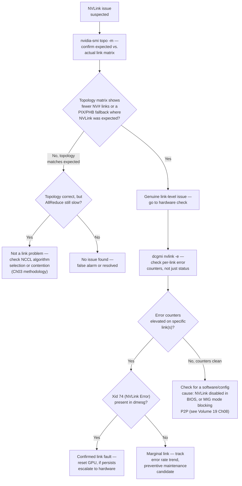

## Symptoms

- NVLink error counters increment in DCGM
- GPU-to-GPU communication falls back to PCIe (10x slower)
- `nvidia-smi topo -m` shows no NVLink connections between GPUs expected to be connected
- Specific GPU pairs fail to communicate efficiently
- AllReduce latency 2-3x worse than expected

## Evidence

### Key Metrics to Collect

- DCGM NVLink error counters
- `nvidia-smi topo -m` output
- Physical topology validation
- AllReduce latency per GPU pair
- dmesg for PCIe errors

## Diagnosis

### Diagnosis flowchart



### First diagnostic step: confirm actual vs. expected topology

```bash
$ nvidia-smi topo -m

        GPU0    GPU1    GPU2    GPU3    CPU Affinity
GPU0     X      NV12    NV12    NV12    0-31
GPU1    NV12     X      NV12    NV12    0-31
GPU2    NV12    NV12     X      PIX     32-63   <- expected NV12, showing PIX
GPU3    NV12    NV12    PIX      X      32-63

# Legend: NV# = NVLink with # links; PIX = PCIe through a PCIe bridge
# (no NVLink); PHB = PCIe through the host bridge; SYS = PCIe across
# NUMA nodes (worst case)
```

GPU2-GPU3 shows `PIX` — this pair is communicating over PCIe, not NVLink, while every other pair shows `NV12` (12 NVLink connections, the expected A100 SXM4 topology within a fully-connected 4-GPU baseboard). This alone is the finding: two GPUs that should have direct NVLink connectivity have fallen back to PCIe, which is roughly an order of magnitude lower bandwidth.

### Second step: check DCGM's NVLink error counters, not just link presence

```bash
$ dcgmi nvlink -e -g 2

+-----------------------------------------------------------------------------+
| GPU ID: 2                                                                    |
| Link  | CRC Errors | Replay Errors | Recovery Errors | Status               |
|-------|------------|---------------|------------------|-----------------------|
|   0   |     0      |      0        |       0          | Down                 |
|   1   |     0      |      0        |       0          | Down                 |
|   2   |  184213    |    92104      |       12         | Down                 |
+-----------------------------------------------------------------------------+
```

Link 2 (the link to GPU3) shows a large accumulated CRC and replay error count before finally going Down entirely — this is not a link that failed instantly; it degraded through a long period of correctable-but-elevated errors before the driver took it fully offline. Links 0 and 1 (to GPU0 and GPU1) show zero errors and are healthy.

### Third step: confirm with dmesg for the corresponding Xid

```bash
$ dmesg -T | grep -i "xid.*74\|nvlink" | tail -10

[Wed Aug  5 03:12:01 2026] NVRM: Xid (PCI:0000:65:00): 74, pid=<n/a>, name=<unknown>, NVLink: fatal error detected on link 2
[Wed Aug  5 03:12:01 2026] NVRM: GPU 0000:65:00.0: NVLink link 2 disabled due to error
```

**Xid 74 confirms this is a genuine, driver-recognized NVLink fault**, not just a monitoring artifact — cross-reference against Chapter 02's Xid table: 74 sits outside the three-tier classification used for GPU-internal faults because it's specifically a link-level error requiring its own diagnostic path, which is what this chapter provides.

### Fourth step: rule out MIG or configuration causes before assuming hardware fault

```bash
# NVLink P2P is intentionally disabled between separate MIG instances,
# even on the same physical GPU — this is a security/isolation boundary
# (see Volume 19 Chapter 08), not a fault, and produces a topology
# matrix that superficially looks like a missing-link problem
$ nvidia-smi -i 2 -q | grep -A3 "MIG Mode"
    MIG Mode
        Current                       : Disabled
        Pending                       : Disabled
# MIG is disabled here — ruled out, this is a genuine hardware case
```

If MIG mode had been enabled, the correct interpretation would be "working as designed," not "NVLink fault" — this distinction matters because the remediation paths are completely different (do nothing vs. hardware escalation), and conflating them wastes a hardware ticket on intended behavior.

## Resolution

### Step 1: attempt a GPU reset to see if the link recovers

```bash
$ sudo nvidia-smi -i 2 --gpu-reset
# Note: gpu-reset requires no active CUDA contexts on the GPU;
# drain workloads first

$ nvidia-smi topo -m
        GPU0    GPU1    GPU2    GPU3
GPU2    NV12    NV12     X      PIX     <- still PIX after reset
```

Reset did not restore the link — this rules out a transient software/firmware state issue and points toward a physical-layer or hardware fault (damaged NVLink bridge/connector on the baseboard, or a GPU-side NVLink transceiver failure).

### Step 2: isolate whether the fault is GPU2's or GPU3's side

```bash
# Check GPU3's link counters for the same link pair
$ dcgmi nvlink -e -g 3
+-----------------------------------------------------------------------------+
| GPU ID: 3                                                                    |
| Link  | CRC Errors | Replay Errors | Recovery Errors | Status               |
|-------|------------|---------------|------------------|-----------------------|
|   0   |     0      |      0        |       0          | Down                 |
|   2   |     0      |      0        |       0          | Down                 |
```

GPU3's corresponding link shows zero errors before going down — it's a passive victim of GPU2's link failure, not independently faulty. This narrows the physical fault to GPU2's NVLink transceiver or the specific bridge/trace connecting GPU2 to GPU3 on the baseboard, not a GPU3-side problem.

### Step 3: drain the affected GPU and escalate to hardware

```bash
$ kubectl cordon <node>
$ kubectl drain <node> --ignore-daemonsets

# Document the specific finding for the hardware ticket:
# GPU2's NVLink to GPU3 (link index 2) shows escalating CRC/replay
# errors culminating in Xid 74 and a driver-forced link-down; GPU3's
# corresponding link is clean, isolating the fault to GPU2's
# transceiver or the GPU2-GPU3 physical connection specifically.
```

### Step 4: if no reset/hardware action is possible immediately, mitigate at the scheduling layer

```bash
# Until the GPU is serviced, avoid scheduling jobs that require
# GPU2<->GPU3 direct NVLink for performance-critical collectives —
# a job can still run using the remaining healthy links, just with
# a topology-aware placement that avoids relying on the broken pair
$ kubectl label node <node> nvlink-degraded=gpu2-gpu3
# Scheduler policy: jobs requiring full NV12 mesh avoid this node;
# jobs tolerant of PCIe fallback for one pair can still use it
```

## Verification

### Verification Checklist

1. **Topology matrix shows expected link type for all pairs (post-repair):**
   ```bash
   nvidia-smi topo -m
   # Expected: NV12 (or appropriate link count) for all intra-baseboard pairs
   ```

2. **DCGM error counters reset and stay at zero:**
   ```bash
   dcgmi nvlink -e -g 2
   # Expected: 0 CRC/replay/recovery errors, Status: Up
   ```

3. **No Xid 74 recurrence:**
   ```bash
   dmesg -T | grep "Xid.*74" | tail -5
   # Expected: no new entries since repair
   ```

4. **AllReduce performance matches fleet baseline:**
   ```bash
   /opt/nccl-tests/build/all_reduce_perf -b 128M -e 128M -f 2 -g 4
   # Expected: bandwidth matches other healthy nodes, no PCIe-fallback penalty
   ```

### Production Troubleshooting Table

| Symptom | Evidence | Root Cause | Fix | Verification |
|---|---|---|---|---|
| Topology matrix shows PIX/PHB where NV# expected | `nvidia-smi topo -m` shows PCIe-class link between GPUs on the same baseboard | Genuine NVLink hardware fault, or MIG mode blocking P2P (check MIG status first) | If MIG: no action needed (working as designed). If hardware: reset, then escalate if unresolved | Topology restored to expected NV# link type |
| DCGM shows high CRC/replay errors before link goes Down | `dcgmi nvlink -e` shows large accumulated error counts on one link, others clean | Progressive physical-layer degradation (bridge/transceiver) culminating in driver-forced link-down | Escalate to hardware — this is a physical fault, not software-recoverable | Replacement hardware shows zero errors on the same link index |
| Xid 74 in dmesg | `NVLink: fatal error detected on link N` | Driver-confirmed NVLink fault, distinct from GPU-internal Xid tiers (Chapter 02) | Follow this chapter's isolation-then-escalate path, not the generic Xid tier table | Link Status returns to Up with zero error counters post-repair |
| One GPU's link clean, its pair's link shows errors | Asymmetric `dcgmi nvlink -e` results between the two GPUs sharing a link | Fault isolated to one GPU's transceiver or the specific physical connection, not a shared/systemic issue | Escalate with the specific asymmetric evidence — narrows hardware repair scope | Repaired GPU's link counters clean; paired GPU (which was never faulty) unaffected throughout |
| AllReduce slow but topology matrix looks correct | `nvidia-smi topo -m` shows expected NV# everywhere, but latency still elevated | Not a topology/link problem — check NCCL algorithm selection, contention, or a starved rank (Chapter 03) | Apply Chapter 03's methodology instead of continuing to investigate NVLink hardware | Root cause found in the correct subsystem, not misattributed to NVLink |

## Prevention

```bash
# Continuous topology validation: alert on any deviation from the
# node's known-good topology signature, not just link-down events
#!/bin/bash
EXPECTED_TOPO_HASH=$(cat /etc/gpu-cluster/expected_topo_signature)
CURRENT_TOPO_HASH=$(nvidia-smi topo -m | sha256sum | awk '{print $1}')
if [[ "$CURRENT_TOPO_HASH" != "$EXPECTED_TOPO_HASH" ]]; then
  echo "ALERT: topology signature changed on $(hostname) — investigate before scheduling"
fi
```

```yaml
- alert: NVLinkErrorRateRising
  expr: increase(dcgm_nvlink_crc_errors[6h]) > 1000
  for: 30m
  annotations:
    summary: "GPU {{ $labels.gpu }} link {{ $labels.link }} CRC errors rising — preventive maintenance candidate before full link-down"

- alert: NVLinkDown
  expr: dcgm_nvlink_link_status == 0
  for: 5m
  labels: {severity: page}
  annotations:
    summary: "GPU {{ $labels.gpu }} NVLink {{ $labels.link }} is Down — check topology matrix and Xid 74"
```

## Escalation

### When to Escalate

**Escalate to hardware team if:**
- A GPU reset does not restore an expected NVLink connection
- DCGM error counters show sustained elevated CRC/replay rates even without a full link-down (preventive maintenance candidate)
- Xid 74 recurs on the same GPU/link after a reset

**Escalation data to collect:**

```bash
echo "=== NVLink Escalation Data ===" > nvlink_escalation.log
nvidia-smi topo -m >> nvlink_escalation.log
dcgmi nvlink -e -g 0 >> nvlink_escalation.log
dcgmi nvlink -e -g 1 >> nvlink_escalation.log
dcgmi nvlink -e -g 2 >> nvlink_escalation.log
dcgmi nvlink -e -g 3 >> nvlink_escalation.log
dmesg -T | grep -i nvlink >> nvlink_escalation.log
```

### Interview Preparation

**Q: "`nvidia-smi topo -m` shows PIX between two GPUs that should have NVLink. How do you diagnose it?"**

A: "First I rule out the configuration explanation before assuming hardware failure: is MIG mode enabled on either GPU? NVLink P2P is intentionally disabled between MIG instances by design, and that produces exactly this topology signature without any fault at all. If MIG is disabled, then I move to `dcgmi nvlink -e` to check per-link error counters, not just link status — a link that's shown large accumulated CRC or replay errors before going down tells a different, more specific story than one that just silently disappeared. I'd also check dmesg for Xid 74, which is the driver's own confirmation of a fatal NVLink error and distinguishes this from a monitoring or topology-detection artifact."

**Q: "How do you figure out which of two GPUs sharing a failed NVLink is actually at fault?"**

A: "I check both GPUs' error counters for the shared link independently. If one GPU shows a large accumulated error count on that link index and the other shows zero errors before the link simply went down, the fault is isolated to the GPU with the errors — its NVLink transceiver or its side of the physical connection. This matters operationally because it changes what gets replaced: escalating with 'link between GPU2 and GPU3 is down' is much less useful to a hardware team than 'GPU2's transceiver on link 2 shows 184K CRC errors, GPU3's corresponding link is clean' — the second version tells them exactly where to look."

**Q: "Your topology looks completely correct but AllReduce is still 2x slower than expected. Is this an NVLink chapter problem?"**

A: "Not necessarily, and I'd be careful not to force it into this chapter's diagnostic path just because NVLink is involved in the collective. If `nvidia-smi topo -m` shows the expected NV# links everywhere and DCGM shows clean error counters, the topology and hardware are healthy — the slowdown is happening somewhere else. I'd go to the NCCL-timeout chapter's methodology instead: check per-rank op-count progression to see if one rank is starved upstream of the collective, or check whether the NCCL algorithm selection is appropriate for the message size. Misattributing a data-pipeline or algorithm-selection problem to NVLink hardware wastes an escalation and delays finding the actual cause."

