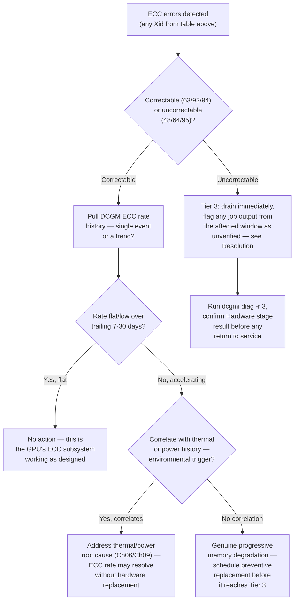

## Symptoms

- DCGM reports correctable ECC errors (CECs)
- DCGM reports uncorrectable ECC errors (UECs) — GPU halts
- Random training loss spikes without code changes
- Model accuracy diverges from baseline
- Specific GPU exhibits unusual error rates

## Evidence

### Key Metrics to Collect

- DCGM ECC counters (correctable, uncorrectable, aggregate)
- ECC error rate trend (errors per GPU-hour)
- Which memory module (HBM0-9 on H100) exhibits errors
- Thermal history correlation
- Power supply ripple measurements

## Diagnosis

### Cross-reference to Chapter 02's Xid tiers first

ECC events surface primarily through four Xid codes covered in Chapter 02's reference table — this chapter goes deeper on the ECC-specific diagnosis and remediation, but the tier classification comes from there:

| Xid | Meaning | Tier |
|---|---|---|
| 63 | ECC page retirement/row remap recording event | Tier 1 — informational, self-healing |
| 92 | High single-bit ECC error rate | Tier 1 — precursor signal, track trend |
| 94 | Contained ECC error | Tier 1 — no action needed |
| 48 | Double Bit ECC Error (uncorrectable) | Tier 3 — drain immediately |
| 64 | ECC page retirement/row remap failure | Tier 3 — the self-healing mechanism itself failed |
| 95 | Uncontained ECC error | Tier 3 — drain immediately, verify affected job output |

### Diagnosis flowchart



### First diagnostic step: classify correctable vs. uncorrectable, and get the full counter picture

```bash
$ nvidia-smi -i 0 -q -d ECC

ECC Errors
    Volatile
        Single Bit
            Device Memory           : 42
            Register File           : 0
            L1 Cache                : 0
            L2 Cache                : 3
            Total                   : 45
        Double Bit
            Device Memory           : 0
            Total                   : 0
    Aggregate
        Single Bit
            Total                   : 891
        Double Bit
            Total                   : 0
```

Zero double-bit (uncorrectable) errors, both volatile (since last reset) and aggregate (lifetime) — this GPU has not had a Tier 3 event. 891 aggregate single-bit errors is the number to evaluate against a rate trend, not against zero, since a nonzero correctable-error count over a GPU's lifetime is expected and not inherently concerning.

### Second step: pull the rate trend, not just the current count

```bash
$ dcgmi dmon -e 202 --list-history --gpu 0 --window 720h  # 30 days

Timestamp             SBE_delta   Cumulative
2026-07-08 00:00:00      3            612
2026-07-15 00:00:00      4            658
2026-07-22 00:00:00      5            719
2026-07-29 00:00:00      8            891
```

Weekly delta rising from 3 to 8 over four weeks — roughly 2.7x over the month. This is a trend worth investigating, not a single reading to react to; the question now is whether it's environmentally caused or a genuine hardware degradation signal.

### Third step: correlate against thermal and power history

```bash
$ promql_query 'avg_over_time(gpu_temperature_celsius{gpu="0"}[30d])'
71.2
$ promql_query 'max_over_time(gpu_temperature_celsius{gpu="0"}[30d])'
84.6   # approaching throttle threshold — see Chapter 06

$ promql_query 'correlation(gpu_temperature_celsius{gpu="0"}, dcgm_ecc_sbe_total{gpu="0"})[30d]'
0.81   # strong positive correlation
```

A strong correlation (0.81) between temperature and single-bit ECC rate over the same 30-day window is a meaningful finding: elevated temperature is a known physical driver of increased bit-flip rate in DRAM/HBM (higher thermal energy makes charge-state bit flips more likely). This points toward a thermal root cause rather than a GPU with an inherently failing memory die — which changes the remediation path entirely (see Resolution).

### Fourth step: identify which specific memory partition is affected, if the tooling supports it

```bash
$ dcgmi diag -r 2 --json 2>/dev/null | jq '.tests[] | select(.name=="Memory")'
{
  "name": "Memory",
  "result": "Pass",
  "info": "0 errors found in current diagnostic pass"
}

# For row-remap-specific detail (post-Ampere GPUs)
$ nvidia-smi -i 0 -q -d ROW_REMAPPER

Row Remapper
    Correctable Error                    : 12
    Uncorrectable Error                  : 0
    Pending                              : No
    Remapping Failure Occurred           : No
    Bank Remap Availability History
        Max                              : 640
        High                             : 8
        Partial                          : 2
        Low                              : 0
        None                             : 630
```

12 correctable rows have been remapped out of the available pool, with 630 banks still reporting no remapping needed — the GPU's self-healing row-remap mechanism (the mechanism behind Xid 63) is functioning and has plenty of headroom. `Remapping Failure Occurred: No` is the specific field to watch — if this ever flips to `Yes`, that's Xid 64 territory (Tier 3), meaning the self-healing mechanism itself is failing, not just handling routine correctable events.

## Resolution

### Path A: uncorrectable error (Xid 48/95) — Tier 3, immediate action

```bash
$ kubectl cordon <node> && kubectl drain <node> --ignore-daemonsets

# Critical: any job that was actively using this GPU's memory at the
# time of the uncorrectable error may have produced silently corrupted
# results — an uncorrectable ECC error means data integrity for that
# memory region was not guaranteed, unlike a correctable event
$ kubectl get pods --field-selector spec.nodeName=<node> -o json \
  | jq -r '.items[].metadata.name' > affected_jobs.txt
# Flag these jobs' checkpoints/outputs from the incident window for
# review or re-run — do not assume the output is trustworthy just
# because the job didn't crash
```

```bash
$ nvidia-smi -i 0 -q -d ROW_REMAPPER | grep "Remapping Failure"
Remapping Failure Occurred           : No
# If "Yes": Xid 64 territory, the self-healing mechanism failed —
# escalate directly to hardware, do not attempt further recovery
```

### Path B: correctable errors, rate trending up, correlated with thermal

```bash
# Address the thermal root cause per Chapter 06's methodology first —
# do not jump straight to hardware replacement when there's a clear
# environmental driver
$ sudo nvidia-smi -pl 250 -i 0   # reduce power limit temporarily
$ # verify airflow, check thermal paste per Ch06 if temperature
  # doesn't respond to power reduction alone

# Re-measure the ECC rate trend after 1-2 weeks of corrected thermal conditions
$ dcgmi dmon -e 202 --list-history --gpu 0 --window 168h
Timestamp             SBE_delta
2026-08-05 00:00:00      1
2026-08-06 00:00:00      2
2026-08-07 00:00:00      1
# Rate back down near baseline — thermal fix resolved it, no hardware
# replacement needed
```

### Path C: correctable errors, rate trending up, no environmental correlation

```bash
# This is the genuine progressive-degradation case — schedule
# preventive replacement rather than waiting for a Tier 3 event
$ ./schedule_maintenance.sh --node <node> --reason "ECC SBE rate trending +170%/month, no thermal/power correlation, row-remap headroom at 630/640" --priority preventive
```

### Path D: `Remapping Failure Occurred: Yes` (Xid 64)

```bash
# The GPU's own self-healing mechanism has failed — this is always
# Tier 3 regardless of how the correctable-error rate itself looks
$ kubectl cordon <node> && kubectl drain <node> --ignore-daemonsets
$ dcgmi diag -r 3 -i 0   # expect Hardware/Memory stage failure, confirming
```

## Verification

### Verification Checklist

1. **For uncorrectable-error incidents: `dcgmi diag -r 3` passes clean before return to service:**
   ```bash
   dcgmi diag -r 3 -i 0
   # Expected: all stages Pass, including Memory/Hardware
   ```

2. **For thermal-correlated correctable errors: rate returns to baseline after thermal fix:**
   ```bash
   dcgmi dmon -e 202 --list-history --gpu 0 --window 168h
   # Expected: weekly delta back within historical normal range
   ```

3. **Row remapper headroom still healthy:**
   ```bash
   nvidia-smi -i 0 -q -d ROW_REMAPPER | grep -E "Remapping Failure|None"
   # Expected: "Remapping Failure Occurred: No", most banks still in "None" category
   ```

4. **Affected job outputs reviewed (for uncorrectable-error cases):**
   ```bash
   # Confirm the checkpoint/output review from Path A was completed and
   # documented, not left as an open item
   ```

### Production Troubleshooting Table

| Symptom | Evidence | Root Cause | Fix | Verification |
|---|---|---|---|---|
| Xid 48 or 95, GPU halted or job crashed | `nvidia-smi -q -d ECC` shows nonzero double-bit/uncorrectable count | Uncorrectable memory error — data integrity for the affected region not guaranteed | Drain immediately; flag affected job output for review; run `dcgmi diag -r 3` before any return to service | Diagnostic passes clean; affected job's output independently verified or discarded |
| Correctable ECC rate climbing, strongly correlated with temperature | `promql` correlation between temp and SBE rate > 0.7; row-remap headroom still large | Thermal-driven bit-flip rate increase, not a failing memory die | Address thermal root cause (Chapter 06) before considering hardware replacement | ECC rate returns to baseline within 1-2 weeks of thermal fix |
| Correctable ECC rate climbing, no thermal/power correlation | Rate trend accelerating with flat temperature/power history | Genuine progressive hardware degradation | Schedule preventive replacement before it reaches an uncorrectable event | GPU replaced proactively; no unplanned Tier 3 incident on this unit |
| Row Remapper "Remapping Failure Occurred: Yes" | `nvidia-smi -q -d ROW_REMAPPER` shows failure flag set | The GPU's self-healing mechanism has itself failed (Xid 64) | Treat as Tier 3 regardless of correctable-error rate appearance; drain and escalate | Replacement hardware shows "No" and healthy remap headroom |
| Training loss spikes intermittently, no crash | No Xid at all, but loss curve shows unexplained spikes correlating in time with low-level correctable ECC events | Correctable ECC events can, in rare cases, introduce a transient numerical perturbation even though the hardware "corrected" it, if the correction interacts with certain reduced-precision training paths | Correlate loss-spike timestamps against ECC event timestamps; if correlated, consider this evidence for hardware review even absent a crash-level signal | Loss spikes stop coinciding with ECC events after hardware or thermal remediation |

## Prevention

```bash
# Weekly ECC rate trend report, fleet-wide — the same discipline
# Chapter 02 recommends applied specifically to the ECC-relevant codes
$ python ecc_trend_report.py --window 7d --compare-to 7d-prior

GPU         SBE(this week)   SBE(prior week)   Trend    Temp Correlation
gpu-014          8                3            +167%         0.81  <- flag for thermal review
gpu-089          2                2              0%           0.12
gpu-102          5                4             +25%          0.09  <- below alert threshold, monitor
```

```yaml
- alert: ECCRateRisingWithThermalCorrelation
  expr: |
    (increase(dcgm_ecc_sbe_total[7d]) > 2 * increase(dcgm_ecc_sbe_total[7d] offset 7d))
    and
    (avg_over_time(gpu_temperature_celsius[7d]) > 75)
  for: 6h
  annotations:
    summary: "GPU {{ $labels.gpu }} ECC rate rising with elevated temperature — check thermal (Ch06) before assuming hardware failure"

- alert: RowRemapperFailure
  expr: dcgm_row_remapper_failure == 1
  for: 0m
  labels: {severity: page}
  annotations:
    summary: "GPU {{ $labels.gpu }} row remapper failure (Xid 64) — Tier 3, drain immediately"
```

## Escalation

### When to Escalate

**Escalate to hardware team if:**
- Any uncorrectable ECC event (Xid 48, 95) occurs
- Row Remapper shows `Remapping Failure Occurred: Yes` (Xid 64)
- Correctable ECC rate is climbing with no thermal/power correlation — preventive replacement candidate
- Row-remap bank headroom drops into the "Low" or "None" category becoming a large fraction of total banks (approaching exhaustion of the self-healing mechanism's capacity)

**Escalation data to collect:**

```bash
echo "=== ECC Escalation Data ===" > ecc_escalation.log
nvidia-smi -i 0 -q -d ECC >> ecc_escalation.log
nvidia-smi -i 0 -q -d ROW_REMAPPER >> ecc_escalation.log
dcgmi dmon -e 202 --list-history --gpu 0 --window 720h >> ecc_escalation.log
dcgmi diag -r 3 -i 0 >> ecc_escalation.log 2>&1
# Thermal/power history for correlation review
promql_query 'gpu_temperature_celsius{gpu="0"}[30d]' >> ecc_escalation.log
```

### Interview Preparation

**Q: "A GPU shows a rising correctable ECC error rate but no crashes. Do you escalate for hardware replacement?"**

A: "Not immediately — I'd first check whether the rate correlates with something environmental, specifically temperature, since elevated temperature is a known physical driver of increased bit-flip rate independent of the memory hardware actually degrading. I'd pull both the ECC rate trend and the thermal history over the same window and check the correlation. If they track together, I'd address the thermal issue first — better cooling, power limit reduction, or whatever Chapter 06's methodology points to — and re-measure the ECC rate after that fix before considering hardware replacement at all. If the rate is climbing with no environmental correlation, that's when I'd treat it as genuine progressive hardware degradation and schedule a preventive replacement, rather than waiting for it to escalate into an uncorrectable event."

**Q: "What's the difference in how you respond to Xid 94 versus Xid 48?"**

A: "Xid 94 is a contained ECC error — the GPU handled it internally, no data was at risk, and no action is needed beyond logging it as part of the normal rate-trend tracking. Xid 48 is a double-bit, uncorrectable ECC error — the GPU could not correct it, meaning data integrity for that memory region isn't guaranteed. That's a completely different severity: I drain the GPU immediately, and just as importantly, I go back and flag whatever job was actively using that GPU's memory during the event, because its output might be silently corrupted rather than obviously crashed. The job not crashing doesn't mean its results are trustworthy if it was touching that memory region when an uncorrectable error occurred."

**Q: "How does the GPU's row-remap mechanism relate to Xid 63 and 64, and why does it matter operationally?"**

A: "Modern NVIDIA GPUs can remap a memory row that's shown a correctable error to a spare row, so future accesses avoid the degraded location entirely — that remapping event is what generates Xid 63, and it's routine, self-healing behavior with no action needed. What I do watch operationally is the remaining headroom for this mechanism — `nvidia-smi -q -d ROW_REMAPPER` shows how many banks still have spare capacity versus how many have already used it. If that headroom gets thin, or if the remapping itself ever fails — which generates Xid 64 — that's a hard escalation, because at that point the GPU's own self-healing capability for memory errors is exhausted or broken, and any subsequent correctable error has nowhere to go but become a real problem."

