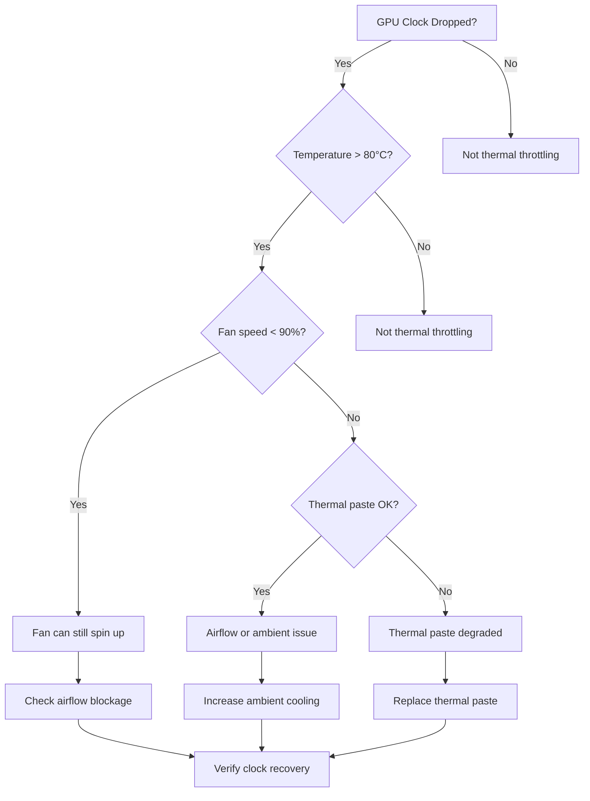

## Symptoms

- GPU clock speed drops from 2.5 GHz to 1.8 GHz during load
- Performance degrades 15-30% mid-training without code changes
- Temperature rises to 85°C (throttle threshold)
- DCGM reports thermal slowdown events
- Fan speed maxes at 100% but temperature still rising

## Evidence

### Key Metrics to Collect

- GPU temperature trend (`nvidia-smi dmon`)
- Clock speed before/after throttle
- Fan speed and fan health
- Thermal events from DCGM
- Ambient temperature
- Power consumption

## Diagnosis

### Diagnosis Flowchart



### First Diagnostic Step: Temperature and Clock Correlation

```bash
$ nvidia-smi dmon -s puctem

# GPU   Pwr Temp SM Mem  Enc Dec XSM Mxm Fbg Xid Pid Name
     0  245   85  99  62   38   0   0   0   0   0   - python
     1  250   83  98  61   40   0   0   0   0   0   - python
     2  249   82  97  60   35   0   0   0   0   0   - python
     3  250   84  99  61   39   0   0   0   0   0   - python
```

**Interpretation:**
- Temperature at 85°C is at the throttle threshold
- SM (streaming multiprocessor) utilization at 99% → GPU is throttled
- Power draw at 245-250W (close to limit)
- All GPUs show similar temperature pattern

### Check Clock Speed Changes

```bash
$ nvidia-smi -i 0 -q -d CLOCK | grep "Current Clocks"
        Current Clocks
            Graphics                       : 1833 MHz
            SM                             : 1833 MHz
            Memory                         : 1215 MHz
            Video                          : 1440 MHz
```

**Before throttle (from logs):** 2500 MHz
**During throttle:** 1833 MHz → **27% clock reduction**

Compare against baseline:

```bash
$ nvidia-smi -i 0 --query-gpu=clocks.current.graphics --format=csv,noheader
1833
1834
1832
1833
# Output stable at ~1833 MHz
```

### Check Thermal Events in DCGM

```bash
$ dcgmi dmon -s etm

# GPU Event:Thermal
     0 0
     1 0
     2 0
     3 0
```

If event counter > 0, thermal throttling events were recorded. Check detailed history:

```bash
$ dcgmi diag -r 3  # Run diagnostic level 3

GPU 0: Thermal Test
  Temperature limit: 87°C
  Current temperature: 85°C
  Thermal slowdown: Yes
  Thermal slowdown events: 1247 in last hour
```

### Measure Cooling System Health

```bash
$ nvidia-smi -i 0 -q | grep -E "Fan Speed|Temperature|Throttle"

Fan Speed                           : 100 %
Temperature                         : 85 C
GPU Current Temp                    : 85 C
GPU Thermal Slowdown                : Active
```

Check if fan is at maximum:

```bash
$ for i in {0..7}; do echo -n "GPU $i: "; nvidia-smi -i $i --query-gpu=fan.speed --format=csv,noheader; done

GPU 0: 100 %
GPU 1: 100 %
GPU 2: 100 %
GPU 3: 100 %
```

All fans at 100% but temperature still 85°C → **cooling system is saturated**.

## Resolution

### Step 1: Verify Thermal Paste Condition

1. **Power down the system immediately** if temperature > 87°C:
   ```bash
   # Signal graceful job shutdown
   pkill -SIGTERM python
   sleep 30
   
   # Then power off GPU if needed
   sudo nvidia-smi -i 0 --reset
   ```

2. **Check for thermal paste degradation signs:**
   ```bash
   # Query temperature under minimal load
   nvidia-smi -i 0 -q -d TEMPERATURE
   
   # If idle temp is > 60°C, paste may be degraded
   ```

3. **If paste needs replacement:**
   - Stop all jobs on affected GPU
   - Disassemble GPU module
   - Clean old paste residue with isopropyl alcohol
   - Apply fresh thermal paste (Crucial/Arctic MX-6 or Thermal Grizzly Kryonaut recommended)
   - Reassemble and test

### Step 2: Improve Airflow

1. **Check for physical blockages:**
   ```bash
   # Visual inspection
   ls -la /sys/devices/pci0000:00/.../cooling_device*
   ```

2. **Verify fan operation:**
   ```bash
   # Monitor fan speed response to temperature
   watch -n 1 'nvidia-smi -i 0 --query-gpu=temperature.gpu,fan.speed --format=csv,noheader'
   
   # Expected: Fan increases as temp rises
   ```

3. **Improve ambient cooling:**
   - Ensure data center CRAC/CRAH maintains < 24°C ambient
   - Verify no hot-air recirculation around chassis
   - Check for blocked intake vents

### Step 3: Reduce Power Consumption (Temporary)

If thermal paste replacement isn't immediate, temporarily reduce power draw:

```bash
# Set power limit to 200W (from default 250W)
$ sudo nvidia-smi -pm 1  # Enable persistence mode
$ sudo nvidia-smi -pl 200 -i 0

# Verify new limit
$ nvidia-smi -i 0 --query-gpu=power.limit --format=csv,noheader
200.00 W
```

**Trade-off:** ~15-20% performance loss to avoid thermal throttling.

### Step 4: Disable DVFS If Safe

If ambient is cold and fan is healthy, disable dynamic frequency scaling:

```bash
# Check current DVFS state
$ nvidia-smi -i 0 -q | grep -i dvfs

# Disable DVFS (if available via BIOS/driver)
# This keeps GPU at constant high frequency, avoiding throttle-induced stalls
```

## Verification

### Verification Checklist

1. **Temperature stable below 80°C:**
   ```bash
   nvidia-smi -i 0 --query-gpu=temperature.gpu --format=csv,noheader
   
   # Expected: 70-78°C under full load
   ```

2. **Clock speed consistent at 2.5 GHz:**
   ```bash
   nvidia-smi -i 0 --query-gpu=clocks.current.graphics --format=csv,noheader
   
   # Expected: ~2500 MHz sustained
   ```

3. **Fan speed appropriate for load:**
   ```bash
   # Monitor for 1 minute
   for i in {1..60}; do
     echo "$(date): $(nvidia-smi -i 0 --query-gpu=temperature.gpu,clocks.current.graphics,fan.speed --format=csv,noheader)"
     sleep 1
   done
   
   # Expected: Temp stable, Clock stable, Fan at 70-90% (not 100%)
   ```

4. **No thermal throttle events in new monitoring:**
   ```bash
   dcgmi diag -r 3 | grep "Thermal slowdown"
   
   # Expected: Thermal slowdown: No
   ```

5. **Performance back to baseline:**
   ```bash
   # Run benchmark for 5 minutes, measure throughput
   python train.py --epochs 1 --batch-size 256
   
   # Compare throughput (samples/sec) to baseline
   # Expected: Within 1-2% of non-throttled run
   ```

### Production Troubleshooting Table

| Symptom | Evidence | Root Cause | Fix | Verification |
|---------|----------|-----------|-----|--------------|
| Clock drops 2.5 → 1.8 GHz, temp 85°C, fan 100% | DCGM thermal events > 100/min, dmesg shows throttle | Thermal paste degraded or airflow blocked | Replace thermal paste, verify airflow, reduce ambient temp | Temperature < 80°C, clock stable 2.5 GHz, fan 70-80% |
| Temperature rises 2°C/min, plateaus at 87°C | Fan speed 100%, no fluctuation, power draw stable | Cooling capacity exhausted (PSU or facility limits) | Reduce GPU power limit to 200W, enable variable fan control | Temp stabilizes at 75°C with lower throughput |
| Intermittent thermal throttle (appears daily at 3 PM) | Temperature spike correlated with facility AC cycle | Facility HVAC insufficient or datacenter hot spot | Move GPU to cooler location, request facility temp increase | Throttle disappears when relocated or time of day irrelevant |
| Thermal paste applied but temp still 85°C | Fan speed increases but temperature doesn't improve | Thermal interface material defective or installation error | Re-apply paste, verify paste coverage with thermal camera | Temp drops to 70-75°C, no recurring high temp |
| Temperature oscillates 75°C → 87°C → 75°C | DCGM shows alternating thermal slowdown on/off | DVFS causing self-induced oscillation | Disable DVFS in BIOS, use fixed frequency mode | Temperature smooth curve, no oscillation |

## Prevention

### Health Checks

1. **Weekly thermal test:**
   ```bash
   #!/bin/bash
   echo "=== Weekly Thermal Health Check ==="
   for gpu in {0..7}; do
     # Run 10 minutes of load
     timeout 600 cudaEventRecord > /dev/null 2>&1 &
     
     # Sample temperature every 10 seconds
     for i in {1..60}; do
       temp=$(nvidia-smi -i $gpu --query-gpu=temperature.gpu --format=csv,noheader)
       echo "GPU $gpu @ $(date '+%H:%M:%S'): $temp°C"
       sleep 10
     done
     
     # Check for throttle events
     events=$(dcgmi diag -r 3 | grep "Thermal slowdown events" | awk '{print $NF}')
     if [[ $events -gt 10 ]]; then
       echo "WARNING: GPU $gpu had $events throttle events in 10 minutes"
     fi
   done
   ```

2. **Monitor thermal trends:**
   ```bash
   # Prometheus alert rule
   alert: HighGPUTemperature
   expr: nvidia_smi_temperature_current > 80
   for: 5m
   annotations:
     summary: "GPU {{ $labels.gpu }} temperature high"
   
   alert: ThermalThrottling
   expr: rate(nvidia_dcgm_thermal_slowdown[5m]) > 0
   for: 1m
   annotations:
     summary: "GPU {{ $labels.gpu }} experiencing thermal throttle"
   ```

3. **Quarterly thermal paste inspection:**
   - Log visual inspection date and condition
   - Schedule replacement every 24 months or sooner if degradation observed
   - Test thermal contact with thermal imaging camera

## Escalation

### When to Escalate

**Escalate to hardware/facilities if:**
- Temperature remains > 85°C after thermal paste replacement and airflow optimization
- Multiple GPUs in same chassis show identical thermal patterns (facility issue)
- Throttle events spike at specific times correlated with facility events (HVAC failure)
- Fan speed doesn't respond to temperature changes (fan failure)
- Temperature oscillation persists after DVFS disable (hardware feedback loop)

**Escalation data to collect:**

```bash
# 10-minute continuous snapshot
echo "=== Thermal Escalation Data ===" > thermal_escalation.log

# Raw GPU metrics
nvidia-smi -i 0 -q >> thermal_escalation.log 2>&1

# Temperature time series
for i in {1..60}; do
  nvidia-smi -i 0 --query-gpu=timestamp,temperature.gpu,clocks.current.graphics,fan.speed --format=csv >> thermal_escalation.log
  sleep 10
done

# DCGM events
dcgmi diag -r 3 >> thermal_escalation.log 2>&1

# System info
uname -a >> thermal_escalation.log
cat /proc/cpuinfo >> thermal_escalation.log
```

### Interview Preparation

**Q: "During training, we see GPU clock drop from 2.5 to 1.8 GHz and performance halves. Walk us through your diagnosis."**

A: "The first question is: is this thermal throttling or power throttling? They look similar but have different fixes. I'd immediately check the temperature with `nvidia-smi -q -d TEMPERATURE`. If it's > 80°C, then thermal throttling is happening. Next, I'd check if the fan is already at 100% with `nvidia-smi --query-gpu=fan.speed`. If fan is maxed and we're still throttling, then either the thermal paste is degraded, airflow is blocked, or we've hit the data center's ambient cooling limit. I'd try a quick thermal paste reapplication on a test GPU to see if it helps. If temperature doesn't improve and it's a fleet-wide issue at the same time of day, I'd escalate to facilities — could be HVAC struggling during peak hours."

**Q: "A cluster shows intermittent throttling only during 3-6 PM, but all metrics look fine before and after. What's happening?"**

A: "That timing pattern screams facility issue. The data center probably has peak occupancy or heat load during those hours, and the CRAC/CRAH units can't keep up. I'd check with facilities about their AC schedule or capacity limits. We might be able to shift batch jobs away from that window, or request increased cooling. Alternatively, it could be power consumption peaking at the same time — I'd correlate throttling with power draw. If power is also spiking, it could be a PSU struggling with peak demand. Either way, it's an infrastructure issue, not a GPU problem."

**Q: "How would you build a preventive monitoring system to catch thermal degradation before it affects training?"**

A: "I'd set up continuous metrics collection: every 30 seconds, record GPU temperature, fan speed, and clock speed. Then I'd build a Prometheus alert on two things: (1) if temperature > 80°C for > 5 minutes, page on-call to investigate; (2) if throttle events are detected, alert immediately because throttling means we're already losing performance. I'd also run a weekly synthetic load test — schedule a 10-minute constant-load job on each GPU and verify temperature stays < 75°C and clock stays > 2400 MHz. If it doesn't, that GPU is due for thermal paste replacement. This way we catch degradation before it hits production."

