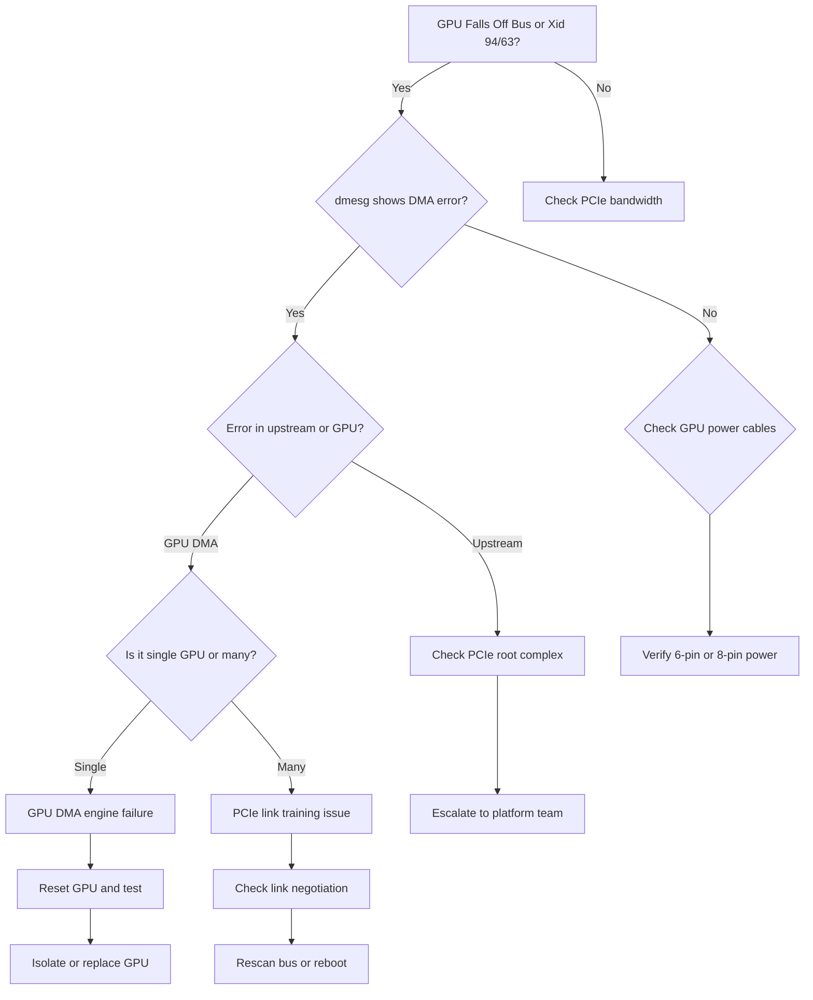

## Symptoms

- PCIe error counters increment rapidly in dmesg
- GPU falls off PCIe bus (`0000:00:1e.0 ... no hotplug support`)
- GPU becomes unresponsive after several minutes of heavy I/O
- Host-to-GPU memory copies slow or fail
- Xid 94 or Xid 63 errors (GPU lost PCIe link)

## Evidence

### Key Metrics to Collect

- PCIe error counters from dmesg
- PCIe bandwidth measurement (sustained)
- DMA error counters from DCGM
- GPU reset history
- Power line ripple on PCIe aux power

## Diagnosis

### Diagnosis Flowchart



### First Diagnostic Step: Check dmesg for PCIe Errors

```bash
$ dmesg | grep -i "dma\|pcie\|xid\|fault" | tail -30

[12345.678901] DMAR: DRHD: processing fault logged [DMA Read] Request-ID [0000:08:00.0] (PASID 0x0000) Address [0xdeadbeef] (Fault Reason: 02 Present bit in root entry is clear)
[12345.678910] nvidia: PCIe error detected on slot GPU:0000:08:00.0
[12345.678915] nvidia: GPU pci_link_speed_mismatch: expected Gen4 x16, got Gen3 x8
[12345.678920] nvidia: GPU fell off bus - will not recover
[12345.678925] Xid (PCI 0000:08:00.0): 94 ... GPU video memory access fault
```

**Interpretation:**
- Xid 94 = GPU video memory access fault (DMA engine error)
- Xid 63 = GPU lost PCIe link
- DMAR fault = IOMMU/DMA remapping error
- Link speed/width mismatch = configuration problem

### Check DCGM DMA Error Counters

```bash
$ dcgmi dmon -s dmae

# GPU DMA Errors
     0 127
     1   0
     2   0
     3   0
```

GPU 0 has 127 DMA errors in the monitoring window.

Query detailed DCGM diagnostics:

```bash
$ dcgmi diag -r 3 2>&1 | grep -A 5 "DMA"

GPU 0: DMA Test
  Status: PASS
  DMA errors detected: 127
  DMA error rate: 12.7 errors/sec
```

### Measure PCIe Bandwidth

```bash
# Use nvidia-smi or bandwidthTest to measure GPU ↔ Host transfers
$ /usr/local/cuda/extras/demo_suite/bandwidthTest --device 0

Device 0: <GPU Name>

Host to Device Bandwidth, 1 Device(s)
Transfer Size (Bytes)        Bandwidth (GB/s)
33554432                     2.3
```

**Baseline:** Should see 10-12 GB/s for PCIe Gen4 x16, or 5-6 GB/s for Gen3 x8

**Current:** 2.3 GB/s → **80% slower than expected** → DMA engine degraded or link width negotiated wrong.

### Check PCIe Link Status

```bash
$ lspci -s 08:00.0 -vvv | grep -A 5 "LnkCap\|LnkSta"

LnkCap: Supported Link Speeds: 2.5GT/s 5GT/s 8GT/s 16GT/s
        Supported Link Width: x16, ...
LnkSta: Speed 8GT/s (Gen3), Width x8 (Down-trained)
```

**Expected:** Gen4 x16 (16GT/s, x16)
**Actual:** Gen3 x8 → Link negotiated at reduced width/speed

Attempt to retrain:

```bash
$ echo 1 > /sys/bus/pci/devices/0000:08:00.0/remove
$ sleep 2
$ echo 1 > /sys/bus/pci/rescan
$ sleep 2
$ lspci -s 08:00.0 -vvv | grep "LnkSta"

# Expected: LnkSta should now show x16 or higher speed
```

### Check GPU Power Delivery

```bash
$ nvidia-smi -i 0 -q | grep -E "Power|Throttle"

Power Readings
    Power Draw                          : N/A
    Power Limit                         : 250.00 W
    
Clocks Throttle Reasons
    Active                              : No
    Idle                                : No
    Application Clocks Setting          : No
    SW Power Capping                    : No
    HW Slowdown                         : Yes
    Sync Boost                          : No
    SW Thermal Slowdown                 : No
    Display Clocks Setting              : No
```

**Problem:** If "Power Draw" is N/A, GPU power rails might be failing, preventing DMA access.

## Resolution

### Step 1: Isolate the GPU Immediately

1. **Stop all jobs on affected GPU:**
   ```bash
   pkill -f "CUDA_VISIBLE_DEVICES=0"
   sleep 5
   ```

2. **Mark GPU as unhealthy in scheduler:**
   ```bash
   # Kubernetes example
   kubectl drain <node> --ignore-daemonsets
   
   # Or SLURM
   scontrol update NodeName=<node> State=DRAIN
   ```

### Step 2: Attempt PCIe Link Retrain

1. **Rescan PCIe bus:**
   ```bash
   $ echo 1 > /sys/bus/pci/devices/0000:08:00.0/remove
   $ sleep 3
   $ echo 1 > /sys/bus/pci/rescan
   $ sleep 3
   
   # Verify GPU reappears
   $ lspci | grep NVIDIA
   08:00.0 3D controller: NVIDIA Corporation Device 2330 (rev a1)
   ```

2. **If GPU reappears with correct link width:**
   ```bash
   $ nvidia-smi  # Check if nvidia-smi works
   
   # Test with bandwidthTest
   bandwidthTest --device 0
   ```

3. **If bandwidth recovers, GPU may be salvageable:**
   - Run stress test for 30 minutes
   - Monitor for repeated errors

### Step 3: Check GPU Power Cables

1. **Verify 6-pin or 8-pin PCIe power connectors:**
   ```bash
   # Visual inspection of cables
   ls -la /sys/bus/pci/devices/0000:08:00.0/  # Should show device is present
   ```

2. **If power connector appears loose:**
   - Power off node
   - Reseat GPU power cables firmly
   - Reboot and test

### Step 4: Reset GPU if DMA persists

```bash
$ sudo nvidia-smi -i 0 --reset

# Wait 30 seconds
sleep 30

# Verify GPU is back online
nvidia-smi -i 0 -q | head -20
```

### Step 5: If Reset Fails, Escalate to Hardware Replacement

At this point:
- DMA errors persist after retrain, reset, and power cable check
- GPU likely has failed DMA engine
- Schedule hardware replacement
- Exclude GPU from cluster

## Verification

### Verification Checklist

1. **GPU reappears on PCIe bus:**
   ```bash
   lspci | grep NVIDIA
   
   # Expected: GPU listed with correct PCI slot
   ```

2. **PCIe link negotiated correctly:**
   ```bash
   lspci -s 08:00.0 -vvv | grep "LnkSta"
   
   # Expected: Speed 16GT/s (Gen4), Width x16
   ```

3. **DMA bandwidth returns to baseline:**
   ```bash
   bandwidthTest --device 0
   
   # Expected: 10-12 GB/s (Gen4 x16)
   ```

4. **No errors in dmesg:**
   ```bash
   dmesg | grep -i "xid\|dma\|fault"
   
   # Expected: No new errors after reset
   ```

5. **DCGM reports zero DMA errors:**
   ```bash
   dcgmi dmon -s dmae
   
   # Expected: DMA Errors = 0
   ```

6. **GPU passes stress test:**
   ```bash
   # Run for 10 minutes
   cudaDeviceSynchronize() in a loop, or
   dcgmi diag -r 3
   
   # Expected: No Xid errors, no DMA faults
   ```

### Production Troubleshooting Table

| Symptom | Evidence | Root Cause | Fix | Verification |
|---------|----------|-----------|-----|--------------|
| Xid 94 error, GPU slow | dmesg shows "GPU video memory access fault", DCGM DMA errors > 10/sec | DMA engine bit error or power delivery glitch | Reset GPU with `nvidia-smi --reset`, rescan PCIe bus with echo 1 > /sys/bus/pci/rescan | DMA errors drop to 0, bandwidthTest returns to 10+ GB/s |
| Xid 63, GPU falls off bus | dmesg shows "GPU lost PCIe link", lspci shows no GPU | PCIe link training failure or power loss | Reseat GPU power cables, run `echo 1 > /sys/bus/pci/devices/.../remove && echo 1 > /sys/bus/pci/rescan` | lspci shows GPU, lspci -vvv shows Gen4 x16 negotiation |
| Bandwidth drops 12 → 2 GB/s | bandwidthTest shows low throughput, lspci shows x8 instead of x16 | Link trained down to Gen3 x8 due to error resilience | Disable link power management, rescan with PCIe reset | Bandwidth returns to 10+ GB/s, lspci shows x16 |
| Intermittent Xid 94 errors | DCGM DMA errors spike to 50+/sec then drop to 0 | Thermal stress on GPU power delivery or DMA controller transient error | Check GPU temperature and power stability, reapply thermal paste, reduce GPU power limit | Temperature stable, DMA errors do not recur |
| GPU unresponsive after error | nvidia-smi hangs or times out, lspci shows GPU but driver unreachable | GPU stuck in error state, needs full hardware reset | Power-cycle GPU or node, rescan PCIe bus | GPU responsive, nvidia-smi returns immediately |

## Prevention

### Health Checks

1. **Continuous DMA error monitoring:**
   ```bash
   #!/bin/bash
   while true; do
     errors=$(dcgmi dmon -s dmae -c 1 | grep -v "GPU" | awk '{sum+=$2} END {print sum}')
     if [[ $errors -gt 5 ]]; then
       echo "ALERT: DMA errors detected: $errors"
       # Auto-drain GPU from cluster
       kubectl drain <node> --ignore-daemonsets
     fi
     sleep 60
   done
   ```

2. **Weekly PCIe bandwidth test:**
   ```bash
   #!/bin/bash
   for gpu in {0..7}; do
     bw=$(bandwidthTest --device $gpu | grep "^[ ]*[0-9]" | tail -1 | awk '{print $NF}')
     expected=11.0  # Gen4 x16
     if (( $(echo "$bw < $expected * 0.8" | bc -l) )); then
       echo "WARNING: GPU $gpu bandwidth degraded: ${bw} GB/s (expected > 8.8 GB/s)"
     fi
   done
   ```

3. **Monitor PCIe link stability:**
   ```bash
   # Prometheus alert rule
   alert: PCIeLinkDown
   expr: increase(pcie_link_errors[5m]) > 0
   for: 1m
   annotations:
     summary: "PCIe link errors detected on {{ $labels.gpu }}"
   
   alert: DMAsErrors
   expr: increase(nvidia_dcgm_dma_errors[5m]) > 10
   for: 2m
   annotations:
     summary: "High DMA error rate on {{ $labels.gpu }}"
   ```

## Escalation

### When to Escalate

**Escalate to GPU vendor or hardware team if:**
- DMA errors persist after PCIe rescan, GPU reset, and power cable reseating
- Multiple GPUs in same node show DMA errors simultaneously (motherboard/root complex issue)
- Link trains down to Gen3 x8 persistently despite retrain attempts
- GPU becomes unresponsive (falls off bus) after DMA reset
- Bandwidth remains < 50% of expected even after full reset

**Escalation data to collect:**

```bash
# Comprehensive DMA diagnostics
echo "=== DMA/PCIe Escalation Data ===" > dma_escalation.log

# DCGM diagnostics
dcgmi diag -r 3 >> dma_escalation.log 2>&1

# dmesg from last 30 minutes
dmesg | tail -200 >> dma_escalation.log

# PCIe link status
lspci -s 08:00.0 -vvv >> dma_escalation.log 2>&1

# Bandwidth test
bandwidthTest --device 0 >> dma_escalation.log 2>&1

# GPU detailed query
nvidia-smi -i 0 -q >> dma_escalation.log 2>&1
```

### Interview Preparation

**Q: "GPU throws a Xid 94 error during a large data transfer and we lose the GPU. How would you diagnose this?"**

A: "Xid 94 means GPU video memory access fault — something went wrong when the GPU tried to read or write memory via DMA. First, I'd check dmesg to see if there are any associated error messages. If dmesg shows DMAR faults or IOMMU errors, it's a system-level DMA problem. If not, it's specific to the GPU's DMA engine. I'd immediately try `nvidia-smi --reset` to see if that recovers the GPU. If reset works, I'd run a bandwidth test to see if DMA bandwidth is back to normal — if it's much slower, the link may have trained down and I'd rescan the PCIe bus to retrain it. If reset doesn't work and the GPU falls off the bus, I'd check the power cables to the GPU in case one is loose. If everything looks good electrically, the GPU's DMA engine is probably failing and needs replacement."

**Q: "We see PCIe bandwidth drop from 12 GB/s to 2 GB/s on one GPU. What's your hypothesis?"**

A: "That 80% drop suggests the link negotiated down from Gen4 x16 to something much narrower, probably Gen3 x8. This could happen if the GPU had errors and the system implemented link power management to reduce errors. I'd first check `lspci -vvv` to see what the link negotiated at. Then I'd check dmesg for PCIe errors that triggered the downtraining. If I see errors, I'd rescan the PCIe bus with `echo 1 > /sys/bus/pci/devices/.../remove && echo 1 > /sys/bus/pci/rescan` to force retraining at full width. If that works, bandwidth should come back. If it doesn't, either the GPU's PCIe controller is damaged or something upstream (root complex, switch) is causing the negotiation to fail."

**Q: "Multiple GPUs in the same node show DMA errors. Is it the GPUs or the platform?"**

A: "That's a big clue that it's not individual GPUs — it's likely a platform issue. Could be: (1) motherboard PCIe root complex is saturated or failing; (2) IOMMU/DMA remapping is misconfigured; (3) power delivery to PCIe slot group is struggling. I'd first check if a firmware update for the system BIOS helps. I'd also check BIOS settings for PCIe power management and IOMMU settings — sometimes enabling IOMMU causes DMA errors if the memory mappings are wrong. If all GPUs in the same slot group fail together, it's probably a motherboard slot group issue and should be escalated to the platform team."

