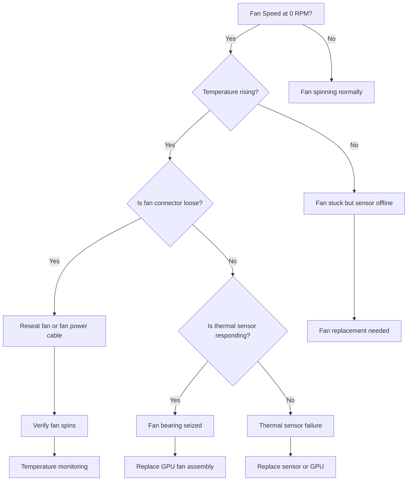

## Symptoms

- Fan speed stuck at 0 RPM despite high GPU temperature
- Temperature rises 2-3°C per minute under load
- DCGM reports fan speed abnormality
- Thermal throttling activates within minutes of starting GPU work
- Two or more fans failing simultaneously on multi-fan systems

## Evidence

### Key Metrics to Collect

- Fan speed from `nvidia-smi -q`
- GPU temperature rise rate
- DCGM fan speed anomaly reports
- Acoustic signature (no fan noise)
- Power supply fan speeds (if accessible)

## Diagnosis

### Diagnosis Flowchart



### First Diagnostic Step: Check Fan Status

```bash
$ nvidia-smi -i 0 -q | grep -A 5 "Fan Speed"

Fan Speed                           : 0 %
GPU Current Temp                    : 55 C
GPU Memory Temp                     : 50 C
```

**Interpretation:** Fan at 0% despite GPU running. This is abnormal unless GPU is truly idle.

Check fan responsiveness to load:

```bash
$ python3 -c "
import time
import subprocess
import torch

print('Starting GPU load test...')
x = torch.ones(1024, 1024, 1024, device='cuda')

for i in range(60):
    y = torch.mm(x[:, :100], x[:, :100])
    print(f'Iter {i}: Temp={subprocess.check_output([\"nvidia-smi\", \"-i\", \"0\", \"--query-gpu=temperature.gpu\", \"--format=csv,noheader\"]).decode().strip()}C, Fan={subprocess.check_output([\"nvidia-smi\", \"-i\", \"0\", \"--query-gpu=fan.speed\", \"--format=csv,noheader\"]).decode().strip()}%')
    time.sleep(1)
"

# Expected output:
# Iter 0: Temp=55C, Fan=0%
# Iter 1: Temp=56C, Fan=0%
# Iter 2: Temp=57C, Fan=5%
# Iter 3: Temp=60C, Fan=20%
# ...
# Iter 59: Temp=82C, Fan=100%
```

If fan doesn't increase with temperature, fan is not responding.

### Check DCGM Fan Anomalies

```bash
$ dcgmi dmon -s fan

# GPU Fan Speed
     0      0  <- Fan stuck at 0%
     1     45  <- Fan normal
     2     50  <- Fan normal
     3     48  <- Fan normal
```

Run diagnostic:

```bash
$ dcgmi diag -r 3 2>&1 | grep -A 10 "Fan"

GPU 0: Fan Test
  Status: FAIL
  Fan speed: 0 RPM
  Expected speed range: 2000-5000 RPM at 80°C
  Fan response: No response to temperature increase
  Recommendation: Replace fan assembly
```

### Measure Temperature Rise Rate

```bash
$ python3 -c "
import subprocess
import time

temps = []
for i in range(60):  # 60 seconds
    temp = subprocess.check_output(['nvidia-smi', '-i', '0', '--query-gpu=temperature.gpu', '--format=csv,noheader']).decode().strip()
    temps.append(int(temp))
    print(f'{i}s: {temp}C')
    time.sleep(1)

# Calculate rate
rate = (temps[-1] - temps[0]) / 60
print(f'Temperature rise rate: {rate:.2f}°C/sec')
"

# Example output with failed fan:
# 0s: 55C
# 1s: 56C
# 2s: 57C
# ...
# 59s: 70C
# Temperature rise rate: 0.25°C/sec
```

**Baseline with working fan:** ~0.05°C/sec (or temperature plateaus)
**With stuck fan:** ~0.2-0.3°C/sec (continuous rise)

### Acoustic Signature Check

```bash
# Listen for fan noise
# - Working fan: steady whirring sound, increases with load
# - Stuck/dead fan: silent under load
# - Bearing failure: grinding or rattling sound

# If available, check console logs for thermal warnings
dmesg | grep -i "fan\|thermal" | tail -20

[12345.678901] nvidia: GPU 0 fan speed critical: 0 RPM, thermal warning enabled
[12345.678905] nvidia: GPU 0 thermal event: overheat detected
```

## Resolution

### Step 1: Immediate Action — Stop GPU Workload

1. **Kill any jobs on the affected GPU:**
   ```bash
   pkill -f "CUDA_VISIBLE_DEVICES=0"
   ```

2. **Check thermal situation:**
   ```bash
   nvidia-smi -i 0 --query-gpu=temperature.gpu --format=csv,noheader
   ```

3. **If temperature &lt; 70°C, safe to investigate:**
   - Can proceed with diagnostics
   - **If temperature > 75°C, immediate power-down required**

### Step 2: Reseat Fan Connector (if safe)

If temperature is still low:

1. **Power down GPU node** (safest approach):
   ```bash
   sudo shutdown -h now
   ```

2. **Check fan power connector:**
   - Locate GPU fan power cable (typically 3-pin or 4-pin connector)
   - Unplug and reseat firmly
   - Power on and test

3. **Verify fan spins after reboot:**
   ```bash
   nvidia-smi -i 0 --query-gpu=fan.speed --format=csv,noheader
   
   # Should show > 0% under load
   ```

### Step 3: If Fan Still Not Responding

1. **Check thermal sensor:**
   ```bash
   nvidia-smi -i 0 -q | grep "GPU Thermal Slowdown"
   
   # If "Active", thermal sensor is working but fan is not
   ```

2. **Disable GPU from cluster:**
   ```bash
   # Kubernetes
   kubectl drain <node> --ignore-daemonsets
   
   # SLURM
   scontrol update NodeName=<node> State=DRAIN
   ```

3. **Order GPU fan replacement or full GPU replacement:**
   - Most GPUs don't have user-replaceable fans
   - Escalate to vendor RMA process
   - Have replacement GPU ready for hot-swap

### Step 4: Temporary Mitigation

If waiting for replacement, can reduce GPU workload:

```bash
# Lower GPU power limit to reduce heat generation
sudo nvidia-smi -i 0 -pl 150

# Only assign low-thermal-footprint jobs to this GPU
```

**Trade-off:** 40-50% performance loss to prevent thermal shutdown.

## Verification

### Verification Checklist

1. **Fan speed increases with temperature:**
   ```bash
   # Idle
   nvidia-smi -i 0 --query-gpu=temperature.gpu,fan.speed --format=csv,noheader
   # Output: 55,0
   
   # Under load (run benchmark)
   # After 30 seconds
   nvidia-smi -i 0 --query-gpu=temperature.gpu,fan.speed --format=csv,noheader
   # Expected: 75,75 (or higher temp, proportionally higher fan)
   ```

2. **Temperature stable during sustained load:**
   ```bash
   # Run for 5 minutes
   for i in {1..300}; do
     nvidia-smi -i 0 --query-gpu=temperature.gpu,fan.speed --format=csv,noheader
     sleep 1
   done
   
   # Expected: Temperature plateaus (e.g., 80°C) and stays there
   # Expected: Fan maintains high speed (80-100%)
   ```

3. **No thermal throttle events:**
   ```bash
   dcgmi diag -r 3 | grep "Thermal slowdown"
   
   # Expected: Thermal slowdown: No
   ```

4. **DCGM reports healthy fan:**
   ```bash
   dcgmi dmon -s fan
   
   # Expected: Fan speed > 30% under any load
   ```

### Production Troubleshooting Table

| Symptom | Evidence | Root Cause | Fix | Verification |
|---------|----------|-----------|-----|--------------|
| Fan stuck at 0 RPM, temp rising 0.3°C/sec | DCGM shows "Fan speed: 0 RPM", no thermal response | Fan bearing seized or connector loose | Reseat fan power connector; if still stuck, replace fan/GPU | Fan speed > 30% under load, temp stabilizes at 75-80°C |
| Silent GPU under load, temp 85°C | Fan speed 0%, acoustic: no fan noise | Complete fan failure | Power off node, remove GPU, replace fan assembly or GPU | After replacement, fan audible under load, temp &lt; 75°C |
| Temperature rising even with 100% fan | Fan speed 100%, thermal sensor active, but temp continues rising | Thermal paste degraded or fan bearing failing | Verify fan is actually spinning (visual inspection); if spinning, replace thermal paste | Temperature drops to 70-75°C after paste replacement |
| Fan speed erratic (0% → 100% → 0%) | Temperature oscillates, fan response inconsistent | DVFS or fan control firmware oscillation | Disable DVFS in BIOS, set fan to manual mode | Fan maintains stable speed curve matching temperature |
| Temperature sensor offline but GPU running | nvidia-smi shows no temperature value (N/A), no thermal throttle | Thermal sensor disconnected or faulty | Check sensor connector, reseat if accessible; otherwise replace GPU | Temperature readings appear, throttle capability returns |

## Prevention

### Health Checks

1. **Weekly fan speed verification:**
   ```bash
   #!/bin/bash
   for gpu in {0..7}; do
     # Quick load test
     timeout 30 python3 -c "
       import torch
       x = torch.ones(1024, 1024, 1024, device='cuda:${gpu}')
       for _ in range(10): y = torch.mm(x, x)
     " &
     
     sleep 25  # Wait for temperature to rise
     
     fan_speed=$(nvidia-smi -i ${gpu} --query-gpu=fan.speed --format=csv,noheader)
     temp=$(nvidia-smi -i ${gpu} --query-gpu=temperature.gpu --format=csv,noheader)
     
     # Fan should be at least 50% at 80°C
     if [[ ${temp} -gt 75 ]] && [[ ${fan_speed} -lt 50 ]]; then
       echo "WARNING: GPU ${gpu} fan not responding (${fan_speed}% at ${temp}°C)"
     fi
   done
   ```

2. **Monthly acoustic inspection:**
   - Listen to each GPU under load
   - Document baseline sound
   - Alert on: silence (fan failure) or grinding (bearing wear)

3. **Fan speed alert rules:**
   ```bash
   # Prometheus alerts
   alert: FanStuck
   expr: nvidia_smi_fan_speed == 0 and nvidia_smi_temperature_current > 50
   for: 1m
   annotations:
     summary: "GPU {{ $labels.gpu }} fan stuck at 0%"
   
   alert: SlowFanResponse
   expr: rate(nvidia_smi_temperature_current[5m]) > 0.2
   for: 5m
   annotations:
     summary: "GPU {{ $labels.gpu }} temperature rising despite high fan speed"
   ```

## Escalation

### When to Escalate

**Escalate to GPU vendor or procurement if:**
- Fan remains stuck at 0% after reseating power connector and reboot
- Temperature continues rising despite 100% fan speed
- Multiple GPUs in same chassis show fan failures simultaneously (power distribution issue)
- Thermal sensor is offline (can't detect fan need)

**Escalation data to collect:**

```bash
# Fan failure diagnostics
echo "=== Fan Failure Escalation Data ===" > fan_escalation.log

# DCGM diagnostics
dcgmi diag -r 3 >> fan_escalation.log 2>&1

# Thermal and fan metrics
for i in {1..60}; do
  nvidia-smi -i 0 --query-gpu=timestamp,temperature.gpu,fan.speed,clocks.current.graphics --format=csv >> fan_escalation.log
  sleep 1
done

# dmesg for thermal warnings
dmesg | grep -i "thermal\|fan" >> fan_escalation.log

# GPU full query
nvidia-smi -i 0 -q >> fan_escalation.log 2>&1
```

### Interview Preparation

**Q: "We power on a GPU and the fan stays at 0% even though the GPU is running training. What's your first move?"**

A: "First, I'd check if this is a real problem or just a sensor issue. I'd run a quick benchmark that taxes the GPU and monitor temperature. If temperature rises smoothly to 85°C while fan stays at 0%, the fan is definitely dead because it's not responding to thermal load. I'd immediately stop the job and power down the node because overheating will cause GPU damage. Then I'd physically inspect the fan connector to see if it's loose — sometimes just reseating fixes it. If it's seated correctly, the fan bearing is probably seized and the GPU needs replacement. I'd escalate to hardware quickly because an idle fan will cause a cascade failure: GPU overheats, thermal sensor triggers shutdown, or worse, data corruption if the GPU runs too hot without knowing it."

**Q: "Fan speed oscillates between 0% and 100% every 5 seconds. What's happening?"**

A: "That sounds like DVFS oscillation — the GPU is probably hitting thermal throttle, then cooling down, then throttling again in a loop. Or it could be fan control firmware oscillation. I'd first check if disabling DVFS in BIOS fixes it. If it does, it's definitely DVFS. If not, I'd check dmesg for thermal events to see if throttling is happening. If thermal events align with fan oscillation, the fan control is too aggressive — I'd adjust the fan curve in BIOS or switch to a linear mode instead of exponential. The key is that oscillation means the system is fighting itself: throttling to cool down, then ramping up, hitting thermal limit again."

**Q: "How would you build a predictive system to detect fan degradation before it causes problems?"**

A: "I'd track fan speed trend over weeks. Normal fans maintain consistent RPM at the same temperature. Degrading fans start requiring higher speeds to maintain the same temperature. I'd set a monthly baseline: at 80°C, what's the typical fan speed? If it's usually 60%, and one month it's 70%, the fan is working harder. If it climbs to 80%, 90%, 100% over several months, that's a leading indicator that the fan is failing. I'd also monitor temperature rise rate under fixed GPU load: if it rises slower with time, the fan is degrading. At 2-3 months before fan dies, I'd schedule preemptive replacement before it actually fails in production."

