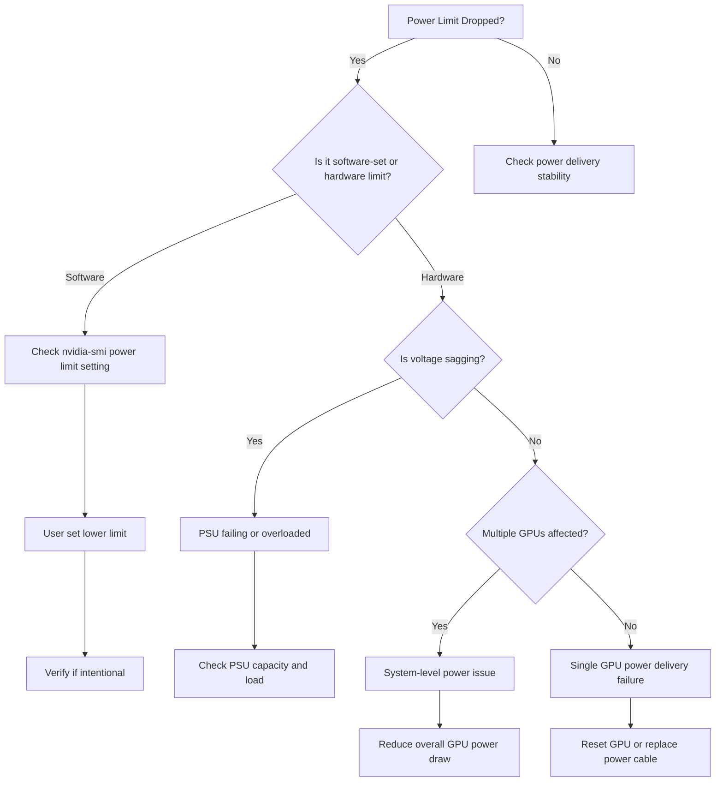

## Symptoms

- GPU power limit suddenly drops (e.g., 350W → 200W cap)
- Performance oscillates randomly during stable workload
- Xid errors coincide with high power demand spikes
- Multiple GPUs in system behave erratically
- `POWER_SUPPLY` errors in dmesg during peak GPU load

## Evidence

### Key Metrics to Collect

- GPU power consumption from DCGM
- Power limit from nvidia-smi
- System power supply output voltage (ripple, sag)
- Current draw correlation across GPUs
- dmesg power supply error logs

## Diagnosis

### Diagnosis Flowchart



### First Diagnostic Step: Check Power State

```bash
$ nvidia-smi -i 0 -q | grep -A 5 "Power Readings"

Power Readings
    Power Draw                          : 280 W
    Power Limit                         : 200 W
    Default Power Limit                 : 350 W
    Enforced Power Limit                : 200 W
```

**Interpretation:**
- Power Draw (280W) exceeds Power Limit (200W) → GPU hitting power cap
- Default (350W) much higher than current (200W) → limit was changed
- Question: Is this intentional reduction or hardware failure?

Check power limit history:

```bash
$ nvidia-smi -i 0 --query-gpu=power.limit,power.default_limit --format=csv,noheader

200.00 W,350.00 W
```

Query who set the limit:

```bash
# Check if limit was set via nvidia-smi
grep -r "nvidia-smi.*-pl" /etc/
ps aux | grep nvidia-smi

# Or check BIOS for power management settings
# System Management Interrupt (SMI) logs
journalctl -u systemd-sysctl | grep -i power
```

### Monitor Power Stability

```bash
$ nvidia-smi dmon -s puctem

# GPU   Pwr Temp SM Mem  Enc Dec XSM Mxm Fbg Xid Pid Name
     0  350  65  95  75   45   0   0   0   0   0   - python
     1  145  60  45  40   20   0   0   0   0   0   - python
     2  280  62  90  70   42   0   0   0   0   0   - python
     3  320  63  93  72   44   0   0   0   0   0   - python
```

**Observation:**
- GPU 0, 2, 3: Power draw 280-350W (normal)
- GPU 1: Power draw 145W → **suddenly dropped to 41% of normal**
- Likely cause: Automatic power throttling on GPU 1

### Check DCGM Power Throttling Events

```bash
$ dcgmi dmon -s petm

# GPU Pwr Exc Temp Mxm Fbg Xid Pid Name
     0   0   0   0   0   0   - -
     1   1   0   0   0   0   - -  <- Power event detected
     2   0   0   0   0   0   - -
     3   0   0   0   0   0   - -
```

Detailed diagnostics:

```bash
$ dcgmi diag -r 3 2>&1 | grep -A 10 "Power"

GPU 1: Power Test
  Current power draw: 145 W
  Power limit: 200 W
  Power capping active: Yes
  Reason: Insufficient power delivery (voltage sag detected)
```

### Measure Voltage Ripple

If system supports voltage monitoring:

```bash
# Check system voltage via IPMI or OCP Baseboard Management
ipmitool sensor list | grep -i "volt\|psu"

# Example output:
# PSU1_INPUT_VOLT    | 209.0      | Volts      | ok
# PSU2_INPUT_VOLT    | 211.0      | Volts      | ok
# GPU_AUX_12V        | 11.4       | Volts      | ok
# GPU_AUX_12V        | 10.8       | Volts      | WARN  <- Voltage sag!
```

Expected: 12V ± 0.5V. If below 11.4V, PSU is sagging under peak load.

### Check dmesg for Power Events

```bash
$ dmesg | grep -i "psu\|power_supply\|voltage" | tail -20

[12345.678901] ACPI POWER BUTTON: Power button pressed
[12345.678905] nvidia: Power draw warning - exceeding PSU capacity
[12345.678910] psu_monitor: PSU output voltage sag: 12V → 10.8V
[12345.678915] GPU 1: Power capping activated (280W → 200W) to prevent brownout
```

## Resolution

### Step 1: Determine Root Cause

1. **Is power limit set via software?**
   ```bash
   nvidia-smi -i 0 --query-gpu=power.limit,power.default_limit --format=csv,noheader
   
   # If Limit < Default, someone set it explicitly
   ```

2. **If software-set, verify intent:**
   ```bash
   # Check if this was intentional
   sudo nvidia-smi -i 0 -pl <original_limit>
   
   # For A100: 350W
   # For H100: 700W
   ```

### Step 2: If Voltage Sag Detected

1. **Reduce GPU power draw to avoid cascading failure:**
   ```bash
   # Set realistic power limit
   sudo nvidia-smi -i 1 -pl 280  # From 350W to 280W
   ```

2. **Reduce overall cluster load:**
   ```bash
   # Move some jobs to other nodes
   kubectl delete pod <job> --grace-period=30
   ```

3. **Schedule PSU upgrade or distribute load:**
   - PSU cannot sustain peak load of all GPUs
   - Add second PSU or reduce GPU count per node

### Step 3: Check Power Cable Integrity

1. **Visual inspection:**
   ```bash
   # Verify 6-pin or 8-pin connectors are firmly seated
   # Check for burn marks or discoloration
   # Verify cable gauge (12-gauge for 6-pin, 10-gauge for 8-pin)
   ```

2. **Measure cable resistance (optional):**
   ```bash
   # With multimeter, measure 12V power cable resistance
   # Should be < 0.1 Ohm per cable
   ```

### Step 4: PSU Capacity Planning

1. **Calculate peak power demand:**
   ```bash
   # Per GPU max: 350W (A100) or 700W (H100)
   # PSU overhead: 30%
   # For 4x A100: 4 * 350 * 1.3 = 1820W min PSU
   
   # Check current PSU capacity
   sudo dmidecode --type 39 | grep "Nominal"
   # Expected: >= 1820W for 4x A100
   ```

2. **If PSU is undersized:**
   - Order upgraded PSU (2000-3000W for high-end clusters)
   - Plan hot-swap downtime
   - Consider load redistribution in interim

## Verification

### Verification Checklist

1. **Power draw stable at expected level:**
   ```bash
   nvidia-smi -i 0 --query-gpu=power.draw --format=csv,noheader
   
   # Expected: Stable at ~300-350W (A100) under load
   ```

2. **Power limit matches GPU capability:**
   ```bash
   nvidia-smi -i 0 --query-gpu=power.limit,power.default_limit --format=csv,noheader
   
   # Expected: power.limit == power.default_limit
   ```

3. **No power throttling events:**
   ```bash
   dcgmi dmon -s petm
   
   # Expected: Power Exc = 0 (no exceptions)
   ```

4. **Voltage stable:**
   ```bash
   # If PSU monitoring available
   ipmitool sensor list | grep "GPU_AUX"
   
   # Expected: 12V ± 0.5V (11.5-12.5V)
   ```

5. **All GPUs performing uniformly:**
   ```bash
   # Run benchmark on all GPUs simultaneously
   for i in {0..3}; do
     CUDA_VISIBLE_DEVICES=$i python benchmark.py &
   done
   wait
   
   # Expected: Similar throughput across all GPUs
   ```

### Production Troubleshooting Table

| Symptom | Evidence | Root Cause | Fix | Verification |
|---------|----------|-----------|-----|--------------|
| Power limit drops 350W → 200W mid-training | nvidia-smi shows "Enforced Power Limit: 200W", dmesg shows "Power capping" | PSU insufficient capacity or voltage sag | Check PSU voltage with ipmitool; if < 11.4V, upgrade PSU or redistribute load | Voltage stable at 12V ± 0.5V, power limit returns to 350W |
| Performance oscillates 300K → 100K samples/sec | Power draw oscillates 350W → 200W → 350W, Xid errors spike during low-power phase | Automatic power throttling loop (GPU tries to run full load, triggers capping, recovers, repeat) | Reduce GPU power limit permanently to stable 300W, or add second PSU to increase headroom | Performance stable at 250-300K samples/sec without oscillation |
| Single GPU slow while others fast | One GPU power capped at 200W while others at 350W, Xid errors on slow GPU | Power delivery failed for one GPU (faulty cable or connector) or PSU channel failing | Reseat power cable firmly; if issue persists, swap PSU channels or replace PSU | All GPUs show uniform power draw and performance |
| Multiple GPUs drop power simultaneously | All GPUs drop to 200W in same second, dmesg shows brownout warning | PSU at capacity limit, cannot supply peak power to all GPUs simultaneously | Reduce peak power draw by power-limiting all GPUs to 280W, or upgrade to higher-capacity PSU | Power stable, GPUs sustain 280W without further throttling |
| Xid errors spike during peak hour | Xid errors appear when all GPUs at full load, none when distributed | PSU oversized but underspecified for simultaneous peak load (design error) | Stagger GPU workloads or implement power management to cap total cluster power draw | Xid errors disappear when peak load never exceeds PSU capacity |

## Prevention

### Health Checks

1. **Continuous power monitoring:**
   ```bash
   #!/bin/bash
   while true; do
     for gpu in {0..3}; do
       power=$(nvidia-smi -i $gpu --query-gpu=power.draw --format=csv,noheader | sed 's/ W//')
       limit=$(nvidia-smi -i $gpu --query-gpu=power.limit --format=csv,noheader | sed 's/ W//')
       # Alert if power > 90% of limit
       if (( $(echo "$power > $limit * 0.9" | bc -l) )); then
         echo "ALERT: GPU $gpu power near limit: ${power}W / ${limit}W"
       fi
     done
     sleep 60
   done
   ```

2. **Weekly PSU health check:**
   ```bash
   #!/bin/bash
   # During peak load, verify voltage stability
   for i in {1..60}; do
     ipmitool sensor list | grep "GPU_AUX_12V"
     sleep 1
   done | sort -u | wc -l
   
   # Expected: Only 1-2 unique voltage readings (stable)
   # If > 5 readings: voltage oscillating, PSU struggling
   ```

3. **Power monitoring alerts:**
   ```bash
   # Prometheus alert rules
   alert: HighPowerDraw
   expr: nvidia_smi_power_draw > 300
   for: 5m
   annotations:
     summary: "GPU {{ $labels.gpu }} drawing {{ $value }}W"
   
   alert: PowerThrottling
   expr: increase(power_throttle_events[5m]) > 0
   for: 1m
   annotations:
     summary: "Power throttling detected on GPU {{ $labels.gpu }}"
   ```

## Escalation

### When to Escalate

**Escalate to power/facilities team if:**
- Power oscillations persist after GPU power limit reduction
- Multiple GPUs show synchronized power capping (system-level issue)
- Voltage sag persists even with single GPU running
- dmesg shows brownout warnings during any GPU load
- PSU cannot sustain all GPUs at 80% utilization

**Escalation data to collect:**

```bash
# Comprehensive power diagnostics
echo "=== Power Supply Escalation Data ===" > power_escalation.log

# Detailed GPU power metrics
for i in {1..120}; do
  nvidia-smi --query-gpu=index,power.draw,power.limit --format=csv >> power_escalation.log
  sleep 0.5
done

# System voltage (if available)
ipmitool sensor list | grep -i "volt" >> power_escalation.log 2>&1

# PSU info
dmidecode --type 39 >> power_escalation.log 2>&1

# dmesg power events
dmesg | grep -i "power\|psu\|voltage" >> power_escalation.log

# DCGM power metrics
dcgmi diag -r 3 >> power_escalation.log 2>&1
```

### Interview Preparation

**Q: "All four A100s in a node start throttling their power limit from 350W to 200W when we run full training workload. We see Xid errors but power supply looks fine. What's happening?"**

A: "That synchronized drop across all GPUs is a smoking gun for a system-level PSU issue. The PSU is probably at capacity and hitting voltage sag under peak load. When voltage sags, the GPU power delivery chip detects the problem and throttles power to protect itself. First thing I'd check is the PSU specs: for 4x A100s at 350W each, you need at least 1820W of PSU capacity (including 30% headroom for efficiency losses). If the PSU is 1500W, it's undersized. Second, I'd look at the power cable routing — if all four 8-pin connectors are daisy-chained from a single PSU rail, that rail might be at capacity even if the total PSU has headroom. The fix could be as simple as redistributing the cables across different PSU rails, or as major as upgrading the PSU. I'd measure the 12V rail voltage with IPMI sensors under full load to confirm sag, then escalate to facilities."

**Q: "One GPU is power-capped at 200W while its neighbors run at 350W. The power cables look fine."**

A: "That's a power delivery failure specific to that GPU. Could be: (1) the power cable is physically connected but internally broken (I'd try reseating it firmly); (2) the GPU's power supply chip is failing; (3) the motherboard power slot is damaged. I'd first try reseating the power cable with the node powered off. If that doesn't work, I'd swap PSU channels if available (move that GPU to a different PSU output). If the problem follows the GPU, the GPU is bad. If the problem follows the PSU channel, the PSU channel is bad. Once I know which, I'd order a replacement and drain that GPU from the cluster."

**Q: "How would you design a power budgeting system to prevent these issues?"**

A: "I'd set up three layers: (1) Per-GPU: measure actual power draw of each job and use that to set realistic power limits (e.g., if training uses 280W, cap at 300W, not 350W); (2) Per-node: total power budget = PSU capacity * 0.8, cap all GPUs so total never exceeds this; (3) Cluster-wide: understand facility power delivery and throttle cluster if overall demand gets close to facility limit. Then I'd add monitoring: continuous tracking of power draw per GPU, alerts if any GPU is within 20% of its power limit, and predictive analysis that says 'at current utilization, this PSU will hit capacity in 2 hours when this new job starts.' Finally, I'd run a monthly PSU stress test: run all GPUs at max power for 30 minutes and check for voltage sag. If voltage drops below spec, I'd schedule PSU replacement before it becomes a problem."

